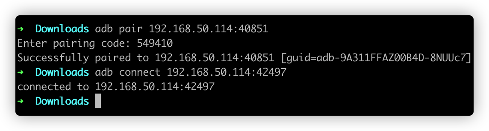
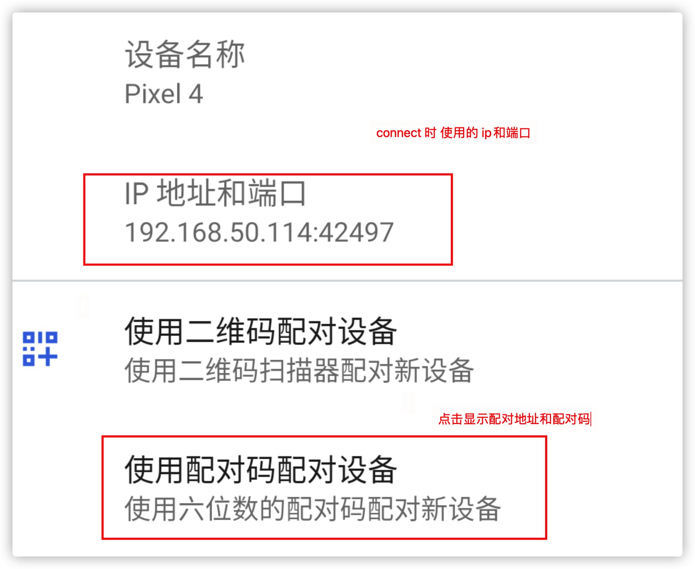

# adb简单介绍

[Google官方对于adb的介绍](https://developer.android.google.cn/studio/command-line/adb?hl=zh-cn)

## Android Debug Bridge组成

- **A client**: 一般情况下就是我们的 **开发设备PC**，用于**发送命令**, 。
- **A server** : 在**开发设备PC** 上作为后台服务，用于**管理Client和Damon之间的通信**。
- **A damon(adbd)** : 以后台进程的方式运行在 **Android设备** 上，用于**运行命令**。

## 开发设备PC上adb位置

包含在 Android SDK Platform-Tools中,目录如下:


## 设备连接方式

### 1. USB方式

打开**设置**应用，选择**开发者选项**，然后启用 **USB 调试**

### 2. 通过 WLAN 连接到设备

#### 2.1. 设备开启USB调试

> 如果是连接 Wear OS 设备，需要关闭手机上与该设备配对的蓝牙。
>
> Android 11 及以上设备, 执行以下流程存在问题时, 可参考[官方文档](https://developer.android.google.cn/studio/run/device#wireless)。

1. Android设备和 adb主机(PC) 连接**同一WLAN网络**。

2. 使用 **USB 线连接**设备和主机。

3. 使用**tcpip**设置设备的监听端口。

   ```bash
   adb tcpip 5555
   ```

4. 查看android设备的**IP地址**。

   **设置** > **WLAN 设置** > **高级** > **IP 地址**。

   此时若USB依然连接可通过**ifconfig**查看ip地址

   ```bash
   adb shell ifconfig
   ```

   

5. 拔掉USB线, 使用**connect连接到此IP对应的设备。

   ```shell
   adb connect 192.168.50.114:5555
   ```
   
6. 切回USB模式

   ```shell
   adb usb
   ```

8. 断开连接

   ```shell
   adb disconnect
   ```


#### 2.2. 设备仅开启无线调试

相比于开启**USB调试**，无线调试主要多了配对流程:

```bash
adb pair 192.168.50.114:40851
```

配对成功后就可以进行连接(⚠️此处连接用的不是上方的配对地址)

```bash
adb connect 192.168.50.114:42497
```





#### 2.3 Android Studio 支持扫码连接


### 3. 模拟器的端口记录

```shell
adb connect 127.0.0.1:7555
```

| 模拟器 | 端口 |
| ------ | ---- |
| mumu   | 7555 |
|        |      |
|        |      |

