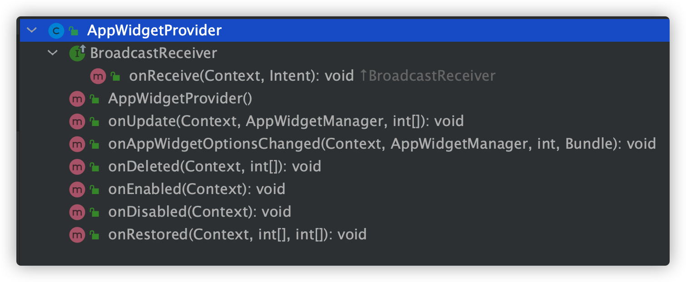

# Android小组件开发

桌面小组件开发主要使用到 android中提供的``AppWidgetProvider``类。这个类实际上就是一个BroadcastReceiver的子类，通过广播的方式通知应用进行相应的操作。



## 如何自定义一个小组件

### 1. 自定义AppWidgetProvider

```kotlin
class MyAppWidgetProvider : AppWidgetProvider() {

    companion object {
        private const val TAG = "${ZTag.TAG}AppWidgetProvider"
        private var click = 0
        const val REFRESH_ACTION = "com.zaze.demo.appwidget.action.REFRESH"
    }

    override fun onReceive(context: Context, intent: Intent) {
        ZLog.i(TAG, "onReceive: ${intent.action}")
        if (REFRESH_ACTION == intent.action) {
            AppWidgetManager.getInstance(context)?.let {
                val appWidgetIds =
                    it.getAppWidgetIds(ComponentName(context, MyAppWidgetProvider::class.java))
                updateAppWidget(context, it, appWidgetIds)
            }
            return
        }
        super.onReceive(context, intent)
    }

    override fun onUpdate(
        context: Context?,
        appWidgetManager: AppWidgetManager?,
        appWidgetIds: IntArray?
    ) {
        ZLog.i(TAG, "onUpdate")
        updateAppWidget(context, appWidgetManager, appWidgetIds)
    }

    private fun updateAppWidget(
        context: Context?,
        appWidgetManager: AppWidgetManager?,
        appWidgetIds: IntArray?
    ) {
        if (context == null || appWidgetManager == null) {
            return
        }
        val remoteViews = RemoteViews(context.packageName, R.layout.my_appwidget)
        // 打开应用
        remoteViews.setOnClickPendingIntent(
            R.id.appwidget_open_btn, PendingIntent.getActivity(
                context,
                0,
                context.packageManager.getLaunchIntentForPackage(context.packageName),
                PendingIntent.FLAG_UPDATE_CURRENT
            )
        )
        // 刷新
        remoteViews.setOnClickPendingIntent(
            R.id.appwidget_refresh_btn, PendingIntent.getBroadcast(
                context,
                0,
                Intent(REFRESH_ACTION).apply {
                    `package` = context.packageName
                },
                PendingIntent.FLAG_UPDATE_CURRENT
            )
        )
        click++
        remoteViews.setTextViewText(R.id.appwidget_content_tv, click.toString())
        appWidgetManager.updateAppWidget(appWidgetIds, remoteViews)
    }

    override fun onAppWidgetOptionsChanged(
        context: Context?,
        appWidgetManager: AppWidgetManager?,
        appWidgetId: Int,
        newOptions: Bundle?
    ) {
        super.onAppWidgetOptionsChanged(context, appWidgetManager, appWidgetId, newOptions)
        ZLog.i(TAG, "onAppWidgetOptionsChanged")
    }

    override fun onDeleted(context: Context?, appWidgetIds: IntArray?) {
        super.onDeleted(context, appWidgetIds)
        ZLog.i(TAG, "onDeleted")
    }

    override fun onEnabled(context: Context?) {
        super.onEnabled(context)
        ZLog.i(TAG, "onEnabled")
    }

    override fun onDisabled(context: Context?) {
        super.onDisabled(context)
        ZLog.i(TAG, "onDisabled")
    }

    override fun onRestored(context: Context?, oldWidgetIds: IntArray?, newWidgetIds: IntArray?) {
        super.onRestored(context, oldWidgetIds, newWidgetIds)
        ZLog.i(TAG, "onRestored")
    }
}
```


### 2. 定义布局文件

和正常activity一样放在项目``res/layout/``下即可。我这里新建``my_appwidget.xml``。

```xml
<?xml version="1.0" encoding="utf-8"?>
<LinearLayout xmlns:android="http://schemas.android.com/apk/res/android"
    xmlns:app="http://schemas.android.com/apk/res-auto"
    android:layout_width="match_parent"
    android:layout_height="match_parent"
    android:gravity="center"
    android:orientation="vertical">

    <Button
        android:id="@+id/appwidget_open_btn"
        android:layout_width="wrap_content"
        android:layout_height="wrap_content"
        android:text="打开应用" />

    <Button
        android:id="@+id/appwidget_refresh_btn"
        android:layout_width="wrap_content"
        android:layout_height="wrap_content"
        android:text="刷新" />

    <TextView
        android:id="@+id/appwidget_content_tv"
        android:layout_width="wrap_content"
        android:layout_height="wrap_content"
        android:text="0" />

</LinearLayout>
```


### 3. 配置appwidget相关信息

在``res/xml/``下新建``my_appwidget_info.xml``。

```xml
<?xml version="1.0" encoding="utf-8"?>
<appwidget-provider xmlns:android="http://schemas.android.com/apk/res/android"
    android:initialLayout="@layout/my_appwidget"
    android:minWidth="110dp"
    android:minHeight="40dp"
    android:updatePeriodMillis="0" />

```

>``android:updatePeriodMillis`` 小组件的自动更新间隔(毫秒), 每隔指定时间将自动触发更新，值小于半小时时将不生效。
>
>``android:initialLayout`` 小组件的初始化布局。


### 4. 在AndroidManifest.xml中声明组件

>``android.appwidget.action.APPWIDGET_UPDATE``为必须监听的事件，不添加时不会出现在小组件列表中。
>
>其他事件可根据需求选择添加，当然也可以添加一些自定义action，可自己在``onReceiver()``中处理。

由于继承自``BroadcastReceiver``，理所当然需要注册广播。小组件的注册方式实质就是一个静态注册广播的过程。

```xml
<receiver
    android:name=".appwidgets.MyAppWidgetProvider">
    <intent-filter>
        <action android:name="com.zaze.demo.appwidget.action.REFRESH" />
        <action android:name="android.appwidget.action.APPWIDGET_UPDATE" />
        <action android:name="android.appwidget.action.APPWIDGET_DELETED" />
        <action android:name="android.appwidget.action.APPWIDGET_ENABLED" />
        <action android:name="android.appwidget.action.APPWIDGET_UPDATE_OPTIONS" />
        <action android:name="android.appwidget.action.APPWIDGET_DISABLED" />
        <action android:name="android.appwidget.action.APPWIDGET_RESTORED" />
    </intent-filter>

    <meta-data
        android:name="android.appwidget.provider"
        android:resource="@xml/my_appwidget_info" />
</receiver>
```

查看``AppWidgetProvider``源码可知主要存在以下几个广播

| Action                                            | Value                                             |
| ------------------------------------------------- | ------------------------------------------------- |
| AppWidgetManager.ACTION_APPWIDGET_UPDATE          | android.appwidget.action.APPWIDGET_UPDATE         |
| AppWidgetManager.ACTION_APPWIDGET_DELETED         | android.appwidget.action.APPWIDGET_DELETED        |
| AppWidgetManager.ACTION_APPWIDGET_OPTIONS_CHANGED | android.appwidget.action.APPWIDGET_UPDATE_OPTIONS |
| AppWidgetManager.ACTION_APPWIDGET_ENABLED         | android.appwidget.action.APPWIDGET_ENABLED        |
| AppWidgetManager.ACTION_APPWIDGET_DISABLED        | android.appwidget.action.APPWIDGET_DISABLED       |
| AppWidgetManager.ACTION_APPWIDGET_RESTORED        | android.appwidget.action.APPWIDGET_RESTORED       |


