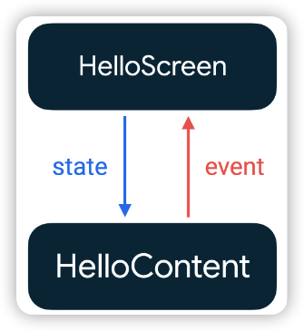
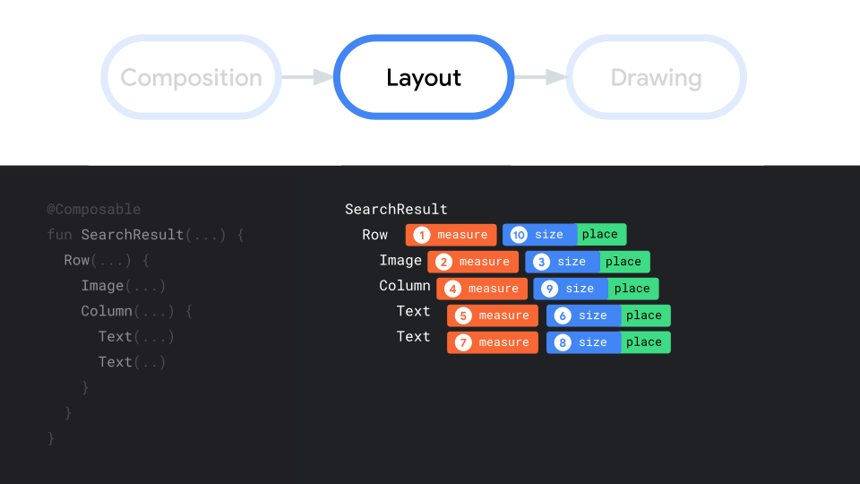
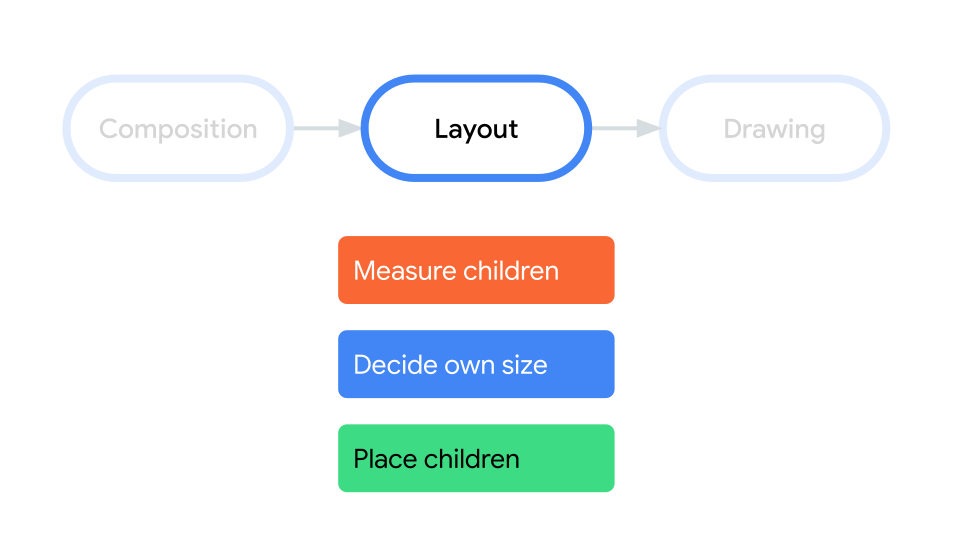

# Compose基础

Compose 是声明式工具集，它的更新方式是通过新参数调用同一个可组合项。这些参数是界面状态的表现形式。每当状态更新时，都会发生重组。

## 基础概念

### 可组合函数（composable function）

添加 `@Composable` 注解后即可定义一个可组合函数，这个注释会告诉 Compose 编译器：这个函数是将数据转换为界面。可组合函数用于**描述所需的界面状态**，并不是结构界面组件。

```kotlin
@Composable
fun Greeting(name: String) {
    Text(text = "Hello $name!")
}
```

* 只有 Composable 函数内能调用 Composable 函数。
* 可组合函数可能会像动画的每一帧一样非常频繁地运行，所以**应避免副作用**。
* **可组合函数可以按任何顺序执行**，所以多个同级的可组合函数间不应该存在依赖关系，每个函数都需要保持独立
* **可组合函数可以并行运行**，意味着可能在后台线程池中执行。所以如果在可组合函数中调用 `viewModel`内的函数，则 Compose 可能会同时从多个线程调用该函数（因为可组合函数同时会被频繁调用）。


### 重组

**输入更改时会再次调用可组合函数，这个过程叫做重组。**

每当状态更新时，都会发生重组。重组会跳过尽可能多的可组合函数和 lambda，仅重组需要更新的部分。

同时重组是乐观操作，Compose 会在参数再次更改之前完成重组。如果某个参数在重组完成之前发生更改，Compose 可能会取消重组，并使用新参数重新开始。（但是附带效果依旧会执行，所以会导致异常）。

> **调用点**：调用可组合项的源代码位置。会影响其在组合中的位置，因此会影响界面树

* 每个调用都有**唯一的调用点和源位置**，编译器将使用它们对调用进行唯一识别。

* 当从同一个调用点多次调用某个可组合项时，除了调用点之外，还会使用**执行顺序来区分实例**。

所以当在列表下方增加数据时，已存在部分将会被重复使用。但是在上方增加、移除或者数据重排时，将会导致参数变化的位置发生重组。

**可以使用 `key` 指定唯一性：**

```kotlin
@Composable
fun MoviesScreen(movies: List<Movie>) {
    Column {
        for (movie in movies) {
            key(movie.id) { // Unique ID for this movie
                MovieOverview(movie)
            }
        }
    }
}
```

### 预览界面

添加 `@Preview` 注解后，就能在 Android Stuido 中预览布局。

> 不建议在正式函数中使用，应单独定义一个预览专用的函数。

```kotlin
@Preview(showBackground = true)
@Composable
fun DefaultPreview() {
    MyComposeTheme {
        Greeting("Android")
    }
}
```


### 附带效应

**附带效应（副作用）**：发生在可组合函数作用域之外的应用状态的变化，官方推荐在 `onClick`等回调中触发附带效应，以免发生异常。

* 写入共享对象的属性
* 更新 `ViewModel` 中的可观察项
* 更新共享偏好设置

### Compose 中的状态

[状态和 Jetpack Compose  | Android Developers](https://developer.android.com/jetpack/compose/state)

#### 状态：State

可以使用`mutableStateOf()` 创建可观察到`MutableState<T>`，每当值发生变化时，将会重新读取 `State<T>.value` 并自动重组界面。

```kotlin
interface MutableState<T> : State<T> {
    override var value: T
}
```

#### 状态存储：remember

##### remember

**使用 `remember {}` 将状态存储在内存中**，防止重组时状态被重置，起到记录状态修改的保护作用。

> Notes：调用 `remember` 的可组合项从组合中移除后，记录的值也将被移除。

```kotlin
@Composable
private fun Greeting(name: String) {

    val expanded = remember { mutableStateOf(false) }

    val extraPadding = if (expanded.value) 48.dp else 0.dp

    Surface(
        color = MaterialTheme.colorScheme.primary,
        modifier = Modifier.padding(vertical = 4.dp, horizontal = 8.dp)
    ) {
        Row(modifier = Modifier.padding(24.dp)) {
            Column(modifier = Modifier
                .weight(1f)
                .padding(bottom = extraPadding)
            ) {
                Text(text = "Hello, ")
                Text(text = name)
            }
            ElevatedButton(
                onClick = { expanded.value = !expanded.value }
            ) {
                Text(if (expanded.value) "Show less" else "Show more")
            }
        }
    }
}
```

##### rememberSaveable

**对于重新创建 activity 或进程的场景，应使用 `rememberSaveable` 来保存状态，以便恢复界面的状态**。

对于一般的数据类型，直接保存即可：

```kotlin
val expanded = rememberSaveable { mutableStateOf(false) }
```

对于无法保存到 Bundle 中的内容，可以使用以下几种方式

* Parcelize

  ```kotlin
  @Parcelize
  data class City(val name: String, val country: String) : Parcelable
  
  @Composable
  fun CityScreen() {
      var selectedCity = rememberSaveable {
          mutableStateOf(City("Madrid", "Spain"))
      }
  }
  ```

* MapSaver

  ```kotlin
  data class City(val name: String, val country: String)
  
  val CitySaver = run {
      val nameKey = "Name"
      val countryKey = "Country"
      mapSaver(
          save = { mapOf(nameKey to it.name, countryKey to it.country) },
          restore = { City(it[nameKey] as String, it[countryKey] as String) }
      )
  }
  
  @Composable
  fun CityScreen() {
      var selectedCity = rememberSaveable(stateSaver = CitySaver) {
          mutableStateOf(City("Madrid", "Spain"))
      }
  }
  ```

* LiveSaver

  ```kotlin
  data class City(val name: String, val country: String)
  
  val CitySaver = listSaver<City, Any>(
      save = { listOf(it.name, it.country) },
      restore = { City(it[0] as String, it[1] as String) }
  )
  
  @Composable
  fun CityScreen() {
      var selectedCity = rememberSaveable(stateSaver = CitySaver) {
          mutableStateOf(City("Madrid", "Spain"))
      }
  }
  ```

##### rememberUpdatedState

`rememberUpdatedState` 会更新保存在内存中值，从而**保证每次都能获取到最新的值**。它其实是 对上方 `remember` 保存状态的一个封装。

> **当一个值需要被长生命周期的表达式引用（LaunchedEffect）时使用，保证效应在值改变时不重启。**

源码：

```kotlin
@Composable
fun <T> rememberUpdatedState(newValue: T): State<T> = remember {
    mutableStateOf(newValue)
}.apply { value = newValue }
```

样例：

```kotlin
@Composable
fun LandingScreen(onTimeout: () -> Unit) {
    // 保存最新数据
    val currentOnTimeout by rememberUpdatedState(onTimeout)

    // 传入 true 固定值，使 LaunchedEffect 不重新执行。
    LaunchedEffect(true) {
        delay(SplashWaitTimeMillis)
      	// 读取并执行
        currentOnTimeout()
    }

    /* Landing screen content */
}
```


#### 状态提升

Compose 中的状态提升是一种将状态移至可组合项的调用方以使可组合项无状态的模式。

Jetpack Compose 中的常规状态提升模式是将状态变量替换为两个参数：

- `value: T`：要显示的当前值
- `onValueChange: (T) -> Unit`：请求更改值的事件，其中 `T` 是建议的新值。函数名可以根据具体场景调整。

以这种方式提升的状态具有一些重要的属性：

- **单一可信来源**：通过移动状态，而不是复制状态，我们可确保只有一个可信来源。这有助于避免 bug。
- **封装**：只有有状态可组合项能够修改其状态。这完全是内部的。
- **可共享**：可与多个可组合项共享提升的状态。如果想在另一个可组合项中执行 `name` 操作，可以通过变量提升来做到这一点。
- **可拦截**：无状态可组合项的调用方可以在更改状态之前决定忽略或修改事件。
- **解耦**：无状态 `ExpandingCard` 的状态可以存储在任何位置。例如，现在可以将 `name` 移入 `ViewModel`。

> 这种 状态向下流动，事件向上流动的模式 称为 **“单向数据流”**




#### 管理状态


* Composable： 管理简单的界面元素状态（界面元素的提升状态）。
* State holder：管理复杂的界面元素状态，且拥有界面元素的状态和界面逻辑（导航、如何显示提示等）。
* ViewModel：提供业务逻辑（处理状态变化）以及屏幕界面状态（屏幕上显示的内容）的访问权限


### CompositionLocal（数据传递）

> 建议使用 `CompositionLocal` 的情况为：
>
> * 可能**会被任何（而非少数几个）后代使用**。
> * `CompositionLocal` 应**具有合适的默认值**。
>
> 其他场景应优先使用 显示参数传递给所需可组合项 或者 控制反转（父级通过逻辑处理组合项）的方式。

Compose 提供 `CompositionLocal` 使数据在界面树中能够隐式传递，而无需使用显示参数的方式进行传递。

* `CompositionLocal` 是**通过组合隐式向下传递数据的工具**。

* `CompositionLocal` 实例的**作用域限定为组合的一部分**
* `CompositionLocal` 的 `current` 值对应于该组合部分中的某个祖先提供的**最接近的值**。

> 范例源码来自 `JetChat中的 BackPressHandler`

#### 创建

* `compositionLocalOf`：在重组期间更改提供的值只会使读取其 `current` 值的内容无效，**即仅重组读取值的位置**。
* `staticCompositionLocalOf` ：与 `compositionLocalOf` 不同，更改该值会导致提供 `CompositionLocal` 的整个 `content` lambda 被重组，而不仅仅是在组合中读取 `current` 值的位置。**所以仅当 `CompositionLocal` 提供的值几乎或者永远不会更改时使用。** 

> 使用范例：

```kotlin
// val LocalBackPressedDispatcher = compositionLocalOf { error("No Back Dispatcher provided") 

// 构建并赋予默认值
val LocalBackPressedDispatcher =
    staticCompositionLocalOf<OnBackPressedDispatcher> { error("No Back Dispatcher provided") }

```

#### 赋值

使用 `provides` infix 函数, 将 `CompositionLocal` 和 `value` 相关联。

```kotlin
CompositionLocalProvider(
  // 此处调用 provides 中缀方法 以onBackPressedDispatcher 为value 创建值
  LocalBackPressedDispatcher provides this@NavActivity.onBackPressedDispatcher
) {
}
```

> 源码

```kotlin
@Stable
abstract class ProvidableCompositionLocal<T> internal constructor(defaultFactory: () -> T) :
    CompositionLocal<T> (defaultFactory) {

    /**
     * 中缀方法，方便构造
     */
    @Suppress("UNCHECKED_CAST")
    infix fun provides(value: T) = ProvidedValue(this, value, true)

    /**
     * 中缀方法，方便构造
     */
    @Suppress("UNCHECKED_CAST")
    infix fun providesDefault(value: T) = ProvidedValue(this, value, false)
}
```

#### 取值

使用 `CompositionLocal.current` 返回值

```kotlin
val backDispatcher = LocalBackPressedDispatcher.current
```


### 在Compose中使用协程

#### LaunchedEffect

使用 `LaunchedEffect` 可以在在可组合项内运行挂起函数。

它可以接收一个 key 参数，和一个协程体 block ：

* 若是变量则在变量发生变化时将会重新执行。
* 若是常量，如下方的Unit，表示生命周期于调用点相同

```kotlin
LaunchedEffect(Unit) { // 此处传入 Unit，表示生命周期于调用点相同。
  // wrap in try-finally to handle interruption whiles opening drawer
  try {
    drawerState.open()
  } finally {
    viewModel.resetOpenDrawerAction()
  }
}

```

> 源码

```kotlin
fun LaunchedEffect(
    key1: Any?,
    block: suspend CoroutineScope.() -> Unit
) {
    val applyContext = currentComposer.applyCoroutineContext
    remember(key1) { LaunchedEffectImpl(applyContext, block) }
}

```


#### rememberCoroutineScope

获取组合感知作用域，以便在可组合项外启动协程。

* `rememberCoroutineScope` 是一个可组合函数，会返回一个 `CoroutineScope`。
* 该 CoroutineScope 绑定到调用它的组合点。调用退出组合后，作用域将取消。

```kotlin
@Composable
fun MoviesScreen(scaffoldState: ScaffoldState = rememberScaffoldState()) {

    // Creates a CoroutineScope bound to the MoviesScreen's lifecycle
  	// 创建一个和 MoviesScreen 相关联的 CoroutineScope
    val scope = rememberCoroutineScope()

    Scaffold(scaffoldState = scaffoldState) {
        Column {
            /* ... */
            Button(
                onClick = {
                    // Create a new coroutine in the event handler to show a snackbar
                  	// 启动协程并执行 showSnackbar
                    scope.launch {
                        scaffoldState.snackbarHostState.showSnackbar("Something happened!")
                    }
                }
            ) {
                Text("Press me")
            }
        }
    }
}
```

> 源码
>
> 内部创建了一个 CoroutineScope ，并和当前上下文进行关联绑定。

```kotlin
@Composable
inline fun rememberCoroutineScope(
    crossinline getContext: @DisallowComposableCalls () -> CoroutineContext =
        { EmptyCoroutineContext }
): CoroutineScope {
    val composer = currentComposer
  	// 创建一个 CoroutineScope， 使用 remember 和 compose进行关联
    val wrapper = remember {
        CompositionScopedCoroutineScopeCanceller(
            createCompositionCoroutineScope(getContext(), composer)
        )
    }
    return wrapper.coroutineScope
}

@PublishedApi
@OptIn(InternalComposeApi::class)
internal fun createCompositionCoroutineScope(
    coroutineContext: CoroutineContext,
    composer: Composer
) = if (coroutineContext[Job] != null) {
    CoroutineScope(
        Job().apply {
            completeExceptionally(
                IllegalArgumentException(
                    "CoroutineContext supplied to " +
                        "rememberCoroutineScope may not include a parent job"
                )
            )
        }
    )
} else {
    val applyContext = composer.applyCoroutineContext
    CoroutineScope(applyContext + Job(applyContext[Job]) + coroutineContext)
}
```

#### DisposableEffect

提供了 `onDispose` 来供我们执行清理操作，触发时机如下：

* key 发生变化。
* 可组合项退出组合。

```kotlin

// LocalLifecycleOwner.current 表示当前Composable的生命周期
@Composable
fun HomeScreen(
    lifecycleOwner: LifecycleOwner = LocalLifecycleOwner.current,
    onStart: () -> Unit,
    onStop: () -> Unit
) {
    // ...
    DisposableEffect(lifecycleOwner) {
        val observer = LifecycleEventObserver { _, event ->
            if (event == Lifecycle.Event.ON_START) {
                currentOnStart()
            } else if (event == Lifecycle.Event.ON_STOP) {
                currentOnStop()
            }
        }
        // 绑定
        lifecycleOwner.lifecycle.addObserver(observer)
        onDispose { // 解绑，需要注意的是这里解绑后会接收不到 Lifecycle.Event.ON_DESTROY
            lifecycleOwner.lifecycle.removeObserver(observer)
        }
    }
}
```


### 状态转换

compose 中 不一定需要使用 `MutableState<T>`存储状态，也支持其他可观察到类型，如 `LiveData` 、 `Flow` 、 `RxJava2` 等。不过需要将这些类型转换为 `State<T>` 。

```kotlin
LiveData<T>.observeAsState() 
StateFlow<T>.collectAsState()

```


#### produceState：将非 Compose 状态转换为 Compose 状态

会启动一个协程，此协程将非 Compose 状态转换为 Compose 状态。同时将值推送到返回的 state 的组合。

```kotlin
@Composable
fun <T> produceState(
    initialValue: T,
    key1: Any?,
    @BuilderInference producer: suspend ProduceStateScope<T>.() -> Unit
): State<T> {
    val result = remember { mutableStateOf(initialValue) }
    LaunchedEffect(key1) {
        ProduceStateScopeImpl(result, coroutineContext).producer()
    }
    return result
}

```

```kotlin
@Composable
fun loadNetworkImage(
    url: String,
    imageRepository: ImageRepository
): State<Result<Image>> {
    return produceState<Result<Image>>(initialValue = Result.Loading, url, imageRepository) {
        val image = imageRepository.load(url)
        value = if (image == null) {
            Result.Error
        } else {
            Result.Success(image) // 转为了 State
        }
    }
}
```

#### derivedStateOf：将一个或多个状态对象转换为其他状态

某个状态是**从其他状态对象计算或派生得出时**使用

```kotlin
@Composable
fun TodoList(highPriorityKeywords: List<String> = listOf("Review", "Unblock", "Compose")) {
    val todoTasks = remember { mutableStateListOf<String>() }
  	// highPriorityKeywords 发生变化时，重新创建状态计算。
    val highPriorityTasks by remember(highPriorityKeywords) {
      	// todoTasks 发生变化时，重新计算。
        derivedStateOf { todoTasks.filter { it.containsWord(highPriorityKeywords) } }
    }
    Box(Modifier.fillMaxSize()) {
        LazyColumn {
          	// highPriorityTasks 重新计算时，此处更新
            items(highPriorityTasks) { /* ... */ }
            items(todoTasks) { /* ... */ }
        }
    }
}
```


#### snapshotFlow：将 Compose 的 State 转换为 Flow

```kotlin
val listState = rememberLazyListState()

LazyColumn(state = listState) {
    // ...
}

LaunchedEffect(listState) {
  	// block 中值发生变化时，将向收集器重新发送
    snapshotFlow { listState.firstVisibleItemIndex }
        .map { index -> index > 0 }
        .distinctUntilChanged()
        .filter { it == true }
        .collect {
            MyAnalyticsService.sendScrolledPastFirstItemEvent()
        }
}
```


## 布局

Compose的默认布局是重叠布局，同 FrameLayout的效果。

### 流程

Compose中父节点会在其子节点之前进行测量，但会在其子节点的尺寸和放置位置确定之后再对自身进行调整。整个过程仅测量一次子项

首先，系统会要求每个节点对自身进行测量，然后以递归方式完成所有子节点的测量，并将尺寸约束条件沿着树向下传递给子节点。再后，确定叶节点的尺寸和放置位置，并将经过解析的尺寸和放置指令沿着树向上回传。

* 节点：measure -> 递归处理子节点（无子节点则跳过） -> size and place




帧渲染主要有三个阶段：

* **组合**：界面显示哪些内容。**运行可组合函数**构建界面说明。
* **布局**：测量并放置元素。
* **绘制**：界面元素绘制到画布（屏幕）。




### 标准布局组件


### 约束

### 自定义布局修饰符

使用 `layout` 修饰符来修改元素的测量和布局方式。

包含2个参数：measurable（测量的元素）、constraints（来自父的约束条件）。

* 测量：`measurable.measure(constraints)`
* 指定尺寸：`layout(placeable.width, height){}`
* 放置到屏幕上：`placeable.placeRelative(0, placeableY)`

```kotlin
fun Modifier.firstBaselineToTop(
    firstBaselineToTop: Dp
) = layout { measurable, constraints ->
    // Measure the composable：测量
    val placeable = measurable.measure(constraints)

    // Check the composable has a first baseline
    check(placeable[FirstBaseline] != AlignmentLine.Unspecified)
    val firstBaseline = placeable[FirstBaseline]

    // Height of the composable with padding - first baseline
    val placeableY = firstBaselineToTop.roundToPx() - firstBaseline
    val height = placeable.height + placeableY
    // 指定可组合项的尺寸
    layout(placeable.width, height) {
        // Where the composable gets placed：放置到屏幕的位置
        placeable.placeRelative(0, placeableY)
    }
}
```

### 自定义布局

`Layout` 可组合项可以手动测量和布局子项，实现自定义布局。

measurables：需要测量的子项列表。

constraints：来自父的约束条件

```kotlin
@Composable
fun MyBasicColumn(
    modifier: Modifier = Modifier,
    content: @Composable () -> Unit
) {
    Layout(
        modifier = modifier,
        content = content
    ) { measurables, constraints ->
        // Don't constrain child views further, measure them with given constraints
        // List of measured children
        val placeables = measurables.map { measurable ->
            // Measure each children
            // 测量所有子项
            measurable.measure(constraints)
        }

        // Set the size of the layout as big as it can
       	// 自定尺寸
        layout(constraints.maxWidth, constraints.maxHeight) {
            // Track the y co-ord we have placed children up to
            var yPosition = 0

            // Place children in the parent layout
            placeables.forEach { placeable ->
                // Position item on the screen
                // 放置到屏幕上
                placeable.placeRelative(x = 0, y = yPosition)

                // Record the y co-ord placed up to
                yPosition += placeable.height
            }
        }
    }
}
```


### 固有特性测量

`height(IntrinsicSize.Min)` 可将其子项的高度强行调整为最小固有高度。

该修饰符具有递归性，它将查询 `Row` 及其子项 `minIntrinsicHeight`。

```kotlin
@Composable
fun TwoTexts(
    text1: String,
    text2: String,
    modifier: Modifier = Modifier
) {
    Row(modifier = modifier.height(IntrinsicSize.Min)) {
        Text(
            modifier = Modifier
                .weight(1f)
                .padding(start = 4.dp)
                .wrapContentWidth(Alignment.Start),
            text = text1
        )
        Divider(
            color = Color.Black,
            modifier = Modifier.fillMaxHeight().width(1.dp)
        )
        Text(
            modifier = Modifier
                .weight(1f)
                .padding(end = 4.dp)
                .wrapContentWidth(Alignment.End),
            text = text2
        )
    }
}
```

> 自定义布局可以重写 `MeasurePolicy` 相关方法。

```kotlin
@Composable
fun MyCustomComposable(
    modifier: Modifier = Modifier,
    content: @Composable () -> Unit
) {
    return object : MeasurePolicy {
        override fun MeasureScope.measure(
            measurables: List<Measurable>,
            constraints: Constraints
        ): MeasureResult {
            // Measure and layout here
        }

        override fun IntrinsicMeasureScope.minIntrinsicWidth(
            measurables: List<IntrinsicMeasurable>,
            height: Int
        ) = {
            // Logic here
        }

        // Other intrinsics related methods have a default value,
        // you can override only the methods that you need.
    }
}
```

---

## 交互

### 点击

> clickable：检测对元素的**点击**。

```kotlin
@Composable
fun ClickableSample() {
    val count = remember { mutableStateOf(0) }
    // content that you want to make clickable
    Text(
        text = count.value.toString(),
        modifier = Modifier.clickable { count.value += 1 }
    )
}
```

> pointerInput：提供更详细的事件。

```kotlin
Modifier.pointerInput(Unit) {
    detectTapGestures(
        onPress = { /* Called when the gesture starts */ },
        onDoubleTap = { /* Called on Double Tap */ },
        onLongPress = { /* Called on Long Press */ },
        onTap = { /* Called on Tap */ }
    )
}
```

### 滚动

* verticalScroll：垂直滚动
* horizontalScroll：水平滚动

```kotlin
@Composable
fun ScrollBoxes() {
    Column(
        modifier = Modifier
            .background(Color.LightGray)
            .size(100.dp)
            .verticalScroll(rememberScrollState()) // rememberScrollState() 获取或更改滚动状态
    ) {
        repeat(10) {
            Text("Item $it", modifier = Modifier.padding(2.dp))
        }
    }
}
```

> scrollable：滚动监听，不会真的滚动元素。

```kotlin
@Composable
fun ScrollableSample() {
    // actual composable state
    var offset by remember { mutableStateOf(0f) }
    Box(
        Modifier
            .size(150.dp)
            .scrollable(
                orientation = Orientation.Vertical,
                state = rememberScrollableState { delta -> // delta 单次滚动间隔的偏移量
                    offset += delta
                    delta
                }
            )
            .background(Color.LightGray),
        contentAlignment = Alignment.Center
    ) {
        Text(offset.toString())
    }
}
```

### 嵌套滚动

默认为从子级传到父级，当子级无法滚动时，将由父级处理。

提供了 `Modifier.nestedScroll()` 自定义协调滚动。

```kotlin
val scrollState = rememberLazyListState()
val topBarState = rememberTopAppBarState()
val scrollBehavior = TopAppBarDefaults.pinnedScrollBehavior(topBarState)

Modifier.fillMaxSize()
	.nestedScroll(scrollBehavior.nestedScrollConnection)
```


### 互动状态（InteractionSource）

`InteractionSource` 提供了多种方法来获取各种互动状态。

* collectIsPressedAsState()：按下
* collectIsFocusedAsState()：焦点
* collectIsDraggedAsState()：拖动
* collectIsHoveredAsState()：悬浮在上方

```kotlin
val interactionSource = remember { MutableInteractionSource() }
val isPressed by interactionSource.collectIsPressedAsState() // 是否按下的状态

Button(
    onClick = { /* do something */ },
    interactionSource = interactionSource) {
    Text(if (isPressed) "Pressed!" else "Not pressed")
}

// 获取状态处理
val interactionSource = remember { MutableInteractionSource() }
val interactions = remember { mutableStateListOf<Interaction>() }

LaunchedEffect(interactionSource) {
    interactionSource.interactions.collect { interaction ->
        when (interaction) {
            is PressInteraction.Press -> {
                interactions.add(interaction)
            }
            is DragInteraction.Start -> {
                interactions.add(interaction)
            }
        }
    }
}
```


---

## 动画效果

[动画  | Jetpack Compose  | Android Developers](https://developer.android.com/jetpack/compose/animation)

### AnimatedVisibility

```kotlin
AnimatedVisibility(
    visible = visible,
    enter = fadeIn(), // 进入动画
    exit = fadeOut() // 退出动画
) {
    // Fade in/out the background and the foreground.
    Box(Modifier.fillMaxSize().background(Color.DarkGray)) {
        Box(
            Modifier
                .align(Alignment.Center)
                .animateEnterExit( // 子项进入/退出动画
                    // Slide in/out the inner box.
                    enter = slideInVertically(),
                    exit = slideOutVertically()
                )
                .sizeIn(minWidth = 256.dp, minHeight = 64.dp)
                .background(Color.Red)
        ) {
            // Content of the notification…
        }
    }
}
```


### animate*AsState

相关API 有 `animateDpAsState`、`animateColorAsState`  等。

```kotlin
val alpha: Float by animateFloatAsState(if (enabled) 1f else 0.5f)
Box(
    Modifier.fillMaxSize()
        .graphicsLayer(alpha = alpha)
        .background(Color.Red)
)
```

> animationSpec ：spring（弹簧）、tween、repeatable等

---


## Modifier（修饰符）

* 修改可组合项的大小、布局、行为和外观。
* 顺序会影响最终结果。如 `clickable()` 和 `padding()`，`padding()` 在后面时，内边距也可点击，反之则不可点击。

设置元素如何放置，支持链式调用

```kotlin
Modifier.fillMaxWidth().padding(vertical = 4.dp, horizontal = 8.dp)
```

| 函数                                    |                          |                                                              |
| --------------------------------------- | ------------------------ | ------------------------------------------------------------ |
| ``fillMaxWidth()``                      | 填充至其父的最大可用宽度 | 会使父布局也填充满最大可以用的空间。                         |
| ``fillMaxHeight()``                     | 填充至其父的最大可用高度 |                                                              |
| ``fillMaxSize()``                       | 填充至其父的最大可用尺寸 |                                                              |
| `width()`                               | 设置宽度                 |                                                              |
| `height()`                              | 设置高度                 | `IntrinsicSize.Min` 强行调整为最小固有高度                   |
| `widthIn(min, max)`                     | 设置最小最大宽度         |                                                              |
| `heightIn(min,max)`                     | 设置最小最大高度         |                                                              |
| ``padding()``                           | 设置内边距               | 没有外边距修饰符。                                           |
| ``paddingFromBaseline()``               | 在文本基线上方添加内边距 | 到基线保持特定距离                                           |
| ``offset()``                            | 设置x,y的偏移量          | `padding` 和 `offset` 之间的区别在于,可组合项添加 `offset` 不会改变其测量结果。需要注意在 LTR 和 RTL 这两种不同的布局方式中，它的表现将不同。对于正偏移值，在LTR中右移，RTL中左移。 |
| `absoluteOffset()`                      | 设置x,y的偏移量          | 正偏移值一律会将元素向右移。即 LTR 中的 `offset()`           |
|                                         |                          |                                                              |
| ``size(width = 10.dp, height = 10.dp)`` | 设置宽高尺寸。           |                                                              |
|                                         |                          |                                                              |

| 特殊场景函数        |               |                                                              |
| ------------------- | ------------- | ------------------------------------------------------------ |
| `matchParentSize()` | 仅 Box 中可用 | 子布局与父项 `Box` 尺寸相同，并且不影响 `Box` 的尺寸。和 `fillMaxSize`的不同在于，它不会影响到父布局的尺寸。 |
| `weight`            | Row 和 Column | 权重                                                         |
|                     |               |                                                              |

### 绘制修饰符（在可组合项前后进行绘制）

* Modifier.drawWithContent：选择绘制顺序
* Modifier.drawBehind：在可组合项后面绘制
* Modifier.drawWithCache：绘制和缓存绘制对象。只要绘制区域的大小不变，或者读取的任何状态对象都未发生变化，对象就会被缓存

```kotlin
var pointerOffset by remember {
    mutableStateOf(Offset(0f, 0f))
}
Column(
    modifier = Modifier
        .fillMaxSize()
        .pointerInput("dragging") {
            detectDragGestures { change, dragAmount ->
                pointerOffset += dragAmount
            }
        }
        .onSizeChanged {
            pointerOffset = Offset(it.width / 2f, it.height / 2f)
        }
        .drawWithContent {
            drawContent()
            // draws a fully black area with a small keyhole at pointerOffset that’ll show part of the UI.
            drawRect(
                Brush.radialGradient(
                    listOf(Color.Transparent, Color.Black),
                    center = pointerOffset,
                    radius = 100.dp.toPx(),
                )
            )
        }
) {
    // Your composables here
}
```

### 图形修饰符（缩放、平移、旋转等变换功能）

> Modifier.graphicsLayer：提供 缩放、平移、旋转、裁剪等变换功能

```kotlin
// 缩放 scaleX
Image(
    painter = painterResource(id = R.drawable.sunset),
    contentDescription = "Sunset",
    modifier = Modifier
        .graphicsLayer {
            this.scaleX = 1.2f
            this.scaleY = 0.8f
        }
)

// 平移 translationX
Image(
    painter = painterResource(id = R.drawable.sunset),
    contentDescription = "Sunset",
    modifier = Modifier
        .graphicsLayer { 
            this.translationX = 100.dp.toPx()
            this.translationY = 10.dp.toPx()
        }
)

// 旋转 rotationX
Image(
    painter = painterResource(id = R.drawable.sunset),
    contentDescription = "Sunset",
    modifier = Modifier
        .graphicsLayer {
          	// TransformOrigin 指定旋转的原点。默认为 (0.5f,0.5f)
            this.transformOrigin = TransformOrigin(0f, 0f)
            this.rotationX = 90f
            this.rotationY = 275f
            this.rotationZ = 180f
        }
)

// 裁剪clip：graphicsLayer的裁剪功能会绘制到边界之外。
Box(
  modifier = Modifier
  .clip(RectangleShape) // 保证 graphicsLayer 不会绘制到 边界之外
  .size(200.dp)
  .border(2.dp, Color.Black)
  .graphicsLayer {
    clip = true
    shape = CircleShape
    translationY = 50.dp.toPx()
  }
  .background(Color(0xFFF06292))
) {
  Text(
    "Hello Compose",
    style = TextStyle(color = Color.Black, fontSize = 46.sp),
    modifier = Modifier.align(Alignment.Center)
  )
}

// 透明度 alpha
Image(
    painter = painterResource(id = R.drawable.sunset),
    contentDescription = "clock",
    modifier = Modifier
        .graphicsLayer {
            this.alpha = 0.5f
        }
)

// 设置合成策略，
Image(
    painter = painterResource(id = R.drawable.sunset),
    contentDescription = "clock",
    modifier = Modifier.graphicsLayer {
      // 使用屏幕外缓冲区绘制，不设置时涉及 alpha的BlendMode 不设置时将无法正常工作。
      // 如 BlendMode.Clear：合成时会将所有像素清楚，导致 Image 显示黑色或者透明显示其他图层内容。
      compositingStrategy = CompositingStrategy.Offscreen
      // CompositingStrategy.Auto 与 CompositingStrategy.Offscreen策略 完成的所有绘制都会被裁剪至绘制区域 Canvas 的大小。内部绘制的内容超过部分将不显示
		}
)

```

### 裁剪

```kotlin
Image(
    painter = painterResource(id = R.drawable.dog),
    contentDescription = stringResource(id = R.string.dog_content_description),
    contentScale = ContentScale.Crop,
    modifier = Modifier
        .size(200.dp)
        .clip(CircleShape)  // 圆形
  			// .clip(RoundedCornerShape(16.dp)) // 圆角
)

// 自定义 Shape
class SquashedOval : Shape {
    override fun createOutline(
        size: Size,
        layoutDirection: LayoutDirection,
        density: Density
    ): Outline {
        val path = Path().apply {
            // We create an Oval that starts at ¼ of the width, and ends at ¾ of the width of the container.
            addOval(
                Rect(
                    left = size.width / 4f,
                    top = 0f,
                    right = size.width * 3 / 4f,
                    bottom = size.height
                )
            )
        }
        return Outline.Generic(path = path)
    }
}
```


## Compose 和 Flutter 

| Compose          | Flutter      |                                                              |
| ---------------- | ------------ | ------------------------------------------------------------ |
| 树形结构界面     | 树形结构界面 | 一般尽量仅更新修改的部分                                     |
| @Composable      | Widget       | 都是元素的配置，用于描述应用的界面。而并非是真正的控件。且两者提供的常用组件的命名也十分类似 |
| CompositionLocal | Provider     | 一种数据共享的方式，同时限制了作用域。数据可以在界面树中传递 |
|                  |              |                                                              |


## 参考资料

[Jetpack Compose  | Android 开发者  | Android Developers (google.cn)](https://developer.android.google.cn/courses/pathways/compose?hl=zh-cn)

[Jetpack Compose 界面应用开发工具包 - Android 开发者  | Android Developers (google.cn)](https://developer.android.google.cn/jetpack/compose)

[Jetpack Compose  | Android Developers (google.cn)](https://developer.android.google.cn/jetpack/compose/interop)

[Compose 编程思想](https://developer.android.google.cn/jetpack/compose/mental-model)

[GitHub repo 模板](https://github.com/android/android-dev-challenge-compose)

[Compose 中的布局](https://developer.android.google.cn/jetpack/compose/layout)

[Compose 文档: 列表](https://youtu.be/BhqPpUYJYeQ)
