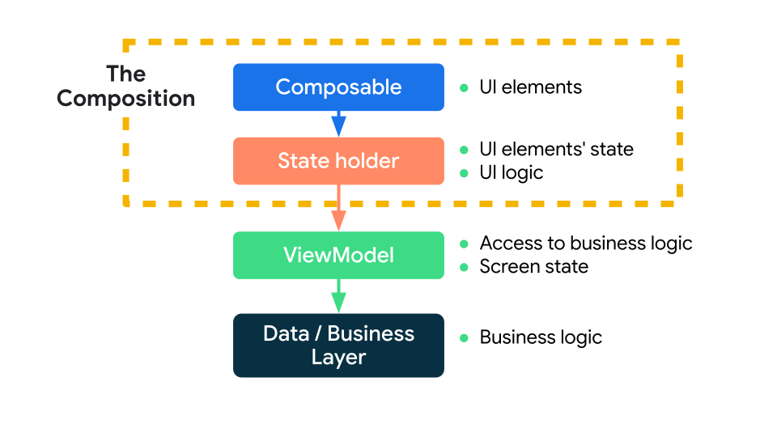

# Compose 状态管理

## 状态：State

[状态和 Jetpack Compose  | Android Developers](https://developer.android.com/jetpack/compose/state)

在Compose 中，用 `state` 来表示一个 UI 的状态。

使用`mutableStateOf()` 创建可观察到`MutableState<T>`，每当值发生变化时，将会重新读取 `State<T>.value` 并自动重组界面。

```kotlin
interface MutableState<T> : State<T> {
    override var value: T
}
```

#### 状态存储：rememberXXX

##### remember

**使用 `remember {}` 将状态存储在内存中**，防止重组时状态被重置，起到保护当前状态的作用。remember 支持接收 `key` 参数，当key发生变化时 remember 将重新执行初始化。`remember` 既可用于存储可变对象，又可用于存储不可变对象。

> Notes：remember的生命周期 和 **调用点**绑定，当调用 `remember` 的可组合项从组合中移除后，记录的值也将被移除。

```kotlin
@Composable
private fun Greeting(name: String) {
    // 这里重组依然还是之前的name
    val test = remember { name }
  	// remember支持返回任何类型，这里返回 State，可以被修改且获取到最新值
    val expanded = remember { mutableStateOf(false) }

    val extraPadding = if (expanded.value) 48.dp else 0.dp

    Surface(
        color = MaterialTheme.colorScheme.primary,
        modifier = Modifier.padding(vertical = 4.dp, horizontal = 8.dp)
    ) {
        Row(modifier = Modifier.padding(24.dp)) {
            Column(modifier = Modifier
                .weight(1f)
                .padding(bottom = extraPadding)
            ) {
                Text(text = "Hello, ")
                Text(text = name)
            }
            ElevatedButton(
                onClick = { expanded.value = !expanded.value }
            ) {
                Text(if (expanded.value) "Show less" else "Show more")
            }
        }
    }
}
```

##### rememberUpdatedState

`rememberUpdatedState` 会更新状态并保存在内存中，**保证每次都能获取到最新的值**。

它其实是对使用  `remember` 保存 `state` 的一个封装，源码如下：

```kotlin
@Composable
fun <T> rememberUpdatedState(newValue: T): State<T> = remember {
    // 创建一个 State
    mutableStateOf(newValue)
}.apply { value = newValue }
```

样例：

```kotlin
@Composable
fun LandingScreen(onTimeout: () -> Unit) {
    // 将 onTimeout 保存为状态
    val currentOnTimeout by rememberUpdatedState(onTimeout)

    // 传入 true 固定值，使 LaunchedEffect 不重新执行。
    LaunchedEffect(true) {
        delay(SplashWaitTimeMillis)
      	// 读取并执行
        currentOnTimeout()
    }

    /* Landing screen content */
}
```

##### rememberSaveable

**对于重新创建 activity 或进程的场景，应使用 `rememberSaveable` 来保存状态，以便恢复界面的状态**。

* 对于一般的数据类型，直接保存即可：

  ```kotlin
  val expanded = rememberSaveable { mutableStateOf(false) }
  ```

对于无法保存到 Bundle 中的内容，可以使用以下几种方式：

* Parcelize

  ```kotlin
  @Parcelize
  data class City(val name: String, val country: String) : Parcelable
  
  @Composable
  fun CityScreen() {
      var selectedCity = rememberSaveable {
          mutableStateOf(City("Madrid", "Spain"))
      }
  }
  ```

* MapSaver

  ```kotlin
  data class City(val name: String, val country: String)
  
  val CitySaver = run {
      val nameKey = "Name"
      val countryKey = "Country"
    	//
      mapSaver(
          save = { mapOf(nameKey to it.name, countryKey to it.country) },
          restore = { City(it[nameKey] as String, it[countryKey] as String) }
      )
  }
  
  @Composable
  fun CityScreen() {
      var selectedCity = rememberSaveable(stateSaver = CitySaver) {
          mutableStateOf(City("Madrid", "Spain"))
      }
  }
  ```

* LiveSaver

  ```kotlin
  data class City(val name: String, val country: String)
  //
  val CitySaver = listSaver<City, Any>(
      save = { listOf(it.name, it.country) },
      restore = { City(it[0] as String, it[1] as String) }
  )
  
  @Composable
  fun CityScreen() {
      var selectedCity = rememberSaveable(stateSaver = CitySaver) {
          mutableStateOf(City("Madrid", "Spain"))
      }
  }
  ```


#### 状态提升

Compose 中的状态提升是一种将状态移至可组合项的调用方以使可组合项无状态的模式。

Jetpack Compose 中的常规状态提升模式是将状态变量替换为两个参数：

- `value: T`：要显示的当前值
- `onValueChange: (T) -> Unit`：请求更改值的事件，其中 `T` 是建议的新值。函数名可以根据具体场景调整。

以这种方式提升的状态具有一些重要的属性：

- **单一可信来源**：通过移动状态，而不是复制状态，我们可确保只有一个可信来源。这有助于避免 bug。
- **封装**：只有有状态可组合项能够修改其状态。这完全是内部的。
- **可共享**：可与多个可组合项共享提升的状态。如果想在另一个可组合项中执行 `name` 操作，可以通过变量提升来做到这一点。
- **可拦截**：无状态可组合项的调用方可以在更改状态之前决定忽略或修改事件。
- **解耦**：无状态 `ExpandingCard` 的状态可以存储在任何位置。例如，现在可以将 `name` 移入 `ViewModel`。

> 这种 状态向下流动，事件向上流动的模式 称为 **“单向数据流”**


#### 管理状态



* Composable： 管理简单的界面元素状态（界面元素的提升状态）。
* State holder：管理复杂的界面元素状态，且拥有界面元素的状态和界面逻辑（导航、如何显示提示等）。
* ViewModel：提供业务逻辑（处理状态变化）以及屏幕界面状态（屏幕上显示的内容）的访问权限


## 副作用（Side-effects）

**Side-effects 副作用**：指发生在可组合函数作用域之外的应用状态的变化，官方推荐在 `onClick` 等回调中触发附带效应，以免发生异常。

* 写入共享对象的属性
* 更新 `ViewModel` 中的可观察项
* 更新共享数据

#### LaunchedEffect

允许我们在可组合项 内运行挂起函数。

它可以接收一个 key 参数，和一个协程体 block ：

* 若是变量则在变量发生变化时将会重新执行。
* 若是常量，如下方的Unit，表示生命周期于调用点相同

```kotlin
LaunchedEffect(Unit) { // 此处传入 Unit，表示生命周期于调用点相同。
  // wrap in try-finally to handle interruption whiles opening drawer
  try {
    drawerState.open()
  } finally {
    viewModel.resetOpenDrawerAction()
  }
}

```

> 源码

```kotlin
fun LaunchedEffect(
    key1: Any?,
    block: suspend CoroutineScope.() -> Unit
) {
    val applyContext = currentComposer.applyCoroutineContext
    remember(key1) { LaunchedEffectImpl(applyContext, block) }
}

```


#### rememberCoroutineScope

获取组合感知作用域，以便在可组合项外启动协程。

* `rememberCoroutineScope` 是一个可组合函数，会返回一个 `CoroutineScope`。
* 该 CoroutineScope 绑定到调用它的组合点。调用退出组合后，作用域将取消。

```kotlin
@Composable
fun MoviesScreen(scaffoldState: ScaffoldState = rememberScaffoldState()) {

    // Creates a CoroutineScope bound to the MoviesScreen's lifecycle
  	// 创建一个和 MoviesScreen 相关联的 CoroutineScope
    val scope = rememberCoroutineScope()

    Scaffold(scaffoldState = scaffoldState) {
        Column {
            /* ... */
            Button(
                onClick = {
                    // Create a new coroutine in the event handler to show a snackbar
                  	// 启动协程并执行 showSnackbar
                    scope.launch {
                        scaffoldState.snackbarHostState.showSnackbar("Something happened!")
                    }
                }
            ) {
                Text("Press me")
            }
        }
    }
}
```

> 源码
>
> 内部创建了一个 CoroutineScope ，并和当前上下文进行关联绑定。

```kotlin
@Composable
inline fun rememberCoroutineScope(
    crossinline getContext: @DisallowComposableCalls () -> CoroutineContext =
        { EmptyCoroutineContext }
): CoroutineScope {
    val composer = currentComposer
  	// 创建一个 CoroutineScope， 使用 remember 和 compose进行关联
    val wrapper = remember {
        CompositionScopedCoroutineScopeCanceller(
            createCompositionCoroutineScope(getContext(), composer)
        )
    }
    return wrapper.coroutineScope
}

@PublishedApi
@OptIn(InternalComposeApi::class)
internal fun createCompositionCoroutineScope(
    coroutineContext: CoroutineContext,
    composer: Composer
) = if (coroutineContext[Job] != null) {
    CoroutineScope(
        Job().apply {
            completeExceptionally(
                IllegalArgumentException(
                    "CoroutineContext supplied to " +
                        "rememberCoroutineScope may not include a parent job"
                )
            )
        }
    )
} else {
    val applyContext = composer.applyCoroutineContext
    CoroutineScope(applyContext + Job(applyContext[Job]) + coroutineContext)
}
```

#### DisposableEffect

自带清理操作的Effect，提供了 `onDispose` 来供我们执行清理操作，`onDispose` 的触发时机：

* 第一次初始化。
* key 发生变化。
* 所在的可组合项(HomeScreen)退出组合时。

也就是说，除了以上几种情况，它都不会执行，适用于做一些注册/反注册的操作。

```kotlin
// LocalLifecycleOwner.current 表示当前Composable的生命周期
@Composable
fun HomeScreen(
    lifecycleOwner: LifecycleOwner = LocalLifecycleOwner.current,
    onStart: () -> Unit,
    onStop: () -> Unit
) {
    // ...
    DisposableEffect(key1 = lifecycleOwner) {
        val observer = LifecycleEventObserver { _, event ->
            if (event == Lifecycle.Event.ON_START) {
                currentOnStart()
            } else if (event == Lifecycle.Event.ON_STOP) {
                currentOnStop()
            }
        }
        // 绑定
        lifecycleOwner.lifecycle.addObserver(observer)
        onDispose { // 解绑，需要注意的是这里解绑后会接收不到 Lifecycle.Event.ON_DESTROY
            lifecycleOwner.lifecycle.removeObserver(observer)
        }
    }
}
```


---

### CompositionLocal（数据传递）

> 建议使用 `CompositionLocal` 的情况为：
>
> * 可能**会被任何（而非少数几个）后代使用**。
> * `CompositionLocal` 应**具有合适的默认值**。
>
> 其他场景应优先使用 显示参数传递给所需可组合项 或者 控制反转（父级通过逻辑处理组合项）的方式。

Compose 提供 `CompositionLocal` 使数据在界面树中能够隐式传递，而无需使用显示参数的方式进行传递。

* `CompositionLocal` 是**通过组合隐式向下传递数据的工具**。

* `CompositionLocal` 实例的**作用域限定为组合的一部分**
* `CompositionLocal` 的 `current` 值对应于该组合部分中的某个祖先提供的**最接近的值**。

> 范例源码来自 `JetChat中的 BackPressHandler`

#### 创建

* `compositionLocalOf`：在重组期间更改提供的值只会使读取其 `current` 值的内容无效，**即仅重组读取值的位置**。
* `staticCompositionLocalOf` ：与 `compositionLocalOf` 不同，更改该值会导致提供 `CompositionLocal` 的整个 `content` lambda 被重组，而不仅仅是在组合中读取 `current` 值的位置。**所以仅当 `CompositionLocal` 提供的值几乎或者永远不会更改时使用。** 

> 使用范例：

```kotlin
// val LocalBackPressedDispatcher = compositionLocalOf { error("No Back Dispatcher provided") 

// 构建并赋予默认值
val LocalBackPressedDispatcher =
    staticCompositionLocalOf<OnBackPressedDispatcher> { error("No Back Dispatcher provided") }

```

#### 赋值

使用 `provides` infix 函数, 将 `CompositionLocal` 和 `value` 相关联。

```kotlin
CompositionLocalProvider(
  // 此处调用 provides 中缀方法 以onBackPressedDispatcher 为value 创建值
  LocalBackPressedDispatcher provides this@NavActivity.onBackPressedDispatcher
) {
}
```

> 源码

```kotlin
@Stable
abstract class ProvidableCompositionLocal<T> internal constructor(defaultFactory: () -> T) :
    CompositionLocal<T> (defaultFactory) {

    /**
     * 中缀方法，方便构造
     */
    @Suppress("UNCHECKED_CAST")
    infix fun provides(value: T) = ProvidedValue(this, value, true)

    /**
     * 中缀方法，方便构造
     */
    @Suppress("UNCHECKED_CAST")
    infix fun providesDefault(value: T) = ProvidedValue(this, value, false)
}
```

#### 取值

使用 `CompositionLocal.current` 返回值

```kotlin
val backDispatcher = LocalBackPressedDispatcher.current
```

### 状态转换

compose 中 不一定需要使用 `MutableState<T>`存储状态，也支持其他可观察到类型，如 `LiveData` 、 `Flow` 、 `RxJava2` 等。不过需要将这些类型转换为 `State<T>` 。

```kotlin
LiveData<T>.observeAsState() 
StateFlow<T>.collectAsState()

```


#### produceState：将非 Compose 状态转换为 Compose 状态

会启动一个协程，此协程将非 Compose 状态转换为 Compose 状态。同时将值推送到返回的 state 的组合。

```kotlin
@Composable
fun <T> produceState(
    initialValue: T,
    key1: Any?,
    @BuilderInference producer: suspend ProduceStateScope<T>.() -> Unit
): State<T> {
    val result = remember { mutableStateOf(initialValue) }
    LaunchedEffect(key1) {
        ProduceStateScopeImpl(result, coroutineContext).producer()
    }
    return result
}

```

```kotlin
@Composable
fun loadNetworkImage(
    url: String,
    imageRepository: ImageRepository
): State<Result<Image>> {
    return produceState<Result<Image>>(initialValue = Result.Loading, url, imageRepository) {
        val image = imageRepository.load(url)
        value = if (image == null) {
            Result.Error
        } else {
            Result.Success(image) // 转为了 State
        }
    }
}
```

#### derivedStateOf：将一个或多个状态对象转换为其他状态

某个状态是**从其他状态对象计算或派生得出时**使用

```kotlin
@Composable
fun TodoList(highPriorityKeywords: List<String> = listOf("Review", "Unblock", "Compose")) {
    val todoTasks = remember { mutableStateListOf<String>() }
  	// highPriorityKeywords 发生变化时，重新创建状态计算。
    val highPriorityTasks by remember(highPriorityKeywords) {
      	// todoTasks 发生变化时，重新计算。
        derivedStateOf { todoTasks.filter { it.containsWord(highPriorityKeywords) } }
    }
    Box(Modifier.fillMaxSize()) {
        LazyColumn {
          	// highPriorityTasks 重新计算时，此处更新
            items(highPriorityTasks) { /* ... */ }
            items(todoTasks) { /* ... */ }
        }
    }
}
```


#### snapshotFlow：将 Compose 的 State 转换为 Flow

```kotlin
val listState = rememberLazyListState()

LazyColumn(state = listState) {
    // ...
}

LaunchedEffect(listState) {
  	// block 中值发生变化时，将向收集器重新发送
    snapshotFlow { listState.firstVisibleItemIndex }
        .map { index -> index > 0 }
        .distinctUntilChanged()
        .filter { it == true }
        .collect {
            MyAnalyticsService.sendScrolledPastFirstItemEvent()
        }
}
```