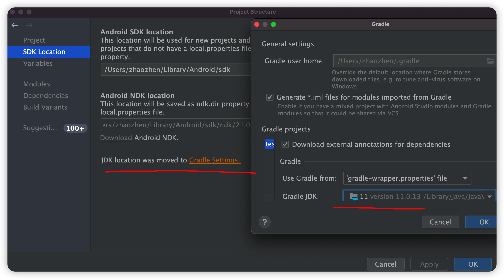

# Compose

[Jetpack Compose 界面应用开发工具包 - Android 开发者  | Android Developers (google.cn)](https://developer.android.google.cn/jetpack/compose)

[Jetpack Compose  | Android Developers (google.cn)](https://developer.android.google.cn/jetpack/compose/interop)

- Compose 编程思想

  https://developer.android.google.cn/jetpack/compose/mental-model

- GitHub repo 模板

  https://github.com/android/android-dev-challenge-compose

- Compose 中的布局

  https://developer.android.google.cn/jetpack/compose/layout

- Compose 文档: 列表

  https://youtu.be/BhqPpUYJYeQ

- Compose pathway

  https://developer.android.google.cn/courses/pathways/compose

- 提交作品

  https://developer.android.google.cn/dev-challenge#the-latest-challenge


## 为项目配置Compose

[将 Jetpack Compose 添加到应用中  | Android Developers (google.cn)](https://developer.android.google.cn/jetpack/compose/interop/adding)

### 配置Android Gradle插件版本

配置``root/build.gradle``

```groovy
buildscript {
    ...
    dependencies {
        classpath "com.android.tools.build:gradle:7.2.2"
        ...
    }
}
```

### 配置Kotlin版本

配置``root/build.gradle``

```groovy
buildscript {
		ext {
        kotlin_version = '1.7.10'
    }
    ...
    dependencies {
				classpath "org.jetbrains.kotlin:kotlin-gradle-plugin:$kotlin_version"
        ...
    }
}
```

添加kotlin插件

```groovy
plugins {
    id 'kotlin-android'
}
```

### Gradle参数配置

最低 API 级别设置为 21 或更高级别，并且开启 Jetpack Compose

```groovy
android {
    defaultConfig {
        ...
        minSdkVersion 21
    }

    buildFeatures {
        // Enables Jetpack Compose for this module
        compose true
    }
    ...

    // Set both the Java and Kotlin compilers to target Java 8.
    compileOptions {
        sourceCompatibility JavaVersion.VERSION_1_8
        targetCompatibility JavaVersion.VERSION_1_8
    }
    kotlinOptions {
        jvmTarget = "1.8"
    }

    composeOptions {
        kotlinCompilerExtensionVersion '1.3.0'
    }
}
```

### 添加依赖项

> 使用 `activity-compose` 依赖项时，`androidx.activity` 也必须位于 1.3.0 版中。

```groovy
dependencies {
    // Integration with activities
    implementation 'androidx.activity:activity-compose:1.5.1'
    // Compose Material Design
    implementation 'androidx.compose.material:material:1.2.1'
    // Animations
    implementation 'androidx.compose.animation:animation:1.2.1'
    // Tooling support (Previews, etc.)
    implementation 'androidx.compose.ui:ui-tooling:1.2.1'
    // Integration with ViewModels
    implementation 'androidx.lifecycle:lifecycle-viewmodel-compose:2.5.1'
    // UI Tests
    androidTestImplementation 'androidx.compose.ui:ui-test-junit4:1.2.1'
}
```


### 其他配置

#### 需要Java 11




#### Gradle

```
compileSdkVersion = 31
minSdkVersion = 21

```


