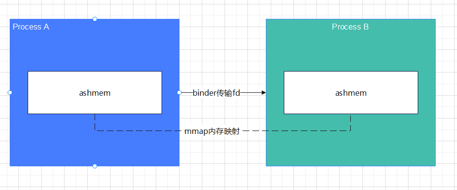

# ContentProvider

> 一种支持**不同进程甚至是应用程序之间共享数据**的机制。
>
> 例如：相册、日历、音频等系统模块。

## 实现机制

ContentProvider 在进行跨进程数据传递时，利用了`Binder` 和 `匿名共享内存(ashmem)`机制。

通过`Binder`传递`CursorWindow`对象内部的匿名共享的文件描述符，从而使用文件描述符来操作同一块匿名内存，达到不同进程访问相同数据的目的。



## 生命周期

>  ContentProvider 的生命周期在` Application onCreate() `之前，而且都是在主线程创建的。
>
> 在初始化时需要避免耗时操作，导致启动速度变慢。


## ----

* 如果操作的数据属于集合类型，那么MIME类型字符串应该以vnd.android.cursor.dir/开头。

```
例如：要得到所有person记录的Uri为content://contacts/person，
那么返回的MIME类型字符串为"vnd.android.cursor.dir/person"。

```
* 如果要操作的数据属于非集合类型数据，那么MIME类型字符串应该以vnd.android.cursor.item/开头。

```
例如：要得到id为10的person记录的Uri为content://contacts/person/10，
那么返回的MIME类型字符串应为"vnd.android.cursor.item/person"。
```
---
## ContentResolver

当外部应用需要对**ContentProvider**中的数据进行添加、删除、修改和查询操作时，可以使用**ContentResolver**类来完成，可以使用Context提供的``getContentResolver()``方法获取对象。

```java
public boolean onCreate() 
在创建ContentProvider时调用
-----
public Cursor query(Uri, String[], String, String[], String) 
用于查询指定Uri的ContentProvider，返回一个Cursor
-----
public Uri insert(Uri, ContentValues)
用于添加数据到指定Uri的ContentProvider中
-----
public int update(Uri, ContentValues, String, String[])
用于更新指定Uri的ContentProvider中的数据
-----
public int delete(Uri, String, String[]) 
用于从指定Uri的ContentProvider中删除数据
-----
public String getType(Uri) 
用于返回指定的Uri中的数据的MIME类型

```

## Uri

**Uri**指定了将要操作的**ContentProvider**，其实可以把一个**Uri**看作是一个**网址**，分为三部分。

* 第一部分是``"content://"``。可以看作是网址中的``"http://"``。
* 第二部分是主机名或authority，用于唯一标识这个ContentProvider，外部应用需要根据这个标识来找到它。可以看作是网址中的主机名，比如``"blog.csdn.NET"``。
* 第三部分是路径名，用来表示将要操作的数据。可以看作网址中细分的内容路径。


