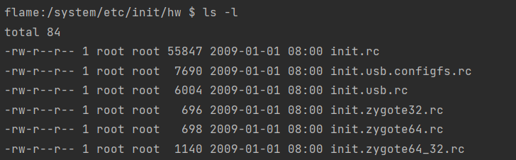

# Android Init Language

## 基础语法

在Android中的 init.rc文件包括其他的rc配置文件，它们都是由 Android Init Language 编写的脚本，我们需要简单了解一下语法以便后续阅读rc文件。

[详细的语法说明可以在这里查看](https://cs.android.com/android/platform/superproject/+/master:system/core/init/README.md)。

包括五大类语句：Actions, Commands, Services, Options, and Imports。

| 语句     |                                                              |      |
| -------- | ------------------------------------------------------------ | ---- |
| Imports  | 解析指定的配置，作为当前的配置的扩展。                       |      |
| Actions  | 表示一组被命名的命令集合。它**包含一个触发器**，可以被 `trigger`命令触发。当一个事件的发生与Action的触发器相匹配时，该Action就被添加到待执行队列的尾部。 |      |
| Services | 它是init启动的程序，并且服务会在退出后重新启动。即服务进程是守护进程。 |      |
| -        |                                                              |      |
| Commands | 它就是Action中包含的一条条命令。                             |      |
| Options  | 用于指定在什么时间怎么样来启动服务。                         |      |

### Section

init.rc 文件在解析中是以**Section为基本单位**，包括Actions，Services, Imports。

#### Action

```shell
on <trigger> [&& <trigger>]*
   <command>
   <command>
   <command>

# 定义 late-init 事件触发器
# 当 late-init 被触发时执行下方的Commands
on late-init
    trigger early-fs
    # 触发 zygote-start
    trigger zygote-start
    
on zygote-start
	...
```

#### Service

```shell
service <name> <pathname> [ <argument> ]*
   <option>
   <option>
   ...
#
service zygote_secondary /system/bin/app_process32 -Xzygote /system/bin --zygote --socket-name=zygote_secondary --enable-lazy-preload
    class main
    priority -20
    user root
    group root readproc reserved_disk
    socket zygote_secondary stream 660 root system
    socket usap_pool_secondary stream 660 root system
    onrestart restart zygote
    task_profiles ProcessCapacityHigh MaxPerformance
```

#### Import

```shell
import <path>
# 
import /system/etc/init/hw/init.${ro.zygote}.rc
```

### Trigger

和Action相关的还有一个触发器Trigger的概念，包括`event triggers` 和 `property triggers`两大类，本质是一个字符串。只要满足条件就会触发Action。

* event triggers：事件触发器由 `trigger`命令 或者 `QueueEventTrigger()`函数触发。

  ```shell
  on boot && property:a=b
  # 定义 boot 事件触发器， property:a=b 属性触发器
  # 当 boot事件发生 并且 属性 a=b 才会真的执行Action
  ```

* property triggers：属性触发器是指当一个指定的属性的值变为给定的新值时，或者当一个指定的属性的值变为任何新值时，触发的字符串。

  ```shell
  on property:a=b && property:c=d 
  # 此处定义了两个属性触发器。
  # a=b && c=d 时就触发Action
  ```


### Commod

命令有很多，这里摘录一些常见的：

| COMMAND                        |                                                              |
| ------------------------------ | ------------------------------------------------------------ |
| start                          | 启动指定的服务                                               |
| stop                           | 关闭指定的服务                                               |
| `class_start <serviceclass>`   | 启动指定类中的所有服务。对应函数为do_class_start.            |
| `class_stop <serviceclass>`    | 关闭指定类中的所有服务                                       |
| exec                           | 根据指定的文件或文件夹找到可执行程序，并在当前进程执行它。进程的用户空间代码和数据完全被新程序替换。**调用成功时无返回，失败返回-1** |
| exec_start                     |                                                              |
| trigger                        | 触发指定Action，会将指定的Action放到队尾。这样外部的循环就能够执行它。 |
| export                         | 设置全局环境变量，对所有进程都生效。                         |
| -                              |                                                              |
| mount                          | 挂载                                                         |
| `chmod <octal-mode> <path>`    | 修改文件的访问权限                                           |
| `chown <owner> <group> <path>` | 修改文件的owner 和 group                                     |
| hostname                       | 设置主机名                                                   |
| ifup                           | 使指定网络接口可用。                                         |
| chroot                         | 改变进程的根目录，起到限制访问文件系统的作用。               |
| chdir                          | 改变工作目录                                                 |
| insmod                         | 安装模块到指定路径                                           |
| sysclktz                       | 设置系统的时区                                               |
| ....                           |                                                              |

## init.rc 文件介绍

init.rc是一个配置文件，它是在 init进程启动后被解析的，记录着 init进程 需要执行哪些操作：

* on early-init：初始化早期阶段。位于触发序列的第一位，在cgroups被配置后但在ueventd的冷启动完成前被触发。
* on init：初始化阶段，冷启动完成后触发。负责启动一些重要的服务。**servicemanager在此时启动**。
* on late-init：初始化后期阶段，挂载文件系统并启动核心系统服务。触发了 zygote-start、boot等。
* on zygote-start：**启动zygote进程**。
* on boot：启动阶段
* on property:ro.debuggable=1：类型此结构都是表示，当对应属性等于指定值时触发。

> 完整文件可以查看 [init.rc - Android Code Search](https://cs.android.com/android/platform/superproject/+/master:system/core/rootdir/init.rc?q=init.rc&ss=android%2Fplatform%2Fsuperproject)

```shell
# 这个rc配置了一些环境变量 例如： `export EXTERNAL_STORAGE /sdcard`等。
import /init.environ.rc
import /system/etc/init/hw/init.usb.rc
import /init.${ro.hardware}.rc
import /vendor/etc/init/hw/init.${ro.hardware}.rc
import /system/etc/init/hw/init.usb.configfs.rc
# 导入Zygote相关的配置
import /system/etc/init/hw/init.${ro.zygote}.rc

# Cgroups are mounted right before early-init using list from /etc/cgroups.json
on early-init
	......
    start ueventd
    # create sys dirctory
    mkdir /dev/sys 0755 system system
	...
    
on init
    sysclktz 0
	...
    # cpuctl hierarchy for devices using utilclamp
    mkdir /dev/cpuctl/foreground
  	....
    # Mount binderfs
    mkdir /dev/binderfs
    mount binder binder /dev/binderfs stats=global
    chmod 0755 /dev/binderfs
	...
    # Start essential services.
    # 这里启动了 servicemanager
    start servicemanager
    start hwservicemanager
    start vndservicemanager
	...

# Mount filesystems and start core system services.
on late-init
    trigger early-fs
    ...
    # Now we can start zygote for devices with file based encryption
    # 触发 zygote-start,内部启动了zygote
    trigger zygote-start
	...
    trigger early-boot
    trigger boot

on early-fs
    # Once metadata has been mounted, we'll need vold to deal with userdata checkpointing
    start vold
    
# Section满足条件则会执行指定的COMMAND
# 条件：zygote-start被触发 并且 property:xxxx=xxx
# COMMAND：start zygote .... 
on zygote-start && property:xxx
    ...
    # 启动 zygote进程
    start zygote
    # 启动 zygote_secondary
    start zygote_secondary
	...

on boot
    # basic network init
    ifup lo
    hostname localhost
    domainname localdomain
    ....
    # Start standard binderized HAL daemons
    class_start hal
    class_start core

	...
```

下面开始我们来一步步分析 配置中的Action是如何执行的。

## Action执行流程

* 入口 是 init进程的 `SecondStageMain()`函数。
*  `LoadBootScripts()` 方法中会寻找init.rc 文件，然后通过解析器解析配置文件。
* 最后会开启一个 loop 循环调用 `am.ExecuteOneCommand()`，来执行Command。
  * 在`builtins.cpp`中定义了 一个 BuiltinFunctionMap，其中记录了Command和Function的对应关系。


### 流程入口：SecondStageMain()

> [init.cpp - SecondStageMain](https://cs.android.com/android/platform/superproject/+/master:system/core/init/init.cpp;drc=5ca657189aac546af0aafaba11bbc9c5d889eab3;l=939)

```cpp
int SecondStageMain(int argc, char** argv) {
    ...
	// 获取 command和fuction的映射表
    const BuiltinFunctionMap& function_map = GetBuiltinFunctionMap();
    Action::set_function_map(&function_map);
    ...
    // 存储并管理解析到的 Action
    ActionManager& am = ActionManager::GetInstance();
    // 存储解析到的 Service
    ServiceList& sm = ServiceList::GetInstance();
    // 加载init.rc，解析内部的Action和Service
    LoadBootScripts(am, sm);
	...
    // 开启无限循环
    while (true) {
       	...
        if (!(prop_waiter_state.MightBeWaiting() || Service::is_exec_service_running())) {
            // 一条一条执行action
            am.ExecuteOneCommand();
        }
 		...
    }
    return 0;
}
```

### 配置解析：LoadBootScripts()

rc 配置文件的大致解析流程：

* 寻找init.rc 文件。
  * 首先会尝试通过``GetProperty("ro.boot.init_rc", "")``获取配置
  * 若不存在则使用默认的几个配置文件。
* 最终调用``parser.ParseConfig()``函数来解析配置文件。

选定需要解析的 init.rc 文件，并创建解析器解析文件。

解析结果会保存在  action_manager 和 service_list 中。

> [init.cpp - LoadBootScripts](https://cs.android.com/android/platform/superproject/+/master:system/core/init/init.cpp;drc=5ca657189aac546af0aafaba11bbc9c5d889eab3;l=364)

```cpp
static void LoadBootScripts(ActionManager& action_manager, ServiceList& service_list) {
    // 解析Service
    Parser parser = CreateParser(action_manager, service_list);
	// 优先从 ro.boot.init_rc 中获取init.rc的路径
    std::string bootscript = GetProperty("ro.boot.init_rc", "");
    if (bootscript.empty()) {
        // 没有则使用默认的init.rc文件
        parser.ParseConfig("/system/etc/init/hw/init.rc");
        if (!parser.ParseConfig("/system/etc/init")) {
            late_import_paths.emplace_back("/system/etc/init");
        }
        // late_import is available only in Q and earlier release. As we don't
        // have system_ext in those versions, skip late_import for system_ext.
        parser.ParseConfig("/system_ext/etc/init");
        if (!parser.ParseConfig("/vendor/etc/init")) {
            late_import_paths.emplace_back("/vendor/etc/init");
        }
        if (!parser.ParseConfig("/odm/etc/init")) {
            late_import_paths.emplace_back("/odm/etc/init");
        }
        if (!parser.ParseConfig("/product/etc/init")) {
            late_import_paths.emplace_back("/product/etc/init");
        }
    } else {
        parser.ParseConfig(bootscript);
    }
}
```

#### CreateParser()

创建了3个解析器，分别负责处理`service`、`on`、`import` 三个Section关键字。

* service：使用 [ServiceParser](https://cs.android.com/android/platform/superproject/+/master:system/core/init/service_parser.cpp) 解析Service，对应[。
* on：使用 [ActionParser](https://cs.android.com/android/platform/superproject/+/master:system/core/init/action_parser.cpp) 解析Action。
* import：使用 [ImportParser]() 解析Import。

> [properties.cpp - CreateParser](https://cs.android.com/android/platform/superproject/+/master:system/libbase/properties.cpp;drc=5ca657189aac546af0aafaba11bbc9c5d889eab3;l=109)

```cpp
Parser CreateParser(ActionManager& action_manager, ServiceList& service_list) {
    Parser parser;
    // 解析service
    parser.AddSectionParser("service", std::make_unique<ServiceParser>(
                                               &service_list, GetSubcontext(), std::nullopt));
    // 解析action
    parser.AddSectionParser("on", std::make_unique<ActionParser>(&action_manager, GetSubcontext()));
    // 解析 improt
    parser.AddSectionParser("import", std::make_unique<ImportParser>(&parser));
    return parser;
}
// 最终添加到 section_parsers_中
void Parser::AddSectionParser(const std::string& name, std::unique_ptr<SectionParser> parser) {
    section_parsers_[name] = std::move(parser);
}

// 这里添加 line_callbacks_，和Ueventd相关
void Parser::AddSingleLineParser(const std::string& prefix, LineCallback callback) {
    line_callbacks_.emplace_back(prefix, std::move(callback));
}
```

#### ParseConfig()

最终是在 [parser.cpp](https://cs.android.com/android/platform/superproject/+/master:system/core/init/parser.cpp;drc=5ca657189aac546af0aafaba11bbc9c5d889eab3;l=186) 中处理的解析：

```cpp
bool Parser::ParseConfig(const std::string& path) {
    if (is_dir(path.c_str())) {
        // 文件夹流程，内部最终调用的还是 ParseConfigFile
        return ParseConfigDir(path);
    }
    // 文件流程
    auto result = ParseConfigFile(path);
    if (!result.ok()) {
        LOG(INFO) << result.error();
    }
    return result.ok();
}
```

若``path``是一个文件夹，将会筛选出该文件夹下的配置文件, 最终便利文件列表依次调用``ParseConfigFile()函数``。

```cpp
bool Parser::ParseConfigDir(const std::string& path) {
    LOG(INFO) << "Parsing directory " << path << "...";
    std::unique_ptr<DIR, decltype(&closedir)> config_dir(opendir(path.c_str()), closedir);
    if (!config_dir) {
        PLOG(INFO) << "Could not import directory '" << path << "'";
        return false;
    }
    dirent* current_file;
    std::vector<std::string> files;
    while ((current_file = readdir(config_dir.get()))) {
        // Ignore directories and only process regular files.
        // 仅处理 规则文件
        if (current_file->d_type == DT_REG) {
            std::string current_path =
                android::base::StringPrintf("%s/%s", path.c_str(), current_file->d_name);
            files.emplace_back(current_path);
        }
    }
    // Sort first so we load files in a consistent order (bug 31996208)
    std::sort(files.begin(), files.end());
    for (const auto& file : files) {
        // 最终还是调用的单文件解析配置
        if (auto result = ParseConfigFile(file); !result.ok()) {
            LOG(ERROR) << "could not import file '" << file << "': " << result.error();
        }
    }
    return true;
}
```

若``path``是一个文件，将先读取文件内容，若读取成功将调用``ParseData()``函数处理数据并返回``true``，否则将返回``false``。

```cpp
Result<void> Parser::ParseConfigFile(const std::string& path) {
    LOG(INFO) << "Parsing file " << path << "...";
    android::base::Timer t;
    auto config_contents = ReadFile(path);
    if (!config_contents.ok()) {
        return Error() << "Unable to read config file '" << path
                       << "': " << config_contents.error();
    }

    ParseData(path, &config_contents.value());

    LOG(VERBOSE) << "(Parsing " << path << " took " << t << ".)";
    return {};
}
```

#### ParseData()

主要的作用就是解析处配置文件中的`Section`。

* `section_parser->ParseSection`：解析 Section
* `section_parser->ParseLineSection()`：解析Service中的 option，并调用对应的函数。

> [parser.cpp - ParseData](https://cs.android.com/android/platform/superproject/+/master:system/core/init/parser.cpp;drc=5ca657189aac546af0aafaba11bbc9c5d889eab3;l=45)

```cpp
void Parser::ParseData(const std::string& filename, std::string* data) {
    data->push_back('\n');
    data->push_back('\0');

    // 初始化解析状态
    parse_state state;
    state.line = 0;
    state.ptr = data->data();
    state.nexttoken = 0;

    SectionParser* section_parser = nullptr;
    int section_start_line = -1;
    std::vector<std::string> args;

    // If we encounter a bad section start, there is no valid parser object to parse the subsequent
    // sections, so we must suppress errors until the next valid section is found.
    bool bad_section_found = false;
	
    // 这个函数 表示一个section解析完成，此时将会把解析结果直接移动拷贝到对应的地方
    // 例如action 则将被移动拷贝到 actionmanager 中。
    auto end_section = [&] {
        bad_section_found = false;
        if (section_parser == nullptr) return;

        if (auto result = section_parser->EndSection(); !result.ok()) {
            parse_error_count_++;
            LOG(ERROR) << filename << ": " << section_start_line << ": " << result.error();
        }

        section_parser = nullptr;
        section_start_line = -1;
    };
	// 开始解析
    for (;;) {
        // 内部通过逐个比对data中的字符，匹配特定的几个关键字符(\n \t \r #等)，返回对应的token
        switch (next_token(&state)) {
            case T_EOF:
                // 文件解析完毕
                end_section();
                for (const auto& [section_name, section_parser] : section_parsers_) {
                    section_parser->EndFile();
                }
                return;
            case T_NEWLINE: { // 表示解析到新的一行数据
                state.line++;
                if (args.empty()) break;
                // If we have a line matching a prefix we recognize, call its callback and unset any
                // current section parsers.  This is meant for /sys/ and /dev/ line entries for
                // uevent.
                auto line_callback = std::find_if(
                    line_callbacks_.begin(), line_callbacks_.end(),
                    [&args](const auto& c) { return android::base::StartsWith(args[0], c.first); });
                // line_callback 和 uevent 相关，可以不管
                if (line_callback != line_callbacks_.end()) {
                    end_section();

                    if (auto result = line_callback->second(std::move(args)); !result.ok()) {
                        parse_error_count_++;
                        LOG(ERROR) << filename << ": " << state.line << ": " << result.error();
                    }
                } else if (section_parsers_.count(args[0])) {
                    // section_parsers_ 就是我们之前添加的 三个解析器。
                    // 通过 count 判断是否存在指定的解析器。
                    end_section();
                    // 将解析器存放到 section_parser 中。
                    section_parser = section_parsers_[args[0]].get();
                    section_start_line = state.line;
                    // // 然后调用对应解析器解析Section
                    if (auto result =
                                section_parser->ParseSection(std::move(args), filename, state.line);
                        !result.ok()) {
                        parse_error_count_++;
                        LOG(ERROR) << filename << ": " << state.line << ": " << result.error();
                        section_parser = nullptr;
                        bad_section_found = true;
                    }
                } else if (section_parser) {
                    // 此处 调用 ParseLineSection 
                    // 若是ServiceParser，内部会解析 Option。
                    // 若是ActionParser，内部会将Command加入到队列中。
                    if (auto result = section_parser->ParseLineSection(std::move(args), state.line);
                        !result.ok()) {
                        parse_error_count_++;
                        LOG(ERROR) << filename << ": " << state.line << ": " << result.error();
                    }
                } else if (!bad_section_found) {
                    parse_error_count_++;
                    LOG(ERROR) << filename << ": " << state.line
                               << ": Invalid section keyword found";
                }
                args.clear();
                break;
            }
            case T_TEXT:
                // 
                args.emplace_back(state.text);
                break;
        }
    }
}
```

### 执行Command

 `SecondStageMain()` 在最后会开启 loop 循环调用 `am.ExecuteOneCommand()`。


#### ActionManager::ExecuteOneCommand()

* 筛选出满足 trigger 的 Action。
* 执行Action中的指定的 Command。

[action_manager.cpp - ExecuteOneCommand](https://cs.android.com/android/platform/superproject/+/master:system/core/init/action_manager.cpp;drc=5ca657189aac546af0aafaba11bbc9c5d889eab3;bpv=1;bpt=1;l=67)

```cpp
void ActionManager::ExecuteOneCommand() {
    {
        auto lock = std::lock_guard{event_queue_lock_};
        // Loop through the event queue until we have an action to execute
        // 当没有可执行的Action时，将循环检查是否存在event trigger
        // 存在event trigger 则将筛选出符合条件的Action，放入执行列表中。
        while (current_executing_actions_.empty() && !event_queue_.empty()) {
            for (const auto& action : actions_) {
                if (std::visit([&action](const auto& event) { return action->CheckEvent(event); },
                               event_queue_.front())) {
                    current_executing_actions_.emplace(action.get());
                }
            }
            // 踢出
            event_queue_.pop();
        }
    }

    if (current_executing_actions_.empty()) {
        return;
    }
	// 获取队首的Action
    auto action = current_executing_actions_.front();

    if (current_command_ == 0) {
        std::string trigger_name = action->BuildTriggersString();
    }
	// 执行当前Action中的第current_command_个Command。
    action->ExecuteOneCommand(current_command_);

    // If this was the last command in the current action, then remove
    // the action from the executing list.
    // If this action was oneshot, then also remove it from actions_.
    // 计数 + 1
    ++current_command_;
    if (current_command_ == action->NumCommands()) {
        // 最后一个Command执行完毕，移除Action，并将计数重置为0
        current_executing_actions_.pop();
        current_command_ = 0;
        if (action->oneshot()) {
            auto eraser = [&action](std::unique_ptr<Action>& a) { return a.get() == action; };
            actions_.erase(std::remove_if(actions_.begin(), actions_.end(), eraser),
                           actions_.end());
        }
    }
}
```

#### Action::ExecuteOneCommand()

找到Action中指定位置的Command，并执行。其中有一个 `start` 命令，可以用于启动Service。例如 `start zygote`。

> [action.cpp - ExecuteOneCommand](https://cs.android.com/android/platform/superproject/+/master:system/core/init/action.cpp;drc=5ca657189aac546af0aafaba11bbc9c5d889eab3;l=146)

```cpp
ExecuteOneCommandvoid Action::ExecuteOneCommand(std::size_t command) const {
    // We need a copy here since some Command execution may result in
    // changing commands_ vector by importing .rc files through parser
    // 获取指定 Command
    Command cmd = commands_[command];
    ExecuteCommand(cmd);
}

void Action::ExecuteCommand(const Command& command) const {
    android::base::Timer t;
  
    // 调用 command.InvokeFunc()
    auto result = command.InvokeFunc(subcontext_);
    auto duration = t.duration();

    // Any action longer than 50ms will be warned to user as slow operation
    if (!result.has_value() || duration > 50ms ||
        android::base::GetMinimumLogSeverity() <= android::base::DEBUG) {
        std::string trigger_name = BuildTriggersString();
        std::string cmd_str = command.BuildCommandString();
    }
}

Result<void> Command::InvokeFunc(Subcontext* subcontext) const {
    if (subcontext) {
        if (execute_in_subcontext_) {
            return subcontext->Execute(args_);
        }

        auto expanded_args = subcontext->ExpandArgs(args_);
        if (!expanded_args.ok()) {
            return expanded_args.error();
        }
        return RunBuiltinFunction(func_, *expanded_args, subcontext->context());
    }

    return RunBuiltinFunction(func_, args_, kInitContext);
}
```

#### RunBuiltinFunction()

执行对应的function，并将参数传入。

例如 `start zygote` 就是调用 `do_start()`函数，然后将`service zygote_secondary /system/bin/app_process32 -Xzygote /system/bin --zygote --socket-name=zygote_secondary --enable-lazy-preload` 转为参数传入。

```cpp
// 执行Function
Result<void> RunBuiltinFunction(const BuiltinFunction& function,
                                const std::vector<std::string>& args, const std::string& context) {
    BuiltinArguments builtin_arguments{.context = context};

    builtin_arguments.args.resize(args.size());
    builtin_arguments.args[0] = args[0];
    for (std::size_t i = 1; i < args.size(); ++i) {
        auto expanded_arg = ExpandProps(args[i]);
        if (!expanded_arg.ok()) {
            return expanded_arg.error();
        }
        builtin_arguments.args[i] = std::move(*expanded_arg);
    }
	// 执行对应的function，并将参数传入。
    return function(builtin_arguments);
}
```

#### Command 映射表

> [builtins.cpp - GetBuiltinFunctionMap](https://cs.android.com/android/platform/superproject/+/master:system/core/init/builtins.cpp;drc=5ca657189aac546af0aafaba11bbc9c5d889eab3;bpv=1;bpt=1;l=1341)

```cpp
// Builtin-function-map start
// GetBuiltinFunctionMap 返回映射表
const BuiltinFunctionMap& GetBuiltinFunctionMap() {
    constexpr std::size_t kMax = std::numeric_limits<std::size_t>::max();
    // clang-format off
    // 这个Map对应的结构体在后面
    static const BuiltinFunctionMap builtin_functions = {
        {"bootchart",               {1,     1,    {false,  do_bootchart}}},
        {"chmod",                   {2,     2,    {true,   do_chmod}}},
        {"chown",                   {2,     3,    {true,   do_chown}}},
        {"class_reset",             {1,     1,    {false,  do_class_reset}}},
        {"class_restart",           {1,     2,    {false,  do_class_restart}}},
        {"class_start",             {1,     1,    {false,  do_class_start}}},
        {"class_stop",              {1,     1,    {false,  do_class_stop}}},
        {"copy",                    {2,     2,    {true,   do_copy}}},
        {"copy_per_line",           {2,     2,    {true,   do_copy_per_line}}},
        {"domainname",              {1,     1,    {true,   do_domainname}}},
        {"enable",                  {1,     1,    {false,  do_enable}}},
        {"exec",                    {1,     kMax, {false,  do_exec}}},
        {"exec_background",         {1,     kMax, {false,  do_exec_background}}},
        {"exec_start",              {1,     1,    {false,  do_exec_start}}},
        {"export",                  {2,     2,    {false,  do_export}}},
        {"hostname",                {1,     1,    {true,   do_hostname}}},
        {"ifup",                    {1,     1,    {true,   do_ifup}}},
        {"init_user0",              {0,     0,    {false,  do_init_user0}}},
        {"insmod",                  {1,     kMax, {true,   do_insmod}}},
        {"installkey",              {1,     1,    {false,  do_installkey}}},
        {"interface_restart",       {1,     1,    {false,  do_interface_restart}}},
        {"interface_start",         {1,     1,    {false,  do_interface_start}}},
        {"interface_stop",          {1,     1,    {false,  do_interface_stop}}},
        {"load_exports",            {1,     1,    {false,  do_load_exports}}},
        {"load_persist_props",      {0,     0,    {false,  do_load_persist_props}}},
        {"load_system_props",       {0,     0,    {false,  do_load_system_props}}},
        {"loglevel",                {1,     1,    {false,  do_loglevel}}},
        {"mark_post_data",          {0,     0,    {false,  do_mark_post_data}}},
        {"mkdir",                   {1,     6,    {true,   do_mkdir}}},
        // TODO: Do mount operations in vendor_init.
        // mount_all is currently too complex to run in vendor_init as it queues action triggers,
        // imports rc scripts, etc.  It should be simplified and run in vendor_init context.
        // mount and umount are run in the same context as mount_all for symmetry.
        {"mount_all",               {0,     kMax, {false,  do_mount_all}}},
        {"mount",                   {3,     kMax, {false,  do_mount}}},
        {"perform_apex_config",     {0,     0,    {false,  do_perform_apex_config}}},
        {"umount",                  {1,     1,    {false,  do_umount}}},
        {"umount_all",              {0,     1,    {false,  do_umount_all}}},
        {"update_linker_config",    {0,     0,    {false,  do_update_linker_config}}},
        {"readahead",               {1,     2,    {true,   do_readahead}}},
        {"remount_userdata",        {0,     0,    {false,  do_remount_userdata}}},
        {"restart",                 {1,     2,    {false,  do_restart}}},
        {"restorecon",              {1,     kMax, {true,   do_restorecon}}},
        {"restorecon_recursive",    {1,     kMax, {true,   do_restorecon_recursive}}},
        {"rm",                      {1,     1,    {true,   do_rm}}},
        {"rmdir",                   {1,     1,    {true,   do_rmdir}}},
        {"setprop",                 {2,     2,    {true,   do_setprop}}},
        {"setrlimit",               {3,     3,    {false,  do_setrlimit}}},
        {"start",                   {1,     1,    {false,  do_start}}},
        {"stop",                    {1,     1,    {false,  do_stop}}},
        {"swapon_all",              {0,     1,    {false,  do_swapon_all}}},
        {"enter_default_mount_ns",  {0,     0,    {false,  do_enter_default_mount_ns}}},
        {"symlink",                 {2,     2,    {true,   do_symlink}}},
        {"sysclktz",                {1,     1,    {false,  do_sysclktz}}},
        {"trigger",                 {1,     1,    {false,  do_trigger}}},
        {"verity_update_state",     {0,     0,    {false,  do_verity_update_state}}},
        {"wait",                    {1,     2,    {true,   do_wait}}},
        {"wait_for_prop",           {2,     2,    {false,  do_wait_for_prop}}},
        {"write",                   {2,     2,    {true,   do_write}}},
    };
    // clang-format on
    return builtin_functions;
}
// Builtin-function-map end

// 变量定义
using BuiltinFunction = std::function<Result<void>(const BuiltinArguments&)>;
using BuiltinFunctionMap = KeywordMap<BuiltinFunctionMapValue>;

// 结构体
class KeywordMap {
  public:
    struct MapValue {
        size_t min_args;
        size_t max_args;
        Value value;
    };
}
// command对应的函数
struct BuiltinFunctionMapValue {
    bool run_in_subcontext;
    BuiltinFunction function;
};

struct BuiltinArguments {
    const std::string& operator[](std::size_t i) const { return args[i]; }
    auto begin() const { return args.begin(); }
    auto end() const { return args.end(); }
    auto size() const { return args.size(); }

    std::vector<std::string> args;
    const std::string& context;
};
```


---

## Service相关流程

分析完Action的执行流程，我们已经知道 init.rc中定义Command都是在`ExecuteOneCommand()`中执行的，其中有一个 `start` 命令，以对应 `do_start()`函数，可以用于启动Service，其中包括了一个很重要的service：**zygote**，我们所有应用进程都是从zygote fork来的。

接下来我们就以 zygote 为例，来了解Service从解析到启动的详细流程。

### zygote.rc

先来看看zygote的配置，它在init.rc中通过 `import /system/etc/init/hw/init.${ro.zygote}.rc ` 导入。

> Notes：若是查看源码则是在 `/system/core/rootdir/` 目录下可用找到这些配置文件。
>
> 这里面包含了很多zygote的配置文件，分别对应 32位、64位，不过里面的内容都大同小异。



目前最新设备一般都使用`init.zygote64_32.rc`，表示内部同时运行了64位和32位两个zygote进程，以64为主，主要是为了同时支持64位和32位（Android5.0才开始支持64位）。

我们主要看`init.zygote64.rc`，它是主要的zygote。

> [init.zygote64_32.rc - Android Code Search](https://cs.android.com/android/platform/superproject/+/master:system/core/rootdir/init.zygote64_32.rc)
>
> [init.zygote64.rc - Android Code Search](https://cs.android.com/android/platform/superproject/+/master:system/core/rootdir/init.zygote64.rc)
>
> 这里将两个文件放一起了

* service：表示是一个服务。
* 服务名： zygote。
* 程序二进程文件位于：`/system/bin/app_process64`。
* 启动参数：`-Xzygote /system/bin --zygote --start-system-server --socket-name=zygote`
  * `/system/bin`：parent dir
  * `--zygote`：表示以 zygote mode 启动
  * `--start-system-server`：表示**zygote启动后需要启动 system_server**。
  * `--socket-name=zygote`：创建一个名为 **zygote的socket**，用于后续通信。

```shell
# 导入了64位的配置
import /system/etc/init/hw/init.zygote64.rc
# 定义 zygote_secondary 服务，它不启动system_server

service zygote_secondary /system/bin/app_process32 -Xzygote /system/bin --zygote --socket-name=zygote_secondary --enable-lazy-preload
    class main		# 执行main
    priority -20	# 
    user root		# 属于root用户
    group root readproc reserved_disk	# root 分组
    socket zygote_secondary stream 660 root system
    socket usap_pool_secondary stream 660 root system
    # zygote_secondary重启时会导致 zygote重启
    onrestart restart zygote
    task_profiles ProcessCapacityHigh MaxPerformance

---
###############################################
# 只有 primary_zygote才会启动system_server
# rc解析时：args[0] = service，按空格分割，依次类推
# main函数调用时的参数：args[0] = -Xzygote，按空格分割，依次类推
service zygote /system/bin/app_process64 -Xzygote /system/bin --zygote --start-system-server --socket-name=zygote
    class main
    priority -20
    user root			# 属于root用户
    group root readproc reserved_disk	# root 分组
    # 
    socket zygote stream 660 root system
    socket usap_pool_primary stream 660 root system
    onrestart exec_background - system system -- /system/bin/vdc volume abort_fuse
    onrestart write /sys/power/state on
    # NOTE: If the wakelock name here is changed, then also
    # update it in SystemSuspend.cpp
    # zygote 重启时会导致以下服务重启
    onrestart write /sys/power/wake_lock zygote_kwl
    onrestart restart audioserver
    onrestart restart cameraserver
    onrestart restart media
    onrestart restart media.tuner
    onrestart restart netd
    onrestart restart wificond
    task_profiles ProcessCapacityHigh MaxPerformance
    critical window=${zygote.critical_window.minute:-off} target=zygote-fatal
```

这里面存在很多 option, 具体对应哪个函数 在 ServiceParser 中存在一个option的解析映射表，和Action中的Command映射表类似，我会在下面处理option的流程列出来。

### 解析Service：ServiceParser()

在上面的分析 init.rc解析流程时，我们看到在`LoadBootScripts()`中调用 `CreateParser()`创建了3个解析器，其中就有专门负责解析Service的 `ServiceParser`。它会将解析出来的service存入到 service_list中。

```C++
Parser CreateParser(ActionManager& action_manager, ServiceList& service_list) {
    Parser parser;
		// 这里注册了service的解析器ServiceParser，解析后的内容存放在ServiceList中。
    parser.AddSectionParser("service", std::make_unique<ServiceParser>(&service_list, subcontexts));
    ...
    return parser;
}
```

那我们就来看看 `ServiceParser.ParseSection() `  和 `ServiceParser.ParseLineSection()` 这两个函数的具体流程：

#### ParseSection()

[service_parser.cpp - ParseSection](https://cs.android.com/android/platform/superproject/+/master:system/core/init/service_parser.cpp;l=628)

解析Section，根据解析结果创建 Service对象。

```cpp
// service zygote /system/bin/app_process64 -Xzygote /system/bin --zygote --start-system-server --socket-name=zygote
Result<void> ServiceParser::ParseSection(std::vector<std::string>&& args,
                                         const std::string& filename, int line) {
    // args[0] = service
    // args[1] = zygote
    // args[2] = /system/bin/app_process64
    .....
    if (args.size() < 3) {
        return Error() << "services must have a name and a program";
    }
	// 获取 service name
    const std::string& name = args[1];
    if (!IsValidName(name)) {
        return Error() << "invalid service name '" << name << "'";
    }
	
    // rc配置文件路径
    filename_ = filename;

    Subcontext* restart_action_subcontext = nullptr;
    if (subcontext_ && subcontext_->PathMatchesSubcontext(filename)) {
        restart_action_subcontext = subcontext_;
    }
	
    // 取出启动程序args[2] 和 启动参数args[3 .. end]
    std::vector<std::string> str_args(args.begin() + 2, args.end());
	// 根据不同的 android 版本来进行启动程序的替换
    if (SelinuxGetVendorAndroidVersion() <= __ANDROID_API_P__) {
        if (str_args[0] == "/sbin/watchdogd") {
            str_args[0] = "/system/bin/watchdogd";
        }
    }
    if (SelinuxGetVendorAndroidVersion() <= __ANDROID_API_Q__) {
        if (str_args[0] == "/charger") {
            str_args[0] = "/system/bin/charger";
        }
    }
	//构建 service
    service_ = std::make_unique<Service>(name, restart_action_subcontext, filename, str_args);
    return {};
}
```

#### ParseLineSection()

此处解析Service中的Option，并执行解析函数。例如 `class main`

```cpp
Result<void> ServiceParser::ParseLineSection(std::vector<std::string>&& args, int line) {
    if (!service_) {
        return {};
    }
    // keywords: args[0] class
	// 通过映射表来找到option对应的解析函数
    auto parser = GetParserMap().Find(args);
    if (!parser.ok()) return parser.error();
    // 执行解析函数，并传入参数，例如 class 对应 ParseClass()
    return std::invoke(*parser, this, std::move(args));
}
```

#### option映射表

```cpp
const KeywordMap<ServiceParser::OptionParser>& ServiceParser::GetParserMap() const {
    constexpr std::size_t kMax = std::numeric_limits<std::size_t>::max();
    // clang-format off
    static const KeywordMap<ServiceParser::OptionParser> parser_map = {
        {"capabilities",            {0,     kMax, &ServiceParser::ParseCapabilities}},
        {"class",                   {1,     kMax, &ServiceParser::ParseClass}},
        {"console",                 {0,     1,    &ServiceParser::ParseConsole}},
        {"critical",                {0,     2,    &ServiceParser::ParseCritical}},
        {"disabled",                {0,     0,    &ServiceParser::ParseDisabled}},
        {"enter_namespace",         {2,     2,    &ServiceParser::ParseEnterNamespace}},
        {"file",                    {2,     2,    &ServiceParser::ParseFile}},
        {"gentle_kill",             {0,     0,    &ServiceParser::ParseGentleKill}},
        {"group",                   {1,     NR_SVC_SUPP_GIDS + 1, &ServiceParser::ParseGroup}},
        {"interface",               {2,     2,    &ServiceParser::ParseInterface}},
        {"ioprio",                  {2,     2,    &ServiceParser::ParseIoprio}},
        {"keycodes",                {1,     kMax, &ServiceParser::ParseKeycodes}},
        {"memcg.limit_in_bytes",    {1,     1,    &ServiceParser::ParseMemcgLimitInBytes}},
        {"memcg.limit_percent",     {1,     1,    &ServiceParser::ParseMemcgLimitPercent}},
        {"memcg.limit_property",    {1,     1,    &ServiceParser::ParseMemcgLimitProperty}},
        {"memcg.soft_limit_in_bytes",
                                    {1,     1,    &ServiceParser::ParseMemcgSoftLimitInBytes}},
        {"memcg.swappiness",        {1,     1,    &ServiceParser::ParseMemcgSwappiness}},
        {"namespace",               {1,     2,    &ServiceParser::ParseNamespace}},
        {"oneshot",                 {0,     0,    &ServiceParser::ParseOneshot}},
        {"onrestart",               {1,     kMax, &ServiceParser::ParseOnrestart}},
        {"oom_score_adjust",        {1,     1,    &ServiceParser::ParseOomScoreAdjust}},
        {"override",                {0,     0,    &ServiceParser::ParseOverride}},
        {"priority",                {1,     1,    &ServiceParser::ParsePriority}},
        {"reboot_on_failure",       {1,     1,    &ServiceParser::ParseRebootOnFailure}},
        {"restart_period",          {1,     1,    &ServiceParser::ParseRestartPeriod}},
        {"rlimit",                  {3,     3,    &ServiceParser::ParseProcessRlimit}},
        {"seclabel",                {1,     1,    &ServiceParser::ParseSeclabel}},
        {"setenv",                  {2,     2,    &ServiceParser::ParseSetenv}},
        {"shutdown",                {1,     1,    &ServiceParser::ParseShutdown}},
        {"sigstop",                 {0,     0,    &ServiceParser::ParseSigstop}},
        {"socket",                  {3,     6,    &ServiceParser::ParseSocket}},
        {"stdio_to_kmsg",           {0,     0,    &ServiceParser::ParseStdioToKmsg}},
        {"task_profiles",           {1,     kMax, &ServiceParser::ParseTaskProfiles}},
        {"timeout_period",          {1,     1,    &ServiceParser::ParseTimeoutPeriod}},
        {"updatable",               {0,     0,    &ServiceParser::ParseUpdatable}},
        {"user",                    {1,     1,    &ServiceParser::ParseUser}},
        {"writepid",                {1,     kMax, &ServiceParser::ParseWritepid}},
    };
    // clang-format on
    return parser_map;
}
```

#### Service结构体

> [service.h - Android Code Search](https://cs.android.com/android/platform/superproject/+/master:system/core/init/service.h;drc=5ca657189aac546af0aafaba11bbc9c5d889eab3;l=67)

```c++
class Service {
  // 声明友元类，允许ServiceParser 访问私有成员变量。
  friend class ServiceParser;

  public:
    Service(const std::string& name, Subcontext* subcontext_for_restart_commands,
            const std::string& filename, const std::vector<std::string>& args);
  ...
 private:
    void NotifyStateChange(const std::string& new_state) const;
    void StopOrReset(int how);
    void KillProcessGroup(int signal, bool report_oneshot = false);
    void SetProcessAttributesAndCaps(InterprocessFifo setsid_finished);
    void ResetFlagsForStart();
    Result<void> CheckConsole();
    void ConfigureMemcg();
    void RunService(const std::vector<Descriptor>& descriptors, InterprocessFifo cgroups_activated,
                    InterprocessFifo setsid_finished);
    void SetMountNamespace();
    static unsigned long next_start_order_;
    static bool is_exec_service_running_;
	
    // service的名字
    const std::string name_;
    // service所属class的名字
    std::set<std::string> classnames_;
    // service 的标识属性
    unsigned flags_;
    // 进程号
    pid_t pid_;
    android::base::boot_clock::time_point time_started_;  // time of last start 最近启动时间
    // 应用未捕获异常崩溃时 系统会弹窗提示应用崩溃，指定时间内多次崩溃会出现额外的提示，例如删除应用等选项。
    android::base::boot_clock::time_point time_crashed_;  // first crash within inspection window 第一次崩溃发生时间
    int crash_count_;                     // number of times crashed within window 崩溃次数(带系统窗口)
    bool upgraded_mte_ = false;           // whether we upgraded async MTE -> sync MTE before
    // 一定时间内崩溃超过四次 会触发 fatal()
    std::chrono::minutes fatal_crash_window_ = 4min;  // fatal() when more than 4 crashes in it
    std::optional<std::string> fatal_reboot_target_;  // reboot target of fatal handler

    std::optional<CapSet> capabilities_;
    ProcessAttributes proc_attr_;
    
    NamespaceInfo namespaces_;

    std::string seclabel_;
    // 部分service 使用了socket，用来描述sockets相关信息，比如zygote
    std::vector<SocketDescriptor> sockets_;
    std::vector<FileDescriptor> files_;
    
    // service一般运行在一个单独的进程中,environment_vars_用来描述创建这个进程时所需的环境变量信息
    std::vector<std::pair<std::string, std::string>> environment_vars_;
    // Environment variables that only get applied to the next run.
    std::vector<std::pair<std::string, std::string>> once_environment_vars_;

    const Subcontext* const subcontext_;
    
    // 重启时触发的Action
    Action onrestart_;  // Commands to execute on restart.

    std::vector<std::string> writepid_files_;
    std::vector<std::string> task_profiles_;
    std::set<std::string> interfaces_;  // e.g. some.package.foo@1.0::IBaz/instance-name

    // keycodes for triggering this service via /dev/input/input*
    std::vector<int> keycodes_;

    int oom_score_adjust_;
    int swappiness_ = -1;
    int soft_limit_in_bytes_ = -1;

    int limit_in_bytes_ = -1;
    int limit_percent_ = -1;
    std::string limit_property_;

    bool process_cgroup_empty_ = false;
    bool override_ = false;
    unsigned long start_order_;
    bool sigstop_ = false;

    std::chrono::seconds restart_period_ = 5s;
    std::optional<std::chrono::seconds> timeout_period_;

    bool updatable_ = false;
    const std::vector<std::string> args_;
    std::vector<std::function<void(const siginfo_t& siginfo)>> reap_callbacks_;
    std::optional<MountNamespace> mount_namespace_;
    bool post_data_ = false;
    std::optional<std::string> on_failure_reboot_target_;

    std::string filename_;
};
```

---

### 启动Service

启动服务 一般都是通过 `start` 命令执行，对应的是 `do_start()`函数。

服务启动设计了 fork 进程，也涉及了 Linux 资源隔离 三大技术：namespace、cgroup、chroot，这里先简单介绍一下。

* namespace：可以创建出独立的文件系统、主机名、进程号、网络等资源空间，实现了**系统全局资源和进程局部资源的隔离**。

* cgroup：用来实现对**进程的 CPU、内存等资源的优先级和配额限制**。

* chroot：可以更改进程的根目录，也就是**限制访问文件系统**。

#### do_start()

> [builtins.cpp - do_start](https://cs.android.com/android/platform/superproject/+/master:system/core/init/builtins.cpp;l=762;drc=5ca657189aac546af0aafaba11bbc9c5d889eab3)

```C++
static Result<void> do_start(const BuiltinArguments& args) {
    // 查询服务
    // args[0] = service, args[1] = zygote
    Service* svc = ServiceList::GetInstance().FindService(args[1]);
    if (!svc) return Error() << "service " << args[1] << " not found";
    // 启动服务
    if (auto result = svc->Start(); !result.ok()) {
        return ErrorIgnoreEnoent() << "Could not start service: " << result.error();
    }
    return {};
}
```

#### Service::Start()

* 创建了一些 fd。
* fork 了一个进程，服务将启动在这个子进程中。

[service.cpp - Start](https://cs.android.com/android/platform/superproject/+/master:system/core/init/service.cpp;drc=5ca657189aac546af0aafaba11bbc9c5d889eab3;l=565)

```c++
Result<void> Service::Start() {
  	...
    post_data_ = ServiceList::GetInstance().IsPostData();

    LOG(INFO) << "starting service '" << name_ << "'...";

    // 创建一个SocketDescriptor
    std::vector<Descriptor> descriptors;
    for (const auto& socket : sockets_) {
        if (auto result = socket.Create(scon); result.ok()) {
            descriptors.emplace_back(std::move(*result));
        } else {
            LOG(INFO) << "Could not create socket '" << socket.name << "': " << result.error();
        }
    }
    
	// 创建一些文件描述符
    for (const auto& file : files_) {
        if (auto result = file.Create(); result.ok()) {
            descriptors.emplace_back(std::move(*result));
        } else {
            LOG(INFO) << "Could not open file '" << file.name << "': " << result.error();
        }
    }

    pid_t pid = -1;
    if (namespaces_.flags) {
        pid = clone(nullptr, nullptr, namespaces_.flags | SIGCHLD, nullptr);
    } else {
        // 调用fork创建子进程用于来启动服务
        pid = fork();
    }

    // pid = 0表示运行在子进程中
    if (pid == 0) {
        umask(077);
        cgroups_activated.CloseWriteFd();
        setsid_finished.CloseReadFd();
        // 在子进程中启动服务
        RunService(descriptors, std::move(cgroups_activated), std::move(setsid_finished));
        _exit(127);
    } else {
        cgroups_activated.CloseReadFd();
        setsid_finished.CloseWriteFd();
    }
    
	...
    NotifyStateChange("running");
    reboot_on_failure.Disable();
    return {};
}

```

#### Service::RunService()

* 调用ExpandArgsAndExecv() 执行服务程序

> [service.cpp - RunService](https://cs.android.com/android/platform/superproject/+/master:system/core/init/service.cpp;drc=5ca657189aac546af0aafaba11bbc9c5d889eab3;l=508)

```cpp
// Enters namespaces, sets environment variables, writes PID files and runs the service executable.
void Service::RunService(const std::vector<Descriptor>& descriptors,
                         InterprocessFifo cgroups_activated, InterprocessFifo setsid_finished) {
    // Enters namespaces
    // namespace 包含独立的文件系统、主机名、进程号、网络等资源空间，实现了系统全局资源和进程局部资源的隔离。
    if (auto result = EnterNamespaces(namespaces_, name_, mount_namespace_); !result.ok()) {
        LOG(FATAL) << "Service '" << name_ << "' failed to set up namespaces: " << result.error();
    }
	
    //  sets environment variables
    for (const auto& [key, value] : once_environment_vars_) {
        setenv(key.c_str(), value.c_str(), 1);
    }
    for (const auto& [key, value] : environment_vars_) {
        setenv(key.c_str(), value.c_str(), 1);
    }

    for (const auto& descriptor : descriptors) {
        // Publish() 会创建文件描述符fd 并将fd设置到环境变量中
        // 这里也包括了 socketDescriptor的发布。
        descriptor.Publish();
    }
	
    // 将Pid写入文件
    if (auto result = WritePidToFiles(&writepid_files_); !result.ok()) {
        LOG(ERROR) << "failed to write pid to files: " << result.error();
    }
    // cgroup 用来实现对进程的 CPU、内存等资源的优先级和配额限制。
  	// Wait until the cgroups have been created and until the cgroup controllers have been
    // activated.
    Result<uint8_t> byte = cgroups_activated.Read();
    if (!byte.ok()) {
        LOG(ERROR) << name_ << ": failed to read from notification channel: " << byte.error();
    }
    cgroups_activated.Close();
    if (*byte != kCgroupsActivated) {
        LOG(FATAL) << "Service '" << name_  << "' failed to start due to a fatal error";
        _exit(EXIT_FAILURE);
    }

  	...
	// 运行服务的可执行文件 args_[0] 就是可执行文件：/system/bin/app_process64
    if (!ExpandArgsAndExecv(args_, sigstop_)) {
        PLOG(ERROR) << "cannot execv('" << args_[0]
                    << "'). See the 'Debugging init' section of init's README.md for tips";
    }
}
```

#### ExpandArgsAndExecv()

内部通过 `evecv`函数执行程序，到此`/system/bin/app_process64`程序就被启动了，即zygote程序启动了。

> [service.cpp - ExpandArgsAndExecv](https://cs.android.com/android/platform/superproject/+/master:system/core/init/service.cpp;drc=5ca657189aac546af0aafaba11bbc9c5d889eab3;l=115)

```cpp
static bool ExpandArgsAndExecv(const std::vector<std::string>& args, bool sigstop) {
    std::vector<std::string> expanded_args;
    std::vector<char*> c_strings;

    expanded_args.resize(args.size());
    c_strings.push_back(const_cast<char*>(args[0].data()));
    for (std::size_t i = 1; i < args.size(); ++i) {
        // 处理 ${} 类型的参数
        auto expanded_arg = ExpandProps(args[i]);
        if (!expanded_arg.ok()) {
            LOG(FATAL) << args[0] << ": cannot expand arguments': " << expanded_arg.error();
        }
        expanded_args[i] = *expanded_arg;
        c_strings.push_back(expanded_args[i].data());
    }
    c_strings.push_back(nullptr);

    if (sigstop) {
        kill(getpid(), SIGSTOP);
    }
	// 调用 evecv 执行指定的程序：/system/bin/app_process64
    return execv(c_strings[0], c_strings.data()) == 0;
}
```

