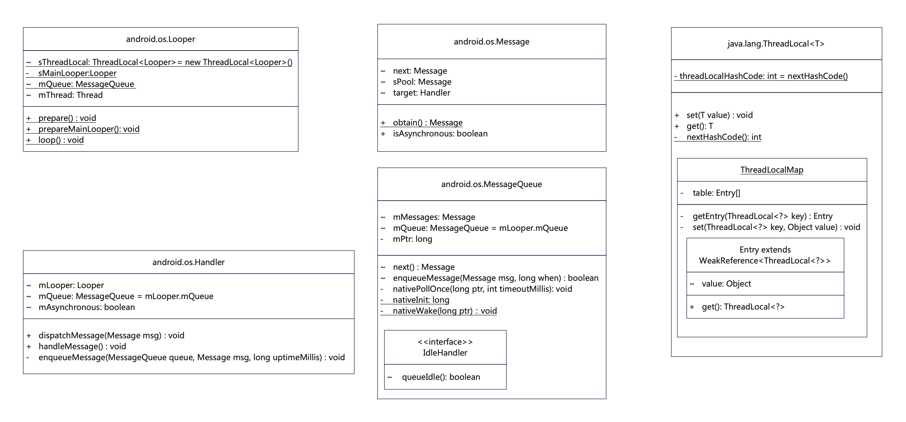

[TOC]

# Android消息机制之Java篇

## 整体流程

在启动线程时，线程内部维护了一个消息队列， 然后让线程进入无限循环。在这个无限循环中，线程会不断的检查消息队列中是否是消息，当循环检测到有消息到来，便会获取这个消息并执行它。如果没有则线程进入等待状态。如果需要执行某个任务，可以就向线程中的消息队列中发送消息。


整个消息机制的流程大致可以总结为以下几步:
1. **创建Looper实例**：在线程启动时通过 ``Looper.prepare()`` 创建一个唯一的Looper实例，Looper内**维护一个消息队列（MessageQueue)**。
2. **启动Looper循环处理消息**：调用`Looper.loop()`，在当前线程启动Looper循环，它会不断的从消息队列中的读取消息，并**通过Handler处理消息**, 没有消息需要执行时将会阻塞等待。
3. **使用Handler发生消息**：通过线程中的Looper对象来生成一个Handler实例， 通过handler发送消息。消息会被放入Looper的MessageQueue中。若当前阻塞，则通过``nativeWake(mPtr)``唤醒 epoll，从而Looper循环将继续处理消息。

### 组成部分

| 组成                   |                                                              |
| ---------------------- | ------------------------------------------------------------ |
| Thread                 | 一个线程对应一个Looper，它是消息执行的线程。                 |
| Looper：消息循环       | 它应该是消息机制的中的核心部分，负责从消息队列中取出消息，并交给Handler处理。 |
| Handler：消息处理器    | 1. 向消息队列投递消息。<br />2. 处理Looper中取出的消息。     |
| Message                | 消息实体，自身是一个链表结构。                               |
| MessageQueue：消息队列 | 负责管理，将接收到的消息按执行时间从近到排序后放入到链表中。 |

### UML类图

> 此处列出一些关键类的UML图，包含一些关键字段和方法。



## 重要的类

### 1. 消息(Message)

消息机制中的通讯数据实体，使用的是 `Parcelable` 序列化方式，性能很高，同时自身是一个链表格式，。可以通过Handler来发送的消息。

Message对象内部存在一个静态变量``sPool``，用于Message的复用。

`Message.obtain()` 方法会从 `sPoll` 中复用 Message对象，可以避免 new的重新分配内存。

```java
public final class Message implements Parcelable {
    /*消息码, 区分消息类型*/
    public int what;
    ...
    // 表示什么时候执行
    /*package*/ long when;
    ...
    // 存储了下一条消息的引用
    /*package*/ Message next; 
    private static final Object sPoolSync = new Object();
    // 消息池
    private static Message sPool;
    // 消息池当前大小
    private static int sPoolSize = 0;
    private static final int MAX_POOL_SIZE = 10;
    
    /**
     * 获取消息的通用方法
     */
    public static Message obtain() {
        synchronized (sPoolSync) {
            if (sPool != null) {
                // 指向消息的头部
                Message m = sPool;
                // 将消息池头部指向下一条
                sPool = m.next;
                m.next = null;
                // 消息池大小减1
                sPoolSize--;
                // 返回从消息池中取得的消息
                return m;
            }
        }
        // 消息池为空就创建一个消息
        return new Message();
    }
    
    // 实现Parcelable接口的方法, 可以将写入Parcel的对象还原为Message
    public static final Parcelable.Creator<Message> CREATOR  = new Parcelable.Creator<Message>() {
        public Message createFromParcel(Parcel source) {
            Message msg = Message.obtain();
            msg.readFromParcel(source);
            return msg;
        }
        
        public Message[] newArray(int size) {
            return new Message[size];
        }
    };
    
    /**
     * 此处完成了消息池的初始化
     * 使用消息的一方(),只要调用了recycle方法便把会废弃的消息放入消息池中以便重新利用。
     * 放入时这个消息的数据将被清空, 若要使用消息池中的消息, 需要调用obtain方法重新初始化
     */
    public void recycle() {
        clearForRecycle();
        synchronized (sPoolSync) {
            if (sPoolSize < MAX_POOL_SIZE) {
                next = sPool;
                sPool = this;
                sPoolSize++;
            }
        }
    }
    
    /*package*/ void clearForRecycle() {
        flags = 0;
        what = 0;
        arg1 = 0;
        arg2 = 0;
        obj = null;
        replyTo = null;
        when = 0;
        target = null;
        callback = null;
        data = null;
    }
    
}
```

### 2. 消息队列(MessageQueue)

所有通过Handler发送的消息，最终都会放入到 `MessageQueue` 中。

* 它提供了对消息队列管理的一些 api，并维护一个按执行时间从近到远的 消息队列。

* MessageQueue 实例化对象的同时 native层也完成初始化（NativeMessageQueue），建立了MessageQueue和NativeMessageQueue的关系。
  

![image_1c9odn8dlocl1lnh18mkahqbdo9.png-85.5kB][MessageQueue于NativeMessageQueue]

> 构造函数

```java
// 按照执行时间排序的消息队列，Message自身是链表结构
Message mMessages;
public class MessageQueue {
    boolean mQuitAllowed = true; // 默认允许推出, 没看到置为false的地方
    private int mPtr; // used by native code

    private native void nativeInit();
    
    MessageQueue() {
        // 执行Native层初始化操作
        nativeInit();
    }
    
}
```

> MessageQueue.enqueueMessage()

将链表中的所有消息进行排序（根据最执行时间进行从近到远排序）。若当前阻塞，则通过``nativeWake(mPtr)``唤醒epoll。

```java
final boolean enqueueMessage(Message msg, long when) {
    // 判断消息是否被使用, 新消息一定是未使用, 在next()里面被处理的消息将被标记为FLAG_IN_USE
    if (msg.isInUse()) {
        throw new AndroidRuntimeException(msg + " This message is already in use.");
    }
    // mQuitAllowed默认为true, 没找到设置为false的地方
    if (msg.target == null && !mQuitAllowed) {
        throw new RuntimeException("Main thread not allowed to quit");
    }
    final boolean needWake;
    synchronized (this) {
        if (mQuiting) { // 默认false, 当target(Handler) 所在线程异常退出时置为true
            RuntimeException e = new RuntimeException(
                msg.target + " sending message to a Handler on a dead thread");
            return false;
        } else if (msg.target == null) {
            mQuiting = true;
        }
        // 给新入队消息赋值执行时间
        msg.when = when;
        // 取出消息队列头部
        Message p = mMessages;
        // 对应三种情况（此时需要将新消息插入头部）
        // 1）消息队列为空 
        // 2）新入队消息需要立即执行 
        // 3）新入队消息的执行时间早于消息队列头部消息的执行时间
        if (p == null || when == 0 || when < p.when) {
            msg.next = p;
            mMessages = msg;
            // 有新消息要处理 若之前是阻塞状态则需要唤醒
            needWake = mBlocked;
        } else {
            // 遍历根据执行时间插入到指定位置
            Message prev = null;
            while (p != null && p.when <= when) {
                // p 在 msg之前执行
                prev = p;
                // 指向下一个进行比对
                p = p.next;
            }
            // msg 插入到链表中
            msg.next = prev.next;
            prev.next = msg;
            // 头部消息没有发生变化 不需要唤醒
            needWake = false;
        }
    }
    if (needWake) {
        // 唤醒
        nativeWake(mPtr);
    }
    return true;
}
```

> MessageQueue.next()

提供下一条需要处理的消息，它会阻塞等待直到到达消息的执行时机，没有消息时将会一直阻塞，直到有新消息入队时才会被主动唤醒。

```java
 Message next() {
    //如果消息循环已经退出并被处理，返回。
    //如果应用程序尝试在退出后重新启动looper，就会发生这种情况。
    final long ptr = mPtr;
    if (ptr == 0) {
        return null;
    }
    int pendingIdleHandlerCount = -1; // IdleHander的数量, 下面有介绍IdleHandler
    int nextPollTimeoutMillis = 0; // 空闲等待时间
    for (;;) {
        if (nextPollTimeoutMillis != 0) {
            Binder.flushPendingCommands();
        }
        // 传入 NativeMessageQueue 的地址ptr, 和等待时间
        nativePollOnce(ptr, nextPollTimeoutMillis);
        synchronized (this) {
            final long now = SystemClock.uptimeMillis();
            Message prevMsg = null; // 同步屏障流程时会被赋值，用于记录最后一条同步消息。
            Message msg = mMessages; // 取出队头
            if (msg != null && msg.target == null) {
                // msg.target == null 表示设置了同步屏障，msg 是同步屏障消息。 
                // 遍历消息队列过滤同步消息，遍历消息队列过滤同步消息，仅处理异步消息。
                do {
                    // 记录最后一条同步消息
                    prevMsg = msg;
                    // msg 指向下一条
                    msg = msg.next;
                } while (msg != null && !msg.isAsynchronous());
            }
            if (msg != null) {
                // 当前时间大于消息执行时间，消息队列指向下一条, 将执行的消息标记使用并返回
                if (now < msg.when) {
                    // 未到消息执行时间, 计算到可以执行的时间的时间差
                    nextPollTimeoutMillis = (int) Math.min(msg.when - now, Integer.MAX_VALUE);
                } else {
                    // 到达执行时机
                    // 标记为不阻塞
                    mBlocked = false;
                    // 将当前执行的消息从消息队列中移除。
                    if (prevMsg != null) {
                        // 碰到过同步屏障
                        // prevMsg 表示最近一个异步消息前的最后一条同步消息。
                        // prevMsg.next() 就是异步消息，这里等同于msg
                        // msg.next 是异步消息的后一条消息
                        // 所以这里就是将这条异步消息从队列中移除。
                        // 注意这里的 mMessages还是之前的队头，所以同步屏障还在，同步消息也并没有丢失
                        prevMsg.next = msg.next;
                    } else {
                        // 没有碰到同步屏障 队头直接指向下一条消息
                        mMessages = msg.next;
                    }
                    msg.next = null;
                    // 消息标记为已使用
                    msg.markInUse();
                    return msg;
                }
            } else {
                nextPollTimeoutMillis = -1;
            }
            if (mQuitting) {
                dispose();
                return null;
            }
            // 当前时间空闲, 看看有没有IdleHandler需要执行， 若没有则将当前线程状态设置为阻塞
            if (pendingIdleHandlerCount < 0
                    && (mMessages == null || now < mMessages.when)) {
                pendingIdleHandlerCount = mIdleHandlers.size();
            }
            if (pendingIdleHandlerCount <= 0) {
                mBlocked = true;
                continue;
            }
            if (mPendingIdleHandlers == null) {
                mPendingIdleHandlers = new IdleHandler[Math.max(pendingIdleHandlerCount, 4)];
            }
            mPendingIdleHandlers = mIdleHandlers.toArray(mPendingIdleHandlers);
        }
        // 处理空闲消息
        for (int i = 0; i < pendingIdleHandlerCount; i++) {
            final IdleHandler idler = mPendingIdleHandlers[i];
            mPendingIdleHandlers[i] = null; // release the reference to the handler
            boolean keep = false;
            try {
                keep = idler.queueIdle();
            } catch (Throwable t) {
                Log.wtf(TAG, "IdleHandler threw exception", t);
            }
            if (!keep) {
                synchronized (this) {
                    mIdleHandlers.remove(idler);
                }
            }
        }
        pendingIdleHandlerCount = 0;
        nextPollTimeoutMillis = 0;
    }
}
```

### 3. 消息循环(Looper)

* ``Looper.prepare()``：与当前线程绑定。

* ``Looper.loop()``：循环调用``MessageQueue.next()``获取消息，交给``Message.target.dispatchMessage()``分发处理。
  * `target`： 就是 Handler， 在`Handler.sendMessageAtTime()` 中被赋值。
* `sThreadLocal`：将Looper保存在线程中的。

```java
public class Looper {
    // 定义一个线程局部对象存储Looper对象
    static final ThreadLocal<Looper> sThreadLocal = new ThreadLocal<Looper>();
    // 消息队列
    final MessageQueue mQueue;
    final Thread mThread;
    
    /**
     * 创建了MessageQueue对象，同时也建立了MessageQueue和NativeMessageQueue的关系
     * 初始化了Native层的Looper
     * 持有当前线程的引用
     */
    private Looper() {
        // 创建了MessageQueue对象
        mQueue = new MessageQueue();
        // 将当前线程状态标记为run
        mRun = true;
        // 存储当前线程
        mThread = Thread.currentThread();
    }
    
    /**
     *  prepare()只能被调用一次, 否则直接抛出异常
     *  Looper对象存入ThreadLocal ,保证一个线程中只有一个Looper
     */
    private static void prepare(boolean quitAllowed) {
        if (sThreadLocal.get() != null) {
            throw new RuntimeException("Only one Looper may be created per thread");
        }
        sThreadLocal.set(new Looper(quitAllowed));
    }
    
    /**
     * loop 必须在prepare()后执行，否则报错
     */
    public static void loop() {
        Looper me = myLooper();
        if (me == null) {
            throw new RuntimeException("No Looper; Looper.prepare() wasn't called on this thread.");
        }
        MessageQueue queue = me.mQueue;
        // 在IPCThreadState中记录当前线程所属的PID 和 UID
        // 了解一下Binder
        Binder.clearCallingIdentity();
        final long ident = Binder.clearCallingIdentity();
        while (true) { 
            // 循环监听获取消息, 可能阻塞
            Message msg = queue.next();
            if (msg != null) {
                if (msg.target == null) {
                    return;
                }
                ......
                // 将获取到的消息交给消息处理器
                msg.target.dispatchMessage(msg);
                ......
                // 将处理过的消息回收并放入到消息池中
                msg.recycle();
            }
        }
    }
}
```

### 4. 消息处理器(Handler)

Handle是Looper线程的消息处理器, 承担了发送消息和处理消息两部分工作。

- 构造函数

```java
final MessageQueue mQueue;
final Looper mLooper;
final Callback mCallback;
IMessenger mMessenger; // 用于跨进程发送消息
public Handler() {
    ....
    // 将 Looper、MessageQueue和Handler关联到一起
    mLooper = Looper.myLooper();4
    if (mLooper == null) {
    // 必须调用Looper.prepare()后才能使用
        throw new RuntimeException(
            "Can't create handler inside thread that has not called Looper.prepare()");
    }
    mQueue = mLooper.mQueue;
    mCallback = null;
}
```


- Handler.post(new Runnable())

实际是发送了一条消息,此处的Runnable并没有创建线程，只是作为一个callback使用

```java
public final boolean post(Runnable r){
   return  sendMessageDelayed(getPostMessage(r), 0);
}

private static Message getPostMessage(Runnable r) {
    Message m = Message.obtain();
    m.callback = r;
    return m;
}
```

- Handler.sendMessageAtTime()

将自身赋值给msg.target, 并将消息放入MessageQueue中

```java
/**
 * uptimeMillis 表示何时处理这个消息
 */
public boolean sendMessageAtTime(Message msg, long uptimeMillis){
    boolean sent = false;
    MessageQueue queue = mQueue;
    if (queue != null) {
        // 将当前的Handler 指定为处理消息的目标端
        msg.target = this;
        // 入队
        sent = queue.enqueueMessage(msg, uptimeMillis);
    }
    else {
        RuntimeException e = new RuntimeException(
            this + " sendMessageAtTime() called with no mQueue");
        Log.w("Looper", e.getMessage(), e);
    }
    return sent;
}
```

- **Handler.dispatchMessage()消息分配**

以下源码可以看出, 当使用post()发送消息时, 最后会调用runnable.run()回调。sendMessage()则是执行handleMessage()， 这个就是我们构建对象时重写的方法

```java
public void dispatchMessage(Message msg) {  
    if (msg.callback != null) {  
        handleCallback(msg);  
    } else {  
        if (mCallback != null) {  
            if (mCallback.handleMessage(msg)) {  
                return;  
            }  
        }  
        handleMessage(msg);  
    }  
}
private static void handleCallback(Message message) {
    message.callback.run();
}
```


### 5. 线程局部变量(ThreadLocal)

它是**为了方便每个线程处理自己的状态而引入的一个机制**。

[ThreadLocal介绍](../../language/java/ThreadLocal.md)

```java
/**
 * 实质是线程的变量值的一个副本
 * 而他存取的数据，就是的当前线程的数据
 */
public class ThreadLocal<T> {
    public T get() {
        Thread t = Thread.currentThread();
        ThreadLocalMap map = getMap(t);
        if (map != null) {
            ThreadLocalMap.Entry e = map.getEntry(this);
            if (e != null)
                return (T)e.value;
        }
        return setInitialValue();
    }
}
```


## 同步屏障

> 对于一些需要优先处理的消息可以设置同步屏障并添加为异步消息，例如Android中的UI刷新事件就使用到了同步屏障(`ViewRootImpl.scheduleTraversals()`)。
>
> 使用同步屏障需要注意的是：设置了同步屏障后仅会处理异步消息，若想继续处理同步消息需要**移除同步屏障消息**。

Android消息机制中的 Message 可以分为 **同步消息** 和 **异步消息** 两类，我们默认发送的都是同步消息，当然平时这两种消息没有什么区别，仅在设置了 **同步屏障** 时才有差异。

同步屏障的作用是**过滤这个同步屏障消息之后执行的所有的同步消息，找到最近的异步消息并优先执行**，这里的过滤并不是将同步消息去除了只是暂时忽略不执行，后续还是会执行的。所以**同步屏障相当于一个过滤机制，过滤出所有的异步消息并优先执行**。

> 如何判断消息类型

message中通过 flags 来控制消息的状态，默认是0，消息使用后会被标记为 FLAG_IN_USE。调用`setAsynchronous()` 则会被设置为异步消息。

```java
// 标记使用
static final int FLAG_IN_USE = 1 << 0;
/** If set message is asynchronous */
static final int FLAG_ASYNCHRONOUS = 1 << 1;

int flags;
public boolean isAsynchronous() {
	return (flags & FLAG_ASYNCHRONOUS) != 0;
}

// 设置异步消息
public void setAsynchronous(boolean async) {
    if (async) {
        flags |= FLAG_ASYNCHRONOUS;
    } else {
        flags &= ~FLAG_ASYNCHRONOUS;
    }
}
```

### 如何使用同步屏障

我们可以通过 `MessageQueue.postSyncBarrier()` 来设置同步屏障，它会插入一个 `target`是空（也就是没有Hander）的消息到消息队列中，这个消息叫做**同步屏障消息**。

同样的当我们处理完逻辑后需要使用`MessageQueue.postSyncBarrier()` 来移除同步屏障，保证同步消息能够继续执行。

> 设置同步屏障

```java
	// 这个返回值很重要，是后续用来移除同步屏障的。
	private int postSyncBarrier(long when) {
        // 插入一条同步屏障消息,这里没有对 target进行赋值。
        synchronized (this) {
            // 这个token 是后续用来移除同步屏障的。
            final int token = mNextBarrierToken++;
            final Message msg = Message.obtain();
            msg.markInUse();
            msg.when = when;
            msg.arg1 = token;

            Message prev = null;
            Message p = mMessages;
            if (when != 0) {
                while (p != null && p.when <= when) {
                    prev = p;
                    p = p.next;
                }
            }
            if (prev != null) { // invariant: p == prev.next
                msg.next = p;
                prev.next = msg;
            } else {
                msg.next = p;
                mMessages = msg;
            }
            return token;
        }
    }

```

> 移除同步屏障

```java
	// 移除同步屏障消息，并唤醒Looper
	public void removeSyncBarrier(int token) {
        synchronized (this) {
            Message prev = null;
            Message p = mMessages;
            // 若同步屏障消息未执行，则遍历查找
            while (p != null && (p.target != null || p.arg1 != token)) {
                prev = p;
                p = p.next;
            }
            if (p == null) {
                throw new IllegalStateException("The specified message queue synchronization "
                        + " barrier token has not been posted or has already been removed.");
            }
            final boolean needWake;
            if (prev != null) {
                // 同步屏障消息之前还有消息，那么就不需要唤醒
                prev.next = p.next;
                needWake = false;
            } else {
                // 移除在队头的同步屏障消息
                mMessages = p.next;
                // 若没有下一条消息了或者下一条是同步消息，那么需要唤醒。
                // 因为异步消息是会在next()中处理的，不需要主动唤醒。
                needWake = mMessages == null || mMessages.target != null;
            }
            p.recycleUnchecked();

            // If the loop is quitting then it is already awake.
            // We can assume mPtr != 0 when mQuitting is false.
            if (needWake && !mQuitting) {
                // 唤醒Looper
                nativeWake(mPtr);
            }
        }
    }
```

### 同步屏障原理

这个同步屏障消息会在 `MessageQueue.next()` 中被处理。一旦开启同步屏障此后就仅处理异步消息，同步消息都会跳过。

```java
 Message next() {
    for (;;) {
        nativePollOnce(ptr, nextPollTimeoutMillis);
        synchronized (this) {
            final long now = SystemClock.uptimeMillis();
            Message prevMsg = null; // 同步屏障流程时会被赋值，用于记录最后一条同步消息。
            Message msg = mMessages;
            if (msg != null && msg.target == null) {
                // msg.target == null 表示碰到了同步屏障
                // 遍历消息队列过滤同步消息，仅处理异步消息。
                do {
                    // 记录最后一条同步消息
                    prevMsg = msg;
                    // msg 指向下一条
                    msg = msg.next;
                } while (msg != null && !msg.isAsynchronous());
            }
            if (msg != null) {
                // 当前时间大于消息执行时间，消息队列指向下一条, 将执行的消息标记使用并返回
                if (now < msg.when) {
                    // 未到消息执行时间, 计算到可以执行的时间的时间差
                    nextPollTimeoutMillis = (int) Math.min(msg.when - now, Integer.MAX_VALUE);
                } else {
                    // 到达执行时机
                    // 标记为不阻塞
                    mBlocked = false;
                    // 将当前执行的消息从消息队列中移除。
                    if (prevMsg != null) {
                        // 碰到过同步屏障
                        // prevMsg 表示最近一个异步消息前的最后一条同步消息。
                        // prevMsg.next() 就是异步消息，这里等同于msg
                        // msg.next 是异步消息的后一条消息
                        // 所以这里就是将这条异步消息从队列中移除。
                        // 注意这里的 mMessages还是之前的队头，所以同步屏障还在，同步消息也并没有丢失
                        prevMsg.next = msg.next;
                    } else {
                        // 没有碰到同步屏障 直接指向下一条消息
                        mMessages = msg.next;
                    }
                    msg.next = null;
                    // 消息标记为已使用
                    msg.markInUse();
                    return msg;
                }
            } else {
                nextPollTimeoutMillis = -1;
            }
        }
    }
}
```


## !!!

### HandleThread
主要和Handle结合使用来处理异步任务
- 实质是一个Thread, 继承自Thread
- 他拥有自己的Looper对象
- 必须调用HandleThread.start()方法, 因为在run中创建Looper对象

### IdleHandler

使用场景:

- 主线程加载完页面之后，去加载一些二级界面;
- 管理一些任务, 空闲时触发执行队列。

Handler线程空闲时执行:

- 线程的消息队列为空
- 消息队列头部的处理时间未到

使用：

```java
// 可以参考ActivityThread类中的空闲时执行gc流程
class IdleForever implements MessageQueue.IdleHandler {
    /**
     * @return true : 保持此Idle一直在Handler中, 每次线程执行完后都会在这执行.
     */
    @Override
    public boolean queueIdle() {
        Log.d("", "我,天地难葬!");
        return true;
    }
}

class IdleOnce implements MessageQueue.IdleHandler {
    /**
     * @return false : 执行一次后就从Handler线程中remove掉
     */
    @Override
    public boolean queueIdle() {
        Log.d("", "我真的还想再活五百年~!!!");
        return false;
    }
}
```


## 参考资料

以上部分图片和解读说明摘自以下参考资料。

**<< Android的设计和实现:卷I>>**

**<<深入理解Android: 卷I>>**

[Handler之同步屏障机制(sync barrier)_syncbarrier_asdgbc的博客-CSDN博客](https://blog.csdn.net/asdgbc/article/details/79148180)


[MessageQueue于NativeMessageQueue]: http://static.zybuluo.com/zaze/kbfxaf2elx70xzzpc1ue4n8m/image_1c9odn8dlocl1lnh18mkahqbdo9.png