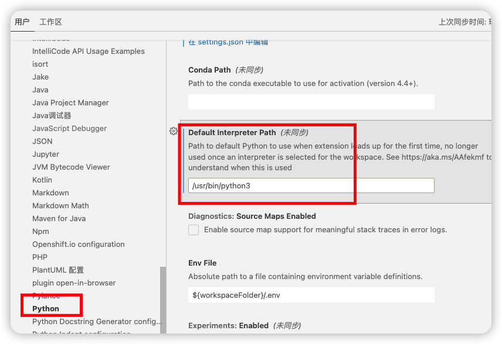

# VS-Code配置

[Visual Studio Code - Code Editing. Redefined](https://code.visualstudio.com/)

* vscode-icons：界面图标


## 1. C/C++编译环境配置

### 1.1 Windows安装C编译器

[GCC配置](./GCC配置.md)

### 1.2 安装需要的插件

- C/C++

### 1.3 项目配置

修改``c_cpp_properties.json``，添加一下include目录。

```json
{
    "configurations": [
        {
            "name": "Win32",
            "includePath": [
                "${workspaceFolder}/**",
                "D:/mingw64/include/**"
            ],
            "defines": [
                "_DEBUG",
                "UNICODE",
                "_UNICODE"
            ],
            "compilerPath": "D:\\mingw64\\bin\\gcc.exe",
            "cStandard": "gnu17",
            "cppStandard": "gnu++14",
            "intelliSenseMode": "gcc-x64"
            // "intelliSenseMode": "windows-msvc-x64"
        }
    ],
    "version": 4
}

```


## 2. Spring Boot配置

初始化

* Spring Initializr Java Support

- DevTools（代码修改热更新，无需重启）
- Web（集成tomcat、SpringMVC）
- Lombok（智能生成setter、getter、toString等接口，无需手动生成，代码更简介）
- Thymeleaf （模板引擎）。
  YAML

## 3. Vue配置

```shell
// 安装webpack
npm install -g webpack 
// 
npm init
//
npm i webpack vue vue-loader

```


## 5. kotlin配置

> 依赖Java环境，首先配置Java。

### 5.1 下载安装kotlin

> [kotlin-compiler 下载地址](https://github.com/JetBrains/kotlin/releases)

- ``mac``也可直接通过brew安装

```shell
brew install kotlin
```

- ``windows``下载完成后需要配置环境变量

```shell
E:\kotlinc\bin
```

#### 验证kotlin

```shell
kotlinc -version
```

### 5.2 安装插件

- Kotlin Language
- Code Runner


### 5.3 配置Setting.json

> 管理 >> 设置 >> 右上角的编辑图标


> 添加以下配置

```json
"code-runner.runInTerminal": true,
"terminal.integrated.shell.windows": "powershell.exe"
```

### 5.4 重启VS Code


## 6. python配置

### 安装插件

* python
* Code Runner
* autopep8：格式化用
* Python Extension Pack：python 扩展
* Python Environment Manager：版本管理
* Flake8: 支持 flake8

### 语法提示

```shell
pip3 install flake8
```

> settings.json

```json
"python.linting.flake8Enabled": true

// 配置三方库路径
"python.autoComplete.extraPaths": [
  "/Users/zhaozhen/Library/Python/3.9/lib/python/site-packages"
],
"python.analysis.extraPaths": [
  "/Users/zhaozhen/Library/Python/3.9/lib/python/site-packages"
]
```

### 指定python版本



> settings.json

```json
"code-runner.executorMap": {
  "python": "python3"
},
```


## 问题处理记录

### 编码GBK的不可映射字符

打开设置，修改`settings.json`：

```json
"code-runner.executorMap": {
"java": "cd $dir && javac -encoding utf8 $fileName && java $fileNameWithoutExt",
},
```


### 控制台乱码

终端中输入 ``chcp``查看当前编码格式。

| 编码格式 | 代码  |
| -------- | ----- |
| GBK      | 936   |
| UTF-8    | 65001 |
| GB2312   | 20936 |

修改编码

```shell
# chcp + 代码
chcp 65001
```


## 插件记录

### Markdown插件

Office Viewer
