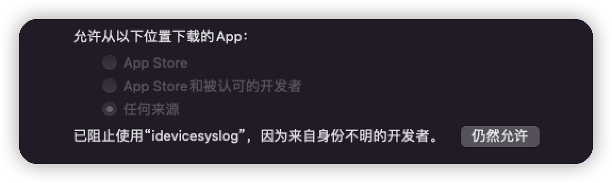
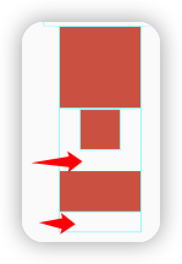

# Flutter学习笔记

## 参考资料

[Flutter - Build apps for any screen](https://flutter.dev/)

[Flutter 中文开发者网站 | Flutter —— 为所有屏幕构建精美应用](https://flutter.cn/)

---

[Flutter中文网 (flutterchina.club)](https://flutterchina.club/)

[第二版序 | 《Flutter实战·第二版》 (flutterchina.club)](https://book.flutterchina.club/)


以下内容部分摘自以上资料。

## 一、Flutter简介

### 1.1 特性

- 使用Dart开发。
- 使用自己的渲染引擎自绘UI，不依赖于原生控件。
- 跨平台，支持Android、IOS、Windows等众多平台。


### 1.2 框架结构


Framework层：

| 模块                                      | 分类       | 包                                                           |
| ----------------------------------------- | ---------- | ------------------------------------------------------------ |
| Foundation、Animation、Painting、Gestures | dart UI 层 | 它是Flutter Engine暴露的底层UI库，提供动画、手势及绘制功能。 |
| Rendering                                 | 渲染层     | 构建渲染树，对变化部分进行更新渲染。                         |
| Widgets                                   | 基础组建库 | 基础组建库。                                                 |
| Material、Cupertino                       | 风格组件   | 基于Material和IOS设计规范的组建库                            |

Engine层：

主要由C/C++实现，包括了 Skia 引擎、Dart 运行时、文字排版引擎等。实现真正的绘制和显示。

Embedder层：

调用所在平台的操作系统的API。


### 1.3 绘制流程

1. 根据``Widget树``生成一个``Element树``。
2. 根据``Element树``生成``Render树``（包含真正的布局和渲染逻辑）。
3. 根据``Render树``生成``Layer树``。
4. 最终显示在屏幕上。


## 二、Flutter环境搭建

[1.3 搭建Flutter开发环境 | 《Flutter实战·第二版》 (flutterchina.club)](https://book.flutterchina.club/chapter1/install_flutter.html#_1-3-1-安装flutter)

### 2.1 mac下使用brew安装

```shell
# 安装flutter
brew install --cask flutter
# 安装dart sdk
brew tap dart-lang/dart
brew install dart
# dart更新
brew upgrade dart
# 强制link dart
brew link --overwrite dart

```

检测依赖：

```shell
flutter doctor
```

Android Studio插件安装：

- Flutter插件
- Dart插件

Flutter SDK分支：

```shell
# 查看所有分支
flutter channel
# 切换分支
flutter channel master
```

更新

```shell
# 更新flutter sdk 和依赖包
flutter upgrade
# 仅更新packages
flutter pub upgrade
# 查看需要更新内容
flutter pub outdated
```


### 2.2 创建项目

使用Android Studio自己创建flutter项目 。

下载官方demo: ``gallery``。

```shell
git clone git@github.com:flutter/gallery.git
```


### 2.3 问题记录

- **Android设备运行时卡在 assembleDebug。**
	
	> 在``android->build.gradle``中添加国内镜像
	```groovy
	maven { url 'https://maven.aliyun.com/repository/public' }
	maven { url 'https://maven.aliyun.com/repository/jcenter' }
	maven { url 'https://maven.aliyun.com/repository/google' }
	```


- **IOS设备运行时提示``无法打开idevicesyslog....``**
	
	打开设置-> 安全与隐私 -> 通用， 发现有一个请求，允许即可。
	
	
	
- **IOS免费开发证书**

  1. 根据Console中的提示,点击``ios/Runner.xcworkspace``。
  2. 打开``xcode -> preferences -> Account``。
  3. 添加一个账号，使用apple id 登录即可。
  4. 在``team``一览 双击team新增一个证书。
  5. 打开项目视图，选择``TARGETS ->Runner->Sign & Capabilities``,添加之前创建的``team``。
  6. xcode直接运行即可。

  

  

## 三、Widget简介

> Widget就是UI元素的配置信息。
>
> Flutter中的UI都是由一个个Widget嵌套组合构成的。

### 3.1 StatefulWidget

- 继承自``Widget``。
- 有状态的组件。
- 状态在widget生命周期是可以改变的。


| 生命周期              | 描述                                                         |
| --------------------- | ------------------------------------------------------------ |
| createState           | 负责创建State，StatefulWidge被调用时执行。                   |
| initState             | State初始化。常用于变量的初始化。会调用                      |
| didChangeDependencies | 组件依赖的全局State(InheritedWidget)发生变化时调用（主题、语言等）。``initState``时也会调用。 |
| build                 | 构建需要渲染的Widget。                                       |
| reassemble            | 开发阶段时使用，例如热重载。                                 |
| didUpdateWidget       | 组件重新构建时调用。                                         |
| deactivate            | 组件被移除时调用。                                           |
| dispose               | 组件被永久移除，不再使用。释放资源。                         |


#### 3.1.1 定义widget

```dart
class MyHomePage extends StatefulWidget {
  const MyHomePage({super.key, required this.title});

  final String title;
	
  // 构建State类
  @override
  State<MyHomePage> createState() => _MyHomePageState();
}

```

#### 3.1.2 定义State

> 对应的StatefulWidget需要维护的状态信息。

```dart
class _MyHomePageState extends State<MyHomePage> {
  /// 组件的状态：计数值
  int _counter = 0;

  ///  修改状态的函数
  ///  1. 计数自增
  ///  2. 调用setState()通知状态变更
  void _incrementCounter() {
    setState(() {
      _counter++;
    });
  }
}
```


### 3.2 StatelessWidget

- 继承自``Widget``。
- 无状态组件。


### 3.3 RenderObject自定义Widget

```dart
class CustomWidget extends LeafRenderObjectWidget{
  @override
  RenderObject createRenderObject(BuildContext context) {
    // 创建 RenderObject
    return RenderCustomObject();
  }
  @override
  void updateRenderObject(BuildContext context, RenderCustomObject  renderObject) {
    // 更新 RenderObject
    super.updateRenderObject(context, renderObject);
  }
}

class RenderCustomObject extends RenderBox{

  @override
  void performLayout() {
    // 实现布局逻辑
  }

  @override
  void paint(PaintingContext context, Offset offset) {
    // 实现绘制
  }
}
```

## 四、路由

> 页面跳转相关的配置管理。

### 4.1 普通的路由挑战

#### 4.1.1 定义路由

```dart
TextButton(
  onPressed: () async {
    var result = await Navigator.push(
      context,
      MaterialPageRoute(
        builder: (context) {
          return const SecondPage();
        },
        maintainState: true,
        fullscreenDialog: false));
    print("路由返回值: $result");
  },
  child: const Text("Route second page")),
```

#### 4.1.2 执行路由跳转

```dart
class SecondPage extends StatelessWidget {
  const SecondPage({super.key});

  @override
  Widget build(BuildContext context) {
    return Scaffold(
      appBar: AppBar(
        title: const Text("Second Page"),
      ),
      body: Center(
          child: Column(children: [
        const Text("This is second page"),
        ElevatedButton(
          onPressed: () => Navigator.pop(context, "我回来了"),
          child: const Text("返回"),
        ),
      ])),
    );
  }
}
```


### 4.2 命名路由

#### 4.2.1 注册路由表

在``MaterialApp``的``routes``属性中注册路由表。

``initialRoute``配置初始页路由。

```dart
MaterialApp(
  title: 'Flutter Demo',
  initialRoute: "/",
  theme: ThemeData(
    primarySwatch: Colors.blue,
  ),
  routes: {
    "/": (context) => const MyHomePage(title: 'Flutter Demo Home Page'),
    "second_page": (context) => const SecondPage(),
  });
}
```

#### 4.2.2 通过路由名跳转

```dart
Navigator.pushNamed(context, "second_page");
// 传递参数
// Navigator.pushNamed(context, "second_page");
```

#### 4.2.3 获取参数

```dart
class SecondPage extends StatelessWidget {
  const SecondPage({super.key});

  @override
  Widget build(BuildContext context) {
    // 获取路由参数
    var args = ModalRoute.of(context)?.settings.arguments;
    return Scaffold(
      appBar: AppBar(
        title: const Text("Second Page"),
      ),
      body: Center(
          child: Column(children: [
        Text("This is second page, $args"),
        ElevatedButton(
          onPressed: () => Navigator.pop(context, "I'm back"),
          child: const Text("返回"),
        ),
      ])),
    );
  }
}
```

### 4.3 路由勾子

> 只有当路由表中未注册的路由，才会调用``onGenerateRoute``。
>
> 所以不再使用自带的路由表，改为自定义一个路由表

```dart
class MyApp extends StatelessWidget {
  const MyApp({super.key});
	
  // 自定义路由表
  static Map<String, WidgetBuilder> routes = {
    "/": (context) => const MyHomePage(title: 'Flutter Demo Home Page'),
    "second_page": (context) => const SecondPage(),
  };

  // This widget is the root of your application.
  @override
  Widget build(BuildContext context) {
    return MaterialApp(
      title: 'Flutter Demo',
      initialRoute: "/",
      theme: ThemeData(
        primarySwatch: Colors.blue,
      ),
      onGenerateRoute: (settings) {
        return MaterialPageRoute(
          builder: (context) {
            String? routeName = settings.name;
            // 统一判断一些前置条件再跳转，例如 登录状态等。
            var builder = routes[routeName];
            if (builder == null) {
              return const SecondPage();
            } else {
              return builder(context);
            }
          },
        );
      },
    );
  }
}
```

### 5. Flutter的布局模型

| 组件                          | 类型           | 描述                            |
| ----------------------------- | -------------- | ------------------------------- |
| LeafRenderObjectWidget        | 非容器组件基类 | 用于没有子节点的widget。如Image |
| SingleChildRenderObjectWidget | 单子组件基类   | 包含一个子widget。child参数     |
| MultiChildRenderObjectWidget  | 多子组件基类   | 包含多个子Widget。children参数  |

#### 5.1 布局模型

##### RenderBox盒型布局。

- 组件对应的渲染对象继承自RenderBox类
- 父组件通过BoxConstraints来描述子组件的约束信息。

> 任何时候子组件都必须遵守其父组件的约束。

```dart
import 'package:flutter/material.dart';

class BoxTest extends StatelessWidget {
  const BoxTest({super.key});

  @override
  Widget build(BuildContext context) {
    Widget childBox = const DecoratedBox(
      decoration: BoxDecoration(color: Colors.red),
    );
    return Column(
      children: [
        // minHeight, minWidth 有父子节点中的最大值决定
        ConstrainedBox(
          constraints: BoxConstraints(minWidth: 50, minHeight: 50),
          child: ConstrainedBox(
            constraints: BoxConstraints(minWidth: 100, minHeight: 100),
            child: childBox,
          ),
        ),
        // maxHeight, maxWidth 有父子节点中的最小值决定
        ConstrainedBox(
          constraints: const BoxConstraints(
            maxHeight: 50,
            maxWidth: 50,
          ),
          child: ConstrainedBox(
            constraints: const BoxConstraints(
              maxHeight: 100,
              maxWidth: 100,
            ),
            child: SizedBox(
              height: 100,
              width: 100,
              child: childBox,
            ),
          ),
        ),
        // 实际看到的效果为 100x50。其实此处父组件的约束其实依然是生效的，并未去除。父约束的高度会体现在留白部分。
        ConstrainedBox(
            constraints: const BoxConstraints(minWidth: 50.0, minHeight: 100.0),
            child: UnconstrainedBox(
              child: ConstrainedBox(
                constraints:
                    const BoxConstraints(minWidth: 100.0, minHeight: 50.0),
                child: childBox,
              ),
            ))
      ],
    );
  }
}

```




##### Sliver(RenderSliver)

> 只有当Sliver出现在视图窗口中时才会构建，是一种按需加载的模型。

- Scrollable：处理滑动手势，确定滑动偏移时构建Viewport。
- Viewport：显示视窗，将SliverConstraints传给Sliver。
- Sliver：按需构建和布局。

``CustomScrollView``:自定义滑动组件， 仅接收Sliver。

``SliverToBoxAdapter``:将RenderBox转换为Sliver。

> ``SliverConstraints``：存储约束条件。

| 字段                | 说明                                                         |
| ------------------- | ------------------------------------------------------------ |
| overlap             | 当前sliver被上一个sliver重叠覆盖的部分的偏移量。即未显示->显示的大小。与scrollOffset相对应 |
| scrollOffset        | 显示部分的偏移量。显示->未显示的大小。                       |
| userScrollDirection | 用户滑动方向。松手时回弹期间返回的依然是用户之前的操作方向，和实际列表滑动方向相反。 |
|                     |                                                              |

> ``SliverGeometry``

| 字段         | 说明                                  |
| ------------ | ------------------------------------- |
| scrollExtent | 滚动范围。                            |
| layoutExtent | 布局范围。垂直方向：[0, layoutExtent] |
| paintOrigin  | 绘制的坐标原点，相对于布局位置。      |
| paintExtent  | 绘制范围大小。                        |


> Sliver布局协议

1. Viewport 将当前布局和配置信息通过SliverConstraints传递给Sliver。
2. Sliver确定自身的位置、绘制等信息，保存在SliverGeometry实例中。
3. Viewport读取geometry中信息对Sliver进行布局和绘制。

#### 5.2 布局流程

1. 上层组件向下层组件传递约束（constraints）条件。
2. 下层组件确定自己的大小，然后告诉上层组件。注意下层组件的大小必须符合父组件的约束。
3. 上层组件确定下层组件相对于自身的偏移和确定自身的大小（大多数情况下会根据子组件的大小来确定自身的大小）。

#### 5.3 线性布局

> 布局沿水平方向（Row）：
>
> - 主轴：水平方向
> - 纵轴：垂直方向
>
> 布局沿垂直方向（Column）：
>
> - 主轴：垂直方向
> - 纵轴：水平方向

##### 主轴（MainAxisAlignment）

| 属性         | 说明                                                       |
| ------------ | ---------------------------------------------------------- |
| start        | 将子控件放在主轴的起点（例如：垂直->上；水平(LTR)->左）。  |
| end          | 将子控件放在主轴的终点。                                   |
| center       | 将子控件放在主轴中心。                                     |
| spaceBetween | 将空闲空间均匀的放在子控件之间。                           |
| spaceAround  | 将空闲空间均匀的放在每个子控件的周围（例如：上下、左右）。 |
| spaceEvenly  | 将空闲空间均匀分布在整个布局间。                           |

##### 纵轴（CrossAxisAlignment）

#### 5.4 弹性布局

``Flex``组件指定采用弹性布局,``Expanded``可以按权重占用空间。

- Flex

#### 5.5 流式布局

> 超出屏幕部分会自动折叠，不会出现布局的溢出报错。

- Wrap
- Flow

#### 5.6 层叠布局

> 相当于Android的FrameLayout

- Stack

#### 5.7 布局对齐

- Align

  ```dart
  Container(
    height: 200,
    width: 200,
    child: const Align(
      // 以矩形的中心点为原点, 向左偏移 100 * 0.5
      alignment: Alignment(-0.5, 0),
      child: FlutterLogo(
        size: 100,
      ),
    ),
  )
  ```

- FractionalOffset

  ```dart
  Container(
    height: 200,
    width: 200,
    child: const Align(
      // 以父组件的左上角为原点， 向右偏移 100 * 0.1, 向下偏移 100 * 0.1
      alignment: FractionalOffset(0.1, 0.1),
      widthFactor: 2,
      heightFactor: 2,
      child: FlutterLogo(
        size: 100,
      ),
    ),
  )
  ```


### 6. 布局适配

#### FittedBox

> 处理布局溢出等问题。

| 属性 | 说明                                 |
| ---- | ------------------------------------ |
| fit  | 指定适配方式。``BoxFit.contain``等。 |


#### NestedScrollView

> 处理滑动冲突：滑动冲突时默认子元素生效。


### 7. 组件变换

#### 7.1 变换

##### Transform

> ``Transform``的变换是在绘制阶段，不是布局阶段， 所以子组件占用的空间大小和位置是固定不变的。

- 平移

  ```dart
  Transform.translate(...);
  ```

- 旋转

  ```
  Transform.rotate(...);
  ```

- 缩放

  ```
  Transform.scale(...);
  ```

##### RotatedBox

> ``RotatedBox``的变换是在layout阶段, 会影响子组件的位置和大小。

#### 7.2 裁剪

##### Clip

| 组件      | 描述                     |
| --------- | ------------------------ |
| ClipOval  | 内切圆                   |
| ClipRRect | 圆角矩形                 |
| ClipRect  | 将组件布局之外的部分剪裁 |
| ClipPath  | 按照Path进行自定义剪裁   |

##### CustomClipper

> 自定义裁剪范围

```dart
class MyClipper extends CustomClipper<Rect> {
  @override
  Rect getClip(Size size) {
    // 裁剪左上角 1/4部分
    return Rect.fromLTWH(0, 0, size.width / 2, size.height / 2);
  }

  @override
  bool shouldReclip(covariant CustomClipper<Rect> oldClipper) {
    return true;
  }
}
```

### 8. 事件监听

#### 8.1 Listener

使用``IgnorePointer``和``AbsorbPointer``忽略阻止子树接收``PointerEvent``。

#### 8.2 GestureDetector

> 手势监听

GestureRecognizer

#### 8.3 事件处理流程

1. Hit Test：手指按下时，发送``PointDownEvent``，深度优先遍历当前的``Render Object树``，对每一个渲染树做命中测试。若命中则添加到``HitTestResult``中。
2. 事件分发：遍历``HitTestResult``，调用每个渲染对象的``handleEvent``处理Down事件。若手指移动则分发``PointMoveEvent``事件。
3. 事件清理：当触发``PointerUpEvent``或``PointCancelEvent``时，会先将事件进行分发，然后清空``HitTestResult``。

> Hit Test仅在``PointDownEvent``事件触发时进行。
>
> 子组件比父组件先响应事件。


### 9. 权限申请

添加依赖

```
flutter pub add permission_handler
```


### 9. 数据调用

#### 文件读写

添加``path_provider``包。

```shell
flutter pub add path_provider
```

| 目录          | Flutter                          | Android                   | IOS                 |
| ------------- | -------------------------------- | ------------------------- | ------------------- |
| 临时文件夹    | getTemporaryDirectory()          | getCacheDir()             | NSCachesDirectory   |
| Documents目录 | getApplicationDocumentsDirectory | AppData目录               | NSDocumentDirectory |
|               | getExternalStorageDirectory      | getExternalFilesDir(null) | UnsupportedError    |

Documents目录：

```dart
Future<String> get _localPath async {
  final directory = await getApplicationDocumentsDirectory();

  return directory.path;
}
```

