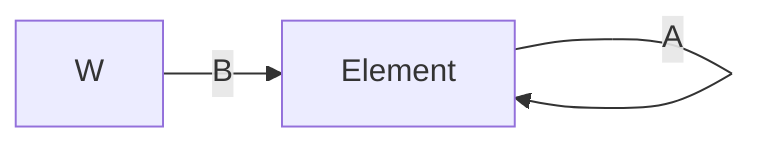

# Flutter核心原理

## 框架结构


### Framework层：

> Dart实现的UI SDK。包含动画、图像绘制和手势操作等功能。开发时可用直接使用这些组件库。

| 模块                                      | 分类       | 包                                                           |
| ----------------------------------------- | ---------- | ------------------------------------------------------------ |
| Foundation、Animation、Painting、Gestures | dart UI 层 | 它是Flutter Engine暴露的底层UI库，提供动画、手势及绘制功能。 |
| Rendering                                 | 渲染层     | 构建渲染树，对变化部分进行更新渲染。                         |
| Widgets                                   | 基础组建库 | 基础组建库。                                                 |
| Material、Cupertino                       | 风格组件   | 基于Material和IOS设计规范的组建库                            |

### Engine层：

主要由C/C++实现。实现视图的渲染。

- 提供调用底层渲染的能力(Skia)。
- 提供文字排版的能力(Text)。
- 提供运行时调用Dart和渲染引擎的能力(Dart)。

### Embedder层：

操作系统适配层，实现平台相关特性的适配。 有线程设置、平台插件、渲染Surface设置等。


## Framework(Flutter UI 框架)

### 硬件绘图基本原理

|              |                                                              |
| ------------ | ------------------------------------------------------------ |
| 显示器(屏幕) | 负责图像的显示。由一个个物理显示单元组(物理像素点)组成。通过在不同的像素点显示不同的颜色来构成最终的图像。 |
| 垂直同步信号 | 一帧图像绘制完毕后准备绘制下一帧时，显示器会发出的一个垂直同步信号(如vsync)，用于同步CPU、GPU和显示器。 |
| 显示刷新频率 | 屏幕更新显示画面的频率(从GPU获取数据的频率)。例如60Hz, 表示屏幕每秒会发出60次垂直同步信号。 |
| 颜色         | 如1600万色 = 2的24次方，表示像素可以显示1600万种颜色，即每个基本色(R、G、B) 深度扩展至8bit。 |
| CPU          | 负责图像数据的计算，提交给GPU。偏向于逻辑计算。              |
| GPU          | 负责图像数据的渲染。GPU将从CPU中获取的数据进行渲染后放入帧缓冲区。偏向于图像相关的复杂计算（矩阵变换、几何等），确定最终各个像素点的色值。 |

1. CPU将计算好的需要显示的内容提交给 GPU。
2. GPU渲染后放入帧缓冲区。
3. 随后视频控制器按照同步信号(VSync)从帧缓冲区取帧读取数据传递给显示器显示。

### 操作系统的绘制API

​	图形计算和绘制最终都是由硬件来完成，硬件对外提供了一些操作指令来控制。

​	操作系统通常会屏蔽这些基础的操作指令，并封装一套标准的API供应用调用。不过这些API提供的功能往往比较基础。直接调用依然十分复杂。

​	因此几乎所有用于开发GUI的编程语言都会在此之上再封装一层。基于操作系统提供的原生绘制API定义一套简单的开发规则，进行一层抽象(UI框架)。

> UI框架：基于平台基础的图形API(Canvas)封装的一套可以高效创建UI的框架。

### Flutter UI 框架

Flutter 提供了一套Dart API，在底层通过``OpenGL``跨平台的绘制库实现一套代码跨多端使用。针对不同的操作系统，对上提供统一的API，对下适配不同操作操作系统的中间层，然后打包编译时再使用相应的中间层代码。

Flutter的UI界面主要是通过``Widget组合``来实现。

UI发生变化时，不直接修改DOM，而是通过更新状态。以``响应式``的模式让框架根据新的状态来重新构建UI。

#### 绘制原理

> OpenGL仅时操作系统API的一个封装库，相当于直接调用系统API。
>
> Skia是一款用C++开发的、性能彪悍的2D图像绘制引擎。

UI线程使用Dart来构建视图结构数据。

GPU线程将这些数据进行图层合成，随后交给Skia引擎加工成GPU数据。

最终通过OpenGL将数据提供给GPU渲染。

#### 界面渲染过程

布局

绘制

合成

渲染


1.  根据`Widget树`生成一个`Element树`。

2.  根据`Element树`生成`Render树`（包含真正的布局和渲染逻辑）。

3.  根据`Render树`生成`Layer树`。

4.  最终显示在屏幕上。




### BuildContext

>  BuildContext就是``StatelessElement``或者``StatefulElement``。

```dart
class StatelessElement extends ComponentElement {
  StatelessElement(StatelessWidget super.widget);

  // 此处调用StatelessWidget的build方法，所以this(StatelessElement)就是BuildContext
  @override
  Widget build() => (widget as StatelessWidget).build(this);
}
```

```dart
class StatefulElement extends ComponentElement {
  StatefulElement(StatefulWidget widget)
      : _state = widget.createState(),
        super(widget) {
    state._element = this;
    state._widget = widget;
  }

  // 此处调用state的build方法，所以this(StatefulElement)就是BuildContext
  @override
  Widget build() => state.build(this);
}
```

> Element实现了BuildContext接口

```dart
abstract class Element extends DiagnosticableTree implements BuildContext {}
```

