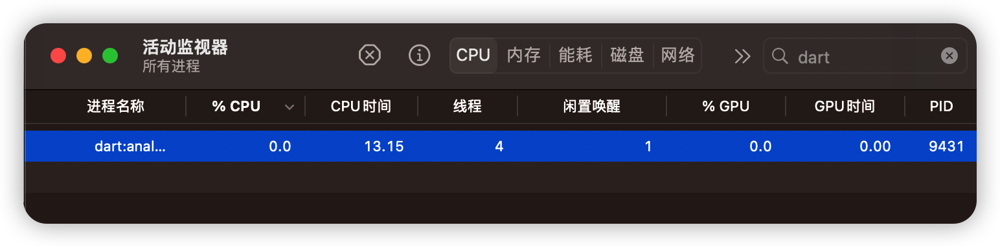
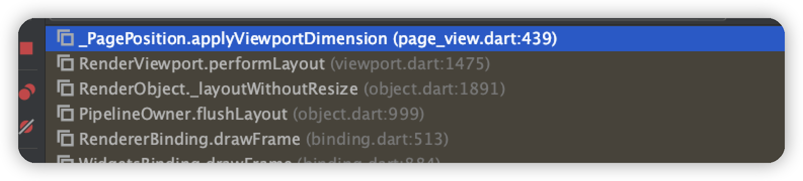

# Flutter问题集


## 1. Android Studio Flutter 项目不显示 App Inspection

```shell
File -> Project Structure
选择 Facets
选择 + 
选择 Android
选择对应项目名称
```


## 2. Flutter执行命令时出现lock的问题

```bash
Waiting for another flutter command to release the startup lock...
```

### 问题处理

结束已运行的dart进程 




找到Flutter的按照目录：

```bash
# 根据自己的实际目录进行调整
/usr/local/Caskroom/flutter/2.10.5/flutter/
```

删除`./bin/cache/lockfile`这个文件：

```bash
/usr/local/Caskroom/flutter/2.10.5/flutter/bin/cache/lockfile
```


## 3. PageController.initialPage修改后不一定生效的问题

此处在每次更新时都会修改`initialPage`，但是最终结果却是页面并不会自动跳转到指定页，仅第一次生效了。不过内部的Text显示的内容变更了。

```dart
@override
Widget build(BuildContext context) {
  controller = PageController(initialPage: widget.initialPage, keepPage: false);
  return PageView.custom(
    controller: controller,
    scrollDirection: Axis.horizontal,
    onPageChanged: (index) {
      print("ControlPage build: onPageChanged $index");
    },
    childrenDelegate: SliverChildBuilderDelegate(
      (context, index) {
        return Text("${widget.initialPage} : $index");
      },
      childCount: widget.initialPage + 1,
    )
  );
}
```

### 问题分析

初步怀疑应该是element复用时，内部的布局或渲染流程存在某些判断，导致后续的initialPage没有被使用。

> PageView所在文件:`page_view.dart`
>
> 查看源码使用反向追踪的方式找到使用`initialPage`参数的地方。

首先确认是否复用，我们没有指定key, 且返回的都是相同类型的Widget，那么一定是复用了。

```dart
static bool canUpdate(Widget oldWidget, Widget newWidget) {
  return oldWidget.runtimeType == newWidget.runtimeType
    && oldWidget.key == newWidget.key;
}
```

既然复用了那么就查看哪些地方使用了initialPage，存在哪些和此值相关联的其他变量和函数。

存在多处调用的地方，`createScrollPosition`最像。

```dart
@override
ScrollPosition createScrollPosition(ScrollPhysics physics, ScrollContext context, ScrollPosition? oldPosition) {
  return _PagePosition(
    physics: physics,
    context: context,
    initialPage: initialPage, // 此处传给了_PagePosition, 它是一个ScrollPosition。
    keepPage: keepPage,
    viewportFraction: viewportFraction,
    oldPosition: oldPosition,
  );
}
```

接着看`_PagePosition`:

```dart
class _PagePosition extends ScrollPositionWithSingleContext implements PageMetrics {
  _PagePosition({
    required super.physics,
    required super.context,
    this.initialPage = 0,
    bool keepPage = true,
    double viewportFraction = 1.0,
    super.oldPosition,
  }) : assert(initialPage != null),
       assert(keepPage != null),
       assert(viewportFraction != null),
       assert(viewportFraction > 0.0),
       _viewportFraction = viewportFraction,
       _pageToUseOnStartup = initialPage.toDouble(), // 赋值给了_pageToUseOnStartup
       super(
         initialPixels: null,
         keepScrollOffset: keepPage,
       );
.....
```

再查找`_pageToUseOnStartup`使用的地方,有好几处，`applyViewportDimension`这个方法十分值得怀疑。

> 内部判断了视图窗口大小是否发生了变化。
>
> 之前是否存在了一些缓存信息等。

```dart
@override
bool applyViewportDimension(double viewportDimension) {
  final double? oldViewportDimensions = hasViewportDimension ? this.viewportDimension : null;
  if (viewportDimension == oldViewportDimensions) { // 此处判断了视图窗口大小是否发生了变化
    return true;
  }
  final bool result = super.applyViewportDimension(viewportDimension);
  final double? oldPixels = hasPixels ? pixels : null;
  double page;
  if (oldPixels == null) { // 仅
    page = _pageToUseOnStartup;
  } else if (oldViewportDimensions == 0.0) {
    // If resize from zero, we should use the _cachedPage to recover the state.
    page = _cachedPage!;
  } else {
    page = getPageFromPixels(oldPixels, oldViewportDimensions!);
  }
  // 计算Pixels
  final double newPixels = getPixelsFromPage(page);

  // If the viewportDimension is zero, cache the page
  // in case the viewport is resized to be non-zero.
  _cachedPage = (viewportDimension == 0.0) ? page : null;

  if (newPixels != oldPixels) {
    // 修正_pixels， 此值后续有用
    correctPixels(newPixels);
    return false;
  }
  return result;
}
```

然后我们通过加断点的方式, debug跟踪流程，查看调用栈，确认是否是和此处有关？



调试发现 是在`RenderViewport.performLayout`时调用:

```dart
@override
void performLayout() {
  // Ignore the return value of applyViewportDimension because we are
  // doing a layout regardless.
  switch (axis) {
    case Axis.vertical:
      offset.applyViewportDimension(size.height);
      break;
    case Axis.horizontal:
      offset.applyViewportDimension(size.width);
      break;
  }

  // ....
  do {
      assert(offset.pixels != null);
    	// 执行layout，这里的offset.pixels就是上面修正的_pixels。
      correction = _attemptLayout(mainAxisExtent, crossAxisExtent, offset.pixels + centerOffsetAdjustment);
      if (correction != 0.0) {
        offset.correctBy(correction);
      } else {
        if (offset.applyContentDimensions(
              math.min(0.0, _minScrollExtent + mainAxisExtent * anchor),
              math.max(0.0, _maxScrollExtent - mainAxisExtent * (1.0 - anchor)),
           )) {
          break;
        }
      }
      count += 1;
    } while (count < _maxLayoutCycles);
  ....
```

### 问题处理

既然源码如何，那么考虑有没处理方式?

- 由于是复用导致的问题，所有可以考虑不复用element。
- 仅需要修改移动的位置，那么可以考虑使用jumpTo等方式手动纠正位置。

#### 1. 不复用element

首先如何不复用, 那么看一下复用逻辑中的`Widget.update`函数。

```dart
/// true  : 复用 > 使用新的widget配置更新 element
/// false : 使用widget创建新的element
static bool canUpdate(Widget oldWidget, Widget newWidget) {
  return oldWidget.runtimeType == newWidget.runtimeType
    && oldWidget.key == newWidget.key;
}
```

所有我们只需要保证`widget.key`不相同就能避免复用。

```dart
class ControlPage extends StatefulWidget {
  int initialPage;
	// 每次都创建一个唯一的key。
  ControlPage(this.initialPage): super(key: UniqueKey());

  @override
  State<StatefulWidget> createState() {
    return ControlPageState();
  }
}
```

运行后生效了。

#### 2. 使用jumpToPage手动纠正位置。

既然`initialPage`不一定生效，那么我们可以直接采用`controller.jumpToPage`的方式在渲染完后移动到指定位置。

```dart
@override
void initState() {
  // 这里也需要设置一下，不然刚打开时会出现闪现上一帧画面的情况。
  controller = PageController(initialPage: widget.initialPage);
  super.initState();
}

@override
Widget build(BuildContext context) {
  print("ControlPageState build:  ${widget.initialPage}");
  // 下一帧再移动到指定位置。可以考虑加个判断，第一次不用跳转
  WidgetsBinding.instance.addPostFrameCallback((timeStamp) {
    controller?.jumpToPage(widget.initialPage);
  });
  return PageView.builder(
    controller: controller,
    scrollDirection: Axis.horizontal,
    itemCount: widget.initialPage + 1,
    onPageChanged: (index) {
      print("ControlPage build: onPageChanged $index");
    },
    itemBuilder: (context, index) {
      return Text("${widget.initialPage} : $index");
    },
  );
}
```


## 4. 布局溢出问题

`Row` 和 `Column` 使用时常会碰到布局溢出的问题。

### 问题处理

#### 1. 使用流式布局

考虑使用`Wrap`或者`Flow`。超出屏幕边界部分会自动折叠，不会出现布局的溢出报错

#### 2. 指定宽度

使用`SizeBox`或者`Container`等容器指定。

#### 3. Expanded包裹

通过`Expanded`指定权重给定具体的宽高。

> 此处的是Text文本过长导致的溢出。
>
> `Text`指定的`overflow: TextOverflow.ellipsis`不生效的原因是，没有具体的宽度。
>
> 通过`Expanded`使得具有宽度。

```dart
Row(
    children: [
        SizedBox(
            height: 160,
            child: Text("第一个"),
        ),
        Expanded(
            child: Padding(
                padding: EdgeInsets.fromLTRB(8, 0, 4, 0),
                child: Column(
                    crossAxisAlignment: CrossAxisAlignment.start,
                    children: [
                        Text(
                            "宽度溢出宽度溢出宽度溢出宽度溢出宽度溢出宽度溢出宽度溢出宽度溢出",
                            maxLines: 1,
                            overflow: TextOverflow.ellipsis,
                            style: TextStyle(fontSize: 20, color: Colors.black),
                        ),
                        Text(
                            "12333333",
                            maxLines: 1,
                            overflow: TextOverflow.ellipsis,
                            style: TextStyle(fontSize: 14, color: Colors.black),
                        ),
                    ],
                ),
            ),
        )
```

## 常见的异常

### Incorrect use of ParentDataWidget

* 可能是由于`Expended`、`Flexible`等组件使用不当：**Expanded、Flexible只在Row、Column等组件内，不在其他组件内使用**。

### RenderCustomMultiChildLayoutBox object was given an infinite size during layout.

子布局无限大小问题，检查代码是否存在`Scaffold`嵌套。
