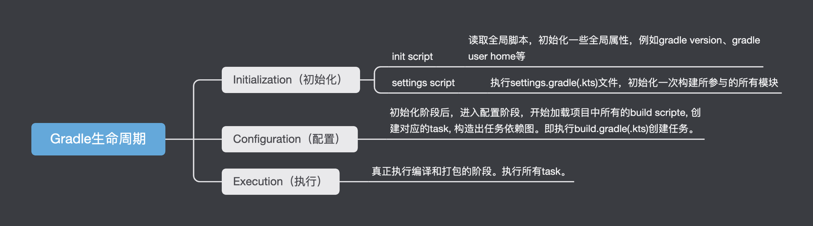

# Gradle学习笔记

> 参考资料：
>
> [关于 Gradle 你应该知道的知识点 - 掘金 (juejin.cn)](https://juejin.cn/post/7064350945756332040)
>
> [The Apache Groovy programming language - Download](https://groovy.apache.org/download.html)
>
> [深度探索 Gradle 自动化构建技术（二、Groovy 筑基篇） - 掘金 (juejin.cn)](https://juejin.cn/post/6844904128594853902)
>
> [What is Gradle?](https://docs.gradle.org/current/userguide/what_is_gradle.html)

`Gradle`是一种基于Groovy的一款强大的构建工具。而`Groovy`语言是一种基于jvm的动态DSL。
所有我们也可以使java、kotin来开发。

|                   |                                                              |                                |
| ----------------- | ------------------------------------------------------------ | ------------------------------ |
| gradlew           | 对gradle脚本的封装，执行对于版本的gradle命令                 |                                |
| gradle-wapper     | 读取gradle配置文件，自动进行下载和配置gradle                 |                                |
| gradle.properties | 参数配置文件, gradle启动时默认会读取并加载其中的参数。等同命令行传参，但是优先级较低 |                                |
| settings.gradle   | 描述构建所需的模块。                                         | 分隔符`:`类似`/`，表示目录层级 |
| build.gradle      | 配置当前模块的构建信息。                                     |                                |

## 常用命令

```shell

# 清除、构建、日志输出
# --info 打印info日志
# --debug 调试模式 
# --stacktrace 打印堆栈信息
./gradlew clean build --info --debug --stacktrace

# -p 指定模块操作
./gradlew -p moduleName

# debug打包
./gradlew assembleDebug
# Release打包
./gradlew assembleRelease


# 查看依赖
./gradlew dependencies

# 查看gradle版本
./gradlew -v

# 编译并安装debug包。
./gradlew installDebug
# 编译并安装Release包。
./gradlew installRelease

# 性能报告: build/reports/profile
./gradlew build --profile


# 查看主要的task任务
./gradlew tasks
# 查看所有任务
./gradlew tasks --all
```

## 注意事项

Groovy中的 `==` 等同java的`equals()`,  比较对象是否为同一个应该用 `.is()`


## Gradle的生命周期

初始化阶段`Initialization` -> 配置阶段`Configuration` -> 执行阶段`Execution`

1. 初始化阶段：决定哪些项目模块（Project）要参与构建。
2. 配置阶段：配置每个项目的模块，执行其中配置脚本。
3. 执行阶段：执行每个参与构建过程的Gradle task。

> 构建过程：

`init script` -> `setting script` -> `root build script(单模块时没有)` -> `build script` 。



### 1. Initialization阶段

初始化阶段执行了`init script`和`settings script`。

#### init script

读取全局脚本，初始化一些全局属性，例如gradle version、gradle user home等。

|                      |                                |                              |
| -------------------- | ------------------------------ | ---------------------------- |
| gradle home dir      | 此次构建的Gradle目录           |                              |
| gradle user home dir | Gradle User Home 目录          |                              |
| Gadle version        | 当前gradle版本                 |                              |
| includeBuilds        | 包含的内部构建                 |                              |
| parent               | 父构建                         |                              |
| pluginManager        | 插件管理实例                   |                              |
| plugins              | 插件容器                       |                              |
| rootProject          | 当前构建的根目录               |                              |
| startParameter       | 传入当前构建的所有参数         |                              |
| taskGraph            | 当前构建的Task组成的有向无环图 | taskGraph.whenReady 后才有值 |

#### settings script

此阶段执行`settings.gradle(.kts)`文件，初始化一次构建所参与的所有模块。

```kotlin
val snapshotVersion : String? = System.getenv("COMPOSE_SNAPSHOT_ID")

pluginManagement {
  	// 管理 Plugin Repository
    repositories {
        gradlePluginPortal()
        google()
        mavenCentral()
    }
}
// 依赖管理
dependencyResolutionManagement {
  	// 指定策略
    repositoriesMode.set(RepositoriesMode.FAIL_ON_PROJECT_REPOS)
    repositories {
        snapshotVersion?.let {
            println("https://androidx.dev/snapshots/builds/$it/artifacts/repository/") 
            maven { url = uri("https://androidx.dev/snapshots/builds/$it/artifacts/repository/") }
        }

        google()
        mavenCentral()
    }
}
// 项目名
rootProject.name = "Jetchat"

// 参与模块
include(":app")

```


### 2. Configuration阶段

初始化阶段后，进入配置阶段，开始加载项目中所有的`build script`, 创建对应的task, 构造出任务依赖图。

`build script`就是执行`build.gradle(.kts)`。其中包括以下内容

#### 插件引入

```kotlin
// 非内置插件
buildscript {
    repositories {
        google()
        mavenCentral()

        if (!libs.versions.compose.snapshot.get().endsWith("SNAPSHOT")) {
            maven { url = uri("https://androidx.dev/snapshots/builds/${libs.versions.compose.snapshot.get()}/artifacts/repository/") }
        }
    }
    dependencies {
        classpath(libs.android.gradlePlugin)
        classpath(libs.kotlin.gradlePlugin)
    }
}

subprojects {
    repositories {
        google()
        mavenCentral()
    }
}

// 内置插件
plugins {
    id("com.github.ben-manes.versions") version "0.43.0"
    id("nl.littlerobots.version-catalog-update") version "0.7.0"
}
// 内置插件
apply("${project.rootDir}/buildscripts/toml-updater-config.gradle")

```

#### 属性配置

公共属性配置

```kotlin
ext {
    ...
}
// 使用方式
// rootProject.ext.xxx
```

对引入的插件进行配置

```kotlin
plugins {
    id("com.android.application")
    id("kotlin-android")
}
android {
    compileSdk = libs.versions.compileSdk.get().toInt()
		// 编译配置
    defaultConfig {
        applicationId = "com.example.compose.jetchat"
        minSdk = libs.versions.minSdk.get().toInt()
        targetSdk = libs.versions.targetSdk.get().toInt()
        versionCode = 1
        versionName = "1.0"
        testInstrumentationRunner = "androidx.test.runner.AndroidJUnitRunner"

        vectorDrawables.useSupportLibrary = true
    }
		// 配置签名
    signingConfigs {
        ....
    }
		// 构建类型
    buildTypes {
          getByName("debug") {
              ...
          }

          getByName("release") {
             ...
          }
    }
  
    // 编译选项
    compileOptions{
    }

}

dependencies {
    val composeBom = platform(libs.androidx.compose.bom)
    implementation(composeBom)
    androidTestImplementation(composeBom)
		....
}

```


### 3. Execution阶段

真正执行编译和打包的阶段。执行所有task。


---

## Gradle 插件

通过添加插件的方式，而不是直接在项目的构建脚本中添加逻辑，易于维护、复用以及更加模块

插件的作用：

* 扩展 Gradle 模型（例如，添加可配置的新 DSL 元素）
* 根据约定配置项目（例如，添加新任务或配置合理的默认值）
* 应用特定配置（例如，添加组织存储库或强制实施标准）

插件的类型：

* 二进制插件：实现了 `org.gradle.api.Plugin ` 接口的插件，一般打包为 jar 。使用``apply plugin :  插件ID`` 的方式 应用插件。
* 脚本插件：一般是某个本地或远程的脚本文件。以 ``apply from : "xxx.gralde"`` 的方式应用。

### 使用插件

基本形式

```kotlin
plugins {
    `«plugin id»` 	// 核心插件
    id(«plugin id»)	// 核心 Gradle 插件或已可用于构建脚本的插件
    id(«plugin id») version «plugin version» [apply «false»]	// 需要解析的二进制 Gradle 插件
}
```

> 旧版本的 apply plugin: 的方式已不推荐使用。

```kotlin
// 不推荐使用
apply(plugin = "java")
```


> 核心插件：可以使用短名称

```kotlin
plugins {
    java
}
```

> 社区插件：必须使用完全限定的插件 ID

```kotlin
plugins {
    id("com.jfrog.bintray") version "1.8.5"
    id("com.example.hello") version "1.0.0" apply false // 不将插件应用到当前项目中， 可以在子模块中使用，并且不用带版本声明。
}

// 子模块中 应用
plugins {
    id("com.example.hello")
}
```

### 管理插件

`pluginManagement{}` 必须是文件中的一个块。在 `settings.gradle.kts` 中。

```kotlin
pluginManagement {
    resolutionStrategy { // 解析策略
        eachPlugin {
            if (requested.id.namespace == "com.example") {
                useModule("com.example:sample-plugins:1.0.0")
            }
        }
    }
    repositories {
        // 自定义仓库
        maven {
          isAllowInsecureProtocol = true // 允许 http
          url = uri("http://localhost:8081/repository/maven-public")
        }
        maven { url = uri("https://maven.aliyun.com/repository/public") }
        // 管理 Plugin Repository
        gradlePluginPortal()
        google()
        mavenCentral()
    }
}
```

### 插件搜索

[Gradle - Plugins](https://plugins.gradle.org/)

---

## Gradle For Android

### Project And Tasks

每一个待编译的工程都包含一个`build.grade`文件，表示一个`Project`。
每个Project包含一系列的tasks，在build.gradle中定义。例如编译源码Task, 资源编译Task, lint task, 打包task、签名task等

### 依赖管理

| 依赖模式       |                                                              |                                                              |
| -------------- | ------------------------------------------------------------ | ------------------------------------------------------------ |
| implementation | 该依赖方式所依赖的库不会传递(只会在当前module中生效)。远程库依赖时依然存在依赖传递 |                                                              |
| api            | 该依赖方式会传递所依赖的库。                                 |                                                              |
| compileOnly    | 只在编译时有效，不参与打包。                                 | 使用场景:<br/>- 单模块调试时, 将其他模块标志为compileOnly<br/>- 处理依赖冲突<br/>- 动态加载jar? |
| runtimeOnly    | 编译时不参与, 只参与apk打包                                  |                                                              |

添加依赖：

```groovy
// 仅单元测试依赖 
testImplementation 'junit:junit:4.13.2'
// 仅 android Test依赖
androidTestImplementation 'androidx.test.ext:junit:1.1.2'
// 模块内依赖
implementation 'androidx.core:core-ktx:1.3.1'
// 依赖 util 模块
implementation project(':util')
// debugImplementation 仅在Debug依赖
```

排除某些不需要的依赖：

```groovy
implementation project(':util') {
    // 排除util中的 support依赖
    exclude group: 'com.android.support'
}
```

### gradle.properties相关配置

```properties

# 仅第一次编译时会开启开启线程守护（Gradle 3.0版本以后默认支持）
org.gradle.daemon=true 
# 开启并行编译
org.gradle.parallel=true
# 需选择进行编译，仅编译相关的 Module
org.gradle.configureondemand=true  
# 配置虚拟机大小，
# -Xmx2048m ：JVM 最大允许分配的堆内存2048MB
# -XX:MaxPermSize=512m：JVM 最大允许分配的非堆内存为 512MB
org.gradle.jvmargs=-Xmx2048m -XX:MaxPermSize=512m -XX:+HeapDumpOnOutOfMemoryError -Dfile.encoding=UTF-8 
# 开启构建缓存
org.gradle.caching=true
```


## Version Catalog 管理依赖版本

### 定义 Version Catalog

> settings.gradle.kts

```kotlin
// 启用
enableFeaturePreview("VERSION_CATALOGS")
// 定义 catalog
dependencyResolutionManagement {
    versionCatalogs {
        create("libs") {
            library(
                "androidx-activity-compose",    // alias
                "androidx.activity",    // group
                "activity-compose"      // artifact
            ).version("1.6.1")
        }
    }
}

// 访问 androidx-activity-compose 
implementation(libs.androidx.activity.aaaa)
// 直接访问返回的是一个 provider，需要调用 get() 获取具体的值
println("libs.androidx.activity.aaaa: ${libs.androidx.activity.aaaa.get()}")

```


### 在TOML文件中定义

在 项目的 `gradle` 目录中定义 `libs.versions.toml` 文件，将会自动声明 `Catalog` 。

| 配置          | 说明                           |
| ------------- | ------------------------------ |
| `[versions]`  | 用于声明可以被依赖项引用的版本 |
| `[libraries]` | 用于声明`Library`的别名        |
| `[bundles]`   | 用于声明依赖包                 |
| `[plugins]`   | 用于声明插件                   |


| 富版本       |                                                        |                                           |
| ------------ | ------------------------------------------------------ | ----------------------------------------- |
| **strictly** | 严格限制版本，不能超出指定的范围                       | `[3.8, 4.0[` ：表示 3.8 ~ 4.0版本，闭区间 |
| **require**  | 不能低于指定的版本范围，但是可以高于                   |                                           |
| **prefer**   | 偏向于某个版本，没有指定时使用这个版本，即为默认版本。 |                                           |
| **reject**   | 指定需要排除的版本                                     |                                           |


```toml
[versions]
groovy = "3.0.5"
checkstyle = "8.37"

[libraries]
# 引用 groovy 参数
groovy-core = { module = "org.codehaus.groovy:groovy", version.ref = "groovy" }
groovy-json = { module = "org.codehaus.groovy:groovy-json", version.ref = "groovy" }
groovy-nio = { module = "org.codehaus.groovy:groovy-nio", version.ref = "groovy" }
# 
commons-lang3 = { group = "org.apache.commons", name = "commons-lang3", version = { strictly = "[3.8, 4.0[", prefer="3.9" } }

[bundles]
groovy = ["groovy-core", "groovy-json", "groovy-nio"]

[plugins]
jmh = { id = "me.champeau.jmh", version = "0.6.5" }
```


> 完整的 libs.versions.toml 样例

```toml
#####
# This file is duplicated to individual samples from the global scripts/libs.versions.toml
# Do not add a dependency to an individual sample, edit the global version instead.
#####
[versions]
accompanist = "0.27.0"
androidGradlePlugin = "7.3.1"
androidx-activity-compose = "1.6.1"
androidx-appcompat = "1.5.1"
androidx-benchmark = "1.1.0"
androidx-benchmark-junit4 = "1.1.0-beta04"
androidx-compose-bom = "2022.11.00"
androidx-constraintlayout = "1.0.1"
androidx-corektx = "1.9.0"
androidx-lifecycle-compose = "2.5.1"
androidx-lifecycle-runtime-compose = "2.6.0-alpha03"
androidx-navigation = "2.5.3"
androidx-palette = "1.0.0"
androidx-test = "1.5.0"
androidx-test-espresso = "3.5.0"
androidx-test-ext-junit = "1.1.4"
androidx-test-ext-truth = "1.4.0"
androidx-window = "1.1.0-alpha04"
androidxHiltNavigationCompose = "1.0.0"
androix-test-uiautomator = "2.2.0"
coil = "2.2.0"
# @keep
compileSdk = "33"
compose-compiler = "1.3.2"
compose-snapshot = "-"
coroutines = "1.6.4"
google-maps = "18.1.0"
hilt = "2.43.2"
hiltExt = "1.0.0"
# @pin When updating to AGP 7.3.0-beta03 and up we can update this https://developer.android.com/studio/write/java8-support#library-desugaring-versions
jdkDesugar = "1.1.5"
junit = "4.13.2"
# @pin update when updating Compose Compiler
kotlin = "1.7.20"
maps-compose = "2.5.3"
material = "1.8.0-alpha02"
# @keep
minSdk = "21"
okhttp = "4.10.0"
# @pin Bump to latest after Espresso 3.5.0 goes stable (due to https://github.com/robolectric/robolectric/issues/6593)
robolectric = "4.5.1"
rome = "1.18.0"
room = "2.5.0-alpha02"
secrets = "2.0.1"
# @keep
targetSdk = "33"

[libraries]
accompanist-flowlayout = { module = "com.google.accompanist:accompanist-flowlayout", version.ref = "accompanist" }
accompanist-pager = { module = "com.google.accompanist:accompanist-pager", version.ref = "accompanist" }
accompanist-permissions = { module = "com.google.accompanist:accompanist-permissions", version.ref = "accompanist" }
accompanist-swiperefresh = { module = "com.google.accompanist:accompanist-swiperefresh", version.ref = "accompanist" }
accompanist-systemuicontroller = { module = "com.google.accompanist:accompanist-systemuicontroller", version.ref = "accompanist" }
android-gradlePlugin = { module = "com.android.tools.build:gradle", version.ref = "androidGradlePlugin" }
androidx-activity-compose = { module = "androidx.activity:activity-compose", version.ref = "androidx-activity-compose" }
androidx-activity-ktx = { module = "androidx.activity:activity-ktx", version.ref = "androidx-activity-compose" }
androidx-appcompat = { module = "androidx.appcompat:appcompat", version.ref = "androidx-appcompat" }
androidx-benchmark-macrobenchmark = { module = "androidx.benchmark:benchmark-macro", version.ref = "androidx-benchmark" }
androidx-benchmark-macrobenchmark-junit4 = { module = "androidx.benchmark:benchmark-macro-junit4", version.ref = "androidx-benchmark-junit4" }
androidx-compose-animation = { module = "androidx.compose.animation:animation" }
androidx-compose-bom = { module = "androidx.compose:compose-bom", version.ref = "androidx-compose-bom" }
androidx-compose-foundation = { module = "androidx.compose.foundation:foundation" }
androidx-compose-foundation-layout = { module = "androidx.compose.foundation:foundation-layout" }
androidx-compose-material = { module = "androidx.compose.material:material" }
androidx-compose-material-iconsExtended = { module = "androidx.compose.material:material-icons-extended" }
androidx-compose-material3 = { module = "androidx.compose.material3:material3" }
androidx-compose-materialWindow = { module = "androidx.compose.material3:material3-window-size-class" }
androidx-compose-runtime = { module = "androidx.compose.runtime:runtime" }
androidx-compose-runtime-livedata = { module = "androidx.compose.runtime:runtime-livedata" }
androidx-compose-ui = { module = "androidx.compose.ui:ui" }
androidx-compose-ui-googlefonts = { module = "androidx.compose.ui:ui-text-google-fonts" }
androidx-compose-ui-test = { module = "androidx.compose.ui:ui-test" }
androidx-compose-ui-test-junit4 = { module = "androidx.compose.ui:ui-test-junit4" }
androidx-compose-ui-test-manifest = { module = "androidx.compose.ui:ui-test-manifest" }
androidx-compose-ui-tooling = { module = "androidx.compose.ui:ui-tooling" }
androidx-compose-ui-tooling-preview = { module = "androidx.compose.ui:ui-tooling-preview" }
androidx-compose-ui-util = { module = "androidx.compose.ui:ui-util" }
androidx-compose-ui-viewbinding = { module = "androidx.compose.ui:ui-viewbinding" }
androidx-constraintlayout-compose = { module = "androidx.constraintlayout:constraintlayout-compose", version.ref = "androidx-constraintlayout" }
androidx-core-ktx = { module = "androidx.core:core-ktx", version.ref = "androidx-corektx" }
androidx-hilt-navigation-compose = { module = "androidx.hilt:hilt-navigation-compose", version.ref = "androidxHiltNavigationCompose" }
androidx-lifecycle-livedata-ktx = { module = "androidx.lifecycle:lifecycle-viewmodel-ktx", version.ref = "androidx-lifecycle-compose" }
androidx-lifecycle-runtime = { module = "androidx.lifecycle:lifecycle-runtime-ktx", version.ref = "androidx-lifecycle-compose" }
androidx-lifecycle-runtime-compose = { module = "androidx.lifecycle:lifecycle-runtime-compose", version.ref = "androidx-lifecycle-runtime-compose" }
androidx-lifecycle-viewModelCompose = { module = "androidx.lifecycle:lifecycle-viewmodel-compose", version.ref = "androidx-lifecycle-compose" }
androidx-lifecycle-viewmodel-ktx = { module = "androidx.lifecycle:lifecycle-viewmodel-ktx", version.ref = "androidx-lifecycle-compose" }
androidx-lifecycle-viewmodel-savedstate = { module = "androidx.lifecycle:lifecycle-viewmodel-savedstate", version.ref = "androidx-lifecycle-compose" }
androidx-navigation-compose = { module = "androidx.navigation:navigation-compose", version.ref = "androidx-navigation" }
androidx-navigation-fragment = { module = "androidx.navigation:navigation-fragment-ktx", version.ref = "androidx-navigation" }
androidx-navigation-ui-ktx = { module = "androidx.navigation:navigation-ui-ktx", version.ref = "androidx-navigation" }
androidx-palette = { module = "androidx.palette:palette", version.ref = "androidx-palette" }
androidx-room-compiler = { module = "androidx.room:room-compiler", version.ref = "room" }
androidx-room-ktx = { module = "androidx.room:room-ktx", version.ref = "room" }
androidx-room-runtime = { module = "androidx.room:room-runtime", version.ref = "room" }
androidx-test-core = { module = "androidx.test:core", version.ref = "androidx-test" }
androidx-test-espresso-core = { module = "androidx.test.espresso:espresso-core", version.ref = "androidx-test-espresso" }
androidx-test-ext-junit = { module = "androidx.test.ext:junit", version.ref = "androidx-test-ext-junit" }
androidx-test-ext-truth = { module = "androidx.test.ext:truth", version.ref = "androidx-test-ext-truth" }
androidx-test-rules = { module = "androidx.test:rules", version.ref = "androidx-test" }
androidx-test-runner = "androidx.test:runner:1.5.1"
androidx-test-uiautomator = { module = "androidx.test.uiautomator:uiautomator", version.ref = "androix-test-uiautomator" }
androidx-window = { module = "androidx.window:window", version.ref = "androidx-window" }
coil-kt-compose = { module = "io.coil-kt:coil-compose", version.ref = "coil" }
core-jdk-desugaring = { module = "com.android.tools:desugar_jdk_libs", version.ref = "jdkDesugar" }
google-android-material = { module = "com.google.android.material:material", version.ref = "material" }
googlemaps-compose = { module = "com.google.maps.android:maps-compose", version.ref = "maps-compose" }
googlemaps-maps = { module = "com.google.android.gms:play-services-maps", version.ref = "google-maps" }
hilt-android = { module = "com.google.dagger:hilt-android", version.ref = "hilt" }
hilt-android-testing = { module = "com.google.dagger:hilt-android-testing", version.ref = "hilt" }
hilt-compiler = { module = "com.google.dagger:hilt-android-compiler", version.ref = "hilt" }
hilt-ext-compiler = { module = "androidx.hilt:hilt-compiler", version.ref = "hiltExt" }
hilt-gradlePlugin = { module = "com.google.dagger:hilt-android-gradle-plugin", version.ref = "hilt" }
junit = { module = "junit:junit", version.ref = "junit" }
kotlin-gradlePlugin = { module = "org.jetbrains.kotlin:kotlin-gradle-plugin", version.ref = "kotlin" }
kotlin-stdlib = { module = "org.jetbrains.kotlin:kotlin-stdlib-jdk8", version.ref = "kotlin" }
kotlinx-coroutines-android = { module = "org.jetbrains.kotlinx:kotlinx-coroutines-android", version.ref = "coroutines" }
kotlinx-coroutines-test = { module = "org.jetbrains.kotlinx:kotlinx-coroutines-test", version.ref = "coroutines" }
okhttp-logging = { module = "com.squareup.okhttp3:logging-interceptor", version.ref = "okhttp" }
okhttp3 = { module = "com.squareup.okhttp3:okhttp", version.ref = "okhttp" }
robolectric = { module = "org.robolectric:robolectric", version.ref = "robolectric" }
rometools-modules = { module = "com.rometools:rome-modules", version.ref = "rome" }
rometools-rome = { module = "com.rometools:rome", version.ref = "rome" }
secrets-gradlePlugin = { module = "com.google.android.libraries.mapsplatform.secrets-gradle-plugin:secrets-gradle-plugin", version.ref = "secrets" }

```

读取配置

```kotlin
targetSdk = libs.versions.targetSdk.get().toInt()
```

