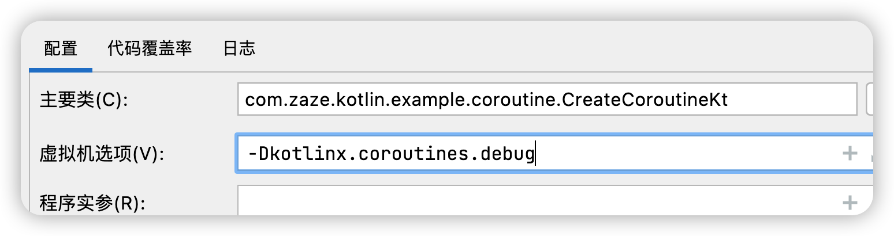
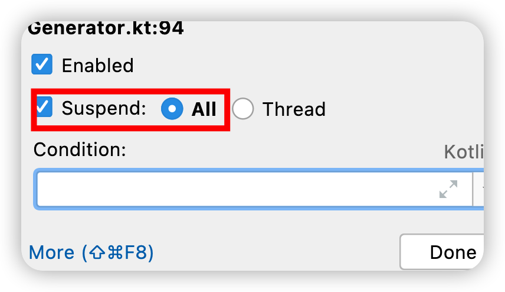
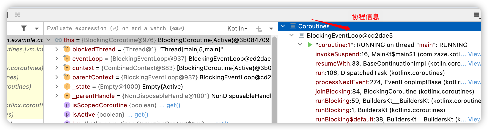

# Kotlin协程

> 源码常出看到 `expect` 和 `actual` 修饰词，他们表示修饰的对象是跨平台的。他们一一对应同名。
>
> expect： 相当于接口。
>
> actual： 是真实的实现。源码需要在对应平台的依赖库中查看。

## 温习总结用

> 在学习Kotlin协程和写这篇学习总结的过程中，对于协程的概念一直停留在字面概念上。对里面的一些概念也是似懂非懂（协作的？挂起信息？continuation怎么理解? 为什么执行结果会作为下次执行的入参？等）。经过一段时间的学习感觉对协程有了一些理解。所以我把对 协程的理解先阐述在前面，方便后续温习时快速回忆。

**协程是基于线程的封装**，是运行在线程上的。是一种**为异步程序设计的程序控制流程的机制**，其核心点是**挂起和恢复**，并且这个**流程是由程序逻辑自己控制的**，而不是像线程那样调度时间是由操作系统控制的。

* **协程的挂起点**：挂起函数被调用并且真正挂起的地方，只有异步调用时才会需要挂起，也表示程序需要调度的地方。

* **协程的挂起**：当我们调用一个挂起函数且被挂起时，可以类似理解为协程基于挂起点将 一个完整的函数一分为二，分为上下两部分，上部分就是我们已经执行完成的，下部分就是我们过会需要恢复继续执行的部分。紧接着会在上下两部分间插入一段代码，可以称之为中间部分（它可能也是个挂起函数）。如果需要参数则传入对应的参数，不需要时传入 `Unit`。而下部分则被挂起，暂时不执行。
  * 通过反编译 查看 `invokeSuspend()` 的具体实现可以知道，协程挂起就是通过 `if else`  + 标志位 来做不同的事情。挂起就是 更新标志位，然后直接return。恢复 就是判断 标志位，接着执行之前由于return没有执行的后续部分。

* **协程的恢复**：为了能够接着恢复之前挂起的下部分，Kotlin 协程中会将挂起点的信息下部分保存到一个 `Continuation` 实例中，并会将这个实例返回给我们，我们可以通过它来恢复协程，也就是继续执行 下部分函数。执行下部分时可能需要中间部分的执行结果（没有返回值时是 `Unit` ），这也就是为什么 在恢复协程（`continuation.resumeWith(value)`）时，会将执行协程体（ `invokeSuspend()`） 的结果作为下一个协程体执行所需参数的原因。

* **协程的非阻塞**：原因是由于默认的挂起方式将会切换到其他线程。

 **Continuation**：可以类比我们平时使用的 Callback, `resumeWith()` 是回调函数，可以将结果回调给我们，同时下部分代码相当于在这个回调中执行，也就是 CPS 变换。

上中下三个部分之间存在参数传递，使用返回值等，且每个协程会自己主动交出控制权，所以协程之间是相互协作的关系。


> **基于以上的观点，我理解协程 就是将我们声明的实际函数 在需要挂起的地方拆分成更多的子函数（一个个的 `Continuation`就是为了能处理这些子函数 ），再通过一定的方式进行组合调用的这样一个协作过程。而这个组合协同的方式就是指协程的调度。也就理解了为什么说协程之间是相互作用的。**

* **协程是基于线程的封装，是运行在线程上的，可以认为是一种异步任务的管理框架**。

* **协程运行在线程中，相当于 一个个Task**：一个线程中可以运行成千上万的协程，且协程可以通过挂起/恢复在不同线程中切换。
* **协程的启动/恢复 相当于是开启了一个无限循环，从而一直获得调度权**：`resumeWith()` 内部 是一个死循环，循环内通过 `invokeSuspend()` 执行协程体。不退出/挂起 的情况下，会将返回值 `outcome` 会作为下次循环 执行协程体 的入参 param。
* **协程的挂起/退出 相当于退出内部的循环，从而交出调度权**：在 挂起 或者 结束 时会退出循环。结束时调用回调 ` completion.resumeWith(outcome)`，将结果返回。
* **协程中的入参和返回值**：`resume(value)` 中的参数 value ，实际是最近挂起处（`suspendCoroutine()`） 接收的返回值。不需要返回值时是 `Unit` 。
* **协程实际是一个个 `Continuation` 组成**：我们操作的协程体都是 `Continuation` 的接口实例， 一般为 `SafeContinuation`。它包含一个 `CorutineContext` 上下文来保存信息，和 一个  `resumeWith()` 函数来处理操作并返回结果。
* **协程是通过 CPS 变换来实现挂起和恢复**：将 挂起点信息 保存在 Continuation 对象中，通过传递 Continuation 来控制异步调用流程。将同步调用的挂起函数转换成了异步代码（Callback）。
* **对称协程的调度方式是通过统一的调度中心来实现的**：由一个`特权协程`来统一 启动其他协程。其他协程会在结束前将 调度权还给 特权协程，特权协程再去启动需要调度的协程，从而将调度权转移给了对应的协程。结束时通过注册的回调接口进行回调。
* **我们平时使用的大多都是复合协程**：复合协程是基于 简单协程（类似`createCoroutine()`方式创建） 的扩展和封装，方便我们的使用。比如常用的  `launch {}` 就是复合协程的构造器。

## 什么是协程

### 协程的基本概念

协程是一种**程序控制流程的机制**，是为异步程序设计的。其核心点是 函数或一段程序能够被挂起，稍后再在挂起的位置恢复， 这个流程是程序逻辑自己控制的。

* 一个 支持挂起和恢复的程序。Kotlin协程是基于 `Continuation` 来实现挂起和恢复的。
* 以同步（阻塞）执行的方式 实现 异步（非阻塞）任务的执行,  简化了异步编程。
* 不同于线程，协程不需要系统和硬件的支持，是依靠编译器实现的。

协程的核心是 挂起 和 恢复：

* 挂起：让出运行权。

* 恢复：获得运行权。


#### 协程的组成部分

* **协程的执行体**：启动协程时对应的函数，即启动协程需要执行的操作，也叫 **协程体**。
* **协程的控制实例**：创建协程时返回的实例，称为**协程的描述类**。我们可以通过它控制协程的调用流转。
* **协程的状态**：调用流程转移前后，协程的状态会发生相应的变化。

#### Kotlin协程的一些概念

> Kotlin协程是独立于标准库的一套框架。
>
> 协程的本质是基于线程的封装，是运行在线程上的。可以认为是一种异步任务的管理框架。

* 协程体：协程中需要执行的操作。是一个被 suspend 修饰的 lambda表达式： `(suspend () -> T)` ，是一个 `Continuation` 。
* 协程的控制实例：`Continuation`（续体）
* 协程的状态：`COROUTINE_SUSPENDED` , `UNDECIDED` , `RESUMED` 
* 挂起函数：`suspend`修饰的函数， 只能在挂起函数和协程体内调用。 挂起函数不一定挂起。
* 挂起点：程序需要调度的地方，即**真正被挂起**的位置。
  * 只有异步操作才需要挂起，即发生了先获取结果再处理的情况，后面会结合源码分析。


### 线程和协程对比

**协程是基于线程的封装，是运行在线程上的**。可以认为是一种异步任务的管理框架，是在用户层模拟的线程（用户态线程）。

* **线程**：一旦开始执行，那么直到任务结束都就不会暂停。在Java虚拟机中，线程会直接映射为内核线程，而内核线程的**调度是由操作系统控制，通常是按时间片划分的抢占式调度**。
* **协程**：协程可以挂起暂停，主动让出交由另一个协程执行，稍后也能恢复继续执行。调度流程是程序通过挂起和恢复自己控制的，是由程序自己进行调度的，并不会交给系统。**这种协程自己主动交出控制权的方式叫做协作式调度，协程之间是相互协作的**。

### 异步程序对比

* 线程切换
* 函数调用栈发生变换

####  **Future**

> 异步结果 **阻塞了主调用流程**。

```kotlin
/**
 * Future 测试
 */
fun main() {
    MyLog.i(DateUtil.timeMillisToString(), "------ start")
    arrayListOf("1", "2").map {
        testFuture(it)
    }.map {
        it.get()
    }
    MyLog.i(DateUtil.timeMillisToString(), "------ finish")
}

val executors: ExecutorService = Executors.newSingleThreadExecutor()

fun testFuture(test: String): Future<String> {
    MyLog.i(DateUtil.timeMillisToString(), "testFuture $test")
    return executors.submit(Callable {
        MyLog.i(DateUtil.timeMillisToString(), "$test sleeping")
        Thread.sleep(1000L)
        MyLog.i(DateUtil.timeMillisToString(), "$test wakeup")
        test
    })
}
```

运行结果：

```shell
2022-11-02 17:06:42:350: ------ start
2022-11-02 17:06:42:393: testFuture 1
2022-11-02 17:06:42:394: testFuture 2
2022-11-02 17:06:42:394: 1 sleeping
2022-11-02 17:06:43:396: 1 wakeup
2022-11-02 17:06:43:396: 2 sleeping
2022-11-02 17:06:44:406: 2 wakeup
2022-11-02 17:06:44:406: ------ finish
```

#### **CompletableFuture**

> 异步结果不阻塞主调用流程，但是**结果脱离了主调用流程**。

```kotlin
/**
 *  CompletableFuture 测试
 */
fun main() {
    MyLog.i(DateUtil.timeMillisToString(), "------ start")
    arrayListOf("1", "2")
        .map {
            testCompletableFuture(it)
        }
        .let { list -> // 整合结果
            CompletableFuture.allOf(*list.toTypedArray())
                .thenApply {
                    list.map { it.get() }
                }
        }.thenAccept {
            MyLog.i(DateUtil.timeMillisToString(), "$it Accept")
        }
    MyLog.i(DateUtil.timeMillisToString(), "------ main sleeping")
    // 保证主线程或者，不然获取不到结果
    Thread.sleep(3000L)
    MyLog.i(DateUtil.timeMillisToString(), "------ finish")
}

fun testCompletableFuture(test: String): CompletableFuture<String> {
    MyLog.i(DateUtil.timeMillisToString(), "testCompletableFuture $test")
    return CompletableFuture.supplyAsync {
        MyLog.i(DateUtil.timeMillisToString(), "$test sleeping")
        Thread.sleep(1000L)
        MyLog.i(DateUtil.timeMillisToString(), "$test wakeup")
        test
    }
}
```

运行结果：

```shell
2022-11-02 17:19:13:293: ------ start
2022-11-02 17:19:13:333: testCompletableFuture 1
2022-11-02 17:19:13:337: testCompletableFuture 2
2022-11-02 17:19:13:337: 2 sleeping
2022-11-02 17:19:13:337: 1 sleeping
2022-11-02 17:19:13:338: ------ main sleeping
2022-11-02 17:19:14:342: 2 wakeup
2022-11-02 17:19:14:342: 1 wakeup
2022-11-02 17:19:14:342: [1, 2] Accept
2022-11-02 17:19:16:350: ------ finish
```

> 若注释了 `Thread.sleep(3000L)` 输出结果变为以下流程，说明 CompletableFuture 的执行流程脱离了 主调用流程。

```shell
2022-11-02 17:20:31:182: ------ start
2022-11-02 17:20:31:224: testCompletableFuture 1
2022-11-02 17:20:31:228: testCompletableFuture 2
2022-11-02 17:20:31:229: 2 sleeping
2022-11-02 17:20:31:229: 1 sleeping
2022-11-02 17:20:31:230: ------ main sleeping
2022-11-02 17:20:31:230: ------ finish
```

####  **Promise与async/await**

> async/await 以同步的方式 实现了异步任务的执行

```javascript
async function main() {
    try {
        const res = await Promise.all(["1", "2"].map(url => download(url)))
        console.log("res " + res)
    } catch (error) {
        console.error(e)
    }
}

function download(url) {
    return new Promise((resolve, reject) => {
        try {
            console.log("Promise " + url)
            "Promise " + url
        } catch (e) {
            reject(e)
        }
    })
}
```

#### **kotlin 协程**

> suspend 声名 挂起函数，同时函数调用的地方就是 挂起点。

```kotlin
val tag = "coroutine"

fun main() = runBlocking {
    log(tag, "---- start");
    launch {
        log(tag, "main result: $result ")
    }
    log(tag, "---- finish");
}

suspend fun testSuspendable(url: String): String {
    return suspendCoroutine { continuation ->
        thread {
            try {
                // 将正常的结果返回
                continuation.resume(download(url))
            } catch (e: Exception) {
                // 将异常返回
                continuation.resumeWithException(e)
            }
        }
    }
}

fun download(url: String): String {
    log(tag, "Download start $url")
    val file = File("testRes/src/writeToFile.txt");
    FileUtils.deleteFile(file)
    repeat(10000) {
        FileUtils.writeToFile("aaaaaaaaa", file, true)
    }
    val result = FileUtils.readFromFile(file).toString().substring(0, 10)
    log(tag, "Download end $result")
    return result
}
```

运行结果：

```shell
2022-11-03 16:56:13:575 coroutine: : ---- start
2022-11-03 16:56:13:593 coroutine: : ---- finish
2022-11-03 16:56:13:596 coroutine: : Download start testSuspendable
2022-11-03 16:56:14:867 coroutine: : Download end aaaaaaaaaa
2022-11-03 16:56:14:867 coroutine: : main result: aaaaaaaaaa 
```


## 协程的分类

不同语言间对写成的实现在细节上存在较大的差异。以下提供了2种分类方式来审视协程的角度和思路，但是这个分类并不是绝对的。

### 按调用栈分类

#### 有栈协程（Stackful Coroutine）

每一个协程都有自己的调用栈，有点类似于线程的调用栈，这种情况下的协程实现很接近线程，主要的不同体现在调度上。

> 优点

可以在任意函数调用层级的任意位置挂起，并转移调度权。如 Lua

> 缺点

需要额外开辟一块 栈内存。（Go 做了大量优化，按需扩容/缩容，内存占用相对较小）。

#### 无栈协程（Stackless Coroutine）

没有自己的调用栈。状态通过状态机或者闭包等语法实现。

* 状态机：通过状态流转 来实现 控制流转。
* 闭包：保存变量。

> Kotlin 的协程是通过 状态机 + 闭包 的方式实现的。通常被认为是 无栈协程。不过 Kotlin 通过 `suspend`函数嵌套调用的方式，实现 任意挂起函数调用层次的 挂起，这却是有栈协程的特性。

### 按调度方式分类

#### 对称协程

> 类似线程，更能体现出协程的独立性和协作性。

* 任意协程都是相互独立且平等的，不会因为调用关系而存在从属关系。

* 调度权可以在任意协程间转移。

#### 非对称协程

> 更加符合我们的思维习惯，调用有来有回，形成闭环。
>
> 是多数语言的实现方式。

* 调度权只能出让给协程的调用方，存在从属关系。

* 可以通过建立统一分发中心的方式，实现对称协程的能力。


## 协程使用案例

* 通过`createCoroutine()`创建协程体后，需要调用返回值 `Continuation`的`resume()`方法来启动协程，否则将一直处于挂起状态。
* `startCoroutine()`函数内部会在创建协程体后会立即调用`resume()`。

> `createCoroutine()` 和 `startCoroutine()` 都存在一个带 `receiver` 参数的声明，我们可以在协程体内 使用 this访问receiver 实例，receiver它的作用是约束和扩展 协程体，类似作用域的功能。

代码样例：

```kotlin
const val TAG = "CreateCoroutine"

/**
 * 创建协程体: createCoroutine
 * 需要调用 resume启动
 */
val continuation = suspend { // 协程体
    MyLog.i(TAG, "In Coroutine 1")
    1
}.createCoroutine(object : Continuation<Int> {
    override val context: CoroutineContext
        get() = EmptyCoroutineContext

    override fun resumeWith(result: Result<Int>) {
        // 协程结束后的回调
        MyLog.i(TAG, "Coroutine End: $result")
    }
})


/**
 * 创建并立即执行 : startCoroutine
 */
val continuation2 = suspend {
    MyLog.i(TAG, "In Coroutine 2")
    2
}.startCoroutine(object : Continuation<Int> {
    override val context: CoroutineContext
        get() = EmptyCoroutineContext

    override fun resumeWith(result: Result<Int>) {
        MyLog.i(TAG, "Coroutine End: $result")
    }
})

fun main() {
    // 调用resume()启动协程
    continuation.resume(Unit)
    // 等同上方，实际 resume 就是调用的这个方法。
//    continuation.resumeWith(Result.success(Unit))
}

```

输出结果：

```shell
CreateCoroutine: In Coroutine 2
CreateCoroutine: Coroutine End: Success(2)
CreateCoroutine: In Coroutine 1
CreateCoroutine: Coroutine End: Success(1)
```

## 协程的大体流程

*  我们可以通过 `createCoroutine()` 函数来创建协程并返回协程体 `Continuation`，是一个`SafeContinuation` 实例。
*  `SafeContinuation` 实际是个代理类，内部的 `delegate`才是 `Continuation` 的本体。
*  `delegate` 是一个匿名内部类, 继承自 `SuspendLambda`，是 `suspend lambda` 被编译器处理后生成的，`SuspendLambda` 是 `Cotinuation` 接口的实现类。
*  我们实际调用的是 `delegate.resumeWith()` 来启动协程，`delegate` 就是协程体。

*  `delegate.resumeWith()` 内部 通过 `invokeSuspend()` 启动了协程。

*  结束后调用` completion.resumeWith(outcome)` 将结果回调给我们。


## 协程的调试配置

设置 VM 参数，这样我们 通过 `Thread.currentThread().name` 打印时，会显示协程信息。

```shell
-Dkotlinx.coroutines.debug
```




Debug配置，方便断点调试。



调试窗口默认的最右边有协程相关信息。




## 协程启动流程分析

> 此分析流程 基于上面的 `CreateCoroutine` 代码范例，我们通过添加断点的方式跟踪协程的启动过程，从而 加深对理解 Kotlin 协程的理解。
>
> IDEA 代码跳转 到的是 `kotlin-stdlib-comom:x.xx.xx` 下，具体实现在 `kotlin-stdlib:x.xx.xx`下。
>
> 真实的源码文件 一般是 `xxxJvm.kt`  格式。
>
> 如`SafeContinuationJvm.kt`

了解大概后来看看具体流程。

### 协程的创建

通过标准库提供的  `createCoroutine()` 函数来创建协程。

#### createCoroutine() 协程创建入口

```kotlin
@SinceKotlin("1.3")
@Suppress("UNCHECKED_CAST")
public fun <T> (suspend () -> T).createCoroutine(
    completion: Continuation<T>
): Continuation<Unit> =
    SafeContinuation(createCoroutineUnintercepted(completion).intercepted(), COROUTINE_SUSPENDED)

// receiver 参数用于约束和扩展协程体，协程体内的this 就是 receiver，从而可以执行 receiver 内的方法。
public fun <R, T> (suspend R.() -> T).createCoroutine(
    receiver: R,
    completion: Continuation<T>
): Continuation<Unit> =
    SafeContinuation(createCoroutineUnintercepted(receiver, completion).intercepted(), COROUTINE_SUSPENDED)

```

* 协程体【`(suspend () -> T)`】：是协程的执行体。它是一个 suspend Lambda 表达式，没有入参，返回类型为范型 T。它最终会被编译器处理成匿名内部类, `createCoroutine` 是它的扩展函数。
* 参数【`completion: Continuation<T>`】：协程的完成回调，会在协程执行完成后调用。
* 返回值【`Continuation<Unit>`】：用于触发协程的启动，内部保存了协程执行所需的上下文。

> 小结
>
> * `createCoroutine()`  是一个扩展函数，它的 receiver type 【 `(suspend () -> T)` 】是一个被 suspend 修饰的 lambda表达式，就是上方代码案例中的 `suspend { ... }`。
> *  `createCoroutine()` 返回了一个 `Continuation` 的实例，我们可以用它来启动协程。

先来看看返回的  `Continuation `  的定义。

#### Continuation：协程控制器

Continuation 是返回给我们使用的一个协程控制器。它是一个接口，包含了一个协程上下文（CoroutineContext） 和 一个恢复协程的 `resumeWith()` 函数。

```kotlin
@SinceKotlin("1.3")
public interface Continuation<in T> {
    // 协程上下文
    public val context: CoroutineContext
	
    /**
     * 恢复协程的执行
     * 参数 result 内存储的是 执行结果（某个值或异常）。
     **/
    public fun resumeWith(result: Result<T>)
}
```

从源码中可以发现 我们实际获得的Continuation 是 一个SafeContinuation。

#### SafeContinuation

 `SafeContinuation` 实际是 一个代理类，代理了 `createCoroutineUnintercepted()` 创建的`delegate: Continuation` 。

这里的状态控制主要是为了保证异步调用时挂起：

* **异步调用**：先调用 `getOrThrow()` 来尝试获取结果，再调用`resumeWith()` 的场景。即**先获取再处理**，这样错乱的流程，需要挂起等待处理才能获取到正确的结果。
* **同步调用**：和上述相反，先调用 `resumeWith()`  。即**先处理再获取**，这样的正常流程可以直接获取到结果。

> SafeContinuationJvm.kt

```kotlin
@PublishedApi
@SinceKotlin("1.3")
internal actual class SafeContinuation<in T>
internal actual constructor(
    private val delegate: Continuation<T>,
    initialResult: Any?
) : Continuation<T>, CoroutineStackFrame {
  
  	// 默认为UNDECIDED, createCoroutine 时传入的是COROUTINE_SUSPENDED
    @PublishedApi
    internal actual constructor(delegate: Continuation<T>) : this(delegate, UNDECIDED)

    public actual override val context: CoroutineContext
        get() = delegate.context

  	// 存放的是 协程的当前状态 或者 最终结果。
  	@Volatile
    private var result: Any? = initialResult
  
  	private companion object {
      
      	// 修改的是 SafeContinuation.result 字段
        @Suppress("UNCHECKED_CAST")
        private val RESULT = AtomicReferenceFieldUpdater.newUpdater<SafeContinuation<*>, Any?>(
            SafeContinuation::class.java, Any::class.java as Class<Any?>, "result"
        )
    }
  
    // 只有 挂起的协程才需要恢复。非挂起是直接返回数据。
  	// createCoroutine() 创建协程时，初始化为 COROUTINE_SUSPENDED
    public actual override fun resumeWith(result: Result<T>) {
        while (true) { // lock-free loop
            val cur = this.result // atomic read， 这个是自身持有的result
            when {
              	// 未定状态，表示同步调用，还没挂起过就直接调用了 resume。
                // 直接将RESULT 更新 resule 数据, 调用 getOrThrow() 将可以直接获得结果。
                cur === UNDECIDED -> if (RESULT.compareAndSet(this, UNDECIDED, result.value)) return
                // 当前挂起状态，恢复协程，更新为 RESUMED。
                cur === COROUTINE_SUSPENDED -> if (RESULT.compareAndSet(this, COROUTINE_SUSPENDED, RESUMED)) {
                    // 当前状态为 COROUTINE_SUSPENDED, 调用 resumeWith()，恢复协程
                    delegate.resumeWith(result)
                    return
                }
                else -> throw IllegalStateException("Already resumed")
            }
        }
    }
  
  	/**
  	 *  挂起、返回结果或异常
  	 **/
    @PublishedApi
    internal actual fun getOrThrow(): Any? {
        var result = this.result // atomic read
        if (result === UNDECIDED) {
          	// 当前是 UNDECIDED，将 RESULT更新为挂起状态
            if (RESULT.compareAndSet(this, UNDECIDED, COROUTINE_SUSPENDED)) return COROUTINE_SUSPENDED
          	// 比较更新时 发生了变化，直接重新读取结果。
            result = this.result // reread volatile var
        }
        // 当前 RESUMED 执行中：返回挂起
      	// Failure： 抛出异常
      	// 是结果数据：直接返回
        return when {
            result === RESUMED -> COROUTINE_SUSPENDED // already called continuation, indicate COROUTINE_SUSPENDED upstream
            result is Result.Failure -> throw result.exception
            else -> result // either COROUTINE_SUSPENDED or data
        }
    }
}

```

> 小结：
>
> `SafeContinuation` 实际是一个代理, 内部的 `delegate`才是 `Continuation` 的本体，我们启动协程时实际调用的是 `delegate.resumeWith()` 
>
> * `resumeWith()` 函数 
>   * 若`this.result` 当前是 COROUTINE_SUSPENDED 挂起状态，则将状态 更新为RESUMED 并调用 `delegate.resumeWith()` 启动/恢复协程。
>   *  若 `this.result` 为 UNDECIDED 未定状态，则直接更新数据 到 result 中。
> * `getOrThrow()` 函数
>   * 若当状态为 `RESUME` 时 则将会变更状态为 `COROUTINE_SUSPENDED` 挂起状态
>   * 为 `Result.Failure` 失败状态时，将直接抛出对应异常
>   * 若已获取到结果则直接返回结果。

新的问题： `delegate` 是什么？

#### delegate是什么？

从上面的源码我们已经知道 delegate 实例是通过`createCoroutineUnintercepted(completion).intercepted()`创建的。`createCoroutineUnintercepted()`，它是一个跨平台的函数，具体的实现得看具体的平台，这里是JVM。`intercepted()` 是一个拦截处理过程，对研究整体流程没什么影响，可暂时忽略。

> IntrinsicsJvm.kt

```kotlin
@SinceKotlin("1.3")
public actual fun <T> (suspend () -> T).createCoroutineUnintercepted(
    completion: Continuation<T>
): Continuation<Unit> {
    val probeCompletion = probeCoroutineCreated(completion)
    return if (this is BaseContinuationImpl)
        create(probeCompletion) // 调用此处
    else
        createCoroutineFromSuspendFunction(probeCompletion) {
            (this as Function1<Continuation<T>, Any?>).invoke(it)
        }
}
```

最后调用了 ` this.create()`函数创建Continuation，它是  `BaseContinuationImpl` 的子类。

```kotlin
@SinceKotlin("1.3")
internal abstract class BaseContinuationImpl(
    public val completion: Continuation<Any?>?
) : Continuation<Any?>, CoroutineStackFrame, Serializable {
    
    // 内部无具体实现
    public open fun create(completion: Continuation<*>): Continuation<Unit> {
        throw UnsupportedOperationException("create(Continuation) has not been overridden")
    }
}
```

但是`BaseContinuationImpl`中没有`create()`的具体实现。单纯看源码已经没有进一步的信息。

通过断点查看 实例信息，发现它是一个匿名内部类：`com.zaze.kotlin.example.coroutine.CreateCoroutineKt$continuation$1`。

所以 **创建Continuation 的具体实现是在匿名内部类中**。

那么这个 匿名内部类时如何生成的呢？

supend 函数以及 suspend lambda  两者在编译器处理后会生成一个匿名内部类，且继承自 `SuspendLambda`这个抽象类。

supend 函数 上面已经列举很多，我们看看 suspend lambda 是什么样子。

```kotlin

fun main() {
    // suspend lambda 
    suspend {
        MyLog.i(TAG, "In Coroutine 1")
    }
}

// 源码中的定义
// 是一个高阶函数，高阶函数的实现就是匿名内部类。
public inline fun <R> suspend(noinline block: suspend () -> R): suspend () -> R = block
```

我通过添加断点日志，将`delegate`的父类型输出出来验证了一下。它的父类确实是 `SuspendLambda`。

````shell
delegate's super class: class kotlin.coroutines.jvm.internal.SuspendLambda
````

#### SuspendLambda

SuspendLambda 源码注释中也明确的写了： `Suspension lambdas inherit from this class`，lambdas挂起函数继承自这个类。

```kotlin
@SinceKotlin("1.3")
// Suspension lambdas inherit from this class
internal abstract class SuspendLambda(
    public override val arity: Int,
    completion: Continuation<Any?>?
) : ContinuationImpl(completion), FunctionBase<Any?>, SuspendFunction {
    constructor(arity: Int) : this(arity, null)

    public override fun toString(): String =
        if (completion == null)
            Reflection.renderLambdaToString(this) // this is lambda
        else
            super.toString() // this is continuation
}


// 主要处理了 拦截器相关的流程
@SinceKotlin("1.3")
// State machines for named suspend functions extend from this class
internal abstract class ContinuationImpl(
    completion: Continuation<Any?>?,
    private val _context: CoroutineContext?
) : BaseContinuationImpl(completion) {
    constructor(completion: Continuation<Any?>?) : this(completion, completion?.context)
}
```

> 小结
>
> `delegate` 是一个匿名内部类, 继承自 `SuspendLambda`，是 `suspend lambda` 被编译器处理后生成的。`SuspendLambda` 是一个 `Continuation` 接口的实现类。

#### 总结

* `createCoroutine()`  是一个扩展函数，它的 receiver type 【 `(suspend () -> T)` 】是一个被 suspend 修饰的 lambda表达式，就是上方代码案例中的 `suspend { ... }`。
*  `createCoroutine()` 返回类型为 `Continuation` ，实际是 `SafeContinuation` 的实例，我们可以用它来启动协程。

* `SafeContinuation` 本质是一个代理, 内部的 `delegate`才是 `Continuation` 的本体，我们启动协程时实际调用的是 `delegate.resumeWith()` 
* `delegate` 是一个匿名内部类, 继承自 `SuspendLambda`，是 `suspend lambda` 被编译器处理后生成的。
  * `SuspendLambda` 也是 `Cotinuation` 接口的实现类。


### 协程的启动

#### resume()

我们通过调用 `Continuation.resume(value)` 来**启动/恢复协程**，也也可以叫 推进协程。

* 参数 `value` 是作为**最近一个挂起点（`suspendCoroutine()`）的返回值**， 即调用 `resume(value)` 后，之前的挂起处可以收到 `value` 这个返回值。

```kotlin
@SinceKotlin("1.3")
@InlineOnly
public inline fun <T> Continuation<T>.resume(value: T): Unit =
    resumeWith(Result.success(value))
```

实际调用的是自身的 `Continuation.resumeWith()`函数，所以我们可见将上述测试代码的改成以下内容, 效果相同。

```kotlin
val continuation = suspend { // 协程体
    MyLog.i(TAG, "In Coroutine 1")
    // 这里调用一个挂起函数
    val fun1 = fun1()
    MyLog.i(TAG, "In Coroutine fun1: $fun1") // fun1 = 100
    // 返回 1，作为下一个调度协程的入参，或者协程结束后直接返回给我们
    1
}.createCoroutine(object : Continuation<Int> { // completion
    override val context: CoroutineContext
        get() = EmptyCoroutineContext

    override fun resumeWith(result: Result<Int>) {
        // 协程结束后的回调，这里会接收到1
        MyLog.i(TAG, "Coroutine End: $result")
    }
})

fun main() {
    // 调用resume()启动协程
    // continuation.resume(Unit)
    // 等同上方，实际 resume 就是调用的这个方法。
	val r = continuation.resumeWith(Result.success(Unit))
    // r = Unit
}

// 执行挂起
suspend fun fun1() = suspendCoroutine<Int> {continuation ->
    MyLog.i(TAG, "fun1")
    // 100 将会作为 调用处的返回值
    // 由于直接同步调用了 resume，这个函数将实际并不会挂起
    continuation.resume(100)
}
```

接着先来看看 `resumeWith()` 内部又做了什么？

#### resumeWith()

我们在`SuspendLambda` 的父类 `BaseContinuationImpl`中找了`resumeWith()`的具体实现：

> `BaseContinuationImpl.resumeWith()` 内部 调用了 `invokeSuspend()`

```kotlin
// completion 就是我们创建协程时传入的 Continuation 接口
@SinceKotlin("1.3")
internal abstract class BaseContinuationImpl(
    public val completion: Continuation<Any?>?
) : Continuation<Any?>, CoroutineStackFrame, Serializable {
    public final override fun resumeWith(result: Result<Any?>) {
        var current = this
        var param = result // 我们传入的参数就是初始值
        while (true) {
          	// 恢复，更新为 RUNNING 状态
            probeCoroutineResumed(current)
            with(current) {
                val completion = completion!! 
                val outcome: Result<Any?> =
                    try {
                        // 传入参数，并调用 invokeSuspend() 执行协程体
                        // 获取返回值，范例中是 1
                        val outcome = invokeSuspend(param)
                      	// 若挂起，则退出循环
                        if (outcome === COROUTINE_SUSPENDED) return
                        // 使用返回值 创建一个成功结果
                        Result.success(outcome)
                    } catch (exception: Throwable) {
                        Result.failure(exception)
                    }
                releaseIntercepted() // this state machine instance is terminating
              	// completion是依然是一个协程，则继续循环执行
                if (completion is BaseContinuationImpl) {
                    // unrolling recursion via loop
                    current = completion
                  	// 返回值作为下次执行的参数
                    param = outcome
                } else {
                    // top-level completion reached -- invoke and return
                    // 协程结束的回调。
                    completion.resumeWith(outcome)
                    return
                }
            }
        }
    }

    protected abstract fun invokeSuspend(result: Result<Any?>): Any?
}
```

````kotlin
internal fun probeCoroutineResumed(frame: Continuation<*>) = updateState(frame, RUNNING)
````

通过断点走一下流程：

* `resumeWith()` 内部会调用 `invokeSuspend()` 启动/恢复协程。结果就是会输出日志： `In Coroutine 1` 。

* 获取到返回值 `1`，因此`outcome = 1` ，并会封装成一个 Result类。

* 接着将存在两个分支。
  * 若 `completion` 依然还是一个协程，将继续进行循环，并将返回结果赋值给 param 作为 下次循环 执行协程体的入参。
  * 若执行完后协程就结束了，会调用 `completion.resumeWith(outcome)` 将结果回调给我们。
  

> 小结
>
> * **协程的启动/恢复相当于是 `resumeWith()` 内开始循环**：`delegate.resumeWith()` 内部 是一个死循环，循环通过 `invokeSuspend()` 执行协程体。不退出的情况下，会将返回值 `outcome` 会作为下次循环 执行协程体 的入参。
> * **协程的挂起/退出相当于退出`resumeWith()`  内的循环**：在 挂起 或者 结束 时会退出循环。结束时调用回调 ` completion.resumeWith(outcome)`，将结果返回。
>
> 新的疑问：
>
> `invokeSuspend()` 的具体实现是什么样的？

#### invokeSuspend()

`invokeSUpend()` 的具体实现 在编译器生成的 匿名内部类中，我们可以通过反编译的方式查看内部流程。

```java
public final class CreateCoroutineKt {
   @NotNull
   public static final String TAG = "CreateCoroutine";
   @NotNull
   private static final Continuation continuation = ContinuationKt.createCoroutine((Function1)(new Function1((Continuation)null) {
      // 这个label 是用来表示阶段的
      int label;

      @Nullable
      public final Object invokeSuspend(@NotNull Object $result) {
         // var3 表示挂起
         Object var3 = IntrinsicsKt.getCOROUTINE_SUSPENDED();
         Object var10000;
         switch (this.label) {
            case 0: // 第一次执行时 走这里
               ResultKt.throwOnFailure($result);
               MyLog.INSTANCE.i("CreateCoroutine", "In Coroutine 1");
               Continuation var4 = (Continuation)this;
               // 这里将label更新为1，那么下次就不走这个分支了
               this.label = 1;
               // 这里默认将 会传入当前协程的 Continuation 给挂起函数
               var10000 = CreateCoroutineKt.fun1(var4);
               // 这里会判断是否挂起，
               if (var10000 == var3) { // 挂起，则直接中断，等待下次执行。
                  return var3;
               }
               break;
            case 1: // 第一次被恢复后执行这里。
               ResultKt.throwOnFailure($result);
               // 赋值结果
               var10000 = $result;
               break;
            default:
               throw new IllegalStateException("call to 'resume' before 'invoke' with coroutine");
         }

         int fun1 = ((Number)var10000).intValue();
         MyLog.INSTANCE.i("CreateCoroutine", "In Coroutine fun1: " + fun1);
         return Boxing.boxInt(1);
      }

      @NotNull
      public final Continuation create(@NotNull Continuation $completion) {
         return (Continuation)(new <anonymous constructor>($completion));
      }

      @Nullable
      public final Object invoke(@Nullable Continuation p1) {
         return ((<undefinedtype>)this.create(p1)).invokeSuspend(Unit.INSTANCE);
      }

      // $FF: synthetic method
      // $FF: bridge method
      public Object invoke(Object p1) {
         return this.invoke((Continuation)p1);
      }
   }), (Continuation)(new Continuation() {
      @NotNull
      public CoroutineContext getContext() {
         return (CoroutineContext)(new LogInterceptor());
      }

      public void resumeWith(@NotNull Object result) {
         MyLog.INSTANCE.i("CreateCoroutine", "Coroutine End: " + Result.toString-impl(result));
      }
   }));
```


#### suspendCoroutine()：挂起函数

`suspendCoroutine()` **是 Kotlin 提供的拥有挂起能力的函数**。若发生 异步调用则会挂起当前协程。如果我们在传入的 `block` 内部调用了 `safe.resume()` 那么将不会挂起，此时将直接返回结果。

* 这里通过 `SafeContinuation` 保证了 仅异步才挂起。

* 内部调用了 `suspendCoroutineUninterceptedOrReturn()` 函数，它的具体实现，是在编译时被编译器内联替换的。

```kotlin
@SinceKotlin("1.3")
@InlineOnly
public suspend inline fun <T> suspendCoroutine(crossinline block: (Continuation<T>) -> Unit): T {
    contract { callsInPlace(block, InvocationKind.EXACTLY_ONCE) }
    return suspendCoroutineUninterceptedOrReturn { c: Continuation<T> ->
         // 传入的Continuation 作为 delegate
        // 生成一个新的 SafeContinuation，内部保存了挂起点信息。
        val safe = SafeContinuation(c.intercepted())
        // 将Continuation传给调用处
        block(safe)
        // 调用 getOrThrow() 获取返回结果
        safe.getOrThrow()
    }
}

@SinceKotlin("1.3")
@InlineOnly
@Suppress("UNUSED_PARAMETER", "RedundantSuspendModifier")
public suspend inline fun <T> suspendCoroutineUninterceptedOrReturn(crossinline block: (Continuation<T>) -> Any?): T {
    contract { callsInPlace(block, InvocationKind.EXACTLY_ONCE) }
    throw NotImplementedError("Implementation of suspendCoroutineUninterceptedOrReturn is intrinsic")
}
```

* `suspendCoroutine()` 调用时若是异步调用则会挂起当前协程，并回调一个 `Continuation` 用以恢复。
* `suspendCoroutine()` 的同步返回值 T 是在下次调用 `resume(value)` 恢复时获得， 返回值内容为 恢复时传入的值。

> fun1() 会被编译成下面的样子

```java
   @Nullable
   public static final Object fun1(@NotNull Continuation $completion) {
      SafeContinuation var2 = new SafeContinuation(IntrinsicsKt.intercepted($completion));
      Continuation continuation = (Continuation)var2;
      int var4 = false;
      MyLog.INSTANCE.i("CreateCoroutine", "fun1");
      Result.Companion var10001 = Result.Companion;
      continuation.resumeWith(Result.constructor-impl(Boxing.boxInt(100)));
      Object var10000 = var2.getOrThrow();
      if (var10000 == IntrinsicsKt.getCOROUTINE_SUSPENDED()) {
         DebugProbesKt.probeCoroutineSuspended($completion);
      }

      return var10000;
   }
```


## 协程的组成部分

### 函数的挂起

协程的挂起发生在程序执行流程发生异步调用时，当前调用流程的执行状态进入等待状态。

#### 挂起函数

> 挂起函数的本质其实是 Callback。

* 被 `suspend` 关键字修饰的函数叫做 挂起函数，同时也改变了函数类型（CPS变换）。
* 挂起函数不一定会挂起，只是支持挂起的能力。当`resume()` 和 挂起调用 不在同一个函数栈中时才会挂起（例如线程切换、事件循环等）。
* 挂起函数可以调用任意函数，但只能在 协程体 或者 其他挂起函数内 被调用。普通函数不能调用挂起函数。

> `@RestrictsSuspension`  注解修饰 Scope 后，协程体内只能调用内部自身的 挂起函数，不能调用外部的挂起函数。
>
> 快路径（fast path）：挂起函数直接同步返回。比如提前启动的异步任务已经执行完成，结果已存在。
>
> 慢路径（slow path）：需要挂起，等待异步任务完成时通过 `Continuation` 的恢复调用返回结果。
>

#### 挂起点

**协程内挂起函数调用的地方称为挂起点。** 

在我理解中，挂起点相当于将 一个函数基于这个点 一分为二，上部分就是我们已经执行的，下部分恢复后需要继续执行的信息，保存的挂起点的信息就是为了定位，便于后续恢复。

#### 协程的状态

> 通过 `createCoroutine()`  等一些构造器创建时，默认赋值为 COROUTINE_SUSPENDED 。

* UNDECIDED：待定，协程的默认状态。
* COROUTINE_SUSPENDED：挂起状态。
* RESUMED：执行中。

```kotlin
@SinceKotlin("1.3")
@PublishedApi // This class is Published API via serialized representation of SafeContinuation, don't rename/move
internal enum class CoroutineSingletons { COROUTINE_SUSPENDED, UNDECIDED, RESUMED }
```

#### CPS 变换

> Continuation-Passing-Style Transformation 

Kotlin 挂起函数的挂起和恢复，就是通过 CPS 变换实现的。将挂起点信息保存在 Continuation 对象中，通过传递 Continuation 来控制异步调用流程。

Kotlin 编译器将 suspend  翻译成 Continuation，而 Continuation 可以类比我们平时使用的 Callback, `resumeWith()` 是回调函数，可以将结果回调给我们，同时下部分代码相当于在这个回调中执行。从而将同步调用的挂起函数转换成了异步代码（Callback）


### 协程的上下文

协程上下文是各种不同元素的集合，主要承载资源获取、管理协程等工作，是执行环境相关的通用数据资源的统一管理者。

常见的上下文有 `CoroutineExceptionHandler`、`Job`、`CoroutineDispatcher`、`ContinuationInterceptor` 、`CoroutineName` 等。

* **协程的主元素**：官方提供的协程的描述类，功能相当于线程中的Thread，它也是一个 Context。
* **线程调度**：协程中的调度器 Dispatcher 就是实现了CoroutineContext接口，所以我们可以通过设置不同的 Context 来指定不同的工作线程。如 `Dispatcher.IO` 等
* **添加拦截器**：协程中的拦截器ContinuationInterceptor 也是实现了CoroutineContext接口。
* **设置协程名**：通过 CoroutineName 这个Context来设置协程的名字。

#### CoroutineContext（协程上下文）

> 节点一般为 `CombinedContext`

`CoroutineContext` 接口是一个以 `Key` 为索引的 **数据集合**，`Element` 是数据元素，且内部只会存放自己的数据。我们可以通过 `+`操作符  将 多个上下文进行的合并。

* **Key**：具体的实现类的类型。
* **Element**：就是 Key 对应的 上下文实例。

> 为了方便API设计，Element 也实现了 CoroutineContext 接口。所以它即 可以是集合，也可以是元素。

* 若添加的是空上下文， 那么不需要操作直接返回this即可。
* 遍历context，先将和传入的context拥有相同key的元素去重，接着再将传入的context放在最头部并拼接其他context。
* 最后会将拦截器重新放到头部。

```kotlin
@SinceKotlin("1.3")
public interface CoroutineContext {
	// get方法，可以通过key 来获取 element。
    public operator fun <E : Element> get(key: Key<E>): E?

    public fun <R> fold(initial: R, operation: (R, Element) -> R): R
	
    // 重写了 + 操作符。
    // 例如 A + B
    // this = A
    // context = B
    // 内部会将和传入的context拥有相同key的元素去重，新的覆盖旧的
    // 头插法，新的数据永远在头部
    public operator fun plus(context: CoroutineContext): CoroutineContext =
    	// 若添加的是空上下文， 直接返回即可。
        if (context === EmptyCoroutineContext) this else
    		// 调用传入的context.fold() ，初始值为 this。
    		// 默认实现就是直接指向传入的函数operation。
    		// 若 context 是一个 CombinedContext,则会递归 context.left.fold()。
    		// 最终目的就是去除所有于传入context相同的元素，然后将传入的context放在最前面并拼接其他context
            context.fold(this) { acc, element ->
                // acc：this.left 左向链表。
                // element：context 的元素。
                // 移除acc中的 key对应的element，然后返回移除后的其余的上下文。
                val removed = acc.minusKey(element.key)
                // removed是EmptyCoroutineContext 表示没有其他元素了，那么相加的结果就是当前元素
                if (removed === EmptyCoroutineContext) element else {
                    // 存在其他元素，首先获取拦截器
                    val interceptor = removed[ContinuationInterceptor]
                    // 不存在拦截器，构造一个 CombinedContext。
                    // 将当前element作为第一个元素然后和其他元素拼接起来，继续循环处理
                    if (interceptor == null) CombinedContext(removed, element) else {
                        // 存在拦截器，将拦截器放到头部。
                        val left = removed.minusKey(ContinuationInterceptor)
                        if (left === EmptyCoroutineContext) CombinedContext(element, interceptor) else
                            CombinedContext(CombinedContext(left, element), interceptor)
                    }
                }
            }

	// 返回一个去除了指定 key 后的上下文。
    public fun minusKey(key: Key<*>): CoroutineContext
}

```

```kotlin
// Key 实现类的类型
public interface Key<E : Element>
// Element 继承 CoroutineContext
public interface Element : CoroutineContext {

    public val key: Key<*>

    public override operator fun <E : Element> get(key: Key<E>): E? =
    @Suppress("UNCHECKED_CAST")
    if (this.key == key) this as E else null

    // 上下文添加逻辑时会用到
    // 默认实现就是直接调用 operation()
    // acc -> initial
    // element -> this
    public override fun <R> fold(initial: R, operation: (R, Element) -> R): R =
    operation(initial, this)

    // 自身就是key对应的元素，返回 EmptyCoroutineContext。否则返回this
    public override fun minusKey(key: Key<*>): CoroutineContext =
    if (this.key == key) EmptyCoroutineContext else this
}
```

#### EmptyCoroutineContext

> 表示一个空的协程上下文，内部无数据。实现了 `CoroutineContext` 接口。
>

```kotlin
@SinceKotlin("1.3")
public object EmptyCoroutineContext : CoroutineContext, Serializable {
    private const val serialVersionUID: Long = 0
    private fun readResolve(): Any = EmptyCoroutineContext

    public override fun <E : Element> get(key: Key<E>): E? = null
    // 返回自身
    public override fun <R> fold(initial: R, operation: (R, Element) -> R): R = initial
    // 直接返回传入的 context。
    public override fun plus(context: CoroutineContext): CoroutineContext = context
    // 返回自身
    public override fun minusKey(key: Key<*>): CoroutineContext = this
    public override fun hashCode(): Int = 0
    public override fun toString(): String = "EmptyCoroutineContext"
}
```

#### CombinedContext

> `CoroutineContext` 添加元素时，主要涉及到的就是 `CombinedContext` 类。它是 CoroutineContext 存储逻辑的具体实现类。

CombinedContext 是一个左向链表结构。

* **left**：指向下一个节点。
* **element**：表示当前节点的元素。
* **拦截器永远位于链表的头部**，方便更快的读取拦截器。

```kotlin
@SinceKotlin("1.3")
internal class CombinedContext(
    private val left: CoroutineContext, // 指向下一个节点
    private val element: Element // 当前元素
) : CoroutineContext, Serializable {

	....
    // 层层递归调用 fold，直到最后一个。
    // 并从最后一个开始一次向上执行 operation，并将将操作结果返回作为下次operation的初始值(initial)。
    public override fun <R> fold(initial: R, operation: (R, Element) -> R): R =
        operation(left.fold(initial, operation), element)
	
    // 这个函数的作用就是在 Context这个链中将 key对应的元素去除，然后返回链表中的其他元素。
    // 1. 当前元素就是 key对应的元素：返回 left
    // 2. left中查询不到Key时
    public override fun minusKey(key: Key<*>): CoroutineContext {
        // 先从当前元素中查询key。
        // 若不为空，表示当前element就是 Key所对应的Element
        // 去除自身，即直接返回 left
        element[key]?.let { return left }
        // 当前element不是所需元素，在左向链表中继续查找
        val newLeft = left.minusKey(key)
        return when {
            newLeft === left -> this // 表示key不存在的场景
            newLeft === EmptyCoroutineContext -> element // 表示 left.key == key
            else -> CombinedContext(newLeft, element) // 表示 key 存在，将元素被删除位置的前后两段拼接起来。
        }
    }
	....
}

```

#### 自定义上下文

一般都会继承 `AbstractCoroutineContextElement` 来实现自定义。

```kotlin
// 定义一个异常处理器
class CoroutineExceptionHandler(val onErrorAction: (Throwable) -> Unit) : AbstractCoroutineContextElement(Key) {
    
    // 定义一个实现CoroutineContext.Key泛型为CoroutineExceptionHandler 的伴生对象
    companion object Key : CoroutineContext.Key<CoroutineExceptionHandler>

    fun onError(error: Throwable) {
        error.printStackTrace()
        onErrorAction(error)
    }
}
```

#### 获取上下文

```kotlin
// 使用 Key CoroutineExceptionHandler 来获取上下文实例。
context[CoroutineExceptionHandler]
```


### 协程的拦截器

拦截器也是协程上下文的一种实现，允许我们拦截协程异步回调时的恢复操作，可以在挂起点恢复执行的位置添加拦截器来实现一些 AOP 操作。协程的调度器也基于拦截器实现的。

拦截器相关的流程是在 `ContinuationImpl` 中处理的

* **拦截器的 Key 是固定的**，值为 `ContinuationInterceptor`。
* `intercepted()` 函数被调用后，会从当前上下文中查询拦截器，并调用 拦截器的 `interceptContinuation()`

```kotlin
@SinceKotlin("1.3")
// State machines for named suspend functions extend from this class
internal abstract class ContinuationImpl(
    completion: Continuation<Any?>?,
    private val _context: CoroutineContext?
) : BaseContinuationImpl(completion) {
    constructor(completion: Continuation<Any?>?) : this(completion, completion?.context)

    public override val context: CoroutineContext
        get() = _context!!

    // 缓存拦截器用
    @Transient
    private var intercepted: Continuation<Any?>? = null

    // 调用拦截器的 interceptContinuation() 方法
    public fun intercepted(): Continuation<Any?> =
        intercepted
            ?: (context[ContinuationInterceptor]?.interceptContinuation(this) ?: this)
                .also { intercepted = it }

    protected override fun releaseIntercepted() {
        val intercepted = intercepted
        if (intercepted != null && intercepted !== this) {
            context[ContinuationInterceptor]!!.releaseInterceptedContinuation(intercepted)
        }
        this.intercepted = CompletedContinuation // just in case
    }
}
```

#### 自定义拦截器

```kotlin
class LogInterceptor : ContinuationInterceptor {
    // 拦截器的Key 是固定的。
    override val key: CoroutineContext.Key<*>
        get() = ContinuationInterceptor


    override fun <T> interceptContinuation(continuation: Continuation<T>): Continuation<T> {
        // 这里处理拦截后的处理逻辑，需要返回一个 Continuation。
        return LogContinuation(continuation)
    }
}

class LogContinuation<T>(private val continuation : Continuation<T>) : Continuation<T> by continuation {

    override fun resumeWith(result: Result<T>) {
        println("before resumeWith: $result")
        continuation.resumeWith(result)
        println("after resumeWith.")
    }
}
```


### 总结

协程的 启动/恢复 相当于开启一个循环，内部执行 协程体，每次执行结果都会作为下次循环中 执行协程体的入参。当协程挂起或者执行完毕时 退出循环。

* 协程 通过绑定 `CoroutineContext` 这个上下文，来设置一些数据丰富协程的功能。
* 协程 通过调用 `suspend` 修饰的挂起函数实现挂起。如 `suspendCoroutine()`
* 协程 通过 `Continuation.resume(value)`进行恢复。参数 `value` 将作为一个挂起点的返回值。

## 复合协程

基于 协程基础设施提供的简单协程 进行封装，得到框架层面的复合协程。方便应用使用。

> 复合协程的实现模式

* 协程的构造器：

* 协程的返回值：泛型声明参数。若需要返回值，也会存在泛型参数声明返回值。
* 协程的状态机：在协程的创建、启动、完成过程中，处理协程的状态流转。
* 协程的作用域：`xxScope`形式的接口，用于扩展功能、约束挂起函数的调用位置。


### 从 `Sequence` 来了解一下复合协程的组成结构

以 Kotlin 协程自带的序列生成器 `Sequence` 进行分析。

```kotlin
fun main() {
  	// 构建一个序列生成器，是一个 Iterator
    val sequence = sequence {
        yield(1)
        yield(2)
        yield(3)
        yield(4)
        yieldAll(listOf(1, 2, 3, 4))
    }
  	// for 循环时，会调用hasNext() 恢复协程
    for (element in sequence) {
        println(element)
    }
}
```

#### 协程的构造器 

```kotlin
public fun <T> sequence(@BuilderInference block: suspend SequenceScope<T>.() -> Unit): Sequence<T> = Sequence { iterator(block) }

public inline fun <T> Sequence(crossinline iterator: () -> Iterator<T>): Sequence<T> = object : Sequence<T> {
    override fun iterator(): Iterator<T> = iterator()
}
public fun <T> iterator(@BuilderInference block: suspend SequenceScope<T>.() -> Unit): Iterator<T> {
    val iterator = SequenceBuilderIterator<T>()
  	// 创建协程
    iterator.nextStep = block.createCoroutineUnintercepted(receiver = iterator, completion = iterator)
    return iterator
}
```

#### 协程的状态机

> for 循环时，会调用hasNext()。 
>
> 若数据已准备完毕，返回 true ，执行 `next()` 返回数据；若数据未准备完毕，则会调用 `resume()` 恢复协程（ `resume()`  内部进入循环）。
>
> 协程启动/恢复后，会调用 yield() 准备数据，并将协程状态更新 `COROUTINE_SUSPENDED` ，协程挂起（`resume()` 退出循环）。

```kotlin
private typealias State = Int

private const val State_NotReady: State = 0
private const val State_ManyNotReady: State = 1
private const val State_ManyReady: State = 2
private const val State_Ready: State = 3
private const val State_Done: State = 4
private const val State_Failed: State = 5

private class SequenceBuilderIterator<T> : SequenceScope<T>(), Iterator<T>, Continuation<Unit> {
    private var state = State_NotReady
    private var nextValue: T? = null
    private var nextIterator: Iterator<T>? = null
    var nextStep: Continuation<Unit>? = null

    override fun hasNext(): Boolean {
        while (true) {
            when (state) {
                State_NotReady -> {}
                State_ManyNotReady ->
                    if (nextIterator!!.hasNext()) {
                        state = State_ManyReady
                        return true
                    } else {
                        nextIterator = null
                    }
                State_Done -> return false
                State_Ready, State_ManyReady -> return true
                else -> throw exceptionalState()
            }

            state = State_Failed
            val step = nextStep!!
            nextStep = null
            step.resume(Unit) // 恢复协程
        }
    }

    override fun next(): T {
        when (state) {
            State_NotReady, State_ManyNotReady -> return nextNotReady()
            State_ManyReady -> {
                state = State_ManyNotReady
                return nextIterator!!.next()
            }
            State_Ready -> {
                state = State_NotReady
                @Suppress("UNCHECKED_CAST")
                val result = nextValue as T
                nextValue = null
                return result
            }
            else -> throw exceptionalState()
        }
    }

    private fun nextNotReady(): T {
        if (!hasNext()) throw NoSuchElementException() else return next()
    }

    private fun exceptionalState(): Throwable = when (state) {
        State_Done -> NoSuchElementException()
        State_Failed -> IllegalStateException("Iterator has failed.")
        else -> IllegalStateException("Unexpected state of the iterator: $state")
    }


    override suspend fun yield(value: T) {
      	// 保存数据，更新状态
        nextValue = value
        state = State_Ready
      	// 挂起
        return suspendCoroutineUninterceptedOrReturn { c ->
            nextStep = c
            COROUTINE_SUSPENDED
        }
    }

    override suspend fun yieldAll(iterator: Iterator<T>) {
        if (!iterator.hasNext()) return
        nextIterator = iterator
        state = State_ManyReady
        return suspendCoroutineUninterceptedOrReturn { c ->
            nextStep = c
            COROUTINE_SUSPENDED
        }
    }

    override fun resumeWith(result: Result<Unit>) {
        result.getOrThrow() // just rethrow exception if it is there
        state = State_Done
    }

    override val context: CoroutineContext
        get() = EmptyCoroutineContext
}
```

#### 协程的的返回值

`Sequence`没有返回值

```kotlin
    override fun resumeWith(result: Result<Unit>) {
        result.getOrThrow() // just rethrow exception if it is there
        state = State_Done
    }
```

#### 协程的作用域

用于约束挂起函数的调用位置和扩展协程体功能。

>  `@RestrictsSuspension` 限制协程体内只能调用内部自身的 挂起函数，不能调用外部的挂起函数。

```kotlin
@RestrictsSuspension
@SinceKotlin("1.3")
public abstract class SequenceScope<in T> internal constructor() {
    public abstract suspend fun yield(value: T)

    public abstract suspend fun yieldAll(iterator: Iterator<T>)


    public suspend fun yieldAll(elements: Iterable<T>) {
        if (elements is Collection && elements.isEmpty()) return
        return yieldAll(elements.iterator())
    }

    public suspend fun yieldAll(sequence: Sequence<T>) = yieldAll(sequence.iterator())
}

```


## Kotlin协程框架

### launch、async、runBlocking

#### launch()

调用后将创建并启动协程，仅返回一个 `Job` 对象用以控制协程和感知协程的状态，不会将执行结果返回给我们。

#### async()

基本和 `launch()` 相同，也是调用后就会启动协程，不同点在于 返回的是一个 `Deferred` 对象，可以获取到结果。

#### runBlocking()

**runBlocking()会将调用线程阻塞，直到协程结束。**

实现原理是内部维护了一个事件循环。最后会调用 `joinBlocking()`，`joinBlocking()`函数内部会开启了一个循环，因此能阻塞调用线程。内部所有Job执行完毕后，协程退出，也会退出循环，从而不再阻塞。

```kotlin
public fun <T> runBlocking(context: CoroutineContext = EmptyCoroutineContext, block: suspend CoroutineScope.() -> T): T {
    contract {
        callsInPlace(block, InvocationKind.EXACTLY_ONCE)
    }
    val currentThread = Thread.currentThread()
    val contextInterceptor = context[ContinuationInterceptor]
    val eventLoop: EventLoop?
    val newContext: CoroutineContext
    if (contextInterceptor == null) {
        // create or use private event loop if no dispatcher is specified
        eventLoop = ThreadLocalEventLoop.eventLoop
        newContext = GlobalScope.newCoroutineContext(context + eventLoop)
    } else {
        // See if context's interceptor is an event loop that we shall use (to support TestContext)
        // or take an existing thread-local event loop if present to avoid blocking it (but don't create one)
        eventLoop = (contextInterceptor as? EventLoop)?.takeIf { it.shouldBeProcessedFromContext() }
            ?: ThreadLocalEventLoop.currentOrNull()
        newContext = GlobalScope.newCoroutineContext(context)
    }
    // Coroutine 实际是一个 Scope
    val coroutine = BlockingCoroutine<T>(newContext, currentThread, eventLoop)
    // 内部调用的是 CoroutineStart.DEFAULT.invoke(block, coroutine)
    coroutine.start(CoroutineStart.DEFAULT, coroutine, block)
    return coroutine.joinBlocking()
}
```

```kotlin
private class BlockingCoroutine<T>(
    parentContext: CoroutineContext,
    private val blockedThread: Thread,
    private val eventLoop: EventLoop?
) : AbstractCoroutine<T>(parentContext, true) {
    override val isScopedCoroutine: Boolean get() = true

    override fun afterCompletion(state: Any?) {
        // wake up blocked thread
        if (Thread.currentThread() != blockedThread)
            LockSupport.unpark(blockedThread)
    }

    @Suppress("UNCHECKED_CAST")
    fun joinBlocking(): T {
        registerTimeLoopThread()
        try {
            eventLoop?.incrementUseCount()
            try {
                while (true) {
                    @Suppress("DEPRECATION")
                    if (Thread.interrupted()) throw InterruptedException().also { cancelCoroutine(it) }
                    val parkNanos = eventLoop?.processNextEvent() ?: Long.MAX_VALUE
                    // note: process next even may loose unpark flag, so check if completed before parking
                    if (isCompleted) break
                    parkNanos(this, parkNanos)
                }
            } finally { // paranoia
                eventLoop?.decrementUseCount()
            }
        } finally { // paranoia
            unregisterTimeLoopThread()
        }
        // now return result
        val state = this.state.unboxState()
        (state as? CompletedExceptionally)?.let { throw it.cause }
        return state as T
    }
}
```

```kotlin
public abstract class AbstractCoroutine<in T>(
    /**
     * The context of the parent coroutine.
     */
    @JvmField
    protected val parentContext: CoroutineContext,
    active: Boolean = true
) : JobSupport(active), Job, Continuation<T>, CoroutineScope {
    
    // 会调用的是 start.invoke(block, receiver, coroutine)
    // 最后还是会调用到 createCoroutineUnintercepted()
    public fun <R> start(start: CoroutineStart, receiver: R, block: suspend R.() -> T) {
        initParentJob()
        // start.invoke(block, receiver, coroutine)
        start(block, receiver, this)
    }
}
```


### Job（协程的描述类）

官方提供的协程的描述类，功能相当于线程中的Thread。调用 `launch()` 后会返回给我们一个 Job 对象。

* 操作协程实现复杂的功能

* 检测协程的生命周期状态。
* 结构化并发：一个 Job 可以拥有多个 ChildJob，可以通过控制父协程来控制一堆子协程。

```kotlin
public interface Job : CoroutineContext.Element {
  
  	// 存入上下文中后，可以通过 Key 查询
    public companion object Key : CoroutineContext.Key<Job> {
        init {
            CoroutineExceptionHandler
        }
    }
  
  	// 是否存活的状态
    public val isActive: Boolean
    public val isCompleted: Boolean
    public val isCancelled: Boolean

    @InternalCoroutinesApi
    public fun getCancellationException(): CancellationException

    public fun start(): Boolean
	
  	// 取消协程
    public fun cancel(cause: CancellationException? = null)
		
    public val children: Sequence<Job>

    @InternalCoroutinesApi
    public fun attachChild(child: ChildJob): ChildHandle

  	// 挂起 指导协程结束
    public suspend fun join()

    public val onJoin: SelectClause0

    public fun invokeOnCompletion(handler: CompletionHandler): DisposableHandle

   
    @InternalCoroutinesApi
    public fun invokeOnCompletion(
        onCancelling: Boolean = false,
        invokeImmediately: Boolean = true,
        handler: CompletionHandler): DisposableHandle
}

public typealias CompletionHandler = (cause: Throwable?) -> Unit
```

| 函数                   |                                                            |                                                              |
| ---------------------- | ---------------------------------------------------------- | ------------------------------------------------------------ |
| `join()`               | 是一个挂起函数，调用后调用处将会挂起，直到被等待协程完成。 | 1. 被等待协程已完成，join 不会挂起而是立即返回。<br />2. 被等待协程未完成，join 挂起，直到协程执行完成。<br />3. 调用协程已取消，则立即抛出 `CancellationException`。 |
| `cancel()`             | 取消协程                                                   |                                                              |
| `isActive`             | 协程是否仍在执行。true 表示在执行。                        |                                                              |
| `key`                  | 用于将Job 存入它的协程上下文中。                           |                                                              |
| `invokeOnCompletion()` | 协程结束回调。存在三种情况。                               | 1. `null`：协程正常结束。<br />2. `CancellationException`：协程被取消，这个异常需要特殊处理，和 普通的异常区分开。<br />3. 其他异常：发生了错误，需要处理异常。 |

### Deferred

继承自 Job，调用 `async` 时会获得一个返回值`deferred`，我们可以通过 `deferred.await()` 等待并获取结果，和 `join()`的区别是可以获取到返回结果。


### CoroutineStart

在 `Coroutine.start()` 函数 实际就是调用的 `CoroutineStart.invoke()`函数，内部会根据类型来创建协程，不过最终都是最终还是调用 `createCoroutineUnintercepted()` 函数来创建并启动协程。

```kotlin
public enum class CoroutineStart {
    DEFAULT,
    LAZY,
    @ExperimentalCoroutinesApi // Since 1.0.0, no ETA on stability
    ATOMIC,
    @ExperimentalCoroutinesApi  // Since 1.0.0, no ETA on stability
    UNDISPATCHED;

  	// 根据对应类型 启动协程
    @InternalCoroutinesApi
    public operator fun <T> invoke(block: suspend () -> T, completion: Continuation<T>): Unit =
        when (this) {
            DEFAULT -> block.startCoroutineCancellable(completion)
            ATOMIC -> block.startCoroutine(completion)
            UNDISPATCHED -> block.startCoroutineUndispatched(completion)
            LAZY -> Unit // will start lazily
        }

    // 根据对应的CoroutineStart类型来启动协程
    @InternalCoroutinesApi
    public operator fun <R, T> invoke(block: suspend R.() -> T, receiver: R, completion: Continuation<T>): Unit =
        when (this) {
            DEFAULT -> block.startCoroutineCancellable(receiver, completion)
            ATOMIC -> block.startCoroutine(receiver, completion)
            UNDISPATCHED -> block.startCoroutineUndispatched(receiver, completion)
            LAZY -> Unit // will start lazily
        }

    @InternalCoroutinesApi
    public val isLazy: Boolean get() = this === LAZY
}

```


### CoroutineState：协程的状态

### CoroutineScope：协程的作用域

**从源码可以看出`CoroutineScope` 是一个接口，它内部有一个 `coroutineContext` ， 仅是对 `CoroutineContext` 的封装**，核心作用还是约束和扩展。

一般来说Scope中的功能都是通过扩展函数的方式提供的，我们能够通过这些扩展的函数对方便的协程进行控制，例如Kotlin默认提供了`launch()` 等控制协程的方法。同时它也可以约束上下文的作用范围。

* 约束挂起函数的调用位置以及扩展协程体功能：一般会通过扩展函数的方式来扩展功能，同时只有在作用域下才能调用这些函数。
* 约束以及传递CoroutineContext：在相同作用域下我们操作的是同一个上下文，同时也避免了不同作用域间的context相互影响。

父子作用域的关系

* ScopeCoroutine：协同作用域，内部异常会向上传播，任何一个子协程发生异常未处理会导致整体退出。

* SupervisorCoroutine：主从作用域，自协程的异常不会影响父协程以及兄弟协程。

```kotlin
public interface CoroutineScope {
    // 仅仅包含一个 上下文
    public val coroutineContext: CoroutineContext
}

// 扩展的 launch 函数
public fun CoroutineScope.launch(
    context: CoroutineContext = EmptyCoroutineContext,
    start: CoroutineStart = CoroutineStart.DEFAULT,
    block: suspend CoroutineScope.() -> Unit
): Job {
    val newContext = newCoroutineContext(context)
    val coroutine = if (start.isLazy)
        LazyStandaloneCoroutine(newContext, block) else
        StandaloneCoroutine(newContext, active = true)
    coroutine.start(start, coroutine, block)
    return coroutine
}

// 扩展的 async 函数
public fun <T> CoroutineScope.async(
    context: CoroutineContext = EmptyCoroutineContext,
    start: CoroutineStart = CoroutineStart.DEFAULT,
    block: suspend CoroutineScope.() -> T
): Deferred<T> {
    val newContext = newCoroutineContext(context)
    val coroutine = if (start.isLazy)
        LazyDeferredCoroutine(newContext, block) else
        DeferredCoroutine<T>(newContext, active = true)
    coroutine.start(start, coroutine, block)
    return coroutine
}

....
```


### Dispatchers：协程的调度器

Kotlin 协程的调度器 Dispatchers 是一个拦截器。官方协程框架的默认调度方式实现方式是基于线程池的实现的。

| 调度器                 |                        |                                                              |
| ---------------------- | ---------------------- | ------------------------------------------------------------ |
| Dispatchers.Main       | UI 主线程              | 用于UI编程中，例如 Android、Swift。                          |
| Dispatchers.Unconfined | 任意线程               |                                                              |
| Dispatchers.Default    | CPU 密集型任务的线程池 | 最小2线程，一般和 CPU 核心数保持一致。当 `Dispatchers.Default `线程富余时，可能会被 `Dispatchers.IO` 复用。 |
| Dispatchers.IO         | IO 密集型任务的线程池  | 线程数量较多。                                               |

> Dispatchers 是一个object 单例，内部的静态成员变量 Default、Main等 都是 `CoroutineDispatcher` 类型，而`CoroutineDispatcher` 实际本质是一个 `CoroutineContext`。
>

```kotlin
public actual object Dispatchers {
    @JvmStatic
    public actual val Default: CoroutineDispatcher = createDefaultDispatcher()
    @JvmStatic
    public actual val Main: MainCoroutineDispatcher get() = MainDispatcherLoader.dispatcher
    @JvmStatic
    public actual val Unconfined: CoroutineDispatcher = kotlinx.coroutines.Unconfined
    @JvmStatic
    public val IO: CoroutineDispatcher = DefaultScheduler.IO
}

```

#### Dispatchers.IO

接着从源码的角度来看看 Dispatchers 是如何实现调度的。

```kotlin
internal object DefaultScheduler : ExperimentalCoroutineDispatcher() {
    //
    val IO: CoroutineDispatcher = LimitingDispatcher(
        this,
        systemProp(IO_PARALLELISM_PROPERTY_NAME, 64.coerceAtLeast(AVAILABLE_PROCESSORS)),
        "Dispatchers.IO",
        TASK_PROBABLY_BLOCKING
    )

    override fun close() {
        throw UnsupportedOperationException("$DEFAULT_DISPATCHER_NAME cannot be closed")
    }

    override fun toString(): String = DEFAULT_DISPATCHER_NAME

    @InternalCoroutinesApi
    @Suppress("UNUSED")
    public fun toDebugString(): String = super.toString()
}

```

#### ExperimentalCoroutineDispatcher

这里创建了一个线程池，然后在 进行调度时会调度到这个线程池中指定。

```kotlin
@InternalCoroutinesApi
public open class ExperimentalCoroutineDispatcher(
    private val corePoolSize: Int,
    private val maxPoolSize: Int,
    private val idleWorkerKeepAliveNs: Long,
    private val schedulerName: String = "CoroutineScheduler"
) : ExecutorCoroutineDispatcher() {
    public constructor(
        corePoolSize: Int = CORE_POOL_SIZE, // 从系统参数中读取的
        maxPoolSize: Int = MAX_POOL_SIZE,
        schedulerName: String = DEFAULT_SCHEDULER_NAME
    ) : this(corePoolSize, maxPoolSize, IDLE_WORKER_KEEP_ALIVE_NS, schedulerName)

    // 就是 coroutineScheduler 这个线程池
    override val executor: Executor
        get() = coroutineScheduler

    // 这里会创建一个线程池： Executor 
    private var coroutineScheduler = createScheduler()

    // 会被 DispatchedContinuation.resumeWith() 调用
    override fun dispatch(context: CoroutineContext, block: Runnable): Unit =
        try {
            // 调度到线程池中执行。
            coroutineScheduler.dispatch(block)
        } catch (e: RejectedExecutionException) {
            DefaultExecutor.dispatch(context, block)
        }

    override fun dispatchYield(context: CoroutineContext, block: Runnable): Unit =
        try {
            coroutineScheduler.dispatch(block, tailDispatch = true)
        } catch (e: RejectedExecutionException) {
            DefaultExecutor.dispatchYield(context, block)
        }

    public fun limited(parallelism: Int): CoroutineDispatcher {
        require(parallelism > 0) { "Expected positive parallelism level, but have $parallelism" }
        require(parallelism <= corePoolSize) { "Expected parallelism level lesser than core pool size ($corePoolSize), but have $parallelism" }
        return LimitingDispatcher(this, parallelism, null, TASK_NON_BLOCKING)
    }

    internal fun dispatchWithContext(block: Runnable, context: TaskContext, tailDispatch: Boolean) {
        try {
            coroutineScheduler.dispatch(block, context, tailDispatch)
        } catch (e: RejectedExecutionException) {
            DefaultExecutor.enqueue(coroutineScheduler.createTask(block, context))
        }
    }

    private fun createScheduler() = CoroutineScheduler(corePoolSize, maxPoolSize, idleWorkerKeepAliveNs, schedulerName)
}
```

#### ExecutorCoroutineDispatcher

```kotlin
public abstract class ExecutorCoroutineDispatcher: CoroutineDispatcher(), Closeable {
    /** @suppress */
    @ExperimentalStdlibApi
    public companion object Key : AbstractCoroutineContextKey<CoroutineDispatcher, ExecutorCoroutineDispatcher>(
        CoroutineDispatcher,
        { it as? ExecutorCoroutineDispatcher })
    // 持有一个线程池
    public abstract val executor: Executor
    public abstract override fun close()
}

```

#### CoroutineDispatcher

从这里可以发现调度器CoroutineDispatcher 实现了 拦截器接口ContinuationInterceptor ，所以调度器的触发时机应该在`interceptContinuation()` 这个函数。

```kotlin
public abstract class CoroutineDispatcher :
    AbstractCoroutineContextElement(ContinuationInterceptor), ContinuationInterceptor {
    /** @suppress */
    @ExperimentalStdlibApi
    public companion object Key : AbstractCoroutineContextKey<ContinuationInterceptor, CoroutineDispatcher>(
        ContinuationInterceptor,
        { it as? CoroutineDispatcher })
	// 具体调度方式看子类
    public abstract fun dispatch(context: CoroutineContext, block: Runnable)

    @InternalCoroutinesApi
    public open fun dispatchYield(context: CoroutineContext, block: Runnable): Unit = dispatch(context, block)
        
    // 拦截，返回了DispatchedContinuation，这里传入了 Dispatcher 自身。
    public final override fun <T> interceptContinuation(continuation: Continuation<T>): Continuation<T> =
        DispatchedContinuation(this, continuation)
}
```

#### DispatchedContinuation

```kotlin
internal class DispatchedContinuation<in T>(
    @JvmField val dispatcher: CoroutineDispatcher,
    @JvmField val continuation: Continuation<T>
) : DispatchedTask<T>(MODE_UNINITIALIZED), CoroutineStackFrame, Continuation<T> by continuation {
    
    //
    override fun resumeWith(result: Result<T>) {
        val context = continuation.context
        val state = result.toState()
        if (dispatcher.isDispatchNeeded(context)) {
            _state = state
            resumeMode = MODE_ATOMIC
            // 调用了 dispatch() 函数
            dispatcher.dispatch(context, this)
        } else {
            executeUnconfined(state, MODE_ATOMIC) {
                withCoroutineContext(this.context, countOrElement) {
                    continuation.resumeWith(result)
                }
            }
        }
    }
}
```


## 参考资料

> 以下部分图片和解读说明摘自以下参考资料。

《深入理解Kotlin协程》