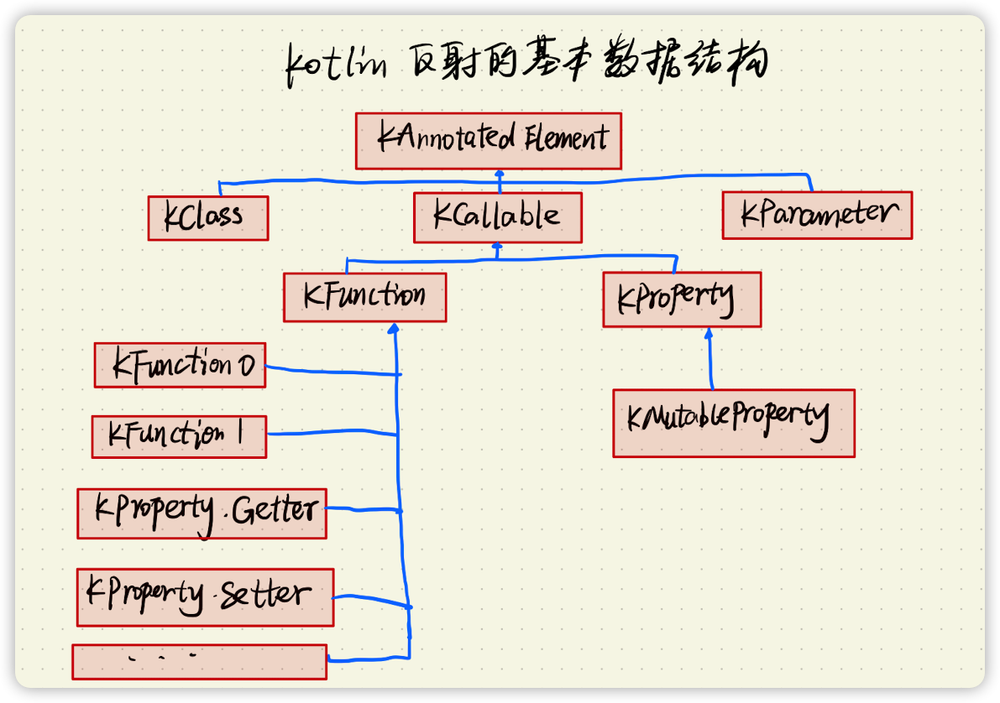

# Kotlin 基础

[Reference - Kotlin 语言中文站 (kotlincn.net)](https://www.kotlincn.net/docs/reference/)

[关于本书 · Kotlin 官方文档 中文版 (kotlincn.net)](https://book.kotlincn.net/)


## 函数

### 代码块函数

* `fun`：表示是一个函数。
* 类型的声明放在变量名的后面，返回值也放在最后。

```kotlin
fun sum1(x: Int, y: Int): Int {
    return x + y
}
```

### 表达式函数

直接以 `=` 的方式连接，形式上像是一个表达式， Kotlin能够自动推导返回类型所有可以省略不写。

```kotlin
// sum1 和 sum2 是等同的
fun sum2(x: Int, y: Int) = x + y
```


## 接口（Interface）

Kotlin 虽然是基于 Java6 ，但是Kotlin 中的接口也支持默认实现（这是Java8时才引入的特性）。不过本质上还是 原来的接口方法，只不过使用了一种巧妙的方式来实现这个特性，可以通过转为java代码来查看具体的实现方式

* **接口参数**：**转为了 get 方法**。所以我们定义的参数并不是一个参数，实际是一个函数，因而我们不能修改值。
* **接口方法**：**自动生成了一个静态内部类，同时定义了一个同名的静态方法作为默认实现。子类实际就是调用的静态内部类的静态方法。**

```kotlin
fun main() {
    val color = Red()
    color.p()
}

interface Color {
    val id: Long
    val color: String
    fun p() {
        println("color: $color")
    }

}

class Red(override val id: Long = UUID.randomUUID().mostSignificantBits) : Color {
    override val color: String
        get() = "red"
}

```

转为Java：

```java
public interface Color {
  	
   long getId();
  
  // 参数 实际为 get方法
   @NotNull
   String getColor();

   void p();

  
  // 默认实现：静态内部类
   @Metadata(
      mv = {1, 5, 1},
      k = 3
   )
   public static final class DefaultImpls {
      public static void p(@NotNull Color $this) {
         String var1 = "color: " + $this.getColor();
         System.out.println(var1);
      }
   }
}


public final class Red implements Color {
  // 构造时直接赋值，直接转为了 fianl 成员变量
   private final long id;

  // 重写 get() 则还是一个函数, 若内部是一个随机生成器则可能会每次返回不同结果。
   @NotNull
   public String getColor() {
      return "red";
   }

   public long getId() {
      return this.id;
   }

   public Red(long id) {
      this.id = id;
   }

   // $FF: synthetic method
   public Red(long var1, int var3, DefaultConstructorMarker var4) {
      if ((var3 & 1) != 0) {
         UUID var10000 = UUID.randomUUID();
         Intrinsics.checkNotNullExpressionValue(var10000, "UUID.randomUUID()");
         var1 = var10000.getMostSignificantBits();
      }

      this(var1);
   }

   public Red() {
      this(0L, 1, (DefaultConstructorMarker)null);
   }

   public void p() {
      Color.DefaultImpls.p(this);
   }
}
```


## 类（Class）

不同于Java的地方:

* Kotlin 中的可见性默认为public，而Java为Default。
* Kotlin 中的类默认不可继承，必须声明 `open`关键字，java则是默认开放继承。
* Kotlin 中的嵌套类默认为 `static`，防止了非静态内部类持有外部引用可能导致的泄漏问题。Java则需要我们自己声明static。

### 普通类

### 抽象类

在普通类前面添加 `abstract` 关键字。同 Java 中的抽象类。

### 数据类（data class）

在普通类前面添加 `data` 关键字即为 数据类。是用于存放数据的类。

* 至少需要一个属性。
* 自动实现了一些函数（不同于默认实现）：`copy()`、`equals()`、`hashcode()`、`toString()`、`componentN()系列函数`。
* 解构

```kotlin
data class AppShortcut(
    val appName: String? = null,
    val packageName: String = ""
)
```

### 枚举类

在普通类前面添加 `enum` 关键字。和 Java 中的枚举使用方法相同。

```kotlin
enum class Month constructor(var cn: String, var en: String, var number: Int) {
    JANUARY("一月", "January", 1),
    FEBRUARY("二月", "February", 2),
    MARCH("三月", "March", 3),
    APRIL("四月", "April", 4),
    MAY("五月", "May", 5),
    JUNE("六月", "June", 6),
    JULY("七月", "July", 7),
    AUGUST("八月", "AUGUST", 8),
    SEPTEMBER("九月", "September", 9),
    OCTOBER("十月", "October", 10),
    NOVEMBER("十一月", "November", 11),
    DECEMBER("十二月", "December", 12),
}
```

### 可见性修饰符

> kotlin没有了包可见的概念，增加了模块内可见的概念。

* 默认是public：所有可见。
* private：私有，仅类内可见。若是顶层函数，则是在同文件下可见。
* protected：类内以及子类可见，所以使用protected是会提示将类设为open，否则和private没有区别。不能用于顶层函数。
  * 注意kotlin的protected不是包内可见的，这点和java不同。
* internal：模块内可见，常用于封装SDK时。

## Sealed 密封类/接口

> 不同包名下无法继承 密封类/接口

### 密封类

在普通类前面添加 `sealed` 关键字，可以说是枚举的增强类型，拥有枚举类的**逻辑完备性**。同时 密封类能拥有多个实例。

`sealed class` 是抽象类，无法被实例化，。（`Sealed types cannot be instantiated`）

> Kotlin 1.0 ：密封类的子类型必须**在密封类内部**。

```kotlin
// A.kt
sealed class A {
  class B(s: String) : A()
}
```

> Kotlin 1.1：取消了必须在密封类内部的约束，但是必须在同一个文件中。

```kotlin
// 都在 A.kt 中
sealed class A 
class B(s: String) : A()
```

> Kotlin 1.5：可以在不同的文件中，仅需要保证文件在同一个模块中且 package 一直。如 A.kt，B.kt 两个文件中。

```kotlin
// A.kt
sealed class A 
// B.kt
class B(s: String) : A()
```

### 密封接口

和 密封类 具有相同的功能。它的优势在于。

* 不希望接口被外部实现时，可以使用密封接口。
* 由于枚举继承了Enum，无法在继承其他类，但是能继承接口，这时就可以通过密封接口，使不同的枚举建立一定的联系。**能帮助密封类、枚举类等类实现多继承和复杂的扩展性**。

```kotlin
sealed interface A {
    class B(s: String) : A
}

// 可以通过 密封接口 将不同的枚举建立 一定的联系。
enum class C : A{
  CC, CCC
}

enum class D : A{
}

fun deal(a : A) {
    when(a) {
        is A.B -> {
            // 
        }
        is C -> {
          // 可以继续根据 枚举C 来处理逻辑
          when(a) {
                C.CC -> {

                }
                C.CCC -> {
                    
                }
            }
        }
        is D -> {

        }
    }
}
```


## object

`object` 关键字在 Kotlin中主要有以下作用：

* **单例模式**：以`object XXClass{}` 的形式出现，标明这个类是单例模式，此时不必写 `class` 关键字。
  * 转为java代码后可以知道，实际是**使用静态常量的方式实现的单例（之前看是静态代码块？）**，利用了类的初始化锁来保证线程安全。
  * 不支持初始化入参。

* **匿名内部类**：以`object: View.OnClickListener{}`的形式出现，等同于 java中的 `new View.OnClickListener() {}`。
  * Kotlin中定义匿名内部类时，支持实现多个接口，例如`object: A(), B, C {}`。

* **伴生对象**：以`companion object {}`形式出现，用于实现java中的静态变量和静态方法、工厂模式等。

```kotlin
object DateUtil {
    init {
        println("inii")
    }
}
```

> 反编译 java

```java
public final class DateUtil {
   @NotNull
   public static final DateUtil INSTANCE = new DateUtil();

   private DateUtil() {
   }

   static {
      System.out.println("inii");
   }
}

```

## Value Class 内联类

可以在构造函数中传入一个参数，且仅能传入一个参数，用于将参数包装成一个类，类似 typealias，区别在于 value class 能保证类型安全且它拥有类的功能。

使用value calss 实际上并不会创建额外的实例，编译后会被自动转为参数对应的类型，所以效率很高。


## 委托

### 委托类

Kotlin 的委托常用于实现委托模式，通过 `by` 关键字实现委托，可以直接委托 **名称和入参相同的函数**，相比于 java 省略了很多模版代码。

通过委托的方式可以实现类似多继承的功能。

```kotlin
// 将 Derived 的接口实现委托给 传入的参数 b，
class Derived(b: Base) : Base by b {
  //...
}
```

### 委托属性

委托属性实际上委托的是属性的  `getter`和`setter` 方法。

### 标准委托

Kotlin 提供了好几种标准委托，

* 直接委托：两个属性之间的直接委托
* 懒加载委托：`by lazy` 
*  观察者委托：`Delegates.observable`
*  映射委托：`by map` 

#### 属性间的直接委托

这个特性适用于版本兼容

```kotlin
class Item {
    var count: Int = 0
    // by 表示 total 的 getter setter 将被委托
  	// ::count 属性引用：表示委托的对象是 count
    var total: Int by ::count
}
```

### 懒加载委托

一般会和委托 `by` 一起使用，也就是常见的 `by lazy` 懒加载。

它有三种加载模式：

* `LazyThreadSafetyMode.SYNCHRONIZED`：互斥锁，内部会加锁保证仅有一个线程执行初始化函数进行初始化，发生并发时其他线程需要等待。
* `LazyThreadSafetyMode.PUBLICATION`：利用的CAS机制，发生并发时只要当前值还没有被初始化就都能执行初始化函数，初始化的值是第一个返回的值。
* `LazyThreadSafetyMode.NONE`：不加锁，所以并发时不保证结果。

它的实现类都是单例模式，值被初始化后就不会再修改。

```kotlin
public interface Lazy<out T> {
	// 实现类 会重写 getValue() 方法
    public val value: T
	// 表示是否以及实例化。
    public fun isInitialized(): Boolean
}
```


### 自定义委托

我们可以使用自定义委托的方式来重新定义变量值的读取和赋值。

* ReadOnlyProperty：用于 val 修饰的变量，可以重写 `getValue()`
* ReadWriteProperty：用于var修饰的变量，可以重写 `setValue()` 和 `getValue()`
* `provideDelegate()` 函数是在提供委托时调用，即最先被调用，此处可以做一些特殊处理，比如根据参数 派发给其他委托。

```kotlin
class Derived(b: Base) : Base by b {
    /**
     *
     */
    override val message: String
        get() = "Derived message"

    var delegate: String by MyDelegate()

    /**
     * 覆盖委托方法
     */
    override fun print() {
        println("Derived print : $delegate")
    }
}

/**
 * 自定义委托
 * val 使用 ReadOnlyProperty 重写 getValue 即可
 * var 使用 ReadWriteProperty 重写 getValue 和 getValue
 * 当然也可以不实现上述接口，直接重新对应函数
 */
class MyDelegate : ReadWriteProperty<Derived, String> {
    private var value = "MyDelegate"
    override fun getValue(thisRef: Derived, property: KProperty<*>): String {
        println("MyDelegate getValue:  ${property.name}")
        return ""
    }

    operator fun provideDelegate(thisRef: Derived, property: KProperty<*>): ReadWriteProperty<Derived, String> {
        // 提供委托时 可以做的一些特殊处理，此处就打印以下日志直接返回自身了
        println("MyDelegate provideDelegate: ${property.name}")
        return this
    }

    override fun setValue(thisRef: Derived, property: KProperty<*>, value: String) {
        println("MyDelegate setValue: ${property.name} >> $value")
        this.value = value
    }
}
```


## 多态和扩展

### 多态

多态是面向对象（OOP）的一个重要特性。大致有以下几种类型的多态：

* 子类型多态（Subtype polymorphism）：子类继承父类, 使用子类型替换超类型实例的行为。
* 参数多态（Parametric polymorphism）：最常见的参数多态就是泛型。
* 特设多态（Ad-hoc polymorphism）：运算符重载、扩展。

### 扩展

Kotlin的的扩展函数，可以为类添加额外的方法、属性, **它其实是一个静态方法**，编译器会将扩展函数转换成对应的静态方法，而扩展函数调用处的代码也会被转换成静态方法的调用，所以不会带来额外的性能消耗。所以扩展函数相当于我们平时写的工具类静态方法，只不过Kotlin 提供了 扩展 这种形式方便我们使用，编译时在进行转换，相当于一种模版。

**所以所有工具类做的事都可以使用扩展来替代**。扩展这功能也有点游戏 mod，浏览器插件的意思，可以将一些非核心功能划分出去实现。

**扩展的使用场景**有：

* 扩展三方类的功能。
* 以前用Java实现的工具类，以及常用的模版代码。
* 保持类的单一性将关注点分离，一些功能单独分离用扩展实现，同时也能降低类的复杂度。

#### 扩展函数

格式：`fun A.method() { }` 。声明方式和普通的函数基本相同，仅是在 函数名前多了 `ClassName` 以及 `.`。

表示给A 添加了 `method()` 方法。

* **AppCompatActivity**：接收者类型（recievier type），通常是类或接口。
* **this**：在函数体内部可以使用 this 获取到具体的 扩展对象实例，并访问实例内部的属性和函数，但是只能访问接收者类的 `public`属性和函数。this 是通过编译器注入的。

```kotlin
// AppCompatActivity 添加了 setupActionBar(..) 函数
fun AppCompatActivity.setupActionBar(
    toolbar: Toolbar,
    action: ActionBar.(toolbar: Toolbar) -> Unit = {}
) {
    // this 就是 AppCompatActivity
    this.setSupportActionBar(toolbar)
    supportActionBar?.run {
        action(toolbar)
    }
}
```

#### 扩展属性

和普通属性写法类似，也是多了一个接收者类型，它的**本质实际是扩展函数**，并且它并不能存储状态。

```kotlin
val ApplicationInfo.isSystemApp: Boolean
    get() = this.flags and ApplicationInfo.FLAG_SYSTEM > 0

// 和以下扩展函数转为 java 后是等同的
//fun ApplicationInfo.isSystemApp(): Boolean {
//    return this.flags and ApplicationInfo.FLAG_SYSTEM > 0
//}
```

#### 扩展的作用域

* **顶层定义扩展**：能被**全局访问**，使用于通用的扩展。
* **类内部定义扩展**：作用域被限制在声明类中，**仅能被声明时所在的类中使用**。对一些特定场景下扩展方法可以通过这个方式进行限制。

> Notes：object 的拓展可以直接使用类名访问，且object 内的拓展的作用域是全局的。

```kotlin
fun main() {
    doExt(todo = {
        println("todo".append(" ext"))
    })
    // 这里调用的是 object 内部的拓展，它的作用域是全局的
    // 若将 object ExtScopeInstance注释则会报错, class内部的拓展仅能在class内访问
    "".append("")
}

fun doExt(todo: ExtScope.() -> Unit) {
    // object 可以直接访问
    ExtScopeInstance.todo()
    // class 需要创建实例访问
    ExtScopeClass().todo()
}

interface ExtScope {
    /**
     * 指定这个 String.doSome的作用域为 ExtScope
     */
    fun String.append(append: String): String
}
object ExtScopeInstance : ExtScope {
    override fun String.append(append: String) = this.let {
        "ExtScopeInstance.append: $it$append"
    }
}

class ExtScopeClass : ExtScope {
    override fun String.append(append: String) = this.let {
        "ExtScopeClass.append: $it$append"
    }
}
```

#### 使用注解约束扩展

通过 `@receiver:ColorInt`  来约束扩展的范围， 这个扩展仅对`@ColorInt` 注解修饰 Int生效。

```kotlin
val @receiver:ColorInt Int.lighterColor
    get() = ColorUtil.lightenColor(this)
```


---

## 类型系统

### Any 和 Any?

Any? 是 Any 的父类型

- Any：非空类型的根类型。例如 String
- Any?：**所有类型的根类型**。例如String?。 

> 需要注意：由于 Any? 才是真正的根类型，所以我们声明范式的时候 默认是 `<T : Any?>`，即默认是可空的。

### Nothing 与 Nothing?

Nothing 是 Nothing? 的子类型

* Nothing：所有类型的子类型。**是最底层的类型，叫做底类型。**
* Nothing?：空类型的子类型。

`throw` 表达式返回的类型就是 Nothing 类型。所以直接 `throw XXException` 时编译器不会报错。

同时当一个表达式的返回值是 Nothing 的时候，就意味着它后面的语句不再会被执行。

### Unit 和 Unit?

类似 Java 的 Void 和 void的结合体，当一个函数不写返回类型时，默认就是返回的 Unit。即返回 Unit 类型时可以直接省略不写。

Unit? 需要明确使用 `return` 表明，它可能返回 null、Unit、Noting。

### 自动装箱和拆箱

在 Kotlin 中所有类型都是对象，所以没有 int、long等原始类型，只有对应的 Int、Long等包装类型。 但是 Kotlin 在编译时会对这些包装类型进行自动推断：

* 若类型为空过则为包装类型。

* 不会为空时将会自动转为原始类型（原始类型占用内存更小）。

需要注意的是，可为空也可能是原始类型，只有被赋值为 `null` 过才会转为Java的包装类。

```kotlin
// a >> Integer，a 被后面修改为空了。
var a:Int? = 1
a = null

// b >> int, 因为在 b 虽然可以为空，但是从未被赋值为空，此时将会是原始类型。
var b:Int? = 2 

// c >> int
val c = 3

```

 

### 范型

范型是对程序的一种抽象，实现逻辑的复用。

* 不同类型能够复用相似的逻辑，从而能写出更加通用化的代码。
* 编译器在编译前会进行类型检查，使用范型能提前发现错误，而不是在运行时才发生 `ClassCastException` 异常。
* 自动类型转换，在运行时获取数据不在需要进行类型的强制转换。
* 更加语义化，在声明时我们便知道具体的类型是什么。

范型格式如下：

```kotlin
interface GeneratorScope<T> {
    suspend fun yield(value: T)
}
// 顶层函数
fun <T> yield(value: T){ }
```

### 类型约束

在定义范型时我们可以添加类型的约束，和继承语法一样，使用 `:`，称为**上界约束**。

```kotlin
open class Fruit(val weight: Double)
// 约束范型T必须为 Fruit 的子类
class FruitPlate<T: Fruit>(val t : T)
```

同时在 Kotlin 中也支持添加多个约束，使用 `where` 关键字实现：

```kotlin
interface Ground
class Watermelon(weight: Double): Fruit(weight), Ground
// 约束 可以切长在地上的水果
fun <T> cut(t:T) where T:Fruit, T : Ground {}
```

### 型变（Variance）

正常情况下， 虽然类型A是类型B的子类型，但是  `Generic<A>` 和 `Generic<B>` 是没有继承关系的，即范型是不变的。为了增强范型的灵活性，就需要解决范型的不变性问题，这时候就用到了型变，分为协变和逆变。

* 协变（out）：父子关系相同，对应 Java的 `<? extends X>` 。适用于泛型作为返回值的时候，对应 `getter()`
* 逆变（in）：父子关系相反，对应 Java的  `<? super X>` 。适用于泛型作为参数的时候，对应 `setter()`

> java 的 `?` 通配符相对应Kotlin中的是 `*`。
>
> 官方文档中对 `*` 的解释：`Function<*, *>` means `Function<in Nothing, out Any?>`.
>

```kotlin
fun main() {
    var dest = arrayOfNulls<Number>(3)
    val src = arrayOf(1.0, 2.0, 3.0)
    // dest: Array<Number>
    // src: Array<Double>
    copyIn(dest, src)
    copyOut(dest, src)
}

// 使用处型变，逆变；
// T 是 Double，<in Double> 表示可以接收 Double的父类。
// Number 是 Double的父类，Array<Number> 是 Array<Double> 的子类
inline fun <reified T> copyIn(dest: Array<in T>, src: Array<T>) {
    src.forEachIndexed { index, t ->
        dest[index] = t
    }
    // T 是 Double
    println("copyIn T: ${T::class.java}")
    // 
    // a: Double
    // 由于in修饰，dest[0]无法读取到正确类型，返回的是 Any?。
    // 一定要使用的话，可以尝试强转
    val a: T = dest[0] as T
    
  	// 此处正常赋值 src[0]是 Double， a也是Double
  	src[0] = a

}

// 协变；
// T 是 Number，<out Number> 表示可以接收 Number 的子类
// Number是Double的父类，Array<Number> 是 Array<Double> 的父类
inline fun <reified T> copyOut(dest: Array<T>, src: Array<out T>) {
    src.forEachIndexed { index, t ->
        dest[index] = t
    }
    // T 是 Number
    println("copyOut T: ${T::class.java}")
    
  	// 此处正常读取, a: Number,dest[0]也是 Number
    val a: T = dest[0]
    
    // out 修饰，无法赋值，只能调用get获取 src中的值
    // 父类Number 无法赋值给 子类Double
    src[0] = a // 这里报错
}

// 运行输出：
copyIn T: class java.lang.Double
copyOut T: class java.lang.Number
```

#### 协变

协变的定义是：假如类型A是类型B的子类型，那么 `Generic<A>` 也是 `Generic<B>` 的子类型，父子关系相同。

* 通过 `out` 关键字来表明泛型类及泛型方法是协变的。对应 Java的 `<? extends X>` 。
* **父子关系相同，支持T的子类型**。范围向外扩展。
* **只能读取**，不能添加（传出 out），泛型类型一般不能作为参数类型（可以使用 `@UnsafeVariance` 注解取消限制），但**适合作为返回值**。

```kotlin
// 声明处型变
public interface List<out E> : Collection<E> {
    public operator fun get(index: Int): E
  	// 此处使用 @UnsafeVariance 注解取消了限制
    override fun contains(element: @UnsafeVariance E): Boolean
    public fun indexOf(element: @UnsafeVariance E): Int
}
```

#### 逆变

假如类型A是类型B的子类型，那么`Generic<B>` 是 `Generic<A>` 的子类型，父子关系相反。

* 使用 `in` 关键字表明泛型参数类型逆变 。对应 Java的 `<? super X>` 。
* **父子关系相反，支持T的父类型**。范围向内收拢。
* 不能读取（传入 in），只能添加，即**泛型类型适合作为参数类型**，但不能作为返回值。

```kotlin

public interface Comparable<in T> {
    public operator fun compareTo(other: T): Int
}
```


### 范型的实现原理

Kotlin 中的范型机制和Java是相同，实现原理都是 **类型擦除** ，在编译后会擦除范型的类型（即无法在运行时获取到对象的具体类型）。这么做的原因是为了向后兼容，因为Java1.5 之前是没有范型的。

类型的自动转换则是通过使用强制类型转换来实现。

> 类型擦除并不是真的将全部的类型信息都擦除了，类型信息还是会存储 在class常量池中

### 如何获取范型类型

* 匿名内部类：匿名内部类在初始化时在Class信息中 保存了父类或父接口的相应信息，其中就包括了泛型的类型。（Gson使用了这种方式）

  ```java
  // 匿名内部类就是子类自身
  Class<?> subclass = getClass()
  // 根据子类来获取父类的类型
  Type superclass = subclass.getGenericSuperclass();
  // 获取类型参数
  ParameterizedType parameterized = (ParameterizedType) superclass;
  // 取第一个
  Type type = parameterized.getActualTypeArguments()[0]
  ```

  

* 内联函数：编译时编译器会将相应函数的字节码插入到调用的地方。需要配合 `reified` 关键字使用，这样在编译时参数类型也会被插入到字节码中。

  ```kotlin
  inline fun <reified T> getType(): Class<T> {
    	// 没有 reified 时，是报错的
      return T::class.java
  }
  ```

  

## 注解

注解是对程序代码的补充，提高代码的灵活性，同时也有解偶的作用。

### 注解的使用

常见的注解有表示废弃的 `@Deprecated`

```kotlin
@Deprecated(message = "废弃描述", ReplaceWith("使用xxx替代"), level = DeprecationLevel.ERROR)
inline fun <reified T> getType(): Class<T> {
    return T::class.java
}
```

### 注解的定义

查看 `Deprecated` 的定义

```kotlin
@Target(CLASS, FUNCTION, PROPERTY, ANNOTATION_CLASS, CONSTRUCTOR, PROPERTY_SETTER, PROPERTY_GETTER, TYPEALIAS)
@MustBeDocumented
public annotation class Deprecated(
    val message: String,
    val replaceWith: ReplaceWith = ReplaceWith(""),
    val level: DeprecationLevel = DeprecationLevel.WARNING
)
```

其中 `@Target` 是**元注解，即它本身是注解的同时，还可以用来修饰其他注解。**

### 元注解

#### @Target 

**指定使用目标：被修饰的注解可以用于什么地方。**

取值有：

```kotlin

public enum class AnnotationTarget {
    // 类、接口、object、注解类
    CLASS,
    // 注解类
    ANNOTATION_CLASS,
    // 泛型参数
    TYPE_PARAMETER,
    // 属性
    PROPERTY,
    // 字段、幕后字段
    FIELD,
    // 局部变量
    LOCAL_VARIABLE,
    // 函数参数
    VALUE_PARAMETER,
    // 构造器
    CONSTRUCTOR,
    // 函数
    FUNCTION,
    // 属性的getter
    PROPERTY_GETTER,
    // 属性的setter
    PROPERTY_SETTER,
    // 类型
    TYPE,
    // 表达式
    EXPRESSION,
    // 文件
    FILE,
    // 类型别名
    TYPEALIAS
}
```

> 精确指定使用目标
>
> 格式为 `@标记:注解`

| 标记     | 作用目标         |      |
| -------- | ---------------- | ---- |
| file     | 文件             |      |
| property | 属性             |      |
| field    | 字段             |      |
| get      | 属性 getter      |      |
| set      | 属性 setter      |      |
| receiver | 扩展的接受者参数 |      |
| param    | 构造函数参数     |      |
| setparam | 函数参数         |      |
| delegate | 委托字段         |      |

```kotlin
object Singleton {
  	// 表示作用于 persion 的 setter方式
    @set:Inject
    lateinit var person: Person
}
```

#### @Retention

**指定了保留位置：被修饰的注解是不是编译后可见、是不是运行时可见。**

取值有：

```kotlin
public enum class AnnotationRetention {
    // 注解只存在于源代码，编译后不可见
    SOURCE,
    // 注解编译后可见，运行时不可见
    BINARY,
    // 编译后可见，运行时可见
    RUNTIME
}
```

#### @Repeatable

允许我们在同一个地方，多次使用相同的被修饰的注解

#### @MustBeDocumented

指定被修饰的注解应该包含在生成的 API 文档中显示，一般用于SDK中。

### 注解处理器


## 面向表达式编程

### 语句（statement）

程序中的赋值、循环控制、打印等操作都称为语句。

### 表达式（expression）

> 可以返回值的语句

表达式可以时一个值、常量、变量、操作符、函数，或它们之间的组合。进行解释和计算后产生另一个值。

在 Kotlin 中大部分代码都是表达式，通过 Unit 类型 做到了所有的函数调用都是表达式。

* if 表达式
* 函数体表达式
* Lambda表达式
* 函数引用表达式
* ......

相比于 语句，表达式更倾向于自成一块，具备更好的隔离性。


## 函数式编程

Kotlin支持了部分函数式特性，函数式编程在狭义上指只能使用纯函数进行编程的语言，不允许有副作用。广义上是指任何以函数为中心进行编程的语言。

主要特性有：

* 函数是头等公民。
* 方便的闭包。
* 递归式构造列表。
* 柯里化的函数。
* 惰性求值。
* 模式匹配。
* 尾递归优化。
* 范型能力，包括高阶类型。
* Typeclass
* 类型推导

### 函数是头等公民

具有以下特点：

* 顶层函数：函数可以独立于类之外。
* 高阶函数：函数也可作为参数或者返回值。
* 函数引用：可以像变量一样使用。

### 纯函数

纯函数的典型特征就是没有副作用（Side Effect），不会修改函数作用域之外的数据。

* 不变性：不应该修改函数作用域之外的数据，通过copy的方式修改。即不会修改传入的参数、外部的状态，不触发IO，也不会调用其他会产生副作用的函数
* 引用透明性：一个表达式可以被等价的指替换。即输入相同，结果一定相同。
* 无状态：内部行为不会改变外部的状态。
* 幂等性：调用1次和调用N次是等价的。即无论被调用多少次，只要参数相同，返回值就一定相同。

### 闭包

`{}`包裹的代码块如果访问了外部环境（即括号外的那些变量），则被称为是闭包。

简单理解的话，闭包可以看成是一个匿名内部类（一个函数 + 环境）。

> 需要注意的是在 Java中的匿名内部类 不能修改 局部变量，只能读取，所以不算完整的闭包，原因是 局部变量是值拷贝，而不是引用。
>
> 不过 Kotlin 中的 匿名内部类是可以修改 局部变量的，算是闭包。Kotlin 是通过 将局部变量包装成一个对象给 匿名内部类使用的，所以能修改。例如
>
> ```kotlin
> // kotlin 原始代码
>     var a = 1
>     object : Runnable {
>         override fun run() {
>             a = 2
>         }
>     }
> // 反编译成java
>       final Ref.IntRef a = new Ref.IntRef();
>       a.element = 1;
>       Runnable var10001 = new Runnable() {
>          public void run() {
>             a.element = 2;
>          }
>       };
> ```

常见的闭包形式有：Lambda 表达式、Java的成员内部类等。

在 foreach、repeat、run 等闭包中 使用 return 需要注意的事项：

* return：等同于 java的 return， 直接中断后续所有。
* `return@forEach`：相当于 java 中的 `continue`，并不会退出循环，而是中断当前，然后执行下一个。
  * 因为这里退出的是当前的闭包：`action: (T) -> Unit` 。

```kotlin
var sum = 0
listOf(1, 2, 3).forEach { // 闭包：访问了 sum
  sum += it
  return@forEach 
}

// 正确的退出方式
// 嵌套一层闭包，别名loop
run loop@{
   listOf(1, 2, 3).forEach { // 闭包：访问了 sum
      sum += it
      // 退出loop
      return@loop
	}
}
```

### 高阶函数

> Kotlin的高阶函数转为 Java 时是以匿名内部类的方式存在的，每次调用都会创建一个对象，可以通过 `inline`	内联函数的方式来进行优化，在编译时会将代码嵌入到每一个的地方。

**高阶函数就是以其他函数作为参数或者返回值的函数**。所以只要存在普通函数的复合使用它就是一个高阶函数。

函数既然可以作为参数和返回值，那么必然是具有类型的，先来看看函数的类型。

#### 函数类型（Function Type）

> 函数类型转为Java后会变为 FunctionN 形式的接口，定义在 [Functions.kt](https://github.com/JetBrains/kotlin/blob/master/libraries/stdlib/jvm/runtime/kotlin/jvm/functions/Functions.kt) 中，从 0 .. 22 共23个接口。会以匿名内部类的形式被使用。当然使用 `inline` 关键字后就是直接复制代码替换了。

函数类型为：`(参数类型1, 参数类型2) -> 返回值类型`

* 使用 `->` 来连接参数类型和返回值类型。左边是参数类型，右边是 返回值类型
* 参数必须使用 `(参数类型1, 参数类型2)` 包裹，多参数用 `,`分 割，没有参数时 `()` 即可,。
* 返回值必须显示声明，无返回值时也需要写 `Unit`。

例如：

```kotlin
// 接收两个 Int类型 参数， 返回一个Int类型结果
(Int, Int) -> Int

// 对应的具体函数可以是
fun sum2(x: Int, y: Int) = x + y
```

函数类型是可以带接收者的，例如 `apply` 源码

```kotlin
// block 是一个带接收者T的函数类型，实际就是一个扩展函数，从而我们可以在 block 函数体内部使用 this 获取到接收者对象实例1。
@kotlin.internal.InlineOnly
public inline fun <T> T.apply(block: T.() -> Unit): T {
    contract {
        callsInPlace(block, InvocationKind.EXACTLY_ONCE)
    }
    block()
    return this
}

// block 函数体内部使用 this 获取到 i 对象。
i.apply {
  println("apply this: $this")
}
```

kotlin的协程 suspend lambda 也是一个高阶函数：

```kotlin
@kotlin.internal.InlineOnly
@SinceKotlin("1.2")
@Suppress("INVISIBLE_MEMBER", "INVISIBLE_REFERENCE")
public inline fun <R> suspend(noinline block: suspend () -> R): suspend () -> R = block


// 使用
suspend {
    MyLog.i(TAG, "In Coroutine 1")
}
```


那么如何将一个已经定义好的函数作为参数或者返回值呢？在Kotlin 中我们可以使用 函数引用的方式。

#### 函数的引用

在Kotlin 中我们使用 **函数引用** 的方式来引用一个函数，类比变量引用，可以通过 `::`符号的方式（同Java8）将引用的函数赋值给函数类型的变量。

```kotlin
fun sum1(x: Int, y: Int): Int {
    return x + y
}

fun main() {
  	// 引用函数赋值给函数类型的变量
    val sum: (Int, Int) -> Int = ::sum1
}

```

还有一些其他用法

```kotlin
class Book(val name: String)

fun main() {
    // 引用构造函数：(String) -> Book
    val newBook = ::Book
  	val book = newBook("book")
    println(book.name)
  	// 成员引用，引用类中成员变量; 格式[类::属性]
    // Book::name  
  	// 相当于 lambda：(Book) -> String
    val bookNames = listOf(Book("book1"), Book("book2"))
        .map(Book::name)
    println(bookNames)
}
```

> 需要区分 Book::name 和 book::name 的区别。
>
> Book::name：相当于 (Book) -> String
>
> book::name：相当于  () -> String

#### 匿名函数

和函数的区别就是省略的函数名，修改上述`map(Book::name)`中的代码来举例。

```kotlin
val bookNames2 = listOf(Book("book1"), Book("book2"))
.map(fun(book: Book): String {
  return book.name
})
```

#### Lambda

Lambda表达式可以理解为简化表达式后的匿名函数，也就是函数的简写，是一种语法糖。

```kotlin
// 完整的 Lambda 表达式
// sum1 是 Lambda变量，=后面的是 Lambda
val sum1: (Int, Int) -> Int = { x: Int, y: Int ->
    x + y
}
// Lambda变量声明了类型，Lambda中的参数可以省略类型
val sum2: (Int, Int) -> Int = { x, y ->
    x + y
}
// Lambda中的参数声明了类型，且返回值支持类型推导，Lambda变量可以省略声明
val sum = { x: Int, y: Int ->
    x + y
}
```

* Lambda表达式必须使用 `{}`包裹，同时 但凡 是 `= {}`的方式，一定是构建了一个Lambda表达式。
* Lambda变量声明了类型，Lambda中的参数可以省略类型
* Lambda中的参数声明了类型，且返回值支持类型推导，Lambda变量可以省略声明
* 单参数隐藏名`it` 指代传入的参数。

上述匿名函数使用Lambda可以简化为：

```kotlin
val bookNames3 = listOf(Book("book1"), Book("book2"))
        .map { // 单参数隐藏名：it； 柯里化风格：{}放到最外面；类型推导；
            it.name
        }
```

> SAM（Single Abstract Method）转换 
>
> * 必须是接口，抽象类不行；
>
> * 该接口有且仅有一个抽象的方法，抽象方法个数必须是 1，默认实现的方法可以有多个


## 元编程

元编程就是操作元数据的编程。程序即数据(反射获取类型信息)，数据即程序(代码生成)。

* 元数据：述数据的数据
* 元编程：操作元数据的编程。程序操作程序
* 元语言：描述程序的数据结构, 编写元程序的语言。

常见的元编程技术有：

* 运行时通过API暴露程序信息：例如反射。
* 动态执行代码：多见于脚本语言，JavaScript eval.动态将文本作为代码执行。
* 通过外部程序实现目的：编译器，解语法糖(desuger)。

### 反射（自反）

> 像用 Kotlin 描述 Kotlin 自身信息的行为就是所谓的反射或自反。

指元语言和要描述的语言是同一种语言的特性，即一门语言同时也是自身的元语言的能力称为反射。

我们可以通过 反射 获取程序的状态，并修改。极大的提升了程序的灵活性

Kotlin 中的反射在单独的库中，里面提供了许多扩展函数和封装类型，帮助我们使用反射：

```groovy
implementation "org.jetbrains.kotlin:kotlin-reflect"
```




#### 类型信息（KClass）

> 对应 Java 中的 Class。

可以通过 `obj::class` 的反射方式获取 obj 的类型信息，称为 类引用，返回类型是 `KClass`。

```kotlin
fun printClass(obj: Any) {
    println("class is ${obj::class.simpleName}")
}
```

KClass包含的成员有：

| 成员变量      | 说明                                               | 类型                       |
| ------------- | -------------------------------------------------- | -------------------------- |
| simpleName    | 类的名称，对于匿名内部类，则为 null                | `String?`                  |
| qualifiedName | 完整的类名                                         | `String`                   |
| members       | 所有成员属性和方法                                 | `Collection<KCallable<*>>` |
| constructors  | 类的所有构造函数                                   | `Collection<KFunction<T>>` |
| nestedClasses | 类的所有嵌套类                                     | `Collection<KClass<*>>`    |
| visibility    | 类的可见性：PUBLIC、PROTECTED、INTERNAL、PRIVATE； | `KVisibility?`             |
| isFinal       | 是不是 final                                       | `Boolean`                  |
| isOpen        | 是不是 open                                        | `Boolean`                  |
| isAbstract    | 是不是 抽象的                                      | `Boolean`                  |
| isSealed      | 是不是 密封的                                      | `Boolean`                  |
| isData        | 是不是 数据类                                      | `Boolean`                  |
| isInner       | 是不是 内部类                                      | `Boolean`                  |
| isCompanion   | 是不是 伴生对象                                    | `Boolean`                  |
| isFun         | 是不是 函数式接口                                  | `Boolean`                  |
| isValue       | 是不是 Value Class                                 | `Boolean`                  |

#### 可调用元素（KCallable）

Kotlin 中所有可调用元素都是 `KCallable`。比如 函数、属性。

| 成员变量       | 说明                                                     | 类型                   |
| -------------- | -------------------------------------------------------- | ---------------------- |
| name           | 属性和函数的名称                                         |                        |
| parameters     | 调用这个元素所需要的的所有参数。第一个参数一般是对象自身 | `List<KParameter>`     |
| returnType     | 返回值类型。需要调用 `KType.classifier` 获取到具体的类型 | `KType`                |
| typeParameters | 所有的类型参数 (比如泛型)                                | `List<KTypeParameter>` |
| call()         | 真正的执行方法。例如 `setter` 、`getter`                 | 是一个范型             |
| visibility     | 可见性                                                   | `KVisibility?`         |
| isSuspend      | 是不是挂起函数                                           | `Boolean`              |

#### 成员属性（KProperty）

继承自`KCallable` ，是一个可调用元素，

```kotlin
fun printMembers(obj: Any) {
    // memberProperties 是扩展函数，在反射库中
    obj::class.memberProperties.forEach {
        // 此处为 KProperty1
        // 调用 it.name 获取属性名
        // 调用 it.getter.call(obj) 获取属性值
        println("Property ${it.name} = ${it.getter.call(obj)}")
        if (it.name == "name"
            && it is KMutableProperty1 // 是否 var
            && it.getter.returnType.classifier == String::class // 属性类型 是否为String
            && it.setter.parameters.size == 2 // 一个是对象，一个是需要修改的值
        ) {
            // 调用 it.setter.call(obj) 修改属性值
            it.setter.call(obj, "modified")
            println("Property ${it.name} = ${it.getter.call(obj)}")
        }
    }
}
```

#### 


## 其他

### as 和 as?

as 用于进行类型的强制转换，转换失败则抛出 ClassCastException。

as? 则是 转换失败时 返回 null。


### 尾递归（tailrec）

对于递归函数可以使用 `tailrec` 关键字进行尾递归优化。

```kotlin
tailrec fun loop(i: Int, j: Int): Int {
    return if(i > 10) i + j else loop(i + 1, j + i)
}
```


### expect 和 actual 修饰词的作用

常出现在 kotlin sdk 的源码中，是用来实现跨平台的。

expect 和 actual 是一一对应的，他们同名。

* expect（接口）：期望调用的类、成员变量或方法。

* actual（实现）： 实际调用的类、成员变量或方法。

> IDEA 代码跳转的是 `kotlin-stdlib-comom:x.xx.xx` 下，若是跨平台的函数，它对应的具体实现在 `kotlin-stdlib:x.xx.xx`下。（具体的平台名字可能有差异）
>
> 一般在IDEA中直接搜索 `xxxJvm.kt` 对应的 `xxxJvm.kt`文件即 是源码实现。
>
> 如 `class SafeContinuation` ，那么就搜索 `SafeContinuationJvm.kt`

### 编程范式（Programming Paradigm）

编程范式是一类典型的编程风格，常见的编程范式主要有以下几种：

* 声明式
  * 函数式编程（Functional Programming）
  * 逻辑式
* 命令式
  * 面向对象：Java
  * 面向过程：C

### inline、noinline、crossinline

* inline：修饰的函数、函数参数内联。和 lambda 配合使用时，会出现inline 之后的代码也被跳过。一般需要使用`return@foreach`这种方式表示退出lambda。

* noinline: 修饰的函数参数不内联。

* crossinline：修饰的参数函数依然会内联，但是会限制 lambda表达式不能直接return。

  

