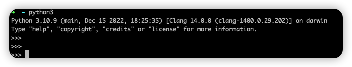
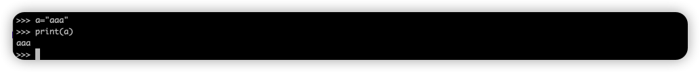

# Python学习笔记

## 注意点

* Python 默认编码为 ASCII码。通过在文件开头声明编码 ``# coding=UTF-8``。

* Python3.X 默认编码为 UTF-8。
* python根据缩进来判断代码行之间的关系，需要注意缩进。


## pythod安装

[Python配置](./Python配置.md)

## 命令中执行python

执行以下命令进入python

```shell
python
# python3
python3
```



尝试执行python




## 数据类型

### 字符串

```python
# coding=UTF-8

# 定义 字符串 变量 message
message = "hello Python world" + "!"
# 输出
print(message)
print(message.title())
print(message.upper())
print(message.lower())

# 删除末尾空白：rstrip
language = "python "
print(language.rstrip() + "。")
print(language + "。")
# 并没有修改原值，需要重新赋值
language = language.rstrip()
print(language + "。")

# 字符串多行写法，输出还是单行
language = "python"\
    "," + "java," + \
    "c++"
print(language)

print(language)

# 多行字符串，且保留内部格式
lines = '''
第一行
第二行
第三行
'''
print(lines)
```

### 数字

* 数字和字符串拼接时需要使用 `str()` 进行类型转换，否则会触发 `TypeError` 异常。

```python
# coding=UTF-8
num = 3 + 0.1
print(num)

# string 转 int
num = 3 + int('21')
print(num)

# 数字和字符串 拼接时需要使用 `str()` 进行类型转换，否则会触发 `TypeError` 异常
print("num = " + str(num)) 
```

### 列表

使用 `[]` ，可修改

```python
#!/usr/bin/python3

# 创建
digits = list(range(1, 5))
print(digits)

# 可以是不同类型
names = ("胡桃", 1, 2)
print(names)
# 
names = ["胡桃", '甘雨', '宵宫']
print(str(names) + " 长度: " + str(len(names)))

# 读取
print("------- 读取 -------")
print("0 访问最后一个：" + names[0])
# 访问最后一个，列表为空时会报错
print("-1 访问最后一个：" + names[-1])
# 开始位置：index，0可省略
# 结束位置：index + 1
print("前2个: " + str(names[0:2]))
print("第二个到末尾" + str(names[1:]))
# -2 表示后2个
print("后2个" + str(names[-2:]))

# 复制
print("------- 复制 -------")
names2 = names[:]
names2.append("我是复制到")
print(names2)
print(names)

# 修改
print("------- 修改-------")
names[0] = "神里绫华"
print(names)

# 添加
print("------- 添加 append -------")
names.append("胡桃")
print(names)

# 插入
print("------- 插入 insert -------")
names.insert(1, "丘丘人")
print(names)

# 删除
print("------- 删除 del, remove -------")
del names[1]
print(names)
names.append("蕈兽")
print(names)
names.remove("蕈兽")
print(names)

# pop
print("------- pop -------")
sl = names.pop()
print(sl)
print(names)

# 排序
print("------- 临时排序 sorted -------")
print(sorted(names))
print(names)
print("------- 永久排序 sort -------")
# 内部值被修改
names.sort()
print(names)

# 反转列表
print("------- 反转列表 reverse -------")
# 修改了内部值
names.reverse()
print(names)

# 遍历
print("------- 遍历 for in : -------")
for name in names:
    print(name)

print("------- 遍历 for in range: -------")
# 左闭右开 区间：输出 1,2,3,4
for name in range(1, 5):
    print(name)


# 计算
print("------- 列表计算 min, max, sum: -------")
print(digits)
print("min: " + str(min(digits)))
print("max: " + str(max(digits)))
print("sum: " + str(sum(digits)))

# 列表解析
print("------- 列表解析 [表达式 for循环提供值 ] -------")
# **2 平方
squares = [value**2 for value in range(1, 11)]
print(squares)


# 元组
names = ("胡桃", '甘雨', '宵宫')
print(names)
# names[0] = "丘丘人" 不能修改
names = ('宵宫')  # 变量可以重新赋值
print(names)
```

### 元组

使用 `()`, 操作方式和列表相同，只不过不能修改内部的值（变量还是可以赋值修改的）。

```python
#!/usr/bin/python3
names = ("胡桃", '甘雨', '宵宫')
print(names)
# names[0] = "丘丘人" 不能修改
names = ('宵宫') # 变量可以重新赋值
print(names)
```

### 字典

使用 `{}` 包裹

```python
#!/usr/bin/python3

hutao = {'name': "胡桃", 'weapon': '长枪'}

```

## 表达式

### and,or,in

```python
#!/usr/bin/python3
names = ["胡桃", '甘雨', '宵宫']

# in 是否在列表内
print("胡桃" in names)

# and 并且
print("胡桃" in names and "甘雨" in names)

# or 或
print("胡桃" in names or "丘丘人" in names)
```

### for

> 注意结尾有 `:`

```python
#!/usr/bin/python3
names = ["胡桃", '甘雨', '宵宫']
# 遍历
print("------- 遍历 for in : -------")
for name in names:
    print(name)

print("------- 遍历 for in range: -------")
# 左闭右开 区间：输出 1,2,3,4
for name in range(1, 5):
    print(name)

```

### if-elif-else

```python
names = []
# if-elif-else
if names:
    print("有数据")
else:
    print("无数据，添加数据")
    names = ["胡桃", '甘雨', '宵宫']


if "丘丘人" in names:
    print("丘丘人")
elif "胡桃" in names:
    print("胡桃")
else:
    print("无")
```

### while

```python
count = 3
while count > 0:
    print(count)
    count -= 1


while True: 
    print(count) 
    count += 1
    if count == 2:
        count += 2
        continue
    if count > 3:
        break
```

### pass

什么都不做，直接跳过。有占位符的效果。

```python
def a():
    pass
```


## 用户输入

`input()`

```python
#!/usr/bin/python3

message = input("Please enter you name: ")
print("Hello " + message + "!")
```


## 函数

* 定义函数：使用 `def` 关键字 。
* 形参可以有默认值。
* 返回值：`return` 关键字。
* 任意数量参数：`*param` 。
* 任意数量键值对参数：`**kv` 。

```python
#!/usr/bin/python3
# 定义函数
def say(message="world"):
    """这是函数的注释说明"""
    print("hello " + message)

# 使用默认值
say()
# 位置传参
say("java world")
# 命名参数
say(message="python world")

# -------
# 返回值
def get_role_name():
    return "胡桃"

print(get_role_name())

# -------
# 允许传递任意实参
def print_more(*messages):
    buffer = ""
    for msg in messages:
        buffer += msg
        buffer += " "
    print(buffer)

print_more("python", "world")

# -------
# 任意数量的 键值对 数据
def build_profile(**kv):
    print(kv)
    profile = {}
    for key, value in kv.items():
        profile[key] = value

    return profile

print(build_profile(name="胡桃", rarity=5))

```

## 类

### 简单使用

`class` 关键字。

```python
#!/usr/bin/python3

class Role():
    """角色"""

    # 表示构造函数，固定命名；形参self必须位于首位，它是指向实例本身的引用，会自动传递。
    def __init__(self, name, weapon, rarity, vision) -> None:
        """初始化"""
        self.name = name
        self.weapon = weapon
        self.rarity = rarity
        self.vision = vision
        # 属性添加默认值
        self.level = 1

    # 定义的函数也需要 self参数
    def to_str(self):
        """输出类信息"""
        return "Role{"\
            "name=" + self.name + \
            ", weapon=" + self.weapon + \
            ", rarity=" + str(self.rarity) + \
            ", vision=" + self.vision + \
            ", level=" + str(self.level) + \
            "}"

# 创建实例
hutao = Role(name="胡桃", weapon="长枪", rarity=5, vision="火")
# 访问属性
print(hutao.name)
# 访问函数
print(hutao.to_str())

```

### 继承

```python
class A():

    def __init__(self, a):
        self.a = a

    def p(self):
        print("a=" + self.a)


# B 继承 A
class B(A):

    def __init__(self, a, b):
        # 首先需要初始化父类
        super().__init__(a)
        self.b = b

    # 重写
    def p(self):
        print("a=" + self.a + "; b=" + self.b)


a = A("a")
b = B("a", "b")

a.p()
b.p()

```

---

## 异常

```python
#!/usr/bin/python3

filename = "a.txt"
# filename = "./res/test.txt"

try:
    with open(filename) as f_obj:
        contents = f_obj.read()
except FileNotFoundError:
    # 发生异常
    print("file not found")
else:
    # 正常流程到后续
    print(contents)

```


---

## 模块导入

每一个`.py` 文件都是一个模块。

* 导入模块： `import 模块`。通过 `模块.func()`的方式访问函数
* 导入模块中部分函数：`from 模块 import func1, func2`。直接通过 `func()`即可访问函数
* 导入模块中的类：`from 模块 import Class1, Class1`。直接通过 `Class`即可访问函数
* 导入模块中所有函数、类等（不推荐）：`from 模块 import *`。直接通过 `func()`即可访问函数
* 别名：`as` 关键字

> hello.py

```python
#!/usr/bin/python3
def say(message):
    print("Hello " + message)
```

### 导入整个模块

> test_import.py
>
> 可以在程序中通过 `import` 关键字 导入整个模块，来使用模块内的代码。

```python
#!/usr/bin/python3
import hello as h

# 模块名.函数
h.say("python")
```

### 导入部分函数

> from 模块 import func1, func2

```python
#!/usr/bin/python3
from hello import say
from hello import *

# 模块名.函数
say("python")
```

### 导入类

>from 模块 import Class1, Class2

```python
from role import Role
hutao = Role(name="胡桃", weapon="长枪", rarity=5, vision="火")
print(hutao.to_str())
```


## 测试用例

* 导入 `unittest` 模块
* 测试类需要继承 `TestCase`
* `setUp` 函数可以初始化数据
* `main()` 执行测试。

```python
#!/usr/bin/python3

import unittest
from role import Role

# 需要继承 TestCase
class TestRole(unittest.TestCase):
    """测试用例"""

    def setUp(self) -> None:
        """创建所有测试用例 共用的数据"""
        self.role = Role(name="胡桃", weapon="长枪", rarity=5, vision="火")

    def test_get_name(self):
        """单元测试"""
        hutao = self.role
        # 断言
        self.assertEqual(hutao.name, hutao.get_name())

# 执行测试
unittest.main()

```


## 文件操作

* `r` : 只读模式，默认
* `w` : 写入模式
* `r+` : 读写模式
* `a` : 附加模式，往末尾写入

### 文件读取

```python
#!/usr/bin/python3
filename = r'./res/test.txt'

# with 不再需要访问文件后会将其关闭。
# 读取全部
with open(filename) as file_object:
    contents = file_object.read()
    print(contents)

print("-------------------------")

# 读取到列表中
with open(filename) as file_object:
    lines = file_object.readlines()

for line in lines:
    print(line.strip())

print("-------------------------")

# 逐行读取
with open(filename) as file_object:
    for line in file_object:
        # 逐行读取时，末尾会有一个换行符。通过 rstrip 去除。
        print(line.rstrip())

```

### 文件写入

```python
#!/usr/bin/python3
# 文件写入
write_filename = "./res/write.txt"

# r: 只读模式，默认
# w: 写入模式
# r+: 读写模式
# a: 附加模式，往末尾写入
with open(write_filename, "w") as file_object:
    file_object.write("Hello Python")
```


## pip：包管理工具

pip是python 包管理工具。python一般自带了pip，它负责包的查找、下载、安装、更新、卸载等功能。

> 存在多个版本的python时，pip 一般关联了 python2.7
>
> pip3 一般关联了 python3。
>
> pip3 可以等价替换 pip

### 安装pip

```shell
sudo python get-pip.py
# 3
sudo python3 get-pip.py
```

### 使用pip

```shell
pip3 --version

# 升级pip
pip3 install -U pip

# 已安装的包
pip3 list
pip3 freeze 

# 查看包信息； -f 详情
pip3 show {packageName}
pip3 show -f {packageName}

```

### 镜像

```shell
# 清华镜像
python -m pip install -i https://pypi.tuna.tsinghua.edu.cn/simple --upgrade pip

# 豆瓣镜像
pip install -i http://pypi.douban.com/simple --trusted-host  pypi.douban.com -r requirements.txt
```


