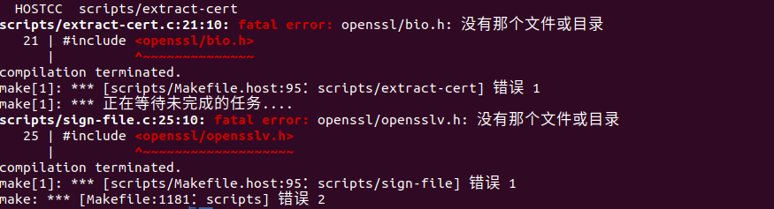

# Linux内核学习笔记

[Linux内核之旅 (kerneltravel.net)](http://www.kerneltravel.net/)

[Linux基础 — Linux Tools Quick Tutorial (linuxtools-rst.readthedocs.io)](https://linuxtools-rst.readthedocs.io/zh_CN/latest/base/index.html)

## 获取内核源码

### 源码下载

[The Linux Kernel Archives](https://www.kernel.org/)

```shell
git clone git://git.kernel.org/pub/scm/linux/kernel/git/torvalds/linux.git
```

### 获取补丁

```
patch -p1 < ../patch-x.y.z
```

## 内核源码树

### 根目录描述

| 目录          | 描述                                |
| ------------- | ----------------------------------- |
| arch          | 特定体系结构的源码                  |
| block         | 块设备I/O层                         |
| crypto        | 加密API                             |
| Documentation | 内核源码文档                        |
| drivers       | 设备驱动程序                        |
| firmware      | 使用某些驱动程序而需要的设备固件    |
| fs            | VFS和各种文件系统                   |
| include       | 内核头文件                          |
| init          | 内核引导和初始化                    |
| ipc           | 进程间通信代码                      |
| kernel        | 像调度程序这样的核心子系统          |
| lib           | 通用内核函数                        |
| mm            | 内存管理子系统的VM                  |
| net           | 网络子系统                          |
| samples       | 示例，示例代码                      |
| scripts       | 编译内核所用的脚本                  |
| security      | Linux安全模块                       |
| sound         | 语音子系统                          |
| usr           | 早期用户空间代码（所谓的initramfs） |
| tools         | 在Linux开发中有用的工具             |
| virt          | 虚拟化基础结构                      |

### 文件描述

| 文件名      | 描述                                     |
| ----------- | ---------------------------------------- |
| COPYING     | 内核许可证（GUN GPL v2）                 |
| CREDITS     | 开发了很多内核代码的开发者列表           |
| MAINTAINERS | 维护者列表，负责维护内核子系统和驱动程序 |
| Makefile    | 基本内核的Makefile                       |

---

## 内核编译

首先需要配置一下基础的编译环境，根据执行时的实际报错提示安装:

```
sudo apt install gcc flex bison libssl-dev pkg-config
```

### 1. 配置内核

配置选项既可以用以决定哪些文件编译进内核，也可以通过预处理命令处理代码。

配置项可以是二选一或者三选一驱动程序一般都用三选一的配置项。

| 配置项 | 二选一 | 三选一                   |
| ------ | ------ | ------------------------ |
| yes    | 开启   | 把代码编译进主内核映像中 |
| no     | 不开启 | 不开启                   |
| module | ----   | 选定，已模块的形式生成   |

配置选项也可以是字符串或整数，这些选项不控制编译过程，而只是指定内核源码可以访问的值，一般以预处理宏的形式表示。例如指定静态分配数组的大小。

- 基于字符界面的命令行工具，逐一便利所有配置项，并选择yes、no或module。

  ```
  make config
  ```

- 基于ncurse库编制的图像节目工具。

  ```
  make menuconfig
  ```

- 基于gtk+的图形工具。

  ```
  make gconfig
  ```

- 基于默认配置创建一个配置：

  ```
  make defconfig
  ```


> 拷贝现有配置
>
> ```
> cp /boot/config-$(uname -r) .config
> ```


### 2. 验证和更新配置

```
make mrproper
make clean
make oldconfig
```

### 3. 执行编译

```shell
make -j4
```

#### 踩坑记录



缺少openssl: ``fatal error: openssl/opensslv.h: xxxxxxxxxxxxxxxxx``。

```
sudo apt install libssl-dev
```

同理: ``fatal error: libelf.h: xxxxxxxxxxxxxxx``

```
sudo apt install libelf-dev
```

> 可以通过 ``apt search openssl``这种方式查找对应依赖。


