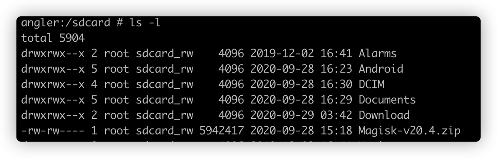

# Linux常用命令

```

# 打开当前目录, 类似mac open
xdg-open .

```

## 文件管理


| 操作命令 | 说明         |      |
| -------- | ------------ | ---- |
| du       | 查看文件大小 |      |
| df       | 查询剩余空间 |      |
| mount    | 分区挂载     |      |
| ls       | 列出文件列表 |      |
| touch    | 创建文件     |      |

### touch（创建文件）

```shell
# 创建一个文件,已存在时为修改文件时间
touch aa.txt
# 创建2个文件
touch aa.txt bb.txt
# 批量创建
touch aa{0001..1000}.txt
```

### 文件重命名

将所有后缀为.log的文件修改改.txt

```shell
rename 's/\.log/\.txt/' *
```


### du: 查看文件大小

```shell
## 控制显示单位
du -m
du -hs /sdcard/
du -ms /sdcard/
du -ks /sdcard/
du -gs /sdcard/

## 控制层级: 一级目录
du -h -d1
```

### mount: 分区挂载

```
mount -o remount, rw /
```

### ls -l




| 文件属性                                                     |      | 拥有者 | 拥有者所在的组 | 文件所占用的空间(以字节为单位) | 最近修改时间     | README.md |
| ------------------------------------------------------------ | ---- | ------ | -------------- | ------------------------------ | ---------------- | --------- |
| -rw-rw----                                                   | 1    | root   | scared_rw      | 5942417                        | 2020-09-28 15:18 | README.md |
| 第一个字符表示文件类型<br />'-': 表示普通文件<br />'d': 表示目录<br />'i':链接文件<br />'b':块设备文件<br />'c':字符设备文件<br />'p':命令管道<br />'s':sock文件 |      |        |                |                                |                  |           |
| r表是读 (Read) 、w表示写 (Write) 、x表示执行 (eXecute)       |      |        |                |                                |                  |           |


## apt: 软件包管理

```bash
sudo apt-get upgrade
## git 
sudo apt-get install git
## curl
sudo apt-get install curl
## python
sudo apt-get install python
```


## ps: 进程查询

查询所有进程

```
ps -A
```

查询指定pid的进程信息

```
ps -p pid
```

查询根据指定文本查询

```shell
ps | grep packageName
```


## 网络相关

> 若指令执行报错，根据提示安装net-tools即可

```shell
sudo apt install net-tools
```

### 查询本机ip

```shell
ifconfig -a
```

### netstat: 监控TCP/IP网络

> 用于显示实际的网络连接、路由表、网络接口设备的状态信息

显示网络状态

```shell
netstat -a
```

xxxxxxxx

```bash
netstat -anp |grep 80
lsof -i:80
//查看当前所有tcp端口·
netstat -ntlp   
netstat -ntulp |grep 80   //查看所有80端口使用情况·
netstat -an | grep 3306   //查看所有3306端口使用情况·
```

### dig:用于查询DNS

Dig是一个在类Unix命令行模式下查询DNS包括NS记录，A记录，MX记录等相关信息的工具
```bash
dig www.baidu.com
dig @114.114.114.114 www.baidu.com
dig baidu.com A +noall +answer
```

```bash
; <<>> DiG 9.10.6 <<>> www.baidu.com
;; global options: +cmd
;; Got answer:
;; ->>HEADER<<- opcode: QUERY, status: NOERROR, id: 25392
;; flags: qr rd ra; QUERY: 1, ANSWER: 3, AUTHORITY: 5, ADDITIONAL: 6

;; OPT PSEUDOSECTION:
; EDNS: version: 0, flags:; udp: 4096
;; QUESTION SECTION:
;www.baidu.com.			IN	A

;; ANSWER SECTION:
www.baidu.com.		679	IN	CNAME	www.a.shifen.com.
www.a.shifen.com.	3	IN	A	112.80.248.76
www.a.shifen.com.	3	IN	A	112.80.248.75

;; AUTHORITY SECTION:
a.shifen.com.		903	IN	NS	ns2.a.shifen.com.
a.shifen.com.		903	IN	NS	ns4.a.shifen.com.
a.shifen.com.		903	IN	NS	ns5.a.shifen.com.
a.shifen.com.		903	IN	NS	ns1.a.shifen.com.
a.shifen.com.		903	IN	NS	ns3.a.shifen.com.

;; ADDITIONAL SECTION:
ns3.a.shifen.com.	903	IN	A	112.80.255.253
ns4.a.shifen.com.	903	IN	A	14.215.177.229
ns5.a.shifen.com.	903	IN	A	180.76.76.95
ns1.a.shifen.com.	903	IN	A	61.135.165.224
ns2.a.shifen.com.	903	IN	A	220.181.33.32

;; Query time: 3 msec
;; SERVER: 192.168.5.50#53(192.168.5.50)
;; WHEN: Mon Apr 27 10:26:25 CST 2020
;; MSG SIZE  rcvd: 271
```


## 12345

```bash
ifconfig en0
查看内核版本 ``cat /proc/version``
which date
alias freak="free -h"
type date
whatis ls 简单介绍ls
man ls 帮助信息ls
info ls 更详细的帮助信息
```