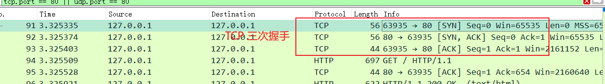
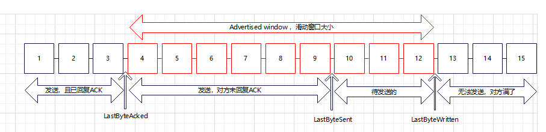
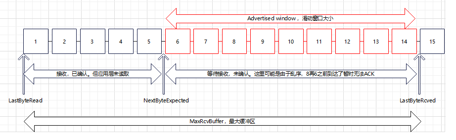

# TCP

## 连接和状态

连接和断开分别需要经过**三次握手**和**四次挥手**。

### 三次握手（建立连接）

> 三次握手的目的：两端互相确认通讯通道的可靠性，并且交换TCP包起始序号ID。

客户端通过 IP地址 和 服务端建立TCP 连接（若是域名会先进行NDS解析）。最开始的 三个数据包 对应 TCP的**三次握手** 。

* **第一次握手 - 请求（SYN）**：客户端发送请求`（SYN; seq=x）`包到服务端。客户端进入 SYN_SEND 状态。
  * seq取值：受时间影响。第一个表示客户端的起始序号。后续消息依次 + 1。

* **第二次握手 - 请求之应答（SYN/ACK）**：服务端接收客户端的请求`(SYN; seq=x)`包后，对seq进行校验，然后向客户端发出应答消息`(SYN; seq=y) / (ACK;ack=x+1)`包。服务端进入 SYN_RECV 状态。
  * ack取值：请求包中的序号 + 1。
  * seq取值：受时间影响。表示服务端的起始序号。后续消息依次 + 1。

* **第三次握手 -应答之应答（ACK）**：客户端接收到服务端的应答 `(SYN; seq=y) / (ACK;ack=x+1)`后，对seq进行校验, 并发出应答消息 ` (ACK; ack=y+1)` 。客户端 进入ESTABLISHED状态，服务端收到这个消息后也会进入 ESTABLISHED 状态

为什么要三次？

第一次握手：客户端向服务端发送请求，这样**服务端收到消息后就知道自己能接收客户端消息**，但是客户端并不清楚这个消息是否正常达到了服务端。

第二次握手：服务端向客户端发送应答消息，这样**客户端收到消息后就知道自己既能发送消息到服务端，还能接收服务端消息**。不过此时服务端还不知道自己能否将消息正常发送到客户端。

第三次握手：客户端向服务端发送应答消息的应答，这样**服务端收到消息后就知道自己能正常向客户端发送消息**。

这样三次握手过后，**两端之间就互相确认了能正常收发消息**。

> 为什么是三次：
>
> 网络协议中经典的红蓝军问题，表明在不可信的通道上无法涉及出完全可靠的通讯协议，因为最后一次报文的发送，发送方用于无法知道接收方是否收到。所以第三次之后发送的第四次、第五次握手等都是无效的操作，导致陷入循环。

### 四次挥手（断开连接）

* **第一次挥手**（FIN; seq=x）：**客户端单方面发送断开请求（FIN; seq=x）**，客户端进入 FIN_WAIT_1。
  * 此时客户端一般会等待服务端的回复，若超时就直接单方面断开了。
* **第二次挥手**（ACK; ack=x+1）半关闭状态：服务端收到客户都的断开请求（FIN; seq=x）后，**回复一个应答（ACK; ack=x+1）**。服务端进入CLOSED_WATI，客户端收到后进入  FIN_WAIT_2。
  * 服务端可能还是消息需要处理发送，所以并不会直接关闭，而是处理完毕后进行第三次挥手。
  * 客户端收到应答后会进入等待，等待服务端处理完成，此时客户端还能接收消息。
* **第三次挥手**（FIN;seq=y）/ (ACK;ack=p+1)：**服务端向客户都发送断开请求（FIN;seq=y）/ (ACK;ack=p+1)**，服务端进入 LAST_ACK。
  * 此时服务端处理完了消息，没有消息想发送给客户端了。
* **第四次挥手**（ACK;ack=y+1）：**客户端收到服务端的断开请求后，会发送一个应答（ACK;ack=y+1）**，同时客户端收到后进入 TIME_WAIT 状态。
  * 这里一般会等待 2个MSL，因为服务端的某些数据包可能还在路上，或者服务端没有收到这个应答消息，进行了消息重发。等待2MSL 可以保证在路上的消息包都已经死了，防止这个消息出现在下次连接中，同时也能回复一下重发消息。
  * 若超过2MSL，服务端还在重发，此时客户端会发送一个 RST 消息，表示已经断开了。

> 为什么四次：
>
> 和三次握手区别在于 2，3两步，这里并不是收到客户端的断开请求，服务端就直接也发起断开请求，主要是由于客户端发起断开时，服务端可能还在待处理的消息，所以服务端需要处理完后才能发起断开，无法直接发起断开，因此多了一步。

## 滑动窗口

TCP 在建立连接的时候会商定起始ID，然后按照ID进行发包。为了保证不丢包，对于所有发送的包都需要应答，可以累计应答，即一次应答某个ID前的所有消息。

流量控制：就是根据接收方消费能力来动态调整窗口大小。

* 当接收端一直不处理消息，那么接收端可以通过确认信息来减小窗口的大小，从而控制发送方的发送行为，直到不发送。

拥塞控制：

### 发送端

| 下标边界                          |                                                           |
| --------------------------------- | --------------------------------------------------------- |
| LastByteAcked                     | 已收到的**连续ACK**的位置边界。                           |
| LastByteSent                      | 正在发送的位置边界。                                      |
| LastByteWritten                   | 应用端可写入的位置边界。                                  |
| Advertised window （窗口的大小 ） | 包括：发送了但未收到ACK的 + 没有发送等待发送的 这两部分。 |

按照包ID进行排序：

1. 0 ~ LastByteAcked：发送了并且已回复ACK的。
2. LastByteAcked ~ LastByteSent：发送了但未收到ACK的。
3. 没有发送，等待发送的。
4. 没有发送，暂不发送的。一般是接收方窗口满了，无法继续接收。

LastByteSent ~ LastByteWritten：包含未发送出去的消息。

### 接收端

| 下标边界                          |                                              |
| --------------------------------- | -------------------------------------------- |
| LastByteRead                      | TCP缓冲区中已被应用层读取到的位置。          |
| NextByteExpected                  | 收到的**连续包**的最后面位置                 |
| LastByteRcved                     | 收到的包的最后面位置                         |
| MaxRcvBuffer                      | 最大缓冲区                                   |
| Advertised window （窗口的大小 ） | MaxRcvBuffer – (LastByteRcvd - LastByteRead) |

1. 接收并已经确认的。这部分用于等待应用端读取。
2. 还没接收，准备接收的。
3. 还没接收，其无法接收的。

重传机制：

* 超时重传：重传时间由自适应重传算法（Adaptive Retransmission Algorithm）来确定。且下一次超时时间会加倍。
* 发送冗余包触发重传：重复发送ACK包，来请求下一个包。
* Selective Acknowledgment （SACK）：将已收到的不连续的包缓存发送给对方，将缺失的包重传。
  * 例如发送 3，5，6。发送方就会重发4。

## 粘包/拆包

拆包的场景

* 发送的数据大于TCP的缓冲区剩余大小，TCP将一个数据包进行拆分多次发送。
* 数据大于最大报文长度MSS。

粘包就是指发送端的多个数据包到接收端是变成了一个数据包。主要是由于TCP是面向流的，消息间并没有边界。

粘包的场景：

* 发送的数据小于缓冲区剩余大小，TCP可能会将多个数据包合并成一次请求发送。
* 接收端应用没有及时读取缓冲区的消息。

处理方式：

* 自定义消息结构体，分为消息头和消息体，头中存放整个消息的长度。根据这个长度在读取的时候进行组包。
* 也可以考虑固定消息长度，不足补0。或者添加特定的分隔符等。
