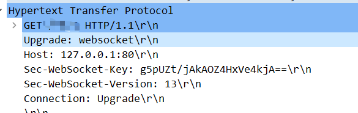

# WebSocket

**WebSocket 是全双工的应用层通信协议**， 主要是为了优化 HTTP/1 的 请求-应答 模式导致的半双工问题，解决 HTTP 难以应用到实时通信领域（即时消息，网络游戏等）的问题。本质还是基于 TCP

* **全双工**的应用**层通信**协议。
* 采用二进制帧结构。
* 默认端口：80,443。
* 需要自己管理连接、缓存、状态等，开发复杂度高于 HTTP。

## 原理

### WebSocket 的握手

基于TCP，所以还是需要先进行TCP的三次握手。之后利用 HTTP 协议升级的特性，发起HTTP GET 握手请求进行协议升级。

* `Upgrade: websocket`：表示升级成 websocket。
* `Connection: Upgrade`：请求协议升级。
* `Sec-WebSocket-Key`：简单的认证密钥。Base64 编码的 16 字节随机数。
* `Sec-WebSocket-Version`：协议版本

### 和 HTTP/2的区别

* WebSocket 侧重于实时通信，HTTP/2侧重传输效率。
* HTTP/2 存在流、多路复用、服务端推送，实质还是流内请求-应答模式。WebSocket 没有流、和多路复用等特性，且由于是全双工的，可以同时收发数据，所有也不需要 服务端推送这个功能。

## 使用

okhttp已经对WebSocket 提供了完整的支持，所以直接使用Okhttp提供的API即可。

WebSocket 的 主要应用领域：

* IM通信
* 数据实时同步
* 页游

### 服务端

### 客户端

### 

