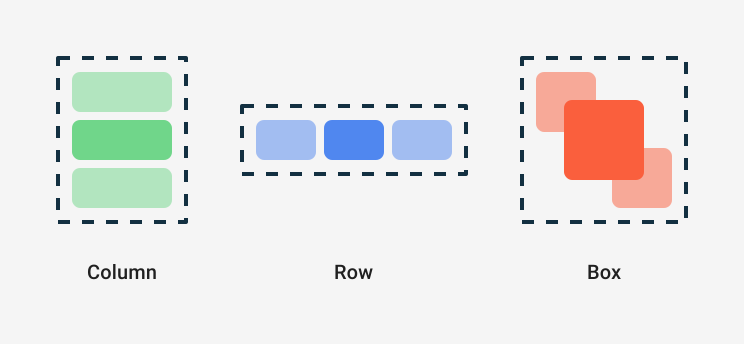

# Compose 开发介绍

## 什么是Compose

Compose是一个由 Google Android 团队官方推出的声明式UI框架，对标 我们之前使用的 View体系（命令式UI）。

> 命令式：需要从头开始，先创建View，然后拿到View，再来更新View。
>
> 声明式：事先声明好了UI布局，通过维护UI的状态来更新控件的状态。框架内部帮我们哪些命令式的操作。

### 传统的View体系

- 通过**XML** 来写布局。
- `LayoutInflater` 读取 XML 并解析，然后创建对应的View。
- 将View关联到 Window上，这里可能是 Activity、Dialog等，我们会 使用 Java 或者 Kotlin 来开发。

存在问题：

系统需要读取解析XML，在转为View，存在性能损耗。当然我们也可以直接使用代码的方式来布局并创建View，只不过写法相对繁琐。


### Compose

* 是一种声明式UI框架，可以方便的 使用 Kotlin 直接以纯代码的方式来写布局。也算是顺应了时代的潮流。
* 通过修改控件的状态来刷新UI。

存在的问题：

每个状态的变更都会需要去刷新界面，这里会依赖 声明式UI框架的优化策略。跳过状态没有变化的控件，只更新状态变化的控件。


## Composable 函数

> Composable函数用于**描述所需的界面状态**，并不是结构界面组件。
>
> Compose 在渲染时并不会转化成`View`，它的布局与渲染还是在`LayoutNode`上完成的

我们通过添加 `@Composable` 注解，即可定义一个可组合函数，这个注释会告诉 Compose 编译器：这个函数是将数据转换为界面。

```kotlin
@Composable
fun Greeting(name: String) {
    Text(text = "Hello $name!")
}
```

* 只有 Composable 函数内能调用 Composable 函数。
* Composable函数可能会像动画的每一帧一样非常频繁地运行，所以**应避免副作用（Effect）**。
* Composable函数可以按任何顺序执行，可组合函数可以并行运行。


## 重组

**输入更改时会再次调用Composable函数，这个过程叫做重组。**Compose 的重组是其声明式 UI 运转的基础，每当状态更新时，都会发生重组，不过会跳过尽可能多的Composable函数和 lambda，仅重组需要更新的部分。

同时重组是乐观操作，Compose 会在参数再次更改之前完成重组。如果某个参数在重组完成之前发生更改，Compose 可能会取消重组，并使用新参数重新开始。（但是 **Effect 依旧会执行，所以可能会导致异常**）。

但并不是说数据没变就不会重组，当**调用点**发生变化时也会触发重组。同时 **不稳定类型也不能跳过重组**。

> **调用点**：调用Composable函数的源代码位置。会影响其在组合中的位置，因此会影响界面树。
>
> **不稳定类型**：例如一个有 var 成员的 data class。https://developer.android.com/develop/ui/compose/performance/stability
>
> **稳定类型**：不可变对象(val String等)、仅有 val 成员的 data class 。稳定类型的成员必须也是稳定类型。

* 每个调用都有**唯一的调用点和源位置**，编译器将使用它们对调用进行唯一识别。

* 当从同一个调用点多次调用某个可组合项时，除了调用点之外，还会使用**执行顺序来区分实例**。

所以左侧图例中 列表下方增加数据时，已存在部分将会被重复使用。但是在上方增加、移除或者数据重排时，将会导致参数变化的位置发生重组。

而右侧图例中通过**使用 `key` 指定唯一性** 来避免重组。


| 重组策略                                      | 说明                                                         | 使用场景                     |
| --------------------------------------------- | ------------------------------------------------------------ | ---------------------------- |
| DisposeOnDetachedFromWindowOrReleasedFromPool | 默认策略。当组合依赖的ComposeView **从 Window 分离或不在容器池**时，组合将被释放。 |                              |
| DisposeOnLifecycleDestroyed                   | ComposeView对应的Lifecycle 被销毁时，组合将被释放            |                              |
| DisposeOnViewTreeLifecycleDestroyed           | 当`ViewTreeLifecycleOwner.Lifecycle` 被销毁时，组合将被释放。即Activity.view 或者 Fragment.view 被销毁时 | Fragment 中使用ComposeView时 |

## 布局

Compose的默认布局是重叠布局，同 FrameLayout的效果。

### 流程

Compose 通过以下方法将状态转换为界面元素：

* **元素的组合**：界面显示哪些内容。**运行Composable函数**构建界面说明。
* **元素的布局**：测量并放置元素。
* **元素的绘制**：界面元素绘制到画布（屏幕）。


### 常见的布局组件




## 状态：State

[状态和 Jetpack Compose  | Android Developers](https://developer.android.com/jetpack/compose/state)

在Compose 中，用 `state` 来表示一个 UI 的状态。

使用`mutableStateOf()` 创建可观察到`MutableState<T>`，每当值发生变化时，将会重新读取 `State<T>.value` 并自动重组界面。

```kotlin
interface MutableState<T> : State<T> {
    override var value: T
}
```

### remember

**使用 `remember {}` 将状态存储在内存中**，防止重组时状态被重置，起到保护当前状态的作用。remember 支持接收 `key` 参数，当key发生变化时 remember 将重新执行初始化。`remember` 既可用于存储可变对象，又可用于存储不可变对象。

> Notes：remember的生命周期 和 **调用点**绑定，当调用 `remember` 的可组合项从组合中移除后，记录的值也将被移除。

```kotlin
@Composable
private fun Greeting(name: String) {
    // 存储 不可变的 name，重组依然还是之前的name
    val test = remember { name }
  	// remember支持返回任何类型，这里返回 State，可以被修改且获取到最新值
    val expanded = remember { mutableStateOf(false) }

    val extraPadding = if (expanded.value) 48.dp else 0.dp

    Surface(
        color = MaterialTheme.colorScheme.primary,
        modifier = Modifier.padding(vertical = 4.dp, horizontal = 8.dp)
    ) {
        Row(modifier = Modifier.padding(24.dp)) {
            Column(modifier = Modifier
                .weight(1f)
                .padding(bottom = extraPadding)
            ) {
                Text(text = "Hello, ")
                Text(text = name)
            }
            ElevatedButton(
                onClick = { expanded.value = !expanded.value }
            ) {
                Text(if (expanded.value) "Show less" else "Show more")
            }
        }
    }
}
```

### rememberUpdatedState

`rememberUpdatedState` 会更新状态并保存在内存中，**保证每次都能获取到最新的值**。

它其实是对使用  `remember` 保存 `state` 的一个封装，源码如下：

```kotlin
@Composable
fun <T> rememberUpdatedState(newValue: T): State<T> = remember {
    // 创建一个 State
    mutableStateOf(newValue)
}.apply { value = newValue }
```

样例：

```kotlin
@Composable
fun LandingScreen(onTimeout: () -> Unit) {
    // 将 onTimeout 保存为状态
    val currentOnTimeout by rememberUpdatedState(onTimeout)

    // 传入 true 固定值，使 LaunchedEffect 不重新执行。
    LaunchedEffect(true) {
        delay(SplashWaitTimeMillis)
      	// 读取并执行
        currentOnTimeout()
    }

    /* Landing screen content */
}
```

##### 

## 运行第一个KMP项目

[运行第一个KMP项目](../跨平台/运行第一个KMP项目.md)


## 参考资料

[Jetpack Compose  | Android 开发者  | Android Developers (google.cn)](https://developer.android.google.cn/courses/pathways/compose?hl=zh-cn)

[Jetpack Compose 界面应用开发工具包 - Android 开发者  | Android Developers (google.cn)](https://developer.android.google.cn/jetpack/compose)

[Jetpack Compose  | Android Developers (google.cn)](https://developer.android.google.cn/jetpack/compose/interop)

[Compose 编程思想](https://developer.android.google.cn/jetpack/compose/mental-model)

[GitHub repo 模板](https://github.com/android/android-dev-challenge-compose)

[Compose 中的布局](https://developer.android.google.cn/jetpack/compose/layout)

[Compose 文档: 列表](https://youtu.be/BhqPpUYJYeQ)