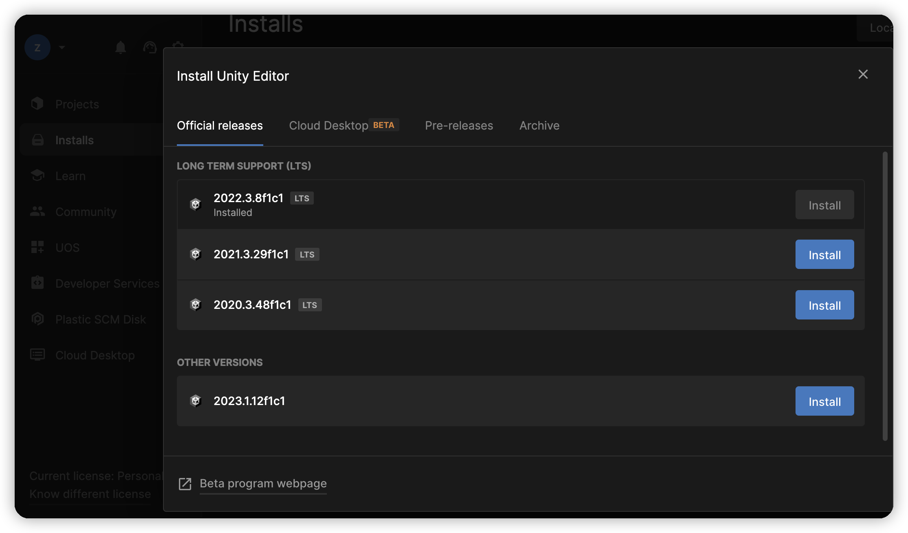

# Unity游戏开发

## 环境配置

### Unity Hub下载

[Unity官方下载_Unity最新版_从Unity Hub下载安装 | Unity中国官网](https://unity.cn/releases#undefined)

### Unity版本安装

选择最新的LTS版本即可。

### 其他工具

* Android Studio：用于导出Android 项目后进行二次开发的IDE。
* [GIMP](https://www.gimp.org/)：开源图像编辑软件。
* Aseprite：开源2D像素图像和动画设计软件。
* Blender：开源3D图形设计软件。
* LMMS：开源数字音频工作站软件，用于数字音乐创作。
* [Audacity](https://github.com/audacity/audacity)：开源音频编辑软件。
* Visual Paradigm：UML工具，有免费社区版。

## 项目创建