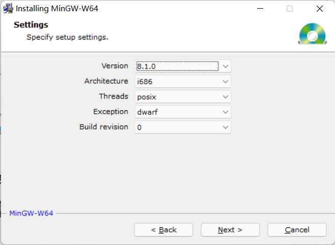

# VS-Code配置

## 1. C/C++编译环境配置

### 1.1 Windows安装C编译器

#### 在线安装（我失败了，最终使用了离线安装）
[下载 MinGW-W64 GCC](https://www.mingw-w64.org/downloads/)

选择 ``Sourceforge``点击下载即可


> 安装选项



- Version(gcc的版本)

一般直接使用默认版本即可。

- Archiecture(系统架构)

根据自身电脑选择。
 ``i686``: 对于32位; ``x86_64``对应64位。

- Threads(操作系统接口协议)

开发的应用程序遵循的协议。
``win32``: Windows程序
``posix``: Linux、Unix、Mac OS等其他操作系统下的程序。

- Exception(异常处理模型)

``Archiecture选择64位时``: seh、sjlj。 seh性能好，不支持32位，sjlj稳定性好，支持32位。

``Archiecture选择32位时``: dwarf、sjlj。dwarf性能好但是不支持64位。

- Build revision(修订版本)
修复漏洞的版本标识，使用默认即可。


#### 离线安装

在线安装出现报错: ``This file has been downloaded incorrently!``。


- 选择离线安装

[离线下载地址](https://sourceforge.net/projects/mingw-w64/files/mingw-w64/)


-  配置环境变量

path中添加 ``D:\mingw64\bin``; 根据自己实际安装位置调整。

- 校验是否配置成功

```shell
gcc -v
```

### 1.2 安装需要的插件

- C/C++


### 1.3 项目配置

修改``c_cpp_properties.json``，添加一下include目录。

```json
{
    "configurations": [
        {
            "name": "Win32",
            "includePath": [
                "${workspaceFolder}/**",
                "D:/mingw64/include/**"
            ],
            "defines": [
                "_DEBUG",
                "UNICODE",
                "_UNICODE"
            ],
            "compilerPath": "D:\\mingw64\\bin\\gcc.exe",
            "cStandard": "gnu17",
            "cppStandard": "gnu++14",
            "intelliSenseMode": "gcc-x64"
            // "intelliSenseMode": "windows-msvc-x64"
        }
    ],
    "version": 4
}

```


## 2. Spring Boot配置

初始化

- DevTools（代码修改热更新，无需重启）

- [X] Web（集成tomcat、SpringMVC） @2020-11-03 10:07:00

- Lombok（智能生成setter、getter、toString等接口，无需手动生成，代码更简介）
- Thymeleaf （模板引擎）。
  YAML

## 3. Vue配置

```shell
// 安装webpack
npm install -g webpack 
// 
npm init
//
npm i webpack vue vue-loader

```


## 4. Java配置

下载OpenJDK

[Java Platform, Standard Edition 13 Reference Implementations](https://jdk.java.net/java-se-ri/13)

新建系统变量`JAVA_HOME`

```shell
D:\openjdk\jdk-13
```

添加环境变量`path`

```shell
%JAVA_HOME%\bin
```

验证：

```shell
java -version
```


## 5. kotlin配置

> 依赖Java环境，首先配置Java。

### 5.1 下载安装kotlin

#### 下载安装

> [下载地址](https://github.com/JetBrains/kotlin/releases)

- ``mac``也可直接通过brew安装

```shell
brew install kotlin
```

- ``windows``下载完成后需要配置环境变量

```shell
E:\kotlin\bin
```

#### 验证kotlin

```shell
kotlinc -version
```

### 5.2 安装插件

- Kotlin Language
- Code Runner


### 5.3 配置Setting.json

管理 >> 设置 >> 右上角的编辑按钮

```
"code-runner.runInTerminal": true,
"terminal.integrated.shell.windows": "powershell.exe"
```


## 问题处理记录

### 控制台乱码

终端中输入 ``chcp``查看当前编码格式。

| 编码格式 | 代码  |
| -------- | ----- |
| GBK      | 936   |
| UTF-8    | 65001 |
| GB2312   | 20936 |

修改编码

```shell
# chcp + 代码
chcp 65001
```


## 插件安装

### Markdown

Office Viewer
