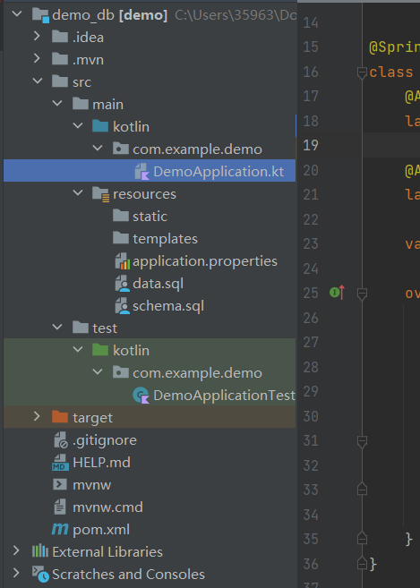
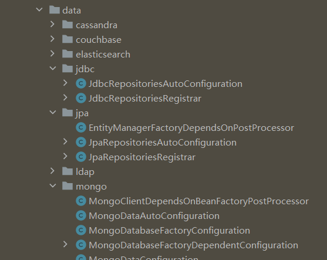
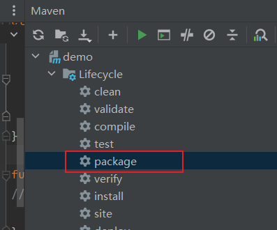
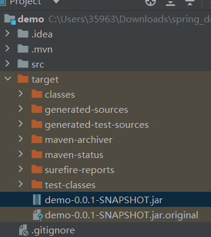
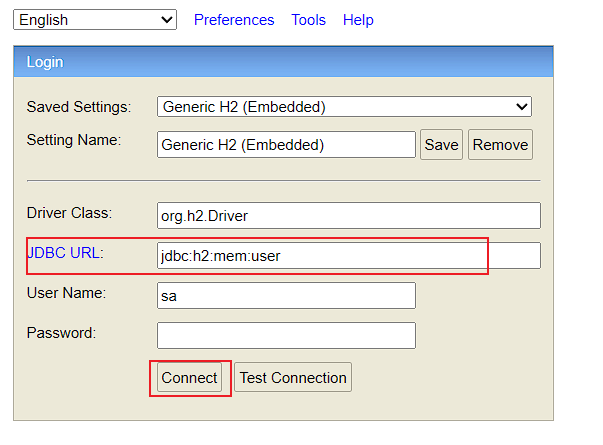

# Spring Boot

Spring Boot可帮助我们快速构建基于Spring的应用程序

## 项目生成器

[Spring Initializr - 快速构建](https://start.spring.io/)

## 项目结构

* `main`：源码和配置目录。
* `test`：测试用例。
* `target`：项目产物。打包后就在这里面。
* `application.properties` ：项目配置。数据源等。
* `pom.xml`：项目运行所需依赖。
* `DemoApplication.kt`：程序的入口



## 注解

### 常用注解

| 注解                     | 对象 | 说明                                                         |
| ------------------------ | ---- | ------------------------------------------------------------ |
| @SpringBootApplication   | 类   | 表明程序的入口类，一般在项目的Application类中会使用。        |
| @Primary                 | 类   | 存在多个数据源时，指定默认。                                 |
| @Data                    | 类   | 用于数据类。可以省去`getter`、`setter`。                     |
| @Builder                 | 类   | 表明是一个Builder类，会自动提供一些用于辅助构造类的 Builder方法 |
| @ConfigurationProperties | 函数 | 定义如何构建一个配置                                         |
| @Configuration           | 类   | 表明这个类是一个配置类                                       |
| @ImportResource          |      | 注入配置                                                     |
| @ComponentScan           |      | 告诉spring 扫描哪些package下的Bean                           |
|                          |      |                                                              |

### Bean相关注解

> Spring Bean是被Spring IOC 容器管理的对象。当我们定义一个Bean后，Spring IOC 容器就能够帮我们自动完成Bean的实例化。

Spring 提供了定义Bean 和 实例化Bean的相关注解：

* 定义Bean：比如`@Component`、`@Repository`、`@Service`、`@Controller` 等注解会将对应类作为Bean交由Spring管理。
*  实例化Bean：可以通过`@Autowired`、`@Resource`等方式来自动实例化Spring Bean。

> Notes：`@Bean` 注解更加通用，不仅可以作用于我们自己定义的类，也可以用于依赖库中类。

| Bean相关注解    | 说明                                                         | 对象           |
| --------------- | ------------------------------------------------------------ | -------------- |
| @Bean           | 将**函数的返回值将作为 Bean**。即通过函数来创建Bean。方法只会被调用一次，不仅可以 | 函数           |
| -               |                                                              |                |
| @Component      | **通用的Bean定义方式**。表示该类作为一个组件类，没有特定的含义。 | 类             |
| @Repository     | 定义一个数据仓库 Bean。**表示该类负责数据库DAO相关操作**。   | 类             |
| @Service        | 定义一个业务服务的Bean。**表示该类负责业务服务相关逻辑代码的实现**。 | 类             |
| @Controller     | 定义一个SpringMVC的 **Controller**。有`@Controller`、 `@RestController`。 | 类             |
| -               |                                                              |                |
| @Autowired      | 用于**自动实例化Bean**。<br />用于成员变量时：这个Bean成员变量将会被自动实例化。<br />用于函数时：注入参数。 | 成员变量、函数 |
| @Qualifier      | 指定Bean的名字来注入，一般用于存在多个同类型的Bean时使用。   |                |
| @Resource       | 表示 **方法的参数会按照名字来自动注入Bean**。                | 函数           |
| @Value          | 注入常量，或**SpEL**表达式 `#{}`。                           |                |
| -               |                                                              |                |
| @RequestMapping | 将方法关联到指定的URL 之下。                                 |                |

> 代码案例：

```kotlin
@Bean
fun userDataSource(): DataSource {
    return userDataSourceProperties().initializeDataSourceBuilder().build()
}

// 此处使用 @Resource，通过参数名 userDataSource 来注入DataSource，相当于自动调用了 userDataSource() 函数。
@Resource
fun userTransactionManager(userDataSource: DataSource): PlatformTransactionManager {
    return DataSourceTransactionManager(userDataSource)
}
```


## 接口定义


## Sprint Boot的自动配置

Spring Boot 默认会帮助项目自动进行配置，它的实现在 `org.springframework.boot:spring-boot-autoconfigure:x.x.x` 这个依赖库中。

> Nots: 当我们自己配置某些类型后，Spring Boot就不会在自动配置这些类型。例如配置了DataSource，那么DataSource就不会在自动配置，其他的还是会自动配置。



---

## 数据源配置

数据源的配置一般涉及以下3个部分：

* 数据源：DataSource
* 事务：配置事务管理和事务操作。
  * 事务管理：PlatformTransactionManager (DatasourceTransactionManager)。
  * 事务操作：TransactionTemplate。
* Jdbc操作：JdbcTemplate等

### 自动默认配置

Spring Boot 默认会帮助项目自动进行配置：

* DataSource：通过**DataSourceAutoConfiguration** 自动配置。
* DataSourceTransactionManager：通过**DataSourceTransactionManagerAutoConfiguration**自动配置。
* JdbcTemplate：通过**JdbcTemplateAutoConfiguration**自动配置。

> `application.properties`配置

```properties
############################
# 数据源配置，本地开发数据库
spring.datasource.url=jdbc:mysql://localhost:3306/dev?serverTimezone=GMT%2B8&characterEncoding=utf-8
spring.datasource.username=root
spring.datasource.password=123456

# 可选，默认情况下 Spring Boot会根据url自动判断类型
# spring.datasource.driver-class-name=com.mysql.cj.jdbc.Driver

############################
# 初始化内嵌数据库
spring.datasource.initialization-mode=embedded|always|never
# 创建初始化数据库的schema,默认 schema.sql
spring.datasource.schema
# 数据库内容初始化，默认data.sql
spring.datasource.data
# h2 内存数据库
spring.datasource.platform=h2
############################
############################
```

> 测试代码

```kotlin
class DemoApplication : CommandLineRunner {
    @Autowired
    lateinit var dataSource: DataSource

    @Autowired
    lateinit var jdbcTemplate: JdbcTemplate

    val logger: Logger = LoggerFactory.getLogger(DemoApplication.javaClass)

    override fun run(vararg args: String?) {
        logger.info("--------------- start")
        val conn = dataSource.connection
        logger.info(conn.toString())
        conn.close()
        jdbcTemplate.queryForList("SELECT * FROM User")
            .forEach {
                logger.info(it.toString())
            }
        logger.info("--------------- end")
    }
}
```

### 使用自定义配置

当然我们也可以进行手动配置：

我们可以将Spring Boot的默认配置排除，然后通过代码的方式来实现对应的配置。

```properties
user.datasource.url=jdbc:h2:mem:user
user.datasource.username=u
user.datasource.password=
```

1. 排除Spring的默认实现。

   ```kotlin
   @SpringBootApplication(
       exclude = [DataSourceAutoConfiguration::class,
           DataSourceTransactionManagerAutoConfiguration::class,
           JdbcTemplateAutoConfiguration::class
       ]
   )
   class DemoApplication : CommandLineRunner { ... }
   ```

2. 自定义配置实现：`DataSourceProperties`、`DataSource`、`PlatformTransactionManager`

   ```kotlin
   // 创建配置
   @Bean
   @ConfigurationProperties("user.datasource")
   fun userDataSourceProperties(): DataSourceProperties {
       return DataSourceProperties()
   }
   
   @Bean
   fun userDataSource(): DataSource {
       return userDataSourceProperties().initializeDataSourceBuilder().build()
   }
   
   @Bean
   @Resource
   fun userTransactionManager(userDataSource: DataSource): PlatformTransactionManager {
       return DataSourceTransactionManager(userDataSource)
   }
   ```

### 配置多个数据源

#### 管理数据源配置

不同数据源间的配置应该分开，这样能够方便管理维护。

```properties
# 前缀区分
dev.datasource.url=jdbc:h2:mem:dev
dev.datasource.username=u
dev.datasource.password=

#
test.datasource.url=jdbc:h2:mem:test
test.datasource.username=u
test.datasource.password=
```

#### 多个数据源协同工作

* 配置主数据源：使用`@Primary` 指定默认使用的数据源。
* 排除Spring Boot的⾃动配置

### 连接池配置

> Notes：
>
> Spring Boot 1.0 默认连接池 ：Tomcat-jdbc
>
> Spring 2.0 默认连接池：HikariCP

1. 先将默认的连接池依赖排除。

   ```xml
   <dependency>
       <groupId>org.springframework.boot</groupId>
       <artifactId>spring-boot-starter-jdbc</artifactId>
       <!-- 排除默认的HikariCP -->
       <exclusions>
           <exclusion>
               <groupId>com.zaxxer</groupId>
               <artifactId>HikariCP</artifactId>
           </exclusion>
       </exclusions>
   </dependency>
   ```

2. 根据 三方连接池（如Druid）的文档进行配置即可。

---


## Spring Data

Spring Data 提供相对一致的、基于 Spring 的编程模型。

它提供了一系列的抽象，其中包括：

* Spring Data JPA
* Spring Data JDBC
* Spring Data Commons
* Spring Data Redies
* ....

## Spring Data JDBC

JDBC（Java Database Connectivity，Java数据库连接），是Java 中用来规范客户端程序如何来访问**关系型数据库**的应用程序接口，提供了诸如查询和更新数据库中数据的方法。

* 核心接口：core、JdbcTemplate。
* 数据源：datasource。
* 封装JDBC对象：object
* 辅助工具：support。错误码等

### JdbcTemplate

提供了 增删改查等API，直接传入Sql语句即可。

```kotlin
	fun testSql() {
        //
        // 通用 函数
        jdbcTemplate.execute("")
        // 单个查询
        logger.info(
            "queryForObject: count=${
                jdbcTemplate.queryForObject(
                    "SELECT COUNT(*) FROM t_user",
                    Long::class.java
                )
            }"
        )
        // 批量查询
        jdbcTemplate.queryForList("SELECT * FROM t_user")
            .forEach {
                logger.info("queryForList: $it")
            }
        logger.info("-----------------")
        //
        // 插入、修改、删除
        jdbcTemplate.update("INSERT INTO t_user (id, username) VALUES (?,?)", 3, "user3")
        logger.info("-----------------")

        val list = listOf<User>(
            User(5, "user5"),
            User(6, "user6")
        )
        jdbcTemplate.batchUpdate(
            "INSERT INTO t_user (id, username) VALUES (?, ?)",
            object : BatchPreparedStatementSetter {
                override fun setValues(p0: PreparedStatement, p1: Int) {
                    list[p1].let {
                        p0.setLong(1, it.id)
                        p0.setString(2, it.username)
                    }
                }

                override fun getBatchSize(): Int {
                    return list.size
                }

            })
        logger.info("-----------------")
        // 通用查询，可以使用RowMapper转换类型，queryForList就是基于这个实现的
        jdbcTemplate.query("SELECT * FROM t_user") { rs, rowNum ->
            User(
                id = rs.getLong(1),
                username = rs.getString(2)
            )
        }.forEach {
            logger.info("query: $it");
        }
        logger.info("-----------------")
    }
```

### SimpleJdbcInsert

Spring JDBC 提供的一个辅助类，帮助我们方便使用JdbcTemplate。 

```kotlin
   fun testSimpleJdbcInsert() {
        val row: Map<String, *> = mapOf(
            "username" to "user4",
        )
        val id = simpleJdbcInsert
            .withTableName("t_user") // 指定表名 t_user
            .usingGeneratedKeyColumns("id") // 自动生成主键 id
            .executeAndReturnKey(row)
        logger.info("simpleJdbcInsert ID= $id");
//        val count = simpleJdbcInsert.execute(MapSqlParameterSource(row))
//        logger.info("simpleJdbcInsert count= count");
    }

```

### NamedParameterJdbcTemplate

可以直接使用 `:param` 的形式来代替 占位符 `?`。

```kotlin
    fun testNamedParameterJdbcTemplate() {
        // 批量插入
        val list = listOf<User>(
            User(5, "user5"),
            User(6, "user6")
        )
        // :id, :name 表示引用User对象的成员变量
        NamedParameterJdbcTemplate(dataSource).batchUpdate(
            "INSERT INTO t_user (id, username) VALUES (:id, :username)",
            SqlParameterSourceUtils.createBatch(list)
        )
    }
```


### 事务

Spring 提供了 一套 **统一事务模型**，无论是使用JDBC还是Hibernate抑或是myBatis来访问数据，在Service层的代码都是一样的，提供了一致的操作接口。

#### 事务特性

> 事务的7种传播特性

| 传播性                       | 值   | 描述                                           |
| ---------------------------- | ---- | ---------------------------------------------- |
| **PROPAGATION_REQUIRED**     | 0    | **默认**。当前有事务就⽤当前的，没有就⽤新的   |
| PROPAGATION_SUPPORTS         | 1    | 事务可有可⽆，不是必须的                       |
| PROPAGATION_MANDATORY        | 2    | 当前⼀定要有事务，不然就抛异常                 |
| **PROPAGATION_REQUIRES_NEW** | 3    | ⽆论是否有事务，都起个新的事务，挂起之前的事务 |
| PROPAGATION_NOT_SUPPORTED    | 4    | 不⽀持事务，按⾮事务⽅式运⾏                   |
| PROPAGATION_NEVER            | 5    | 不⽀持事务，如果有事务则抛异常                 |
| **PROPAGATION_NESTED**       | 6    | 当前有事务就在当前事务⾥再起⼀个事务           |

> 事务的隔离特性

| 隔离性                       | 值   | 脏读   | 不可重复读 | 幻读   |
| ---------------------------- | ---- | ------ | ---------- | ------ |
| 默认：以实际使用的数据库为准 | -1   | 数据库 | 数据库     | 数据库 |
| ISOLATION_READ_UNCOMMITTED   | 1    | 允许   | 允许       | 允许   |
| ISOLATION_READ_COMMITTED     | 2    | 禁止   | 允许       | 允许   |
| ISOLATION_REPEATABLE_READ    | 3    | 禁止   | 不允许     | 允许   |
| ISOLATION_SERIALIZABLE       | 4    | 禁止   | 禁止       | 禁止   |

#### 编程式事务

主要涉及的类有`TransactionTemplate`、`PlatformTransactionManager`、`TransactionDefinition`等。

* TransactionDefinition：用于设置事务属性，传播性、隔离性、超时等。
* PlatformTransactionManager：这是一个接口，用来实现事务执行、回滚等功能。
* TransactionTemplate：供我们直接使用的类。支持事务管理，设置事务属性等功能。继承自 TransactionDefinition，内部包含了PlatformTransactionManager。

```kotlin
    fun doTransaction() {
        logger.info("doTransaction before: count=${getCount()}")
        transactionTemplate.execute {
            jdbcTemplate.execute("INSERT INTO t_user (id, username) VALUES (22, 'user22')")
            logger.info("doTransaction execute: count=${getCount()}")
            // 回滚
            it.setRollbackOnly()
        }
        logger.info("doTransaction rollback: count=${getCount()}")
    }
```

#### 声明式事务

 `@Transactional` 注解表示开启一个事务，它会帮我们处理上面编程式事务中需要写的那些模板代码。

可以把上述 编程式事务的代码改为用 这个注解处理:

```kotlin
// 发生 IllegalAccessError 异常 时回滚
@Transactional(rollbackFor = [IllegalAccessError::class])
@Throws(IllegalAccessError::class)
fun doTransaction2() {
    jdbcTemplate.execute("INSERT INTO t_user (id, username) VALUES (22, 'user22')")
    throw IllegalAccessError()
}
```


### 异常处理

jdbc对各种数据库的异常定义在 `org.springframework.jdbc.support` 下的 `sql-error-codes.xml`中。我们可以自定义一个同样的

xml文件来覆盖它。

```xml
<beans>
    <bean id="H2" class="org.springframework.jdbc.support.SQLErrorCodes">
        ...
        <!-- 自定义抛出的异常类 -->
        <property name="customTranslations"> 
            <bean class="org.springframework.jdbc.support.CustomSQLErrorCodesTranslation">
                <!-- 指定错误码 -->
                <property name="errorCodes" value="23001,23505" />
                <!-- 指定归属的异常类 -->
                <property name="exceptionClass"
                          value="com.errorcode.CustomException" />
            </bean>
        </property>
    </bean>
</beans>

```


## Spring Data JPA

JPA（Java Persistence API，Java持久层API），它为对象关系映射提供了一种基于POJO 的持久化模型，简化开发工作。

而Spring Data JPA 则是再次增强了抽象，屏蔽了 Hibernate、JDO、EJB等 对象关系映射(O/R Mapping)框架的差异。

> Hibernate 是一种对象关系映射框架，它是JPA的实现。JPA是一层抽象。

```xml
<dependency>
    <groupId>org.springframework.boot</groupId>
    <artifactId>spring-boot-starter-data-jpa</artifactId>
</dependency>
```

### JPA相关注解

| 注解                                                    |                                    |      |
| ------------------------------------------------------- | ---------------------------------- | ---- |
| @Entity                                                 | 定义一个类实体                     |      |
| @MappedSuperclass                                       | 用于实体的父类                     |      |
| @Table(name)                                            | 将实体和表相关联，默认类名作为表名 |      |
| -                                                       |                                    |      |
| @Id                                                     | 主键                               |      |
| @GeneratedValue(strategy, generator)                    | 指定主键的生成策略和生成器         |      |
| @SequenceGenerator(name, sequenceName)                  | 序列生成器                         |      |
| -                                                       |                                    |      |
| @Column(name, nullable, length, insertable, updateable) | 映射字段，默认属性名作为表字段名   |      |
| @JoinTable(name)                                        | 关联表                             |      |
| @JoinColumn(name)                                       | 关联字段                           |      |
| @OneToOne                                               | 一对一                             |      |
| @OneToMany                                              | 一对多                             |      |
| @ManyToMany                                             | 多对多                             |      |
| @OrderBy                                                | 排序                               |      |

```java
@Entity
public class Showcase {
    // 生成策略：GenerationType.SEQUENCE 序列。
    // 生成器："sequence-generator"
    // 定义了一个序列生成器，使用 product_sequence 
    @Id
    @GeneratedValue(strategy = GenerationType.SEQUENCE, generator = "sequence-generator")
    @SequenceGenerator(name="sequence-generator", sequenceName = "product_sequence")
    private Long id;
    @Column(nullable = false)
    private String title;
    @Column
    private String info;
    @Column
    private String tags;
    @Column(name = "image_url")
    private String imgUrl;
}
```

### 使用JPA操作数据库

首先我们基于 以下几个Repository 来定义我们自己的 Repository 。

* CrudRepository<T, ID>：包含最基础操作，扩展自 `Repository` 类
* PagingAndSortingRepository<T, ID>：基于CrudRepository，增加分页。
* JpaRepository<T, ID>：扩展自PagingAndSortingRepository

定义查询

* `<op>...By...`：find、read、query、get、count。例如 `findNameById()`。
* `...OrderBy...[ASC/DESC]`：排序关键字
* `And / Or / IgnoreCase`：条件判断关键字
* `Top / First /Distinct`：特定条件。
* Pageable：分页时用。
* Sort：排序用。

```java
public interface ShowcaseRepository extends JpaRepository<Showcase, Long> {

    @Transactional
    @Modifying
    @Query("delete from Showcase s where s.id in ?1")
    void deleteByIds(List<Long> ids);
	
    // Sort sort = Sort.by(Sort.Direction.DESC, "id");
    // Pageable pageable = PageRequest.of(offset / limit, limit, sort);
    @Query("select s from Showcase s where s.tags like ?1")
    List<Showcase> findByTagsLike(Pageable pageable, String tags);
}
```


## MyBatis

同样是一款持久层框架，支持定制化SQL，存储过程和高级映射。

* @MapperScan 配置扫描位置
* @Mapper 定义接口
* XML定义映射

### XML方式

```properties
######### 配置 mybatis 属性
# 配置映射文件路径规则：classpath, mapper目录下的 xml都是mapper映射文件
mybatis.mapper-locations=classpath*:/mapper/**/*.xml
# 指定映射包名
mybatis.type-aliases-package=com.zaze.demo.mybatis.model
# 类型转换器的包名
mybatis.type-handlers-package=com.zaze.demo.mybatis.handler
# 将下划线转换为驼峰规则。
mybatis.configuration.map-underscore-to-camel-case=true
```

```xml
<?xml version="1.0" encoding="UTF-8"?>
<!DOCTYPE mapper PUBLIC "-//mybatis.org//DTD Mapper 3.0//EN" "http://mybatis.org/dtd/mybatis-3-mapper.dtd">
<mapper namespace="com.zaze.server.mybatis.mapper.RolesMapper">
    <resultMap id="BaseResultMap" type="com.zaze.server.mybatis.model.Roles">
    </resultMap>
    <sql></sql>
</mapper>
```


### 注解方式

```properties
###### 配置 mybatis 属性
# 类型转换器的包名
mybatis.type-handlers-package=com.zaze.server.mybatis.handler
# 将下划线转换为驼峰规则。
mybatis.configuration.map-underscore-to-camel-case=true
```

```kotlin
@Mapper
interface RolesMapper {

    @Insert("insert into t_roles (name, items) " +
            "values (#{name}, #{items})")
    fun save(roles: Roles): Int
}
```

### 常用工具

官方提供的生成器：[MyBatis Generator Core – Introduction to MyBatis Generator](https://mybatis.org/generator/)

分页插件：[MyBatis 分页插件 PageHelper](https://pagehelper.github.io/)


## Spring Data MongoDB

* MongoTemplate：类似 JdbcTemplate，提供了基础的操作数据API。
* MongoRepository：类似JPARepository，提供了很多常用的API


## Spring Data Redis

Redis是一款开源的内存KV存储，常用于作为缓存使用。

* RedisTemplate：类似 JdbcTemplate，提供了基础的操作数据API。
* RedisRepository：类似JPARepository，提供了很多常用的API。

### Jedis

Jedis实例 不是线程安全的，从 JedisPool 中来获取实例。

### Lettuce

### Redis配置


## Spring 缓存抽象

缓存抽象的机制是基于AOP的。 

`@EnableCaching` 开启缓存

```kotlin
@EnableCaching(proxyTargetClass = true)
class DemoApplication
```

| 常用注解     |      |                                                        |
| ------------ | ---- | ------------------------------------------------------ |
| @CacheConfig | 类   | 配置缓存。                                             |
| @Cacheable   | 方法 | 用于查询。会返回方法的返回值，下次调用时会去检测缓存。 |
| @CachePut    | 方法 | 用于新增。将返回值添加到缓存中。                       |
| @CacheEvict  | 方法 | 用于更新和删除。会清空缓存。                           |
| @Caching     |      |                                                        |


## 项目打包

1. 使用IDE 的Maven操作窗口选择 `package`命令直接打包。

   

2. 在Terminal中执行mvn命令打包，需要配置本地maven环境

   ```shell
   # mvn
   mvn clean package
   ```

打包输出在 `项目/target` 目录中



运行 jar

```shell
java -jar demo-0.0.1-SNAPSHOT.jar
```


## 依赖库

### h2

如何查看h2内置数据库？

配置jdbc

```properties
spring.datasource.url=jdbc:h2:mem:user
spring.datasource.username=sa
spring.datasource.password=
```

浏览器打开链接： [localhost:8080/h2-console/](http://localhost:8080/h2-console/)

修改 JDBC URL 为我们配置那个，输入密码，最好点击 `Connect`。




### actuator

```http
localhost:8080/actuator/beans
```

| URL              | 说明                          |      |
| ---------------- | ----------------------------- | ---- |
| actuator/health  | 健康检查                      |      |
| actuator/beans   | 查看spring容器中的 所有bean。 |      |
| actuator/mapping | url映射                       |      |
| actuator/env     | 环境变量                      |      |

> 暴露了一些默认不在Web暴露的Endpoint

```properties
management.endpoints.web.exposure.include=*
#
management.endpoints.web.exposure.include=health,beans,mapping
```


### Lombok

可以帮助简化类定义，提供开发效率。

> 使用Kotlin的话其他就没必要使用这个了。

* @Getter/@Setter：帮助生成getter/setter方法。
* @ToString：帮助生成所有属性的toString方法。
* @NoArgsConstructor / @RequireArgsConstructor / @AllArgsConstructor：帮助生成构造方法
* @Data：包括了 getter/setter 和 toString
* @Builder：帮助生成一些列builder构造方法
* @Slf4j /@CommonsLog / @Log4j

## 编译

### 转Gradle

```shell
gradle init
```

### 多模块编译异常问题

主要就是 `Unresolved reference：xxx` `ClassNotFoundException` 等。

在子模块中禁止bootJar。bootjar不同于普通的jar，它内部的class无法被调用。它是SpringBoot的可执行文件。

```kotlin
// kts
tasks.bootJar { 
    enabled = false
}
tasks.jar {
    enabled = true
}
```

```groovy
// groovy
bootJar { 
    enabled = false
}
jar {
    enabled = true
}
```

