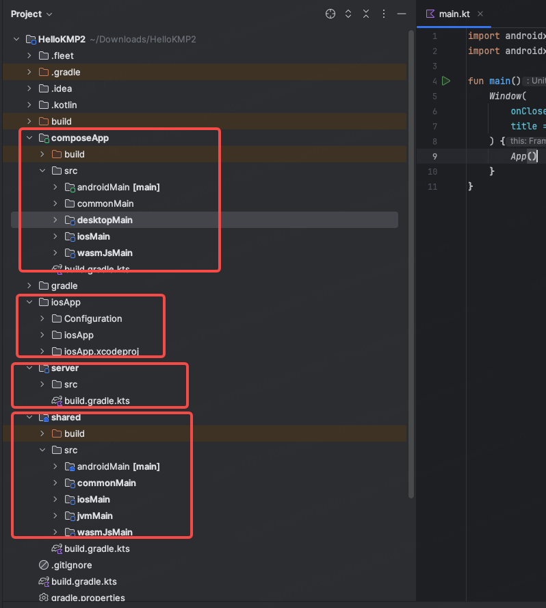

# KMP项目结构分析

之前我们通过 Kotlin Multiplatfrom Wizard 直接创建项目模板，然后通过添加 Gradle 运行配置，终于在 Android、IOS、Desktop、Web上分别运行了这个Demo。下面来看看项目代码结构，并尝试修改。

## 项目目录结构



| 目录       |                                                              |      |
| ---------- | ------------------------------------------------------------ | ---- |
| composeApp | 存放可以在**所有支持的平台上执行的通用代码**。androidMain（安卓）、desktopMain(桌面)、iosMain(IOS)、wasmJsMain(Web) 则是各个平台项目的配置。**commonMain**中包含的是**UI 共享代码**，其中  `App.kt` 就是主界面，在这里直接使用 Compose 编写UI。 |      |
| iosApp     | xcode项目配置                                                |      |
| server     | 服务端项目                                                   |      |
| shared     | 存放**功能逻辑上的共享代码**，内部的 androidMain(安卓)、iosMain(IOS)、jvmMain(桌面)、wasmJsMain(Web) 分别写平台特定代码。commonMain则是公用代码 |      |
|            |                                                              |      |
|            |                                                              |      |

## 代码解析

### Compose UI

>  App.kt
>
>  位于 **composeApp** 下的 **commonMain** 中

```kotlin
@Composable
@Preview
fun App() {
    MaterialTheme {
        // 保存 是否显示内容的状态
        var showContent by remember { mutableStateOf(false) }
        // Column 表示垂直布局
        Column(Modifier.fillMaxWidth(), horizontalAlignment = Alignment.CenterHorizontally) {
            // 添加一个按钮，文本为 Click me! ，点击切换状态，
            Button(onClick = { showContent = !showContent }) {
                Text("Click me!")
            }
            // 根据 showContent 状态，显示或者隐藏内容
            AnimatedVisibility(showContent) {
                // 从 Greeting 类获取一个 greeting 字符串, Greeting 表示业务逻辑
                val greeting = remember { Greeting().greet() }
                Column(Modifier.fillMaxWidth(), horizontalAlignment = Alignment.CenterHorizontally) {
                    // 展示一个图片
                    Image(painterResource(Res.drawable.compose_multiplatform), null)
                    // 一段文本
                    Text("Compose: $greeting")
                }
            }
        }
    }
}
```

### 业务逻辑

> Greeting
>
> 位于 **shared** 模块中的 **commonMain** 中。

这个类 只有一个功能，就是获取运行平台的信息。关键的函数就是 `getPlatform()`，这里掩饰了如何实现平台特定的功能。

```kotlin
class Greeting {
    private val platform = getPlatform()

    fun greet(): String {
        return "Hello, ${platform.name}!"
    }
}
```

> Platform

定义了 一个 Platform 接口，内部有一个 name 参数。我们可以通过 `getPlatform()` 函数来获取接口的具体实现。

`expect`关键字是 Kotlin 中用来修饰 一个跨平台函数，相对应的还有 `actual` 关键字，用于修饰具体的实现函数。 

* expect（接口）：期望调用的类、成员变量或方法。

* actual（实现）： 实际调用的类、成员变量或方法。

```kotlin
interface Platform {
    val name: String
}

expect fun getPlatform(): Platform
```

响应的不同平台的目录下包含了对应的实现，这里选取一个IOS 的：

```kotlin
import platform.UIKit.UIDevice
// 具体的实现类
class IOSPlatform: Platform {
    override val name: String = UIDevice.currentDevice.systemName() + " " + UIDevice.currentDevice.systemVersion
}
// 表示实现，对应 expect
actual fun getPlatform(): Platform = IOSPlatform()
```

## 添加一个简单的计数功能

### 添加额外依赖

> shared/build.gradle.kts
>
> 这里添加了kotlin 协程依赖

```kotlin
sourceSets {
  commonMain.dependencies {
    // put your Multiplatform dependencies here
    implementation("org.jetbrains.kotlinx:kotlinx-coroutines-core:1.8.1")
  }
}
```

### UI 调整

> App.kt

简单的添加了 水平排列的 两个按钮，点击更新计数，并通过Flow 来触发UI更新

```kotlin
@Composable
@Preview
fun App() {
    MaterialTheme {
        //...
        val viewModel = remember { CountViewModel() }
        // 接收 uiState 这个flow的数据，数据变化时 会触发重组
        val count by viewModel.uiState.collectAsState()
        // Column 表示垂直布局
        Column(Modifier.fillMaxWidth(), horizontalAlignment = Alignment.CenterHorizontally) {
            Row {
                Button(
                    onClick = { // 计数 + 1
                        viewModel.increase()
                    }) {
                    Text("++")
                }
                Spacer(Modifier.width(12.dp))
                Button(onClick = {// 计数 - 1
                    viewModel.decrease()
                }) {
                    Text("--")
                }
            }
            // 显示计数
            Button(onClick = { showContent = !showContent }) {
                Text("Click me $count!")
            }
            // ....
        }
    }
}
```

>CountViewModel.kt

创建一个 ViewModel类，内部持有 uiState: Flow ，通过修改它来驱动UI更新。

```kotlin
/**
 * @Description:
 * @Author zhaozhen
 * @Date 2024/6/30 20:05
 */
class CountViewModel {

    val uiState = MutableStateFlow(0)

    fun increase() {
        uiState.value ++
    }

    fun decrease() {
        uiState.value --
    }
}
```
