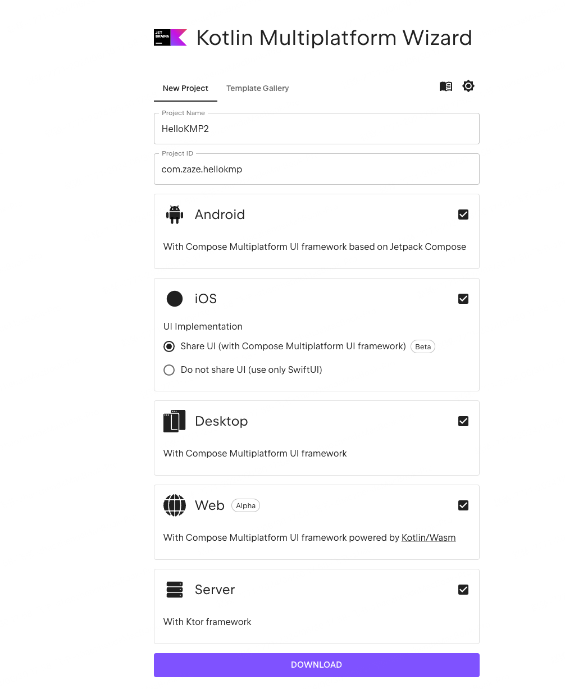
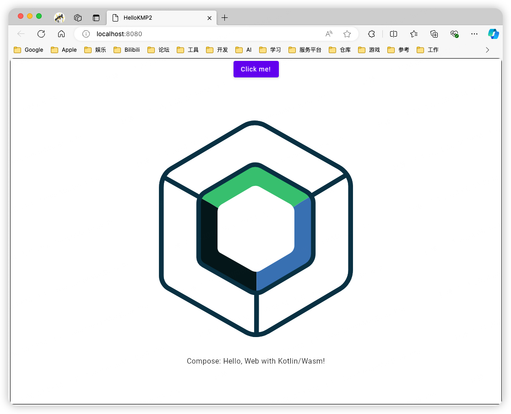

# 运行第一个KMP项目

KMP(Kotlin Multiplatform) 是一种跨平台框架，使用Kotlin编写，可以在Android、IOS、Web、桌面端、服务端上共享代码，**实现通用功能、业务逻辑的多端复用**。对于一些平台特定的功能也提供了API支持扩展。

它的原理是将Kotlin编译为平台原生的二进制文件，因此它的执行效率很高，等同原生。不仅减少编写与维护相同代码所花的时间， 同时保留了原生编程的灵活性与优势。

> KMP 和 Flutter 的区别：
>
> KMP: 仅支持业务逻辑代码的服用，UI 则需要使用 Compose Multiplatform 实现跨平台，或者个端自己实现。不过由于是直接编译为平台对应的二进制，它的执行效率很高。
>
> Flutter：使用Dart编写业务 + UI，一套代码就可以直接构建运行多端。UI使用Flutter引擎来绘制（Skia -> Impeller）而不是平台原生渲染，存在一定的性能损耗。


## 1. 环境准备

> 使用[JetBrains Fleet：不只是代码编辑器](https://www.jetbrains.com/zh-cn/fleet/) 可以帮我们方便的安装 JetBrains 的各种 IDE，包括不限于 Android Studio。

| 工具                        |                                |      |
| --------------------------- | ------------------------------ | ---- |
| Android Studio              | IDE                            |      |
| Xcode                       | ios                            |      |
| JDK                         |                                |      |
| Kotlin Multiplatform plugin | IDE 插件                       |      |
|                             |                                |      |
| Kotlin Plugin               | IDE 插件, Android Stuido自带了 |      |
| Browsers                    | 浏览器，开发web端使用          |      |

### 1.1 环境监测

```shell
# mac 上使用 kdoctor 来监测环境。类似 flutter doctor
# 使用brew 按照kdoctor
brew install kdoctor
# 执行检查
kdoctor
```


## 2. 项目创建

### 2.1 方式一

通过Android Studio 创建KMM，不过这个方式创建只有 Android、IOS 相关配置。若需要使用 Compose 还需要手动进行配置。 


### 2.2 方式二

通过[Kotlin Multiplatform Wizard：项目生成器，类似Spring iniitalizr](https://kmp.jetbrains.com/?_ga=2.228413913.531685004.1719738216-1282601725.1710219540&_gl=1*1iyjx38*_gcl_au*MTU0NTk5MzUwLjE3MTk0NzU4NDQ.*_ga*MTI4MjYwMTcyNS4xNzEwMjE5NTQw*_ga_9J976DJZ68*MTcxOTc0MTE3OC4xMS4wLjE3MTk3NDExNzguNjAuMC4w) 配置项目，然后Download接口。这里创建的项目直接通过 Compose Multiplatform 来收实现UI。



## 3. 运行项目

通过  Kotlin Multiplatfrom Wizard 方式创建的项目比较全面，下面就以它为例，尝试在不同端运行看看效果。

### Android

连接模拟器或者真机后，直接在 Android Studio 中运行即可，无需任何配置。


运行效果：


### IOS

### Desktop

需要手动添加一个运行配置：

- 点击 **Run ** 选择 **Edit Configurations** 。

- 添加  **Gradle** 运行方式。

- 添加运行参数

  ```shell
  desktopRun -DmainClass=MainKt --quiet
  ```


运行效果:


### Web

同桌面端，需要添加一个 Gradle 运行配置

运行参数：

```shell
wasmJsBrowserRun -t --quiet
```


运行效果：





## 参考资料

[Kotlin 多平台 · Kotlin 官方文档 中文版 (kotlincn.net)](https://book.kotlincn.net/text/multiplatform.html)

[Get started with Kotlin Multiplatform | Kotlin Multiplatform Development Documentation (jetbrains.com)](https://www.jetbrains.com/help/kotlin-multiplatform-dev/get-started.html)

[Compose Multiplatform UI 框架 | JetBrains | JetBrains: Developer Tools for Professionals and Teams](https://www.jetbrains.com/zh-cn/lp/compose-multiplatform/)